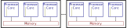
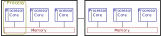
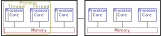
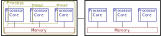
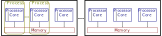
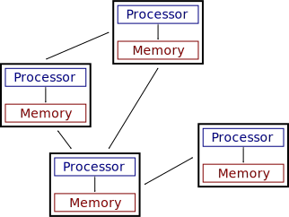
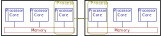
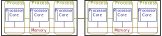
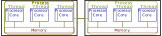

## Parallel and Distributed Computing Terminology

* *Parallel*: Running multiple computations (often on the same computer) at the same time
* *Distributed*: Running a calculation across multiple, networked computers
* Often used together, interchangeably, especially in HPC

### Instruction-level parallelism

* Instruction pipelining
   * Completely transparent (invisible) parallelism
   * Interleave steps, independent operations
   * Possibly "speculatively"
* Data parallelism: SIMD (Single Instruction, Multiple Data)
   * Special instructions that operate on multiple values simultaneously: *vectorization*
   * MMX, SSE, AVX
   * Sometimes inferred by the compiler from loops
   * Hand-written assembly, special functions, math libraries

### Running code: *Process*

* Everything runs in a process
* Includes global state: memory contents, open files, network connections, etc.
* Only makes use of one core by default
* *Task parallelism*: explicitly indicate pieces of code to run concurrently

### Threads

* Parallel execution sharing resources in a single process
* (Global) variables, open files, global state: all shared
* Easy to read the same data
* Hard to write to the same data
* Functions allow synchronization (lock/mutex)

### Multi-threaded libraries

* Some libraries turn single function calls into multi-threaded calculations
* Don't require any explicit code changes
* Consider interaction with explicit parallelism (task count multiplies!)

### Processes

* Parallel execution in separate resource spaces
* Separate copies of all data
* Need to explicitly communicate (send messages) to coordinate
* Same filesystems, fast IPC, "shared" memory

## Distributed Computing

* Various machines working together
* Must send messages to communicate, coordinate

### HPC: High Performance Computing

* Homogeneous cluster of machines
* Low-latency network allows fast communication
   * Shared network filesystems
   * Low-latency networks (10x slower than local memory, 100x faster than SSD)
* Makes distributed computing similar to process-level parallelism

### Distributed Processes

* Processes running on separate hardware
* No shared memory

### Distributed Processes

### Distributed, Threaded Processes

### HPC: High Performance Computing

* Tightly-coupled execution, often running the same code
* Run more at once than fits on a single machine (more memory, calculations)
* Share intermediate results throughout computation

### HTC: High Throughput Computing

* Running many independent (though often parallel) computations
* Collect and store many results across a number of inputs, parameters

# General approaches

### Multiple instances ("flock" parallelism)

* Divide up work among themselves
* Work together in flat structure
* Coordinate/communicate to share intermediate values

### Worker pool

* Run one main process
* Hand off pieces of work to a pool of workers
* All coordination happens in main process
