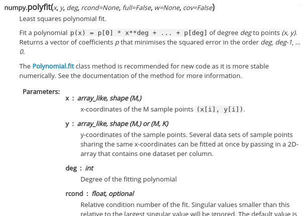

# Sciware

## Functions

https://github.com/flatironinstitute/learn-sciware-dev/tree/master/12_Functions


## Rules of Engagement

### Goal:

Activities where participants all actively work to foster an environment which encourages participation across experience levels, coding language fluency, *technology choices*\*, and scientific disciplines.

<small>\*though sometimes we try to expand your options</small>


## Rules of Engagement

- Avoid discussions between a few people on a narrow topic
- Provide time for people who haven't spoken to speak/ask questions
- Provide time for experts to share wisdom and discuss
- Work together to make discussions accessible to novices

<small>
(These will always be a work in progress and will be updated, clarified, or expanded as needed.)
</small>


## Zoom Specific

- If comfortable, please keep video on so we can all see each other's faces.
- Ok to break in for quick, clarifying questions.
- Use Raise Hand feature for new topics or for more in-depth questions.
- Please stay muted if not speaking. (Host may mute you.)
- We are recording. Link will be posted on #sciware Slack.


## Future Sessions

- Sciware "Office Hours" follow-up discussion in 2 weeks (Nov 19)
- Future sessions planned:
  - Intro to R
  - Data storage file formats (hdf5, numpy, parquet, sqlite, ...)
- Suggest topics and vote on options in #sciware Slack


## Today's Agenda

- Intro: what is a function? (Alex Barnett, CCM)
- Designing good functions (Bob Carpenter, CCM)
- Packaging a Jabberwocky (Alex Barnett, CCM)
- Group exercises!
- Case studies and discussion (Joakim Anden, formerly CCM, Nils Wentzell, CCQ, and others)


<!-- AAAAAAAAAAAAAAAAAAAAAAAAAAAAAAAAAAAAAAAAAAAAAAAAA -->

<!-- I want default left-justify everywhere:  -->
<style type="text/css">
  .reveal p {
    text-align: left;
  }
 </style>
<!-- see: https://stackoverflow.com/questions/41024596/r-markdown-slides-with-reveal-js-how-to-left-align-list-items-bullets-and-numb/41047550#41047550    -->

## Intro: what is a function?


### What is a function?

Say you have python script/notebook including the snippet...

```python
S = 0; T = 0
for i in range(10) :
  S += a[i]*a[i]
for i in range(20) :
  T += b[i]*b[i]
result = S-T
```
<small>Seems to sum the squares of array a, then similar for b, then subtract them.</small>

<!-- note to get pause, ie fragment, to work, need raw HTML here... -->

<div class="fragment">
Good to package the self-contained repeated task as a <em>function</em>:
<pre><code class="python hljs">def sumsquares(a):
    """Sum the squares of the elements of a NumPy array."""
    return sum(a*a)
</code></pre>
</div>

<div class="fragment">
Then entire snippet becomes much simpler, <em>and</em> easier to read:
<pre><code class="python hljs">result = sumsquares(a)-sumsquares(b)
</code></pre>
plus other users, and future you, get a useful tool: a function :)
</div>


### Functions are sad without tests

```python
def sumsquares(a):
    """Sum the squares of the elements of a NumPy array."""
    return sum(a*a)
```
A ("pure") function has inputs (array ``a``), outputs (return value)
- refers to no global variables
- has no "state" (internal memory). This makes it *testable*.

<div class="fragment">
Never trust a func you wrote but didn't test! A simple tester:
<pre><code class="python hljs">
import numpy as np
if sumsquares(np.array((3.0,4.0))) == 25.0:
    print('pass')
else:
    print('fail')
</code></pre>
Q: Other than checking it does the right thing, why else are test "driver" codes essential?
</div>
<div class="fragment">
<em>shows a human how to use your function</em>
</div>

<!-- are more elaborate tests, like what if you send it empy, or non-numpy array... -->


### Standing on the shoulders of giants

We rely on other people's functions all the time, eg ``y=sin(x)`` (low-level math lib), ``coeffs=numpy.polyfit(y,x,degree)``.
Good *design* work went into these functions, as docs show:



Note _interface_: simple required args; advanced ones are optional


You can be a giant too, by writing (then distributing) your own functions!

*Remember "good function" = function body + docs + tester(s) + usage example(s)*


### Session goals & topics

__I. Get us to package most of our code as functions:__
- breaks tasks in to *separately* testable components
- clean, modular code, leaving scripts/notebooks short and readable

__II. Write functions with good interfaces, and critique them:__
- naming, inputs, outputs, their types, optional args
- testers, documentation
- these are *just as important* as the algorithm ("meat") inside the function
Otherwise no-one will use your functions... and that includes future you!  :(


Call it: <font color="red">"good interface design"</font>, in sense of API (application programmer interface). Can include *wrapping existing code so it can be called from another language* (eg Python ``y=sin(x)`` actually wraps ``libm`` library)

[Not to be confused with: "interfacing" in sense of UX/UI (user experience), human-computer interfaces, package management (``apt`` etc)...]

Any questions about what we're talking about or goals ?


<!--  BBBBBBBBBBBBBBBBBBBBBBBBbbbbbbbBBBBBBBBBBBBBBBBBBB -->
## The why, when, and how of functions

<!-- trying md file include.  failed:   #include carpenter.md -->

[slides](carpenter.html)


<!-- JJJJJJJJJJJJJJJJJJJJJJJJJJJJJJJJJJJJJJJJJJJJJJJJJJJJJJJJJJJJJJJJJJJJj -->

## Packaging a Jabberwocky

<br>
<br>

(why Jabberwocky? Because all technical terms in science codes are *nonsense poems* to other users outside that area)


### Creating a good function from a script

You heard your friend wrote code once that included a cool way to find a place \\(x\\) where some 1D function \\(f(x)=0\\). You ask and they say, sure, here you go:
```python
# script proving my gimble is frumious!
# (recall technical words are gibberish to other users)
for brillig in np.arange(0, pi, 0.1):
    mimsy = cos(brillig)
    wabe_guess = 1.5
    while True:
        wabe_newguess = wabe_guess - runcible(mimsy, wabe_guess) /
                                      runciblederivative(mimsy, wabe_guess)
        if abs(wabe_newguess - wabe_guess) < 1e-9:
            break
        wabe_guess = wabe_newguess        
    print(bandersnatch(brillig, wabe_newguess))
```
You laugh, but this is a common collaboration experience!

<div class="fragment">
How useful is this to you? Must waste time understanding the whole script, some outer loop. Is runcible a 1D function? It has 2 args. Where’s the bit that finds the zero of a 1D function? What variable contains the answer??
</div>


### Split out a root-finding function

Ok, in real world at this point you'd read around, eventually (!) find ``scipy.optimize.newton``, and be done. Say internet is broken. Need to make own func...

Ah, you realize it's doing Newton's iteration \\[x_{n+1} = x_n - \frac{f(x_n)}{f'(x_n)}\\] so that the sequence \\(x_0, x_1, \ldots\\) tends to a root.
`mimsy` is some parameter we ignore. `wabe` is \\(x\\), which is a simpler and more universal variable name!

<div class="fragment">
Let's wrap in interface for roots of a <em>general</em> function, not just `runcible`!

We steal the *algorithm* of the script, just do better *packaging*.
</div>


### First draft function

To root-find a general func, need pass that func in, and a (separate?) func for its derivative:
```python
def rootfind1d(f, dfdx, x0):
    """Find a nearby root of a 1D scalar function.
    Inputs: f - a 1D scalar function
            dfdx - its derivative function
            x0 - an initial guess to the root
    Returned value: approximate root x, meaning f(x)=0.
    Notes: uses the Newton-Raphson iteration.
    """
    while True:
        xnew = x0 - f(x0)/dfdx(x0)
        if abs(xnew-x0) < 1e-9:
            break
        x0 = xnew
    return xnew
```
Look it has docs! We suggest you even write the docs *before* you write the
body of the function, focuses the mind.

Q: are we done with this basic draft?


No, recall it is *incomplete* without a test routine, like this:
```python
    from math import *
    f = lambda x: sin(x)
    dfdx = lambda x: cos(x)
    x = rootfind1d(f, dfdx, 2.0)
    if abs(x-pi)<1e-9:
        print('pass')
    else:
        print('fail')
```
Very niiice!

Note: universal simple *math* language and symbols (all jargon gone).

Now why didn't your friend hand you this in the first place?? If they had been a good structured coder, they would have :)

And So Can You\*.

<small>\* Stephen Colbert</small>


### Improvements

The tolerance check `1e-9` was particular to frumious gimbles. Think about your user (or future self): they'll want to change it.

Q: how best do this?

<div class="fragment">
<pre><code class="python hljs">
def rootfind1d(f, dfdx, x0, tol=1e-9):
    """Find a nearby root of a 1D scalar function.
    Inputs: f - a 1D scalar function
            dfdx - its derivative function
            x0 - an initial guess to the root
            tol (optional) - desired absolute tolerance in the root
    Returned value: approximate root x, meaning f(x)=0.
    Notes: uses the Newton-Raphson iteration.
    """
    while True:
        xnew = x0 - f(x0)/dfdx(x0)
        if abs(xnew-x0) < tol:
            break
        x0 = xnew
    return xnew
</code></pre>

Optional args are a great way make it easy on the basic user while the power user can tweak various algorithm parameters from *sensible defaults*.
</div>


Q: how *else* could you improve this function or its tests?

<!-- let some ideas happen here, then... -->

A: one of the group exercises!


<!-- EEEEEEEEEEEEEEEEEEEEEEEEEEEEEEEEEEEEEEEEEEEEEEEEEEEEEE -->
## Exercises (breakouts)

Choose an example to work on in a small group, from the files in the repo: https://github.com/flatironinstitute/learn-sciware-dev/tree/master/12_Functions/exercise

There are several different languages to choose from.


## Discussion, advanced topics


### Naming

<div class="fragment">
Comments are good, but names are better.
</div>

<div class="fragment">
<pre><code class="python hljs">
def get_values2(x, y):
    temp = np.mean(np.abs(x - y) ** 2)
 
    return temp
</code></pre>
</div>

<div class="fragment">
vs.

<pre><code class="python hljs">
def mean_squared_error(x, x_ref):
    mse = np.mean(np.abs(x - x_ref) ** 2)
 
    return mse
</code></pre>
</div>

<div class="fragment">
Comments can go stale and require maintenance.
</div>

<div class="fragment">
Comments also can't be tested (generally).
</div>


### High- and low-level APIs

More advanced libraries or packages can have multiple levels of APIs.

<div class="fragment">
High level calls low level.
</div>

<div class="fragment">
<pre><code class="c hljs">
fftw_plan fftw_plan_dft_1d(int n, fftw_complex *in, fftw_complex *out,
                           int sign, unsigned flags);
</code></pre>
</div>

<div class="fragment">
<pre><code class="c hljs">
typedef struct {
     int n;
     int is;
     int os;
} fftw_iodim;

fftw_plan fftw_plan_guru_dft(
     int rank, const fftw_iodim *dims,
     int howmany_rank, const fftw_iodim *howmany_dims,
     fftw_complex *in, fftw_complex *out,
     int sign, unsigned flags);
</code></pre>
</div>


### High- and low-level APIs (cont.)

FINUFFT: simple call vs. plan interface

<div class="fragment">
<pre><code class="python hljs">
# perform the type-2 NUFFT
f = finufft.nufft2d1(x, y, c, (N1, N2))
</code></pre>
</div>

<div class="fragment">
<pre><code class="python hljs">
# instantiate the plan (note ntrans must be set here)
plan = finufft.Plan(nufft_type, (N1, N2), n_trans=c.shape[0])

# set the nonuniform points
plan.setpts(x, y)

# execute the plan
f = plan.execute(c)
</code></pre>
</div>


### Default arguments

<div class="fragment">Why do we need them?</div>

<div class="fragment">When do we need them?</div>

<div class="fragment">What is a “sensible default”?</div>

<div class="fragment">How do we order them?</div>

<div class="fragment">
<pre><code class="python hljs">
f = finufft.nufft2d1(x, y, c, (N1, N2))
</code></pre>
</div>

<div class="fragment">
<pre><code class="python hljs">
iflag = 1
eps = 1e-6
f = np.zeros([N1, N2], dtype=np.complex128, order='F')

ret = finufftpy.nufft2d1(x, y, c, iflag, eps, N1, N2, f)
</code></pre>
</div>

<div class="fragment">
How do we implement them in languages that do not support them natively?
</div>

<div class="fragment">
Provide <code class="c hljs">-1</code>, <code class="c hljs">NULL</code>?
</div>


## Example: HDF5 (Hierarchical data format)


* Binary data format to store large datasets
* Organize Data in a directory structure
* Seamless compression and decompression


### Storing a C++ vector

```c++
std::vector<double> vec = {1.0, 2.0};

// Create a new file using the default properties.
hid_t file = H5Fcreate ("vec.h5", H5F_ACC_TRUNC, H5P_DEFAULT, H5P_DEFAULT);

// Create a dataspace describing the dimensions
hsize_t dims[1] = {vec.size()};
hid_t space = H5Screate_simple(1 /*ndims*/, dims, NULL);

// Create a dataset and save it to file
hid_t dset = H5Dcreate(file, "vec", H5T_IEEE_F64LE, space, H5P_DEFAULT, H5P_DEFAULT, H5P_DEFAULT);
herr_t status = H5Dwrite(dset, H5T_NATIVE_DOUBLE, H5S_ALL, H5S_ALL, H5P_DEFAULT, vec.data());

// Close and release resources.
H5Dclose (dset); H5Sclose (space); H5Fclose (file);
```


### The output

```
$ h5dump vec.h5

HDF5 "vec.h5" {
GROUP "/" {
   DATASET "vec" {
      DATATYPE  H5T_IEEE_F64LE
      DATASPACE  SIMPLE { ( 2 ) / ( 2 ) }
      DATA {
      (0): 1, 2
      }
   }
}
}
```


### What would we like to write?

```c++
std::vector<double> vec = {1.0, 2.0};

// Create a new file with write access
h5::file file("vec.h5", 'w');

// Store the vector to dataset "vec"
h5::write(file, "vec", vec);
```

```c++
// Create a new file with read access
h5::file file("vec.h5", 'r');

// Read the vector from dataset "vec"
std::vector<double> vec;
h5::read(file, "vec", vec);
```


### The User Interface

```c++
namespace h5 {
  template <typename T>
  void write(group g, std::string key, T const& data);

  template <typename T>
  void read(group g, std::string key, T& data);

  template <typename T>
  T read(group g, std::string key);
}
```

Find library at [github.com/TRIQS/h5](https://github.com/TRIQS/h5/)
