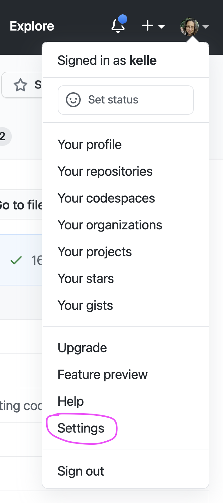
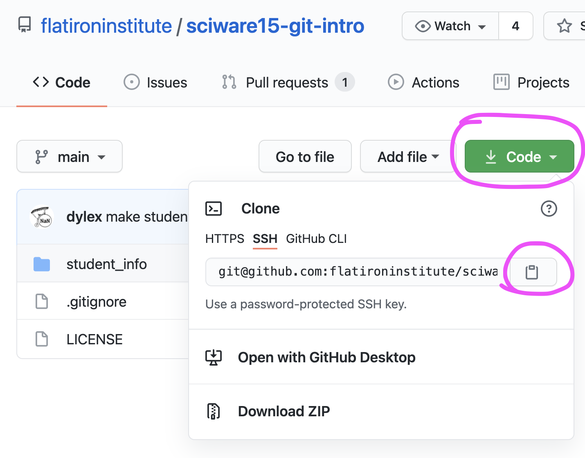

# Sciware

## Intro to Github

https://github.com/flatironinstitute/learn-sciware-dev/tree/master/15_IntroGithub


## Rules of Engagement

### Goal:

Activities where participants all actively work to foster an environment which encourages participation across experience levels, coding language fluency, *technology choices*\*, and scientific disciplines.

<small>\*though sometimes we try to expand your options</small>


## Rules of Engagement

- Avoid discussions between a few people on a narrow topic
- Provide time for people who haven't spoken to speak/ask questions
- Provide time for experts to share wisdom and discuss
- Work together to make discussions accessible to novices

<small>
(These will always be a work in progress and will be updated, clarified, or expanded as needed.)
</small>


## Zoom Specific

- If comfortable, please keep video on so we can all see each other's faces.
- Ok to break in for quick, clarifying questions.
- Use Raise Hand feature for new topics or for more in-depth questions.
- Please stay muted if not speaking. (Host may mute you.)
- We are recording. Link will be posted on #sciware Slack.


## Future Sessions

- Tomorrow: Github Part 2: collaboration
- July 8: Intro to IDEs and Debugging
- Suggest topics and vote on options in #sciware Slack


## Today's Agenda

- What is Git and GitHub? 
- Setting up git and GitHub on your computer
- Getting code off of GitHub
- Putting code onto GitHub


# Intro to Git and GitHub


## Version control

<div style="display: flex;">

<ul>
<li>keeps track of history of one or more files</li>
<li>helps with backup and collaboration</li>
<li>makes it easier to combine changes to the same file</li>
</ul>
</div>

## git

*a distributed, command-line, version-control tool*

* released in 2005 by Linus Torvalds for developing Linux, as an alternative to older tools (CVS, svn)
* now the dominant tool for academic and industry software development
* **distributed**: no central server, every repo is fully functional, independent, and can "sync" with any other


## GitHub

* A central website for storing and sharing git repositories
* Started in 2008 as a freemium service, now owned by Microsoft
* Provides repository management, permissions, collaboration tools, CI, etc.


# Setting up GitHub on your Computer


## Make sure `git` is installed
<pre  style="font-size:1em;"> <code data-trim data-noescape>&gt; git version
git version 2.30.1
</code></pre>

<p class="align-left">If this returns an error, please raise your hand and someone can help you in a breakout room.
</p>


## Setting your name in Git 

**See what name is currently set**
<pre style="font-size:1em;"> <code data-trim data-noescape>&gt; git config --global user.name
</code></pre>

<div class="spacer"></div>

**Set your name**
<pre  style="font-size:1em;"> <code data-trim data-noescape>&gt; git config --global user.name "Mona Lisa"
</code></pre>


## Setting your email address

### See what email address is currently set
<pre  style="font-size:1em;"> <code data-trim data-noescape>&gt; git config --global user.email
</code></pre>

### Set an email address
<pre  style="font-size:0.9em;"> <code data-trim data-noescape>&gt; git config --global user.email "your_email@example.com"
</code></pre>
(Ideally set to the same email address you used for Github.)


## Setup SSH
<div class="spacer"></div>

### Generate an SSH key and copy it to the clipboard
<pre style="font-size:1em;"> <code data-trim data-noescape>&gt; ssh-keygen -t ed25519
> cat ~/.ssh/id_ed25519.pub
</code></pre>


## Add the SSH key to GitHub

- On Github:
  - Profile Photo > Settings > SSH and GPG keys > New SSH Key
  



## Add the SSH key to GitHub

- **Title** should refer to the computer on which the key was generated.

- Paste key into text box.


## Setup Git's default text editor

<div class="spacer"></div>

- So that you don't get stuck in vi:

<pre  style="font-size:1em;"> <code data-trim data-noescape>&gt; git config --global core.editor "nano -w"
</code></pre>

<div class="spacer"></div>

- How to set up your favorite editor with Git:

> https://git-scm.com/book/en/v2/Appendix-C%3A-Git-Commands-Setup-and-Config#ch_core_editor


# Questions?


# Getting code from GitHub onto your computer


# GitHub Jargon

- Folder containing the code
  - *repository* or *repo*, for short

- "Download the code"
  - *clone* the *repo*

- Your computer harddrive 
  - *local*

*Download the code to your computer* in GitHub-ese is   
**Clone the Repo to your local**


## Clone the repo

<div style="display: flex;">

<ul>
<li>Go to the repo on the Github website</li>
<li>Click Green Code button</li>
<li>Choose SSH tab</li>
<li>Click the clipboard icon to copy the repo path</li>
</ul>
</div>


## Clone the repo (continued...)

- In a Terminal window, clone the repo:

```
git clone git@github.com:flatironinstitute/sciware15-git-intro
```

<div class="spacer"></div>

A folder will be created containing all of the files in the repo. 

The folder name will be the repo name.


## What does `git clone` do?
Using the `git clone` command connects the folder to the repo on GitHub in case you ever wanted to interact with it later.

- It generates hidden folder `.git`

<pre  style="font-size:1em;"> <code data-trim data-noescape>&gt; ls -a
</code></pre>

- It also saves the URL to the repo and names it *origin*

<pre  style="font-size:0.9em;"> <code data-trim data-noescape>&gt; git remote -v
origin  git@github.com:flatironinstitute/sciware15-git-intro (fetch)
origin  git@github.com:flatironinstitute/sciware15-git-intro (push)
</code></pre>


# Questions? 


# Survey


# Putting code on GitHub


# Make a test project folder
```
> mkdir test_project
> cd test_project
> touch test_file.txt
```

# Create repo on Github

- Go to your homepage on Github
- Click the Repositories tab
- Click the green New button
- Name the repository `test_project`


# Initialize the directory to use with Github
```
> git init
```

# Name the primary branch main

It's possible to have multiple *branches* of the code where different things are being worked on. 
The primary branch is usual called *main*. 

```
> git branch -M main
> git status
```

Notice:
- branch name
- `test_file.txt` is in red and is *untracked*

# Add the files that you want to put on Github

```
> git add test_file.txt
> git status
```

Notice:
- `test_file.txt` is now green
- `test_file.txt` needs to be committed 

# Commit the changes to git

```
git commit
```
will launch a text editor where you can type "first commit"

You can commit directly from the command line:
```
git commit -m "add test_file.txt"
```

# Connect the folder to Github

```
> git remote -v 
> git remote add origin git@github.com:kelle/test_project.git
> git remote -v 
```

# Push the folder contents to Github
```
> git push -u origin main
```

# Check Github

`test_file.txt` should now be in the repo on the Github website.


# Troubleshooting

- Find Github buddies 
  - The best way to figure things out is by asking folks for help
- Avoid problems by keeping track of the state of your local. Use these commands before and after every command until you gain confidence
  - `git status`
  - `git log`
- There are many resources for common git and Github problems on the internet.
  - Consider discussing with a buddy before copy/pasting.