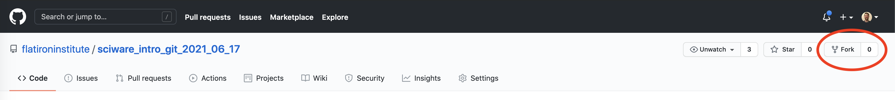
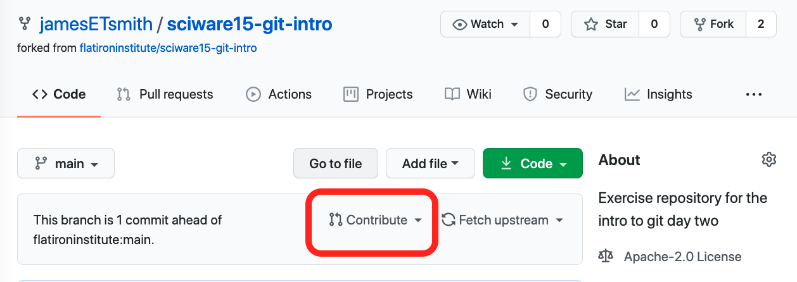
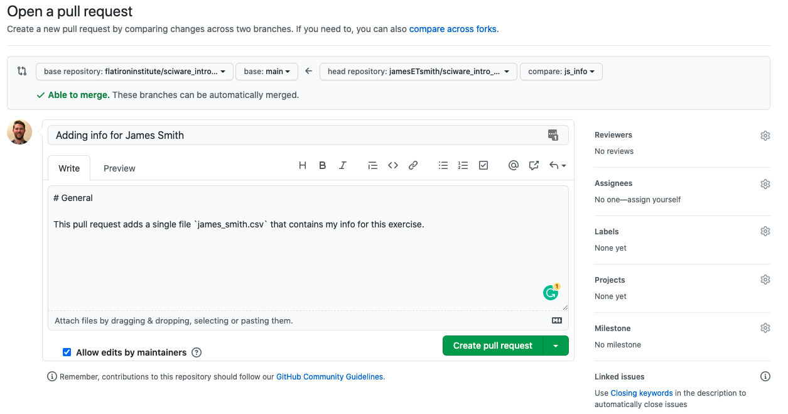
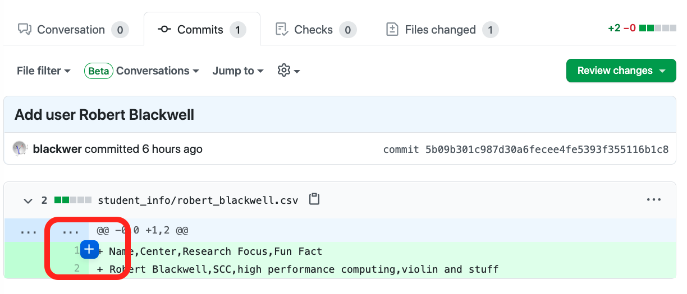

# Sciware

## Intro to Github

https://github.com/flatironinstitute/learn-sciware-dev/tree/master/15_IntroGithub

## Rules of Engagement

### Goal:

Activities where participants all actively work to foster an environment which encourages participation across experience levels, coding language fluency, *technology choices*\*, and scientific disciplines.

<small>\*though sometimes we try to expand your options</small>

## Rules of Engagement

- Avoid discussions between a few people on a narrow topic
- Provide time for people who haven't spoken to speak/ask questions
- Provide time for experts to share wisdom and discuss
- Work together to make discussions accessible to novices

<small>
(These will always be a work in progress and will be updated, clarified, or expanded as needed.)
</small>

## Zoom Specific

- If comfortable, please keep video on so we can all see each other's faces.
- Ok to break in for quick, clarifying questions.
- Use Raise Hand feature for new topics or for more in-depth questions.
- Please stay muted if not speaking. (Host may mute you.)
- We are recording. Link will be posted on #sciware Slack.

## Future Sessions

- July 8: Intro to IDEs and Debugging
- Suggest topics and vote on options in #sciware Slack

## We Need Something Different

- When we want to make changes _separately_ from a main project
- We want to take an existing project in a _new_ direction
- Sometimes we want to make and track changes to repositories we don't have permissions to push to

## Forking to the Rescue

## Forking Workflow

1. Fork and clone the project
2. Add the code and push to your fork
3. Merge code into the main project
4. Keep your fork up to date

## Step 1: Fork and Clone

## Step 1: Fork and Clone

    First we need to fork the repo
    

    Next, we clone <em>our</em> fork of the repo:
    <pre  style="font-size:0.75em;">
        <code data-trim data-noescape class="language-zsh">
        ➜ git clone git@github.com:your_user_name/sciware15-git-intro.git
        </code>
    </pre>

## Step 1: Add an Upstream

 If you already have a copy of this repo from yesterday's workshop, that's ok, keep it!
<pre  style="font-size:0.75em;">
    <code data-trim data-noescape class="language-zsh" data-line-numbers="1,4,5,6">
    ➜ git remote -v
    origin  git@github.com:flatironinstitute/sciware15-git-intro.git (fetch)
    origin  git@github.com:flatironinstitute/sciware15-git-intro.git (push)
    ➜ git remote rename origin upstream
    ➜ git remote add origin git@github.com:jamesETsmith/sciware15-git-intro.git
    ➜ git remote -v
    origin  git@github.com:jamesETsmith/sciware15-git-intro.git (fetch)
    origin  git@github.com:jamesETsmith/sciware15-git-intro.git (push)
    upstream  git@github.com:flatironinstitute/sciware15-git-intro.git (fetch)
    upstream  git@github.com:flatironinstitute/sciware15-git-intro.git (push)
    </code>
</pre>

## Step 2a: Add Your Code

Add a file in `student_info` called `firstName_lastName.csv` with the following info:

- Your full name
- Your center
- Your research focus
- A fun fact

## Step 2a: Add Your Code

Mine looks like this:

<pre  style="font-size:0.75em;">
    <code data-trim data-noescape class="language-plaintext">
Name,Center,Research Focus, Fun Fact
James Smith, CCQ, Quantum Chemistry, My initials are JETS
    </code>
</pre>

## Step 2b: Push to Your Fork

## Step 2b: Push to Your Fork

- Run `git add` on your file
- Commit it
- Push to your fork

Mine looks like this:

<pre  style="font-size:0.75em;">
    <code data-trim data-noescape class="language-zsh">
➜ git status
...
➜ git add student_info/james_smith.csv
➜ git commit -m "Adding info for James Smith"
...
➜ git push origin main
    </code>
</pre>

## Step 3: Open a Pull Request

## Step 3: Open a Pull Request

- Using your browser, navigate to your forked repository
- It should look something like this:

- Click on the `Contribute` button

## Step 3: Open a Pull Request

- Click on the `Open pull request` button

## Step 3: Open a Pull Request

## Step 3: Open a Pull Request

Things to think about when making pull requests (PR):

<ul>
<li>Many projects have PR templates with information you need to fill out, <b><em>use them</em></b>!</li>
<li class="fragment">Include <b><em>why</em></b> you're making the PR, what steps you took, and how it addresses a current problem.</li>
<li class="fragment">Bug reports should <b><em>always</em></b> include a minimum working example.</li>
<li class="fragment">PRs (and Issues) are a valuable <b><em>public</em></b> record, just like StackOverflow.</li>
</ul>

## Step 4: Pull Other's Changes

## Step 4: Pull Other's Changes

If the original repo from `flatironinstitute` isn't your upstream, set it now and then pull from it.

If the original repo from `flatironinstitute` isn't your upstream, set it now and then pull from it.

<pre  style="font-size:0.75em;">
    <code data-trim data-noescape class="language-zsh" data-line-numbers="1,4,5,10">
    ➜ git remote -v
    origin  git@github.com:jamesETsmith/sciware15-git-intro.git (fetch)
    origin  git@github.com:jamesETsmith/sciware15-git-intro.git (push)
    ➜ git remote add upstream git@github.com:flatironinstitute/sciware15-git-intro.git
    ➜ git remote -v
    origin  git@github.com:jamesETsmith/sciware15-git-intro.git (fetch)
    origin  git@github.com:jamesETsmith/sciware15-git-intro.git (push)
    upstream  git@github.com:flatironinstitute/sciware15-git-intro.git (fetch)
    upstream  git@github.com:flatironinstitute/sciware15-git-intro.git (push)
    ➜ git pull upstream main
    </code>
</pre>

# Survey

## http://bit.ly/sciware-github2-2021

## Reviewing a Pull Request

As other students make PRs, go to the pull requests tab on GitHub.

## Reviewing a Pull Request

As other students make PRs, go to the pull requests tab on GitHub.

## Reviewing a Pull Request

Choose another student's PR and click on it.

## Reviewing a Pull Request

Click on the commit to see the diff of their changes and hover over a line until you see the `+` sybmol.

## PR Case Study

Here's an example of a PR _without_ a helpful description:

## PR Case Study

Here's an example of a [PR](https://github.com/scikit-learn/scikit-learn/pull/20251) _with_ a helpful description:

## Extra Resources

Check out and bookmark these tutorials for more information about git and the forking workflow:

- [Bitbucket: Making a Pull Request](https://www.atlassian.com/git/tutorials/making-a-pull-request)
- [CodeRefinery: Distributed version control and forking workflow](https://coderefinery.github.io/git-collaborative/03-distributed/)

# Survey

## http://bit.ly/sciware-github2-2021
