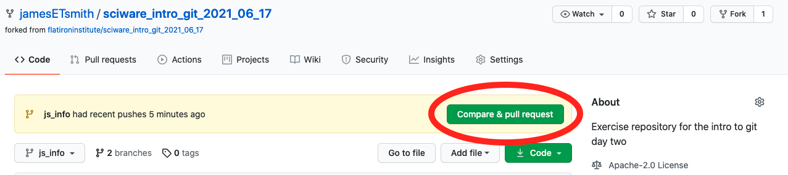

# Sciware

## Intro to Github

https://github.com/flatironinstitute/learn-sciware-dev/tree/master/15_IntroGithub

## Rules of Engagement

### Goal:

Activities where participants all actively work to foster an environment which encourages participation across experience levels, coding language fluency, *technology choices*\*, and scientific disciplines.

<small>\*though sometimes we try to expand your options</small>

## Rules of Engagement

- Avoid discussions between a few people on a narrow topic
- Provide time for people who haven't spoken to speak/ask questions
- Provide time for experts to share wisdom and discuss
- Work together to make discussions accessible to novices

<small>
(These will always be a work in progress and will be updated, clarified, or expanded as needed.)
</small>

## Zoom Specific

- If comfortable, please keep video on so we can all see each other's faces.
- Ok to break in for quick, clarifying questions.
- Use Raise Hand feature for new topics or for more in-depth questions.
- Please stay muted if not speaking. (Host may mute you.)
- We are recording. Link will be posted on #sciware Slack.

## Future Sessions

- July 8: Intro to IDEs and Debugging
- Suggest topics and vote on options in #sciware Slack

## Today's Agenda

- Forking Workflow
- Exercise: How to Fork and Make a Pull Request
- Reviewing and Merging Pull Requests
- Bonus Exercise: Keeping a Fork Up-To-Date

## What's a Fork?
(Figure incoming)

## Why are Forks Necessary?
- When we want to make changes _separately_ from a main project
- Sometimes we want to make and track changes to repositories we don't have permissions to push to

## Forking Workflow

## Forking Workflow

> Each contributor has not one, but two Git repositories: a personal fork local one and a public server-side one.

## Forking Workflow

1. Fork and clone the project
2. Add the code and push to your fork
3. Open a pull request
4. Pull everyone else's changes
5. Bonus: Reviewing a pull request

## EXTRA SLIDE

<!-- From http://jlord.us/git-it/challenges/forks_and_clones.html -->

## Step 1: Fork and Clone

    First we need to fork the repo
    

    Next, we clone <em>our</em> fork of the repo:
    <pre  style="font-size:0.75em;">
        <code data-trim data-noescape class="language-zsh">
        ➜ git clone https://github.com/your_user_name/sciware_intro_git_2021_06_17.git
        </code>
    </pre>

## Step 2a: Add Your Code 

Add a file in `student_info` called `firstName_lastName.csv` with the following info:

- Your full name
- Your enter
- Your research focus

## Step 2a: Add Your Codes

Mine looks like this:

<pre  style="font-size:0.75em;">
    <code data-trim data-noescape class="language-plaintext">
Name,Center,Research Focus, Fun Fact
James Smith, CCQ, Quantum Chemistry, My initials are JETS
    </code>
</pre>

## Step 2b: Push to Your Fork

- Run `git add` on your file
- Commit it
- Push to your fork

Mine looks like this:

<pre  style="font-size:0.75em;">
    <code data-trim data-noescape class="language-zsh">
➜ git add student_info/james_smith.csv
➜ git commit -m "Adding info for James Smith"
...
➜ git push origin main
    </code>
</pre>

## Step 3: Open a Pull Request

- Using your browser, navigate to your forked repository
- It should look something like this:

- Click on the `Compare & pull request` button

## Step 3: Open a Pull Request

## Step 3: Open a Pull Request

Things to think about when making pull requests (PR):

<ul>
<li>Many projects have PR templates with information you need to fill out, <b><em>use them</em></b>!</li>
<li class="fragment">Include <b><em>why</em></b> you're making the PR, what steps you took, and how it addresses a current problem.</li>
<li class="fragment">Bug reports should <b><em>always</em></b> include a minimum working example.</li>
<li class="fragment">PRs (and Issues) are a valuable <b><em>public</em></b> record, just like StackOverflow.</li>
</ul>

## Step 4: Pull Other's Changes

<pre  style="font-size:0.75em;">
    <code data-trim data-noescape class="language-zsh" data-line-numbers="1,4,5,10">
    ➜ git remote -v
    origin  https://github.com/jamesETsmith/sciware_intro_git_2021_06_17.git (fetch)
    origin  https://github.com/jamesETsmith/sciware_intro_git_2021_06_17.git (push)
    ➜ git remote add upstream https://github.com/flatironinstitute/sciware_intro_git_2021_06_17.git
    ➜ git remote -v
    origin  https://github.com/jamesETsmith/sciware_intro_git_2021_06_17.git (fetch)
    origin  https://github.com/jamesETsmith/sciware_intro_git_2021_06_17.git (push)
    upstream  https://github.com/flatironinstitute/sciware_intro_git_2021_06_17.git (fetch)
    upstream  https://github.com/flatironinstitute/sciware_intro_git_2021_06_17.git (push)
    ➜ git pull upstream main
    </code>
</pre>

## BONUS MATERIAL

## Reviewing a Pull Request

## Extra Steps

Check out and bookmark these tutorials for more information about git and the forking workflow:

- [Bitbucket: Making a Pull Request](https://www.atlassian.com/git/tutorials/making-a-pull-request)
- [CodeRefinery: Distributed version control and forking workflow](https://coderefinery.github.io/git-collaborative/03-distributed/)
