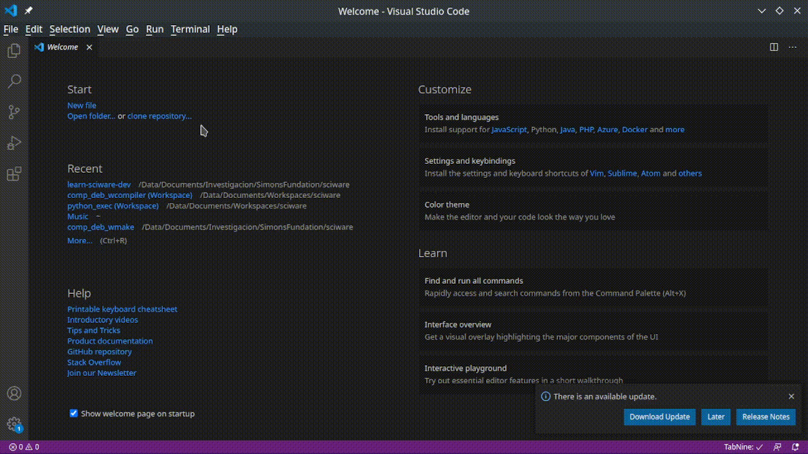
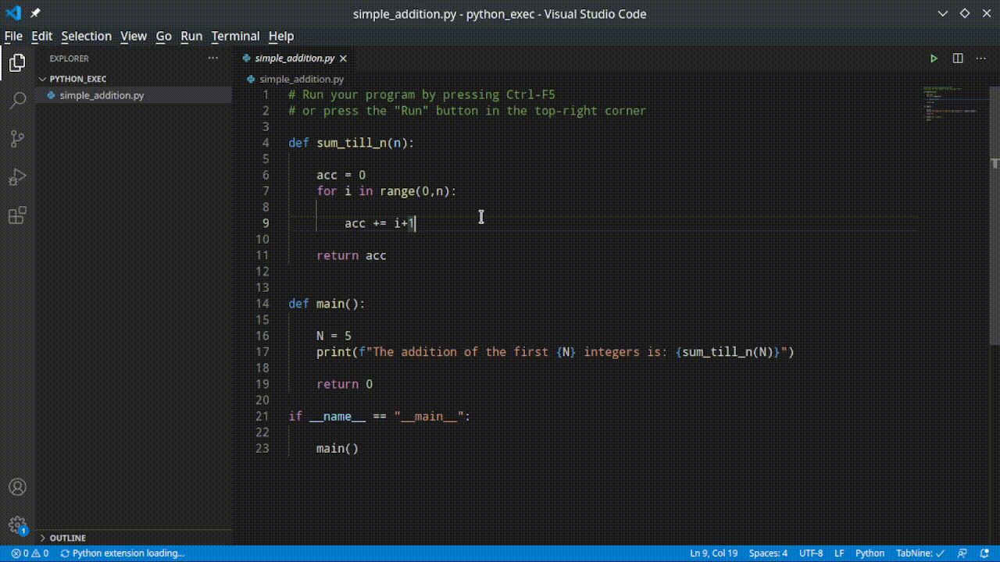
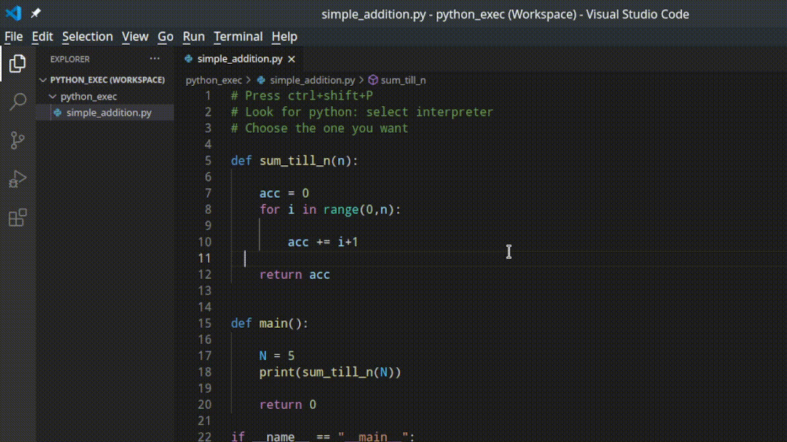

# Sciware

## Tools to make programming easier
### Intro to code editors and debugging

https://github.com/flatironinstitute/learn-sciware-dev/tree/master/16_EditorsVSCode

## Rules of Engagement

### Goal:

Activities where participants all actively work to foster an environment which encourages participation across experience levels, coding language fluency, *technology choices*\*, and scientific disciplines.

<small>\*though sometimes we try to expand your options</small>

## Rules of Engagement

- Avoid discussions between a few people on a narrow topic
- Provide time for people who haven't spoken to speak/ask questions
- Provide time for experts to share wisdom and discuss
- Work together to make discussions accessible to novices

<small>
(These will always be a work in progress and will be updated, clarified, or expanded as needed.)
</small>

## Zoom Specific

- If comfortable, please keep video on so we can all see each other's faces.
- Ok to break in for quick, clarifying questions.
- Use Raise Hand feature for new topics or for more in-depth questions.
- Please stay muted if not speaking. (Host may mute you.)
- We are recording. Link will be posted on #sciware Slack.

## Future Sessions

- Suggest topics and vote on options in #sciware Slack

## Today's Agenda

# Intro to IDEs

# Quick reference guides

# Workspaces

Workspaces are a quality of life feature of vscode that let you:

- Save which folders you are using.
- Configure settings that only apply to said folders.
- Set tasks (compiling/running) and debugging configurations.
- Store and restore UI state associated with that workspace (opened files, tab order, ...)
- Enable or disable extensions only for that workspace.

## Creating a workspace

### Open the folder(s) you will use

## Save workspace

## Load workspace

# Integrated execution

Execute python codes without writting on a terminal

## Select your python interpreter

## Run your code!

# Working on Remote Clusters

All of the cool features you've seen so far, can be used when editing _remote_ files, i.e. on a cluster!!

## How It Works

## What You Can Do

- View, move, and reorganize directories
- Edit files
- Debug
- Static linting
- Formatting
- View figures

## Bonus: Setup

1. Get OpenSSH compatible SSH client
2. Download the [Remote SSH extension](https://code.visualstudio.com/docs/remote/ssh) for VSCode
3. Enable key-based authentication, see the [VSCode docs](https://code.visualstudio.com/docs/remote/troubleshooting#_configuring-key-based-authentication) for details
4. From the VSCode command palette search for `Remote-SSH: Connect to Host`
5. Enter your username and host info, e.g. `jasm3285@login.colorado.edu`

See the official instructions [here](https://code.visualstudio.com/docs/remote/ssh-tutorial)