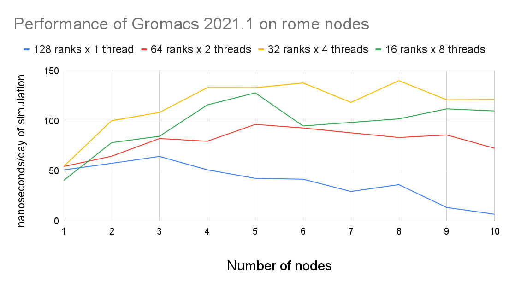
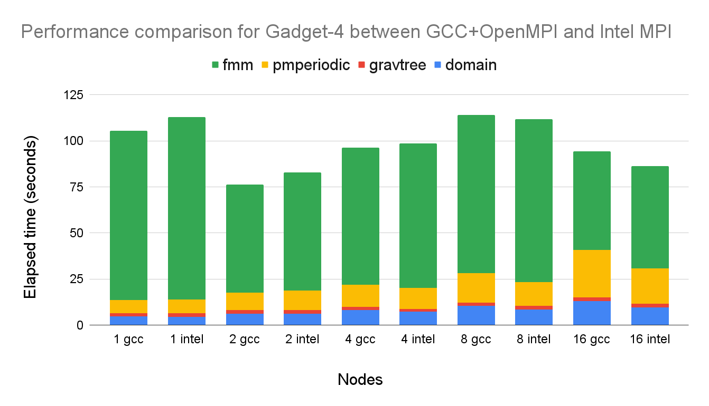

# Sciware

## Flatiron Clusters
## Performance and Efficiency

https://github.com/flatironinstitute/sciware/tree/main/17_FICluster


## Rules of Engagement

### Goal:

Activities where participants all actively work to foster an environment which encourages participation across experience levels, coding language fluency, *technology choices*\*, and scientific disciplines.

<small>\*though sometimes we try to expand your options</small>


## Rules of Engagement

- Avoid discussions between a few people on a narrow topic
- Provide time for people who haven't spoken to speak/ask questions
- Provide time for experts to share wisdom and discuss
- Work together to make discussions accessible to novices

<small>
(These will always be a work in progress and will be updated, clarified, or expanded as needed.)
</small>


## Zoom Specific

- If comfortable, please keep video on so we can all see each other's faces.
- OK to break in for quick, clarifying questions.
- Use Raise Hand feature for new topics or for more in-depth questions.
- Please stay muted if not speaking. (Host may mute you.)
- We are recording. Link will be posted on #sciware Slack.


## Future Sessions

- Chat & office hour (TBD)
- Oct 21: An introduction to scientific visualization with Blender (Brian Kent, NRAO)
- Suggest topics and vote on options in #sciware Slack


## Today's agenda

- Cluster overview
- Slurm and parallelization
- Modules and software
- Filesystems and storage
- Performance and benchmarking
- Activity: monitoring jobs
- Reception (roof)


# Running Parallel Jobs on the FI Cluster

## Slurm, Job Arrays, and disBatch

How to run jobs efficiently on Flatiron's clusters


## Slurm

- How do you share a set of computational resources among cycle-hungry scientists?
  - With a job scheduler! Also known as a queue system.
- Flatiron uses [Slurm](https://slurm.schedmd.com) to schedule jobs
  


## Slurm
- Wide adoption at universities and HPC centers. The skills you learn today will be highly transferable!
- Flatiron has two clusters (rusty & popeye), each with multiple kinds of nodes (see the slides from earlier)
- The [Wiki](https://docs.simonsfoundation.org/index.php/Public:Instructions_Iron_Cluster) lists all the node options and what Slurm flags to use to request them


## Slurm Basics

- Write a "batch file" that specifies the resources needed:

```bash
#!/bin/bash
# File: myjob.sbatch
# These look like comments, but are interpreted by Slurm as sbatch flags
#SBATCH --mem=1G          # Memory?
#SBATCH --time=02:00:00   # Time? (2 hours)
#SBATCH --ntasks=1        # Parallel tasks?
#SBATCH --cpus-per-task=1 # Cores?
#SBATCH --partition=genx

module load gcc python3

for fn in *.hdf5; do
    ./myjob $fn
done
```

- Submit the job to the queue with `sbatch myjob.sbatch`
- Check the status with: `squeue --me`


## Where is my output?

- By default, `slurm-<jobid>.out` in your current directory
- Can set `-o outfile.log`, `-e stderr.log`
- You can also run interactive jobs with `srun --pty ... bash`


## Slurm Tip \#1: Estimating Resource Requirements

- Jobs don't necessarily run in order; most run via "backfill".
  - Implication: specifying the smallest set of resources for your job will help it run sooner
  - But don't short yourself!
- Memory requirements can be hard to assess, especially if you're running someone else's code


## Slurm Tip \#1: Estimating Resource Requirements

- How to estimate resource requirements:
  1. Guess based on your knowledge of the program. Think about the sizes of big arrays and any files being read.
  1. Run a test job
  1. Check the actual usage of the test job with:\
  `seff -j <jobid>`
    - `Job Wall-clock time`: how long it took in "real world" time (`#SBATCH -t`)
    - `Memory Utilized`: maximum amount of memory used (`#SBATCH --mem`)


## Slurm Tip \#2: Choosing a Partition
    
- Use `-p gen` to submit small/test jobs, `-p ccX` for real jobs
  - `gen` has smaller limits and higher priority
- The center and general partitions (`ccx` and `gen`) always allocate whole nodes
  - All cores, all memory, reserved for you to make use of
- If your job doesn't use a whole node, you can use the `genx` partition (allows multiple jobs per node)
- Or run multiple things in parallel...


## Running Jobs in Parallel

- You've written a script to post-process a simulation output
- Have 10–10000 outputs to process
   ```bash
   $ ls ~/myproj
   my_analysis_script.py
   $ ls ~/ceph/myproj
   output1.hdf5  output2.hdf5  output3.hdf5 [...]
   ```
- Each file can be processed independently
- Ready to use rusty! ... but how?
- Recommendation: don't submit more than ~50 jobs at once


## Running Jobs in Parallel

- This pattern of independent parallel jobs is known as "embarrassingly parallel" or "pleasantly parallel"
- Two good options for pleasantly parallel jobs:
  - Slurm job arrays
  - disBatch
- Note: this job is a bad candidate for MPI
  - If the jobs don't need to communicate with each other, no need for MPI!


## Option 1: Slurm Job Arrays
- Queues up multiple identical jobs
  - In this case, one per output
- Syntax: `#SBATCH --array=1-100%10`, submits 100 jobs as an array, limited to 10 running at once
- Slurm is allowed to run each job in the array individually; no need to wait for 10 nodes


## Option 1: Slurm Job Arrays
- Recommend organizing into two scripts: `launch_slurm.sh` and `job.slurm`
```bash
    #!/bin/bash
    # File: launch_slurm.sh

    # Recommendation: keep scripts in $HOME, and data in ceph
    projdir="$HOME/ceph/myproj/"  # data dir with output*.hdf5
    jobname="job1"
    jobdir="$projdir/$jobname"

    mkdir -p $jobdir

    # Use the "find" command to write the list of files to process, 1 per line
    fn_list="$jobdir/fn_list.txt"
    find $projdir -name 'output*.hdf5' | sort > ${fn_list}
    nfiles=$(wc -l $fn_list)

    # Launch a Slurm job array with $nfiles entries
    sbatch --array=1-$nfiles job.slurm $fn_list
```


```bash
    # File: job.slurm
    
    #SBATCH -p ccX      # or "-p genx" if your job won't fill a node
    #SBATCH -N 1        # 1 node
    #SBATCH --mem=128G  # ccX always gets all memory on the node, require at least...
    #SBATCH -t 1:00:00  # 1 hour
    
    # the file with the list of files to process
    fn_list=$1
    
    # the job array index
    i=$SLURM_ARRAY_TASK_ID
    
    # get the line of the file belonging to this job
    fn=$(sed -n "${i}p" ${fn_list})
    
    echo "About to process $fn"
    ./my_analysis_script.py $fn
```


## Option 1: Slurm Job Arrays
- What did we just do?
  - Get the list of N files we want to process (one per job)
  - Write that list to a file
  - Launch a job array with N jobs
  - Have each job get the i-th line in the file
  - Execute our science script with that file
- Why write a list of files when each Slurm job could run its own `find`?
    - Just to be sure that all jobs agree on the division of work (file sorting, files appearing or disappearing, etc)


## Option 2: disBatch
- What if jobs take a variable amount of time?
  - The job array approach forces you to request the longest runtime of any single job
- What if a job in the job array fails?
  - Resubmitting requires a manual post-mortem
- disBatch solves both of these problems!
  - A Slurm-aware dynamic dispatch mechanism that also has nice task tracking
  - Developed here at Flatiron: https://github.com/flatironinstitute/disBatch


## Option 2: disBatch
- Write a "task file" with one command-line command per line:
```bash
# File: jobs.disbatch
./my_analysis_script.py output1.hdf5
./my_analysis_script.py output2.hdf5
```
- Simplify as:
```bash
# File: jobs.disbatch
#DISBATCH PREFIX ./my_analysis_script.py 
output1.hdf5
output2.hdf5
```
- Submit a Slurm job, invoking the `disBatch` executable with the task file as an argument:\
`sbatch [...] disBatch jobs.disbatch`


## Option 2: disBatch
```bash
#!/bin/bash
# File: submit_disbatch.sh

projdir="$HOME/ceph/myproj/"
jobname="job1"
jobdir="$projdir/$jobname"
taskfn="$jobdir/tasks.disbatch"

# Build the task file
echo "#DISBATCH PREFIX ./my_analysis_script.py" > $taskfn
find $projdir -name 'output*.hdf5' | sort >> $taskfn

# Submit the Slurm job: run 16 at a time, each with 8 cores
sbatch -p ccX -n16 -c8 disBatch $taskfn
```


## Option 2: disBatch
- When the job runs, it will write a `status.txt` file, one line per task
- Resubmit any jobs that failed with:\
`disBatch -r status.txt -R`


## Job Arrays vs. disBatch
    
- Job Array Advantages
    - No external dependencies
    - Jobs can be scheduled by Slurm independently

- disBatch Advantages
    - Dynamic scheduling handles variable-length jobs
    - Status file of successful and failed jobs
    - Easy retries of failed jobs
    - Scales beyond 10K+ jobs


## Summary of Parallel Jobs
- Independent parallel jobs are a common pattern in scientific computing (parameter grid, analysis of multiple outputs, etc.)
    - Slurm job arrays or disBatch work better than MPI
- Both are good solutions, but I (Lehman) tend to use disBatch more than job arrays these days, even when I just need static scheduling
  


## GPUs

- For GPU nodes, you should specify:
  - `-p gpu`
  - Number of tasks: `-n1`
  - Number of cores: `--cpus-per-task=1` or `--cpus-per-gpu=1`
  - Amount of memory: `--mem=16G` or `--mem-per-gpu=16G`
  - Number of GPUs: `--gpus=` or `--gpus-per-task=`
  - Acceptable GPU types: `-C p100|v100|a100` (also `v100-32gb` `a100-40gb` `nvlink`)


## Other resources

- "Big memory" nodes: 4 nodes with 3-6TB memory, 96-192 cores
- "preempt" partition: submit very large jobs (beyond your normal limit) which run on idle nodes, but may be killed as resources are requested by others


# Modules & software

- Most software you'll use on the cluster will either be:
  - In a "module" we provide
  - Downloaded/built/installed by you
- By default you only see the "base system" software (CentOS 7), which is often rather old


## Modules

- See what's available: `module avail`
```
gcc/7.4.0(default)
gcc/10.2.0
gcc/11.1.0
python3/3.6.2
python3/3.7.3
```
- Load modules with `module load NAME[/VERSION] ...` (defaults to highest version if not specified)


### `module load`

```
> gcc -v
gcc version 4.8.5 20150623 (Red Hat 4.8.5-44) (GCC)
> module load gcc
> gcc -v
gcc version 7.4.0 (GCC)
> module unload gcc
```


### Other module commands

- `module list` to see what you've loaded
- `module unload`
- `module show NAME` to see what a module does (probably sets PATH)


## Python packages

- `module load python` has a lot of packages built-in (check `pip list`)
- If you need something more, create a [virtual environment](https://docs.python.org/3/tutorial/venv.html):

```
> python3 -m venv --system-site-packages ~/myvenv
> source ~/myvenv/bin/activate
> pip install ...
```

### Jupyter

You can also use modules and virtual environments in JupyterHub:
```
# setup your environment
module load gcc python ...
source ~/projenv/bin/activate
# capture it into a new kernel
module load jupyter-kernels
python3 -m make-custom-kernel projkernel
```

Reload jupyterhub and "projkernel" will show up with the same environment.


## Batch scripts

Good practice to load the modules you need:

```bash
#!/bin/sh
#SBATCH -p ccx
module purge
module load gcc python3
source ~/myvenv/bin/activate

python3 myscript.py
```

### Too much typing

Put common sets of modules in a script
```bash
# File: ~/amods
module purge
module load gcc python hdf5 git
```
And "source" it when needed:
```
> . ~/amods
```

- Avoid putting module loads in `~/.bashrc`


## New modules

- We will soon transition to a new set of modules
- Most things work the same, but some names change
- New versions of packages
- Will replace current modules and `modules-nix`
- Try them now: `module load modules-new`


## Other software

If you need something not in the base system, modules, or pip:
- Download and install it yourself
  - Many packages provide install instructions
  - Load modules to find dependencies
- Ask!


# Benchmarking

## Why, when, what, and how?

Testing how to get the best performance out of your jobs


## Why benchmarking?

- Use the resources more efficiently
- Are you sure you are running optimally?
  - What processor architecture?
  - Which libraries? (eg: OpenBLAS vs MKL)
  - What MPI ranks / OpenMP threads ratio?
  - How many nodes for a given problem size?
- A 15 minutes benchmark can help your week-long computation get you more results
  - Or reduce it to a day-long computation!


## When to benchmark?

- Before you type `sbatch --time=a-lot!`
- For new projects
- For known projects: batch scripts are not "one size fits all"
  - Especially if your scripts come from another HPC center
  - Even locally we have very diverse machines!
  - New software versions can mean new configuration


## What to benchmark?

- Find something that can:
  - Represent your whole run in a short period of time
  - eg: a couple of iterations instead of 1000s of them
  - Use the same configuration you intend to use in production
- Be wary of "toy benchmarks":
  - They might benefit from requiring less memory, I/O, ...
  - If possible run with your real problem, but not to completion!


## How to benchmark?
  
- Domain-specific benchmarking tools
  - [MDBenchmark](https://mdbenchmark.readthedocs.io/) for Molecular Dynamic simulations
- Generic frameworks
  - [JUBE](https://www.fz-juelich.de/ias/jsc/EN/Expertise/Support/Software/JUBE/jube.html)
- These environments will let you:
  - Explore a space of different parameters
  - Easily read/format/export results
  - Produce scaling results for articles
  - <span style="color:#990000">Fill the Slurm queues with jobs: run in multiple steps! (or use disBatch when possible)</span>


## Using JUBE 

1. Create an XML (or YAML) file describing the benchmark
1. Launch using `jube run mybenchmark.xml`
1. While running with a batch scheduler:
  - `jube continue mybenchmark --id=N`: status
  - `jube result mybenchmark --id=N`  : partial results
1. Once finished, get the complete results:
  - Formatted table: `jube result mybenchmark --id=N`
  - CSV: `jube result mybenchmark --id=N -s csv`


## JUBE Configuration Files (1)

- XML Structure:
  1. Benchmark configuration: number of nodes, input files
    - Inputs can be dynamic (python, shell)
  1. Execution configuration: processor type, runtime
    - Execution can be through a batch scheduler
  1. Benchmark definition: which steps to run, in what order
  1. Regular expressions to extract results
  1. Results printing: inputs, outputs, in what order
- If needed, templates for other files, filled at runtime
  - batch scheduler job
  - input parameter files


## JUBE Configuration Files (2)
Parameter sets: NAS Parallel Benchmarks, single node
```xml
<parameterset name="param_set"> <!-- Benchmark configuration -->
    <parameter name="kernel" type="string">bt,cg,ep,ft,is,lu,mg,sp</parameter>
    <parameter name="class" type="string">A,B,C,D</parameter>
</parameterset>
<parameterset name="executeset"> <!-- Slurm job configuration -->
    <parameter name="submit_cmd">sbatch</parameter>
    <parameter name="job_file">npb_mpi.run</parameter>
    <parameter name="max_num_ranks_per_node" type="int">128</parameter>
    <parameter name="exec">num_ranks=1; 
        while [ $$num_ranks -le ${max_num_ranks_per_node} ]; 
            mpirun -np $$num_ranks --bind-to core ./$kernel.$class.x; 
            num_ranks=$$[$$num_ranks*2];
        done
    </parameter>
</parameterset>
```


## JUBE Configuration Files (3)
Analysis and results (with stats!)
```xml
<patternset name="pattern"><!-- Regex pattern -->
  <pattern name="num_ranks_used" type="int">Total processes =\s+$jube_pat_int</pattern>
  <pattern name="time_in_seconds" type="float">Time in seconds =\s+$jube_pat_fp</pattern>
  <pattern name="mflops" type="float">Mop/s total     =\s+$jube_pat_fp</pattern>
</patternset>
<result><!-- Create result table -->
  <use>analyse</use>
  <table name="result" style="csv" sort="kernel,class,num_ranks_used">
    <column>kernel</column>
    <column>class</column>
    <column>num_ranks_used</column>
    <column>time_in_seconds_avg</column><!-- Stats: avg, sum, min, max, std,... -->
    <column>mflops_avg</column>
  </table>
</result>
```


## Example 1: GROMACS
<div style="display: flex;">
<small>
<ul>
<li>How many nodes to use?</li>
<li>How to distribute threads/ranks inside nodes?</li>
<li>GROMACS can be told to stop after <i>N</i> minutes</li>
<li>GROMACS provides performance numbers in ns/day</li>
<i>System courtesy Sonya Hanson (CCB)</i>
</ul>

</small>
</div>

```xml
<parameterset name="param_set">
    <parameter name="num_nodes">1,2,3,4,5,6,7,8,9,10</parameter>
    <parameter name="ranks_per_node">128,64,32,16</parameter>
</parameterset>
<parameterset name="execute_set">
    <parameter name="cores_per_node">128</parameter>
    <parameter name="threads_per_rank">$procs_per_node/$cores_per_node</parameter>
    <parameter name="num_rank">$num_nodes*$ranks_per_node</parameter>
</parameterset>
```


## Example 2: Gadget4
<div style="display: flex;">
<small>
<ul>
<li>Compare Intel MPI with OpenMPI</li>
<li>Weak scaling for a given problem type</li>
<li>Smulation stopped after a few iterations</li>
<li>Gadget4 gives detailed timings</li>
<i>Simulation config courtesy Yin Li (CCA)</i>
</ul>

</small>
</div>

```xml
<parameterset name="compile_set">
    <parameter name="toolchain">gcc_openmpi, intel</parameter>
    <parameter name="compiler">
      { "gcc_openmpi" : "gcc/7.4.0",
        "intel"       : "intel/compiler/2017-4" }
    </parameter>
    <parameter name="mpi_library">
      { "gcc_openmpi" : "openmpi4/4.0.5",
        "intel"       : "intel/mpi/2017-4" }
    </parameter>
</parameterset>
```


## Benchmarking: conclusion

- Try and benchmark when you are starting a new large project on the FI machines
- Using a toolkit like JUBE can simplify your work
- For examples: https://github.com/gkrawezik/BENCHMARKS


# Survey

https://bit.ly/???


# Questions & Help


