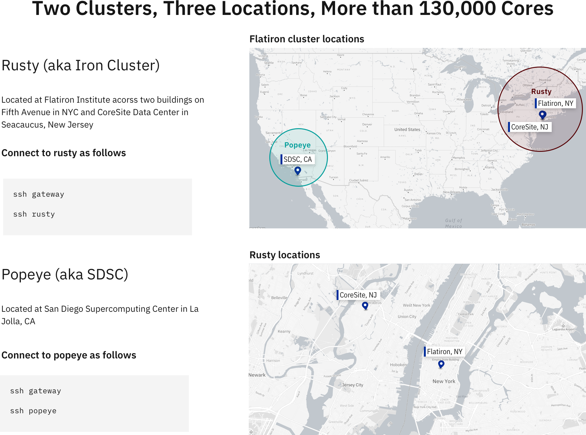
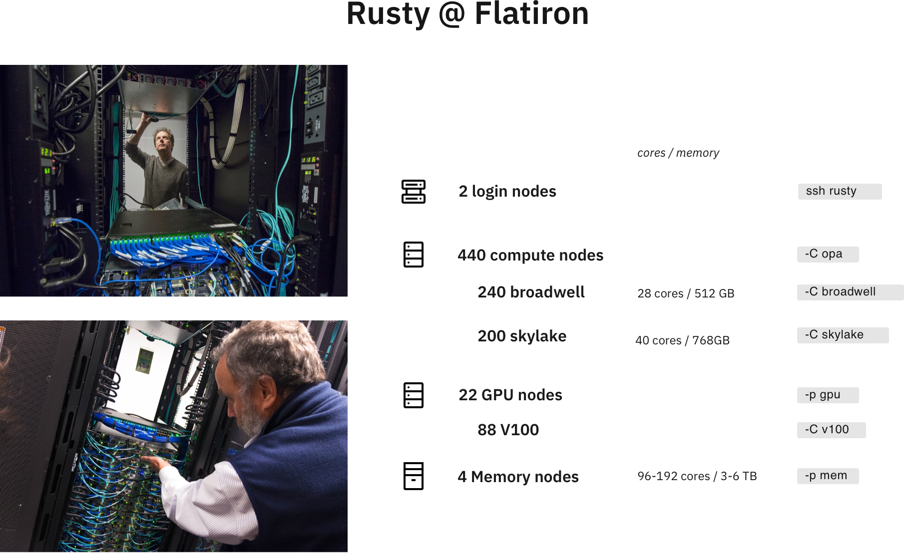
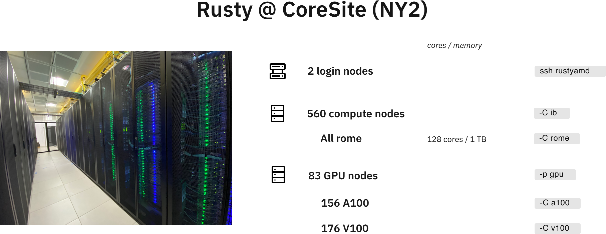
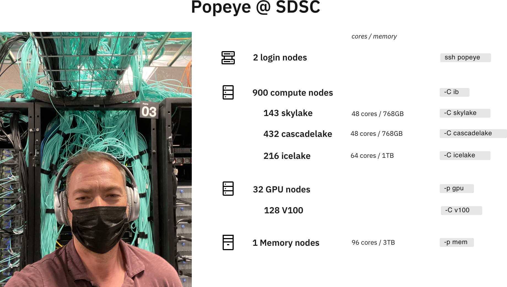
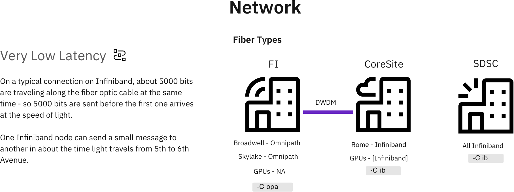

# Sciware

## Flatiron Clusters
## Performance and Efficiency

https://github.com/flatironinstitute/sciware/tree/main/17_FICluster


## Rules of Engagement

### Goal:

Activities where participants all actively work to foster an environment which encourages participation across experience levels, coding language fluency, *technology choices*\*, and scientific disciplines.

<small>\*though sometimes we try to expand your options</small>


## Rules of Engagement

- Avoid discussions between a few people on a narrow topic
- Provide time for people who haven't spoken to speak/ask questions
- Provide time for experts to share wisdom and discuss
- Work together to make discussions accessible to novices

<small>
(These will always be a work in progress and will be updated, clarified, or expanded as needed.)
</small>


## Zoom Specific

- If comfortable, please keep video on so we can all see each other's faces.
- OK to break in for quick, clarifying questions.
- Use Raise Hand feature for new topics or for more in-depth questions.
- Please stay muted if not speaking. (Host may mute you.)
- We are recording. Link will be posted on #sciware Slack.


## Future Sessions

- Oct 7: Chat & office hour
- Oct 21: An introduction to scientific visualization with Blender (Brian Kent, NRAO)
- Suggest topics and vote on options in #sciware Slack


## Today's agenda

- Cluster overview
- Modules and software
- Slurm and parallelization
- Filesystems and storage
- Performance and benchmarking
- Activity: monitoring jobs
- Reception (roof)


# Cluster overview

<h3 style="color:#484848">Liz Lovero (SCC)</h3>

















# Modules & software

<h3 style="color:#484848">Dylan Simon (SCC)</h3>


## Overview

- Most software you'll use on the cluster (rusty, popeye, linux workstations) will either be:
  - In a "module" we provide
  - Downloaded/built/installed by you (usually using compiler/library modules)
- By default you only see the "base system" software (CentOS7), which is often rather old


## New modules

- On Monday, Nov 8, we will switch to a new set of modules
- Try them now: `module load modules-new`
- To switch back: `module load modules-traditional`
   - These will stay around for a while, but no longer maintained
- Newer versions of most packages (replacing old versions)


### `module avail`: aliases

- See what's available: `module avail`
- Aliases for backwards-compatibility: some names have changed
   ```text
   ------- Aliases -------
   intel/mkl -> intel-mkl  (see also intel-oneapi-*)
   lib/fftw3 -> fftw/3
   lib/hdf5  -> hdf5
   python3   -> python/3   (no more python 2)
   openmpi4  -> openmpi/4
   ...
   ```


### `module avail`: Core

```text
------------- Core --------------
gcc/7.5.0                (D)
gcc/10.2.0
gcc/11.2.0
openblas/0.3.15-threaded (S,L,D)
python/3.8.11            (D)
python/3.9.6
...
```
- `D`: default version (also used to build other packages)
- `L`: currently loaded
- `S`: sticky (see BLAS below)


### `module load` or `ml`

- Load modules with `module load` or `ml NAME[/VERSION] ...`
   ```text
   > gcc -v
   gcc version 4.8.5 20150623 (Red Hat 4.8.5-44) (GCC)

   > module load gcc
   > gcc -v
   gcc version 7.5.0 (Spack GCC)
   ```
- Can use partial versions, and also switch
   ```text
   > module load gcc/10
   The following have been reloaded: (don't be alarmed)
     openblas    gcc
   > gcc -v
   gcc version 10.2.0 (Spack GCC)
   ```
- Remove with `module unload NAME` or `ml -NAME`


### `module avail`: compilers

- When you load a compiler module, you may see a separate section
   ```text
   ---- gcc/10.2.0 ----
   fftw       openmpi
   hdf5       python
   openblas   ...
   ```
- These modules were built with/for this compiler
- Switching compilers automatically switches loaded modules to match
   - *Note:* modules are not built for `gcc/11` (uses `gcc/10` modules)
   - *Note:* cuda is not (yet) available with `gcc/10`


### `module avail`: MPI

- To access MPI-enabled modules, load an MPI module
   ```text
   > `ml openmpi`
   ----- openmpi/4.0.6 -----
   fftw/3.3.9-mpi
   hdf5/1.10.7-mpi
   openmpi-intel             (to use icc for mpicc)
   openmpi-opa               (to use opa nodes)
   python-mpi/3.8.11-mpi     (for mpi4py, h5py)
   ...
   ```
- Load them using full name (with `-mpi` suffix)


### flexiBLAS

- Any module that needs BLAS (e.g., numpy) will use whichever BLAS module you have loaded:
   - `openblas`: `-threaded` (pthreads), `-openmp`, or `single` (no threads)
   - `intel-mkl`
   - `intel-oneapi-mkl
- BLAS modules replace each other and won't get removed by default (`S`)


### Other module commands

- `module list` to see what you've loaded
- `module purge` to unload all modules (except `S` slurm, blas)
- `module key WORD` to search all modules
- `module spider MODULE` to see how to load a module
- `module whatis MODULE` to see a description
- `module show MODULE` to see exactly what a module does


## Python packages

- `module load python` has a lot of packages built-in (check `pip list`)
- If you need something more, create a [virtual environment](https://docs.python.org/3/tutorial/venv.html):

```bash
ml python
python3 -m venv --system-site-packages ~/myvenv
source ~/myvenv/bin/activate
pip install ...
```

- Repeat the `ml` and `source activate` to return in a new shell


### Jupyter

You can also use modules and virtual environments in JupyterHub:
```bash
# setup your environment
ml python ...
source ~/projenv/bin/activate
# capture it into a new kernel
ml jupyter-kernels
python -m make-custom-kernel projkernel
```

Reload jupyterhub and "projkernel" will show up providing the same environment


## Batch scripts

Good practice to load the modules you need in the script:

```bash
#!/bin/sh
#SBATCH -p ccx
module purge
module load gcc python
source ~/myvenv/bin/activate

python3 myscript.py
```


### Too much typing

Put common sets of modules in a script
```bash
# File: ~/amods
module purge
module load gcc python hdf5 git
```
And "source" it when needed:
```bash
. ~/amods
```

- Or use `module save`, `module restore`
- Avoid putting module loads in `~/.bashrc`


## Other software

If you need something not in the base system, modules, or pip:
- Download and install it yourself
  - Many packages provide install instructions
  - Load modules to find dependencies
- Ask!


# Running Parallel Jobs on the FI Cluster

## Slurm, Job Arrays, and disBatch

How to run jobs efficiently on Flatiron's clusters

<h3 style="color:#ce3232">Lehman Garrison (CCA)</h3>


## Slurm

- How do you share a set of computational resources among cycle-hungry scientists?
  - With a job scheduler! Also known as a queue system
- Flatiron uses [Slurm](https://slurm.schedmd.com) to schedule jobs


## Slurm
- Wide adoption at universities and HPC centers. The skills you learn today will be highly transferable!
- Flatiron has two clusters (rusty & popeye), each with multiple kinds of nodes (see the slides from earlier)
- The [Iron Cluster Wiki page](https://docs.simonsfoundation.org/index.php/Public:Instructions_Iron_Cluster) lists all the node options and what Slurm flags to use to request them
- Run any of these Slurm commands from a command line on your Flatiron workstation (`module load slurm`)


## Slurm Basics

- Write a "batch file" (special kind of script) that specifies the resources needed:

```bash
#!/bin/bash
# File: myjob.sbatch
# These comments are interpreted by Slurm as sbatch flags
#SBATCH --mem=1G          # Memory?
#SBATCH --time=02:00:00   # Time? (2 hours)
#SBATCH --cpus-per-task=1 # Cores?
#SBATCH --partition=genx

module load gcc python3

./myjob data1.hdf5
```

- Submit the job to the queue with `sbatch myjob.sbatch`: \
  `Submitted batch job 1234567`
- Check the status with: `squeue --me` or `squeue -j 1234567`


## Where is my output?

- By default, anything printed to `stdout` ends up in `slurm-<jobid>.out` in your current directory
- Can set `#SBATCH -o outfile.log` `-e stderr.log`
- You can also run interactive jobs with `srun --pty ... bash`


## What if you have multiple things to run?

- Let's say we have 10 files, each using 1 GB and 1 CPU

```bash
#!/bin/bash
#SBATCH --mem=10G           # Request 10x the memory
#SBATCH --time=02:00:00     # Same time
#SBATCH --cpus-per-task=10  # Request 10x the CPUs
#SBATCH --partition=genx

module load gcc python3

for filename in data{1..10}.hdf5; do
    ./myjob $filename &  # << the "&" runs the task in the background
done
wait  # << wait for all background tasks to complete
```

- This all still runs on a single node. But we have a whole cluster, let's talk about how to use multiple nodes!


## Slurm Tip \#1: Estimating Resource Requirements

- Jobs don't necessarily run in order; most run via "backfill"
  - Implication: specifying the smallest set of resources for your job will help it run **sooner**
  - But don't short yourself!
- Memory requirements can be hard to assess, especially if you're running someone else's code


## Slurm Tip \#1: Estimating Resource Requirements

- How to estimate resource requirements:
  1. Guess based on your knowledge of the program. Think about the sizes of big arrays and any files being read
  1. Run a test job
  1. Check the actual usage of the test job with:\
  `seff -j <jobid>`
    - `Job Wall-clock time`: how long it took in "real world" time; corresponds to `#SBATCH -t`
    - `Memory Utilized`: maximum amount of memory used; corresponds to `#SBATCH --mem`


## Slurm Tip \#2: Choosing a Partition (CPUs)

- Use `-p gen` to submit small/test jobs, `-p ccX` for real jobs
  - `gen` has small limits and higher priority
- The center and general partitions (`ccX` and `gen`) always allocate whole nodes
  - **All cores, all memory**, reserved for you to make use of
- If your job doesn't use a whole node, you can use the `genx` partition (allows multiple jobs per node)
- Or run multiple things in parallel...


## Running Jobs in Parallel

- You've written a script to post-process a simulation output
- Have 10–10000 outputs to process
   ```bash
   $ ls ~/myproj
   my_analysis_script.py
   $ ls ~/ceph/myproj
   data1.hdf5  data2.hdf5  data3.hdf5 [...]
   ```
- Each file can be processed independently
- Ready to use rusty! ... but how?
- Running 1000 independent jobs will be really slow: Slurm won't even look at more than 50


## Running Jobs in Parallel

- This pattern of independent parallel jobs is known as "embarrassingly parallel" or "pleasantly parallel"
- Two good options for pleasantly parallel jobs:
  - Slurm job arrays
  - disBatch
- Note: this job is a bad candidate for MPI
  - If the jobs don't need to communicate with each other, **no need for MPI**!


## Option 1: Slurm Job Arrays
- Queues up multiple identical jobs
  - In this case, one per output
- Syntax: `#SBATCH --array=1-100%16`, submits 100 jobs as an array, limited to 16 running at once
- Slurm is allowed to run each job in the array individually; no need to wait for 16 nodes


## Option 1: Slurm Job Arrays
- Recommend organizing into two scripts: `launch_slurm.sh` and `job.slurm`
```bash
    #!/bin/bash
    # File: launch_slurm.sh

    # Recommendation: keep scripts in $HOME, and data in ceph
    projdir="$HOME/ceph/myproj/"  # dir with data*.hdf5
    jobname="job1"  # change for new jobs
    jobdir="$projdir/$jobname"

    mkdir -p $jobdir

    # Use the "find" command to write the list of files to process, 1 per line
    fn_list="$jobdir/fn_list.txt"
    find $projdir -name 'data*.hdf5' | sort > ${fn_list}
    nfiles=$(wc -l $fn_list)

    # Launch a Slurm job array with $nfiles entries
    sbatch --array=1-$nfiles job.slurm $fn_list
```


```bash
    # File: job.slurm

    #SBATCH -p ccX      # or "-p genx" if your job won't fill a node
    #SBATCH -N 1        # 1 node
    #SBATCH --mem=128G  # ccX always gets all memory on the node, require at least...
    #SBATCH -t 1:00:00  # 1 hour

    # the file with the list of files to process
    fn_list=$1

    # the job array index
    # the task ID is automatically set by Slurm
    i=$SLURM_ARRAY_TASK_ID

    # get the line of the file belonging to this job
    # make sure your `sbatch --array=1-X` command uses 1 as the starting index
    fn=$(sed -n "${i}p" ${fn_list})

    echo "About to process $fn"
    ./my_analysis_script.py $fn
```


## Option 1: Slurm Job Arrays
- What did we just do?
  - Get the list of N files we want to process (one per job)
  - Write that list to a file
  - Launch a job array with N jobs
  - Have each job get the i-th line in the file
  - Execute our science script with that file
- Why write the list when each job could run its own `find`?
    - Avoid expensive repeated filesystem crawl, when the answer ought to be static
    - Ensure that all jobs agree on the division of work (file sorting, files appearing or disappearing, etc)


## Option 2: disBatch
- What if jobs take a variable amount of time?
  - The job array approach forces you to request the longest runtime of any single job
- What if a job in the job array fails?
  - Resubmitting requires a manual post-mortem
- disBatch solves both of these problems!
  - A Slurm-aware dynamic dispatch mechanism that also has nice task tracking
  - Developed here at Flatiron: https://github.com/flatironinstitute/disBatch


## Option 2: disBatch
- Write a "task file" with one command-line command per line:
```bash
# File: jobs.disbatch
./my_analysis_script.py data1.hdf5
./my_analysis_script.py data2.hdf5
```
- Simplify as:
```bash
# File: jobs.disbatch
#DISBATCH PREFIX ./my_analysis_script.py
data1.hdf5
data2.hdf5
```
- Submit a Slurm job, invoking the `disBatch` executable with the task file as an argument:\
`sbatch [...] disBatch jobs.disbatch`


## Option 2: disBatch
```bash
#!/bin/bash
# File: submit_disbatch.sh

projdir="$HOME/ceph/myproj/"
jobname="job1"
jobdir="$projdir/$jobname"
taskfn="$jobdir/tasks.disbatch"

# Build the task file
echo "#DISBATCH PREFIX ./my_analysis_script.py" > $taskfn
find $projdir -name 'data*.hdf5' | sort >> $taskfn

# Submit the Slurm job: run 16 at a time, each with 8 cores
sbatch -p ccX -n16 -c8 disBatch $taskfn
```


## Option 2: disBatch
- When the job runs, it will write a `status.txt` file, one line per task

```text
0	1	-1	worker032	8016	0	10.0486528873	1458660919.78	1458660929.83	0	""	0	""	'./my_analysis_script.py data1.hdf5'
1	2	-1	worker032	8017	0	10.0486528873	1458660919.78	1458660929.83	0	""	0	""	'./my_analysis_script.py data2.hdf5'
```
- Resubmit any jobs that failed with:\
`disBatch -r status.txt -R`


## Job Arrays vs. disBatch

- Job Array Advantages
    - No external dependencies
    - Jobs can be scheduled by Slurm independently

- disBatch Advantages
    - Dynamic scheduling handles variable-length jobs
    - Easy way to make good use of exclusive nodes
    - Status file of job success; easily retry failed jobs
    - Scales beyond 10K+ jobs, low overhead for short jobs
    - Can modify execution resources on the fly
    - Can be used outside of Slurm, e.g. on a workstation


## Summary of Parallel Jobs
- Independent parallel jobs are a common pattern in scientific computing (parameter grid, analysis of multiple outputs, etc.)
    - Slurm job arrays or disBatch work better than MPI
- Both are good solutions, but I (Lehman) tend to use disBatch more than job arrays these days, even when I just need static scheduling


### Scheduling tasks and threads

- For flexibility across nodes, prefer `-n`/`--ntasks` to specify total tasks (not `-N`/`--nodes` + `--ntasks-per-nodes`)
- Always make sure `-c` and thread count match:
   ```bash
   #SBATCH --cpus-per-task=4 # number of threads per task

   export OMP_NUM_THREADS=$SLURM_CPUS_PER_TASK
   export MKL_NUM_THREADS=$SLURM_CPUS_PER_TASK

   run
   ```
- Total cores is `-c` * `-n`


## GPUs

- For GPU nodes, you should specify:
  - `-p gpu`
  - Number of tasks: `-n1`
  - Number of cores: `--cpus-per-task=1` or `--cpus-per-gpu=1`
  - Amount of memory: `--mem=16G` or `--mem-per-gpu=16G`
  - Number of GPUs: `--gpus=` or `--gpus-per-task=`
  - Acceptable GPU types: `-C p100|v100|a100` (also `v100-32gb` `a100-40gb` `nvlink`)


## Other resources

- `-p mem`: "Big memory" nodes: 4 nodes with 3-6TB memory, 96-192 cores
- `-p preempt -q preempt`: submit very large jobs (beyond your normal limit) which run on idle nodes, but may be killed as resources are requested by others
    - This is a great option if your job writes regular checkpoints


## `srun` and `salloc`

- `srun` can run interactive jobs (builds, tests, etc.)
- `salloc` can allocate multi-node interactive jobs for testing
- Inside `sbatch` scripts, `srun` is only useful for running many identical instances of a program in parallel
   - Use `mpirun` for MPI (without `-np`)
   - Unnecessary for running single tasks


# Break

## Survey

https://bit.ly/fi-clusters


# File Systems

See the [SF wiki page on filesystems](https://docs.simonsfoundation.org/index.php/Public:ClusterIO) for more detailed docs

<h3 style="color:#7e588aff">James Smith (CCQ)</h3>


## What is a file system?

<div>
  <ul>
    <li>The directory structure</li>
    <li class="fragment"><em>More technical definition</em>: a method for organizing and retrieving files from a storage medium</li>
  </ul>
</div>


## Home Directory

<ul>
  <li>Every user has a "home" directory at <code>/mnt/home/USERNAME</code></li>
  <li class="fragment">Home directory is shared on all FI nodes (rusty, workstations, gateway)</li>
  <li class="fragment">Popeye (SDSC) has the same structure, but it's a <em>different</em> home directory than on FI nodes</li>
</ul>


## Home Directory

<b>Your home directory is for code, notes, and documentation.</b>

<p style="text-align:left;">It is <b>NOT</b> for:</p>

1. Large data sets downloaded from other sites
2. Intermediate files generated and then deleted during the course of a computation
3. Large output files

<p style="text-align:left;"><b>You are limited to 900,000 files and 900 GB</b> (if you go beyond this you will not be able to log in)</p>


## Backups (aka snapshots)

<div class="r-stack">

  

  <div class="fragment fade-in" data-fragment-index=0>
    If you accidentally delete some files, you can access backups through the <code>.snapshots</code> directory like this:

  <pre style="font-size:0.65em">
  <code data-trim>cp -a .snapshots/@GMT-2021.09.13-10.00.55/lost_file lost_file.restored</code>
  </pre>

  <ul>
    <li><code>.snapshots</code> is a special invisible directory and <em>won't</em> autocomplete</li>
    <li>Snapshots happen twice a day and are kept for 3-4 weeks</li>
    <li>There are separate long-term backups of home if needed (years)</li>
  </ul>
  </div>

</div>


## Ceph

- Pronounced as "sef"
- Rusty: `/mnt/ceph`
- Popeye: `/mnt/sdceph`
- For large, high-bandwidth data storage
- No backups<sup>\*</sup>
- Do not put &#x2273; 1000 files in a directory

<small><sup>\*</sup> <code>.snap</code> is coming soon</small>


## Local Scratch

- Each node as a `/tmp` (or `/scratch`) disk of &ge; 1 TB
- For extremely fast access to smaller data, you can use the memory on each node under `/dev/shm` (shared memory), but be careful!
- Both of these directories are cleaned up after _each_ job
  - Make sure you copy any important data/results over to `ceph` or your `home`


## Monitoring Usage: `/mnt/home`

View a usage summary:

<pre style="font-size:0.75em">
<code data-trim class="language-bash">
$ /cm/shared/apps/fi/bin/pq

+-----------------------------------------------+
|        GPFS Quotas for /mnt/home/johndoe      |
+------------------------+----------------------+
|     Block limits       |    File limits       |
+------------------------+----------------------+
|   Usage:       235G    |   Files:    660k     |
|   Limit:       1.1T    |   Limit:    1.1M     |
|   Avail:       866G    |   Avail:    389k     |
+------------------------+----------------------+
</code>
</pre>


## Monitoring Usage: `/mnt/home`

To track down large files use:
<pre style="font-size:1em">
<code data-trim class="language-bash">
$ du -sh *

64K     CHANGELOG
64K     CONTRIBUTING.md
1.8M    examples
64K     FEATURES
...
</code>
</pre>


## Monitoring Usage: `/mnt/home`

To track down large file counts use:

<pre style="font-size:1em">
<code data-trim class="language-bash">
$ du -s --inodes *

1       CHANGELOG
1       CONTRIBUTING.md
437     examples
1       FEATURES
...
</code>
</pre>


## Monitoring Usage: `/mnt/ceph`

- Don't use <code>du</code>, it's slow
- Just use `ls -l`!
- List files and directories in increasing order:

<pre style="font-size:0.7em">
    <code data-trim class="language-bash">
$ ls -lASrh
total 4.9G
drwxrwsr-x 2 jsmith jsmith  83M Sep 22 15:27 qm_datasets
-rw-rw-r-- 1 jsmith jsmith 2.5G Sep 22 15:26 malonaldehyde_500K.tar.gz
-rw-rw-r-- 1 jsmith jsmith 2.5G Jul 10  2017 malonaldehyde_300K.tar.gz
    </code>
</pre>


## Monitoring Usage: `/mnt/ceph`

Show the number of total files in directory:
  <pre style="font-size:0.75em">
    <code data-trim class="language-text">
    $ getfattr -n ceph.dir.rentries big_dir
    # file: bad_dir
    ceph.dir.rentries="4372"
    </code>
  </pre>


## Moving Files
- Use `mv` within a filesystem, __NOT__ in between them
- Use `rsync` between `/mnt/ceph` and `/mnt/home`, see below
- `rsync` allows to stop in the middle, then resume
- `rsync` can verify the transfer before removal

```bash
# Transfer
rsync -a /mnt/home/johndoe/SourceDir /mnt/ceph/users/johndoe/TargetParentDir/
# Verify
rsync -anv /mnt/home/johndoe/SourceDir /mnt/ceph/users/johndoe/TargetParentDir/
# Clean-up
rm -r /mnt/home/johndoe/SourceDir
```


## Tape Storage

- We have 10PB "cold storage" tape archive at FI
- Can be used to backup things you don't expect to need but don't want to lose
- Archive by moving files to /mnt/ceph/tape/*USERNAME* (contact SCC to setup the first time)
- Restores by request (please allow a few weeks)
- Avoid archiving many small files with long names (use tar)
- Optional Globus endpoint coming soon


## Summary

| Partition |                         Moving Large Files                         |                     Moving Lots of Small Files                     |        Back Up        |
| :-------: | :----------------------------------------------------------------: | :----------------------------------------------------------------: | :-------------------: |
| /mnt/home |                       <span>&#128034;</span>                       |                       <span>&#128007;</span>                       | <span>&#x2705;</span> |
| /mnt/ceph |                       <span>&#128007;</span>                       |            <span>&#128034;</span><span>&#128034;</span>            | <span>&#x274C;</span> |
| /dev/shm  |           <span>&#128007;</span> <span>&#128007;</span>            |            <span>&#128007;</span><span>&#128007;</span>            | <span>&#x274C;</span> |
|   tape    | <span>&#128034;</span><span>&#128034;</span><span>&#128034;</span> | <span>&#128034;</span><span>&#128034;</span><span>&#128034;</span> | <span>&#x274C;</span> |


## BONUS: Speeding up your Workflow

If file IO to HOME is slowing down your workflow, try writing to `/tmp` or `/dev/shm` instead


## BONUS: Use Data-Pipes on `/mnt/ceph`

Still, writing to filesystems can be slow, if your workflow looks like this:

<pre style="font-size:1em">
<code class="language-bash" data-trim>
gunzip data.gz
awk '...' data > awkFilteredData
gzip data
myProgram -i awkFilteredData -o results
rm awkFilteredData
</code>
</pre>


## BONUS: Use Data-Pipes on `/mnt/ceph`

Try consolidating with the `|` command to speed things up and avoid writing intermediate files

<pre style="font-size:1em">
<code class="language-bash" data-trim>
myProgram -i <(gunzip -c data.gz | awk '...') \
  -o /mnt/ceph/YourUserID/projectDirectory/result
</code>
</pre>

Gotcha: pipes do __NOT__ support random access (as an alternative use `/dev/shm` or `/tmp` for intermediate files)


## BONUS: Compiling on `/mnt/ceph`

`/mnt/ceph` is not great for compiling, trying compiling on `/tmp` or `/dev/shm` first and then installing to `/mnt/ceph`

If that's not an option, you can use the `-pipe` option, e.g.:

```bash
g++     -pipe simple_test.cpp
clang++ -pipe simple_test.cpp
icpc    -pipe simple_test.cpp
```

__Note__: `-pipe` isn't supported by `nvhpc`


# Benchmarking

## Why, when, what, and how?

Testing how to get the best performance out of your jobs

<h3 style="color:#484848">G&eacute;raud Krawezik (SCC)</h3>


## Why benchmarking?

- Use the resources more efficiently
- Are you sure you are running optimally?
  - What processor architecture?
  - How many nodes?
  - Which libraries? (eg: OpenBLAS vs MKL)
  - What MPI ranks / OpenMP threads ratio?
- A 15 minutes benchmark can help your week-long computation get you more results
  - Or reduce it to a day-long computation!


## When to benchmark?

- Once your code runs small samples (aka: it works!)
- Before you type `sbatch --time=a-lot!`
- For new projects
- For known projects: batch scripts are not "one size fits all"
  - Especially if your scripts come from another HPC center
  - Even locally we have very diverse machines!
  - Drastically new inputs can require new benchmarks
  - New software versions can mean new configuration


## What to benchmark?

- Find something that can:
  - Represent your whole run in a short period of time
  - eg: a couple of iterations instead of 1000s of them
  - Use a production run configuration
- Start small, but be wary of "toy benchmarks":
  - They might benefit from requiring less memory, I/O, ...
  - If possible run with your real problem, but not to completion!


## How to benchmark?

- Domain-specific benchmarking tools
  - [MDBenchmark](https://mdbenchmark.readthedocs.io/) for Molecular Dynamic simulations
- Generic frameworks
  - [JUBE](https://www.fz-juelich.de/ias/jsc/EN/Expertise/Support/Software/JUBE/jube.html)
- These environments will let you:
  - Explore a space of different parameters
  - Easily read/format/export results
  - Produce scaling results for articles
  - <span style="color:#990000">Fill the Slurm queues with jobs: run in multiple steps! (or use disBatch when possible)</span>


## Using JUBE: Example

```
[user@rusty:~] jube run mybenchmark.yaml
######################################################################
# benchmark: npb3.4.1
# id: 0
# NPB3.4.1 Icelake Single node MPI gcc/7.4.0 skylake
######################################################################
Running workpackages (#=done, 0=wait, E=error):
00000--- (  0/  8)

[user@rusty:~] jube continue mybenchmark_title --id=0
Running workpackages (#=done, 0=wait, E=error):
##000000 (  2/  8)

[user@rusty:~] jube result mybenchmark_title --id=0
| kernel | size | num_ranks_used | time_in_seconds_avg | mflops_avg |
| ------ | ---- | -------------- | ------------------- | ---------- |
| cg     | A    | 1              | 1.03                | 1459.09    |
| cg     | A    | 4              | 0.24                | 6183.24    |
| cg     | A    | 16             | 0.08                | 19800.6    |
| cg     | A    | 64             | 0.06                | 23779.14   |
| cg     | B    | 1              | 42.2                | 1296.53    |
| cg     | B    | 4              | 10.23               | 5350.09    |
| cg     | B    | 16             | 2.9                 | 18884.73   |
| cg     | B    | 64             | 1.45                | 37621.67   |
```


## JUBE Config (1) Parameter sets
What parameters to explore, and generic run settings
```yaml
parameterset: # NAS Parallel Benchmarks, single node strong scaling
  - name: benchmark_configuration # The parameter space
    parameter:                    # 8 x 4 x 8 Slurm jobs would be generated!
      - { name: kernel, type: string, _: "bt, cg, ep, ft, is, lu, mg, sp" }
      - { name: size,   type: string, _: "A, B, C, D" }
      - { name: nranks, type: int,    _: "1, 2, 4, 8, 16, 32, 64, 128" }
  - name: job_configuration # Will be substituted in the Slurm template file
    parameter:
      - { name: submit_cmd,         type: string, _: sbatch }
      - { name: job_file,           type: string, _: npb_mpi.run }
      - { name: exec,               type: string, _:
            mpirun -np $nranks --bind-to core ./$kernel.$size.x
        }
```


## JUBE Config (2) Analysis
Regular expressions to parse the results from the output file(s)
```yaml
patternset:
  name: regex_patterns
  pattern:
    - name: num_ranks_used
      type: int
      _:    Total processes = \s+$jube_pat_int
    - name: time_in_seconds
      type: float
      _:    Time in seconds = $jube_pat_fp
    - name: mflops
      type: float
      _:    Mop/s total     =\s+$jube_pat_fp
```


## JUBE Config (3) Dependencies
From job submission to getting the results
```yaml
step:
  name: submit
  use:  [ benchmark_configuration, job_configuration, files, sub_job ]
  do:
    done_file: $ready_file   # Job is done when that file is created
    _: $submit_cmd $job_file # shell command

analyser:
  name: analyse
  use:  regex_patterns
  analyse:
    step: submit  # Dependency: applies to submit's results
    file: $out_file

result:
  use: analyse    # Dependency: use results from analyse
  table:
    name:   result
    column: [ kernel, size, num_ranks_used, time_in_seconds_avg, mflops_avg ]
```


## Example 1: GROMACS
<div style="display: flex;">
<small>
<ul>
<b>The questions:</b>
<li>How many nodes to use?</li>
<li>How to distribute threads/ranks inside nodes?</li>
<b>The method:</b>
<li>GROMACS can be told to stop after <i>N</i> minutes</li>
<li>It provides performance numbers</li>
<i>System courtesy Sonya Hanson (CCB)</i>
</ul>

</small>
</div>

```yaml
parameterset
  - name: param_set
    parameter:
      - { name: num_nodes,        _: "1, 2, 3, 4, 5, 6, 7, 8, 9, 10" }
      - { name: ranks_per_node,   _: "128, 64, 32, 16" }
  - name: execute_set
    parameter:
      - { name: cores_per_node,   _: 128 }
      - { name: threads_per_rank, _: $cores_per_node / $ranks_per_node }
      - { name: num_ranks,        _: $num_nodes * $ranks_per_node }
```


## Example 2: Gadget4
<div style="display: flex;">
<small>
<ul>
<b>The questions:</b>
<li>Compare Intel MPI with OpenMPI</li>
<li>Weak scaling for a given problem type</li>
<b>The method:</b>
<li>Simulation stopped after a few iterations</li>
<li>Time limit set in Gadget4 config file</li>
<li>Gadget4 gives detailed timings</li>
<i>Simulation config courtesy Yin Li (CCA)</i>
</ul>

</small>
</div>

```yaml
parameterset:
  name: compile_set
  parameter:
    - name: toolchain
      _: "gcc_openmpi, intel"
    - name: compiler
      _: "{ 'gcc_openmpi' : 'gcc/7.4.0',
            'intel'       : 'intel/compiler/2017-4' }"
    - name: mpi_library
      _: "{ 'gcc_openmpi' : 'openmpi4/4.0.5',
            'intel'       : 'intel/mpi/2017-4' }"
```


## Benchmarking: Conclusion

- Try and benchmark when you are starting a new large project on the FI machines
- Using a toolkit like JUBE can simplify your life
- Examples:

<center><a href="https://github.com/gkrawezik/BENCHMARKS">https://github.com/gkrawezik/BENCHMARKS</a></center>

<center><span style="color:#990000">Contact me if you would like to help expand the set of benchmarks we can use for future clusters acquisitions</span></center>


# Activity

<h3 style="color:#7e588aff">James Smith (CCQ)</h3>


## Objective

Use slurm's accounting system to track information about previous (or current) jobs


## Finding a Job
- Use `sacct` command to find the JobID for an old job of yours (or a friend's)

<pre style="font-size:1em">
<code data-trim class="language-bash">
sacct -u johndoe -S 2021-09-01
</code>
</pre>

Where `2021-09-01` is when the jobs were started (pick a date that makes sense for your usage)


## Getting Job Info

<pre style="font-size:.9em">
<code data-trim class="language-bash">
$ seff 1122721
Job ID: 1122721
Cluster: slurm
User/Group: jsmith/jsmith
State: COMPLETED (exit code 0)
Nodes: 1
Cores per node: 128
CPU Utilized: 22:48:16
CPU Efficiency: 94.04% of 1-00:14:56 core-walltime
Job Wall-clock time: 00:11:22
Memory Utilized: 43.35 GB
Memory Efficiency: 4.34% of 1000.00 GB
</code>
</pre>


### Slurm Util

If you're on the FI network, visit:

http://mon7.flatironinstitute.org:8126/

Click on "search" icon in upper-right and enter user name or job id


## Activity

Fill out [this Google form](https://forms.gle/yT45Do2hbYGvWJFo9) with some info about the job


# Survey

https://bit.ly/fi-clusters


# Questions & Help


