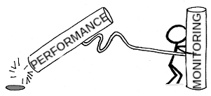
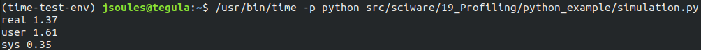
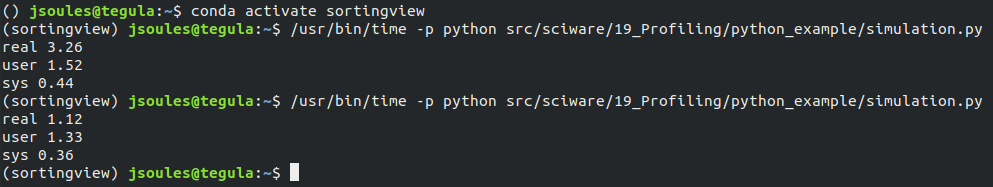
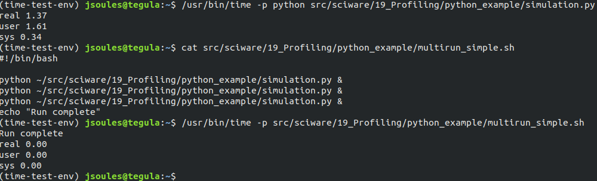
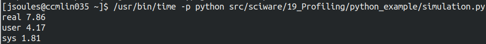
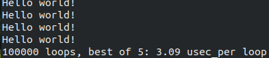
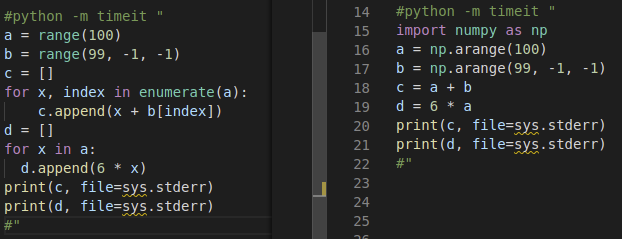
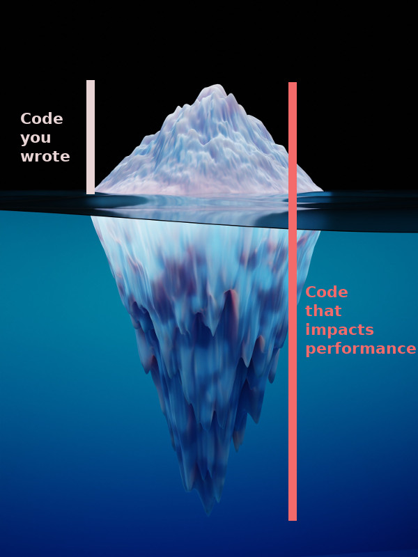
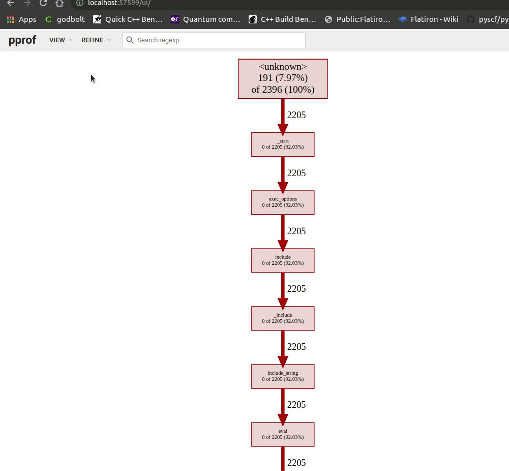
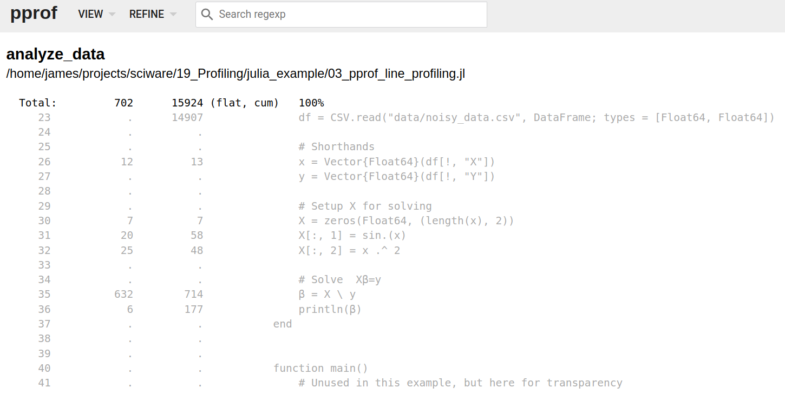

# Sciware

## Finding Where Your Code Spends Time
### Performance Troubleshooting and Profiling

https://github.com/flatironinstitute/sciware/tree/main/19_Profiling


## Rules of Engagement

### Goal:

Activities where participants all actively work to foster an environment which encourages participation across experience levels, coding language fluency, *technology choices*\*, and scientific disciplines.

<small>\*though sometimes we try to expand your options</small>


## Rules of Engagement

- Avoid discussions between a few people on a narrow topic
- Provide time for people who haven't spoken to speak/ask questions
- Provide time for experts to share wisdom and discuss
- Work together to make discussions accessible to novices

<small>
(These will always be a work in progress and will be updated, clarified, or expanded as needed.)
</small>


## Zoom Specific

- If comfortable, please keep video on so we can all see each other's faces.
- OK to break in for quick, clarifying questions.
- Use Raise Hand feature for new topics or for more in-depth questions.
- Please stay muted if not speaking. (Host may mute you.)
- We are recording. Link will be posted on #sciware Slack.
- Please keep questions for the speaker in the Zoom chat.


## Future Sessions

- Suggest topics and vote on options in #sciware Slack


## Today's agenda

- Intro
- Time
- Python
- Julia
- C/C++


# Profiling Intro

### Dylan Simon


## Goal

- We always want everything to take less time
- Need a way to define "less". And quantify "time".
- It's easy to figure out how much time something takes... right?


## "Wall time"

- Useful baseline measure
- Can compare changes (algorithms, dependencies, architectures, anything...)
- What if it takes weeks? (Or milliseconds?)
   - Wall time is a noisy measure (system, scheduling, filesystem, network overhead)
- Which parts take time?


## Time units

- "Wall time" = time
- "CPU time" = cpu cores * time
   - Multiple threads
   - 1 core for 1 second + 8 cores for 5 seconds + 1 core for 2 seconds = 43 cpu seconds, 8 wall seconds
   - "CPU hours": cluster usage (allocated, may be idle), 130k cores = 1.1B cpu hours/year
- \\[ \frac{\textsf{CPU time}}{\textsf{Wall time}} = \textsf{\%CPU} \\] (average number of cores used)


## Profilers

- Tools to break down which parts of your code take time
   - Program: entire run of executable
   - Function: time how long each function takes, how many times
   - Line of code
   - Machine instruction
- Each of these might run multiple times
   - total time, number of executions, average time/execution


## Strategies

- Is this what I expected?
   - Is this part running too many times?
   - Do the counts make sense (think about loops, sanity check)?
   - Are unexpected parts slow?
- Is this necessary?
- Can this be faster?
- Calculation *has* to take time...


## Bite-sized pieces

- Break calculations into smaller pieces
   - Smaller data sets, fewer iterations
- Profiling doesn't require getting results, just running code
- Can use smaller profiling results to infer longer run times (multiply!)
- Code when observed... runs slower




# Simple timing

### Jeff Soules


## Smallest and largest scales

- `time` utility -- program timing
- `timeit` (Python) -- testing small Python snippets
- Rest of session focuses on tools in the middle


## `time`

- System utility installed in `/usr/bin/time` or `/bin/time`
  - NOT the same as `time` (a shell built-in)
- Used to time whole program execution
- Reports `real`, `user`, `sys` times
- "The Beginning and End of profiling"


## Calling `time`

- Use as `$ /usr/bin/time -p EXECUTABLE`
- Examples drawn from sciware repo `sciware/19_Profiling/python_example/`

So on my laptop:
`$ /usr/bin/time -p src/sciware/19_Profiling/python_example/simulation.py`


## What `time` shows

- `real` = wall time
- `user` = time executing YOUR code
- `sys` = time in operating system calls
- `real` likely isn't `user + sys`




## What `time` doesn't show

- Only measures *your* process, not child threads/processes
- Does not tell you *why*
- (More sophisticated tools exist to help with this)


## Selected examples

- Startup cost for first run of Python interpreter



## Selected examples

- Subprocesses not captured

- Workstation worse than laptop?



## Understanding `time`

- Need to look at context!
  - System load? (`htop`!)
  - Hardware issues? (`iowait`)
  - Memory? (garbage collection, swapping...)
  - Concurrency/system interactions? (network latency...)
  - etc
- **Complexity does not go away just because you put it in a black-box**


## `timeit`

- Python utility for testing small snippets of code
- Command-line or in-script use
- Runs small snippets until ~0.2 s has passed
  - Smooths out statistical anomalies or startup costs
- Great for A/B testing, optimizing small decisions


## How to `timeit`

- Command line:
`python -m timeit 'print("Hello world!")'`
- From inside a script
- (See https://docs.python.org/3/library/timeit.html)


## `timeit` output

- Number of times your code sample was run, per trial (`100000 loops`)
- Number of trials (5, because `best of 5`)
- The average speed per loop of the fastest trial (sec, msec, usec...)




## A/B Testing

- Compare two versions of the same code

- Left version (loops): ~80 microsec/loop
- Right version (numpy): ~320 usec/loop
- Numpy's not faster????


## Complexity Never Goes Away

- Suppress screen printing by adding `2>/dev/null`
  - loop version now: ~30 usec/loop (down from 80)
  - numpy version now: ~260 usec/loop (down from 320)
- I/O time is non-negligible! (Observation affects results)
- Increase the number ranges to 1 million instead of 100
  - loop version now takes 324 msec/loop (vs 30 usec)
  - numpy version now takes ~3 msec/loop (vs 300 usec)
  - numpy now 100x faster than loop
- Test cases need to be representative of data


## Complexity Never Goes Away

- Remove the `print` statements entirely?
  - loop version now ~17 usec/loop
  - numpy version now ~2 usec/loop (!)
  - (Turns out converting numpy arrays to strings is really expensive!)


## Complexity Never Goes Away




## Complexity Never Goes Away

- High- and low-level tools are essential for monitoring
- But implementation & context details matter
- Next up: some tools that help dive into complexity


# Python profiling

### Robert Blackwell (SCC)

- Premature optimization is the root of all evil -- Donald Knuth


## Examples

- Example script is in `sciware/19_profiling/python_example/simulation.py`
- To follow along, you'll `python3` with `numpy`, `snakeviz`, and `line-profiler`
- A local display (or X forwarding) is needed for snakeviz, though this is a minor part
- Due to the nature of profiling, your results may vary significantly from your local machine
  and the cluster used in this presentation
- On an FI machine (or use conda/pip to install packages):
```bash
module load python
source ~rblackwell/envs/sciware_19/bin/activate
```


## Python CPU profilers

### Way too many to choose from, with different costs and benefits

- cProfile/profile (built-in and our focus today)
- line-profiler
- scalene
- pyFlame
- py-spy
- Palanteer


## cProfile - a python staple

- Deterministic (hits every function)
- Typically moderate overhead
- No programmer setup cost - just works
- No full call stack information (hard to tell what called what)
- Great for a quick overview of where your program is spending time


## Let's try it out!

- `sciware/19_profiling/python_example/simulation.py`


# Julia profiling

<h3 style="color:#7e588aff">James Smith (CCQ)</h3>


## Examples

- All examples are in `sciware/19_profiling/julia_example`
- To follow along you'll need Julia and the following Julia packages:
  - `PProf`
  - `FlameGraphs`
  - `FileIO`
- You can install them by running `install_prereqs.jl`


## Using `@time` Pt. 1

- Array/Matrix/Tensor memory access matters
<div style="display: table; clear:both; width:100%;">
   <div style="float:left; width:50%">
      <pre  style="font-size:0.6em; width:100%"><code data-trim data-noescape data-line-numbers="1,5" class="language-julia">
function copy_cols(x::Vector{Float64})
    n = size(x, 1)
    out = zeros(Float64, n, n)
    for i = 1:n
        out[:, i] = x
    end
    out
end
    </code>
    </pre>
   </div>
   <div style="float:left; width:50%">
     <pre  style="font-size:0.6em; width:100%"><code data-trim data-noescape data-line-numbers="1,5" class="language-julia">
function copy_rows(x::Vector{Float64})
    n = size(x, 1)
    out = zeros(Float64, n, n)
    for i = 1:n
        out[i, :] = x
    end
    out
end
      </code>
    </pre>
   </div>
</div>


## Using `@time` Pt. 2
- To run the comparison, we can do the following:
```julia
function main()
    N = Int(1e4)
    x = randn(N)

    println("Copying vector to columns")
    @time copy_cols(x)
    println("Copying vector to rows")
    @time copy_rows(x)
end
```


## Using `@time` Pt. 3
```zsh
➜  julia 01_timer.jl 
Copying vector to columns
  0.354818 seconds (2 allocations: 762.939 MiB, 1.12% gc time)
Copying vector to rows
  1.033734 seconds (2 allocations: 762.939 MiB, 3.08% gc time)
```


## Using `@profile` Pt. 1
<div style="display: table; clear:both; width:100%;">
   <div style="float:left; width:50%">
      <pre  style="font-size:0.6em; width:100%"><code data-trim data-noescape  class="language-julia">
function add_no_prealloc(x::Vector{Float64})
    x_new = x .+ 3.0
    return x_new
end
    </code>
    </pre>
   </div>
   <div style="float:left; width:50%">
     <pre  style="font-size:0.6em; width:100%"><code data-trim data-noescape  class="language-julia">
function add_prealloc!(x::Vector{Float64})
    x .+= 3.0
    nothing
end
      </code>
    </pre>
   </div>
</div>


## Using `@profile` Pt. 2
- To run the comparison, we can do the following:
  
```julia
function main()
    x = zeros(10)

    println("\nShowing the profiling info")
    @profile (
        for i = 1:1e7
            add_no_prealloc(x)
            add_prealloc!(x)
        end
    )
    Profile.print(format = :tree, maxdepth = 12)

end
```


## Using `@profile` Pt. 3
<pre style="font-size:0.4em"><code data-trim data-noescape  class="language-zsh" data-line-numbers="13,17-19,21,22">
Showing the profiling info
Overhead ╎ [+additional indent] Count File:Line; Function
=========================================================
   ╎398 @Base/client.jl:495; _start()
   ╎ 398 @Base/client.jl:292; exec_options(opts::Base.JLOptions)
   ╎  398 @Base/Base.jl:418; include(mod::Module, _path::String)
   ╎   398 @Base/loading.jl:1253; _include(mapexpr::Function, mod::Module, _path::String)
   ╎    398 @Base/loading.jl:1196; include_string(mapexpr::typeof(identity), mod::Module, code::String, filename::String)
   ╎     398 @Base/boot.jl:373; eval
 12╎    ╎ 12  ...ojects/sciware/19_Profiling/julia_example/02_profiling.jl:5; add_no_prealloc(x::Vector{Float64})
  4╎    ╎ 4   ...ojects/sciware/19_Profiling/julia_example/02_profiling.jl:7; add_no_prealloc(x::Vector{Float64})
  1╎    ╎ 1   ...ojects/sciware/19_Profiling/julia_example/02_profiling.jl:10; add_prealloc!(x::Vector{Float64})
   ╎    ╎ 381 ...ojects/sciware/19_Profiling/julia_example/02_profiling.jl:38; main()
   ╎    ╎  381 ...k-src/usr/share/julia/stdlib/v1.7/Profile/src/Profile.jl:28; macro expansion
  7╎    ╎   332 ...jects/sciware/19_Profiling/julia_example/02_profiling.jl:40; macro expansion
  3╎    ╎    3   @Base/simdloop.jl:0; add_no_prealloc(x::Vector{Float64})
 10╎    ╎    10  ...jects/sciware/19_Profiling/julia_example/02_profiling.jl:5; add_no_prealloc(x::Vector{Float64})
   ╎    ╎    311 ...jects/sciware/19_Profiling/julia_example/02_profiling.jl:6; add_no_prealloc(x::Vector{Float64})
  1╎    ╎    1   ...jects/sciware/19_Profiling/julia_example/02_profiling.jl:7; add_no_prealloc(x::Vector{Float64})
  2╎    ╎   49  ...jects/sciware/19_Profiling/julia_example/02_profiling.jl:41; macro expansion
   ╎    ╎    41  ...ects/sciware/19_Profiling/julia_example/02_profiling.jl:11; add_prealloc!(x::Vector{Float64})
  6╎    ╎    6   ...ects/sciware/19_Profiling/julia_example/02_profiling.jl:12; add_prealloc!(x::Vector{Float64})
Total snapshots: 800
</code></pre>


## Using `PProf` Pt. 1
 <pre  style="font-size:0.5em; width:60%"><code data-trim data-noescape  class="language-julia">
function complicated_func()
    # Pick parameters for our function
    p = [0.1, -0.5, 0.42, -3, 0.01, -0.2]
    n = 2000000
    
    # Setting up our data
    x = LinRange(0, 10, n)
    y = zeros(length(x))
    
    for i = 1:length(p)
        y .+= p[i] * x .^ i
    end
    
    # Add some noise
    y .+= rand(n) * 0.01
    
    # Setup X for solving
    X = zeros(Float64, (length(x), length(p)))
    for i = 1:length(p)
        X[:, i] = x .^ i
    end
    
    # Solve  Xβ=y
    β = X \ y
    error = (β - p) / norm(p)
    println("Relative error in coefficients ", error)
end      
</code></pre>


## Using `PProf` Pt. 2
- Use `@profile` to collect information about our function of interest (`complicated_func()`)
- Save to a file `_03_profile_data.jlprof`
 
```julia
function main()

    @profile complicated_func()
    Profile.print(format = :tree, maxdepth = 9)

    # Save the data for later
    save("_03_profile_data.jlprof", Profile.retrieve()...)

end
```


## Using `PProf` Pt. 3
- Open the Julia REPL (like a shell)
- Load the data
- Using `pprof()` to analyze the profiling data

```julia
julia> using PProf, FlameGraphs, FileIO
julia> data = load("_03_profile_data.jlprof")
julia> g = flamegraph(data[1]; lidict=data[2])
julia> pprof(g)
```


## Using `PProf` Pt. 3
- Open the `PProf` interface in a browser (something like: http://localhost:57599)



## Using `PProf` Pt. 4
- Now we can examine the lines one-by-one!




# Julia Wrap-Up

- Check out the examples in the [sciware repo](https://github.com/flatironinstitute/sciware/tree/main/19_Profiling/julia_example) for even more details!


# C/C++ profiling

## with gprof

### Dylan Simon


## Building

- Compile and link all files with `-g -pg`
- Better to disable optimization (no `-O`)
- Works with `gcc`, `g++`, `gfortran`, `clang`, `clang++`


## Running

- Run your program normally to produce `gmon.out`
- `GMON_OUT_PREFIX=foo ./myprog` produces `foo.PID`
- Program must not be killed/crash
- Analyze with: `gprof myprog gmon.out`


## Example

- Two implementations of a table (selected by `#define`):
   - Simple dense array: fast & big
   - Sparse `unordered_map`: small & slow

[`19_Profiling/gprof_example`](gprof_example)


## Takeaways

- Only profiles functions compiled with profiling
- Consider memory vs. time tradeoffs
   - Sometimes using more memory can allow faster approaches
   - (Our nodes have a lot of memory)


## Alternatives

- oprofile (full system)
- vtune (processor stats, Sciware 2020-Jun-18 recording)
- ...
- what do you use?


# Questions


# Survey

