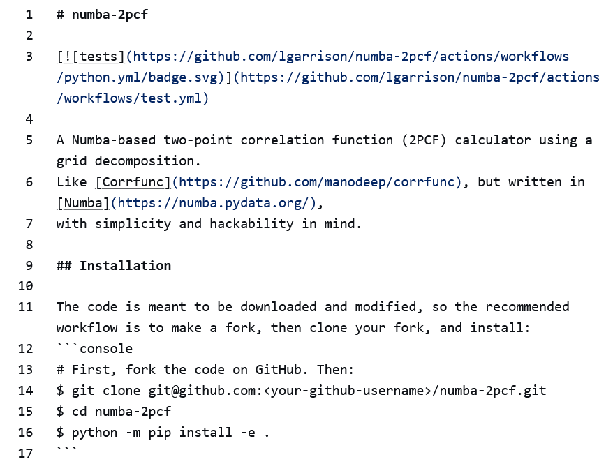
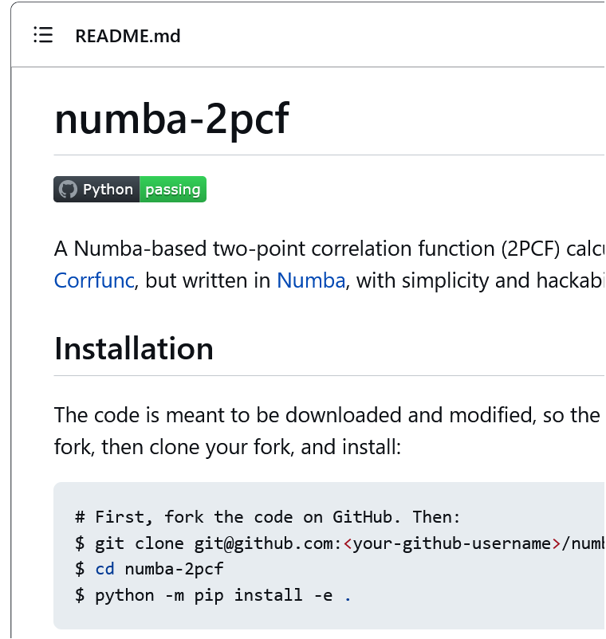

# Sciware

# Documentation
### How to win users and influence science

https://github.com/flatironinstitute/sciware/tree/main/20_Documentation


## Rules of Engagement

### Goal:

Activities where participants all actively work to foster an environment which encourages participation across experience levels, coding language fluency, *technology choices*\*, and scientific disciplines.

<small>\*though sometimes we try to expand your options</small>


## Rules of Engagement

- Avoid discussions between a few people on a narrow topic
- Provide time for people who haven't spoken to speak/ask questions
- Provide time for experts to share wisdom and discuss
- Work together to make discussions accessible to novices

<small>
(These will always be a work in progress and will be updated, clarified, or expanded as needed.)
</small>


## Zoom Specific

- If comfortable, please keep video on so we can all see each other's faces.
- OK to break in for quick, clarifying questions.
- Use Raise Hand feature for new topics or for more in-depth questions.
- Please stay muted if not speaking. (Host may mute you.)
- We are recording. Link will be posted on #sciware Slack.
- Please keep questions for the speaker in the Zoom chat.


## Future Sessions

- Suggest topics and vote on options in #sciware Slack


## Today's agenda

Documentation

- what & why: overview and scope for today (Alex + Jeff)

- how: tools for nice docs (web-facing, manuals, etc) (Lehman)

- how: writing docs for functions, with exercises (Bob)

<!-- AAAAAAAAAAAAAAAAAAAAAAAAAAAAAAAAAAAAAAAAAAAAAAAAA -->
<!-- I want default left-justify everywhere:  -->
<style type="text/css">
  .reveal p {
    text-align: left;
  }
 </style>
<!-- see: https://stackoverflow.com/questions/41024596/r-markdown-slides-with-reveal-js-how-to-left-align-list-items-bullets-and-numb/41047550#41047550    -->


# Documentation: Principles and Definitions


## What is documentation?

Text that helps one use and understand a code or software tool

- describe inputs & outputs for one or more routines
  - fancy name: "API" = application programming interface

- Equally useful: "narrative" docs (free-form)
  - motivation: what does this tool do?
  - why better than tools X, Y? (eg: it's 10x faster...)
  - install instructions, examples, tutorials, pretty figures, bugs
  - how to run a "hello world" example, test your install
   (often in `README.md`: the first thing web user sees on GitHub)
  - or more extensive: PDF manual, wiki, website...


## Who is your audience?

Thinking from your audience's point of view is crucial
- eg API: these two functions _do exactly the same thing_
(the code inside could be identical):
```
beta = linear_regression(X,y) estimates regression weights beta
given a feature matrix X and response vector y.
```
```
x = linsolve(A,b) solves in the least-squares sense the possibly
rectangular linear system Ax=b, where A is a MxN matrix, etc...
```
Stats audience vs math audience - which do you want?

- Choosing a _good name_ for the function (= what it does), is part of good doc!

- Choose good names for arguments in the docs (`beta` is a typical
name for unknown vector in stats, but in physics/math would confuse...)

<!-- - see: https://github.com/ahbarnett/sciware/tree/main/12_Functions -->


## What focus on today?

- User-facing: read by users (not developers) of your code
  - this includes _your future self_: <6 months you forget how to call own code!

- I give overview & general advice
  - later: tools for narrative docs, including web-facing
  - API doc pitfalls and exercises


## Won't talk about today, but related & important

- writing tests for your code/function (can integrate into docs)
- choosing a good interface (API) for your code/func
- um, your algorithms :)  (the body of your code)
- good commenting of code, but...
   - comments are not docs! user should *not* have to look down there!
- discussion/documentation of bugs (eg GitHub Issues)
- academic papers showcasing your package


## API Documentation: how do I call function X?

- self-contained text "docstring" or comment block at top of each function
- printed when do `help` or `?` and/or collected to website (eg via doxygen)
- be as precise and specific as you can about inputs and outputs
- what are the edge cases? what behavior should happen in those cases?
- assumes an audience that is already invested in using your work
     (does little to explain big picture or sell your work to new users)


##

In high-level languages, API doc accessed from command line, eg
```python
In [1]: ?range
Init signature: range(self, /, *args, **kwargs)
Docstring:     
range(stop) -> range object
range(start, stop[, step]) -> range object

Return an object that produces a sequence of integers from start (inclusive)
to stop (exclusive) by step.  range(i, j) produces i, i+1, i+2, ..., j-1.
start defaults to 0, and stop is omitted!  range(4) produces 0, 1, 2, 3.
These are exactly the valid indices for a list of 4 elements.
When step is given, it specifies the increment (or decrement).
```

This is called *inline documentation*.

The `range(4)` example is good: can read to understand quickly

Many people simply modify examples for their purposes

The bang (!) sentence we find a bit unclear!
</div>


## API (cnt'd)

You should aim to break up any repeated task (no matter how small) into
a self-contained function with a docstring.

Eg a MATLAB/Octave quadrature code `gauss.m` (not part of core language):
```matlab
% GAUSS  nodes x (Legendre points) and weights w
function [x,w] = gauss(N)
  beta = .5./sqrt(1-(2*(1:N-1)).^(-2));
  T = diag(beta,1) + diag(beta,-1);
  [V,D] = eig(T);
  x = diag(D); [x,i] = sort(x);
  w = 2*V(1,i).^2;
end
```
When you ask for (interactive) help, prints first `%` comment block:
```
>> help gauss
  GAUSS  nodes x (Legendre points) and weights w
```
Hmm, why not useful?

<div class="fragment">
- missing input args? missing order of outputs! no use example! no teaching!
</div>


## Better docs for `gauss.m`

<pre><code class="matlab">
>> help gauss
  GAUSS   Nodes (Legendre points) and weights for Gaussian quadrature on [-1,1]

  [x,w] = gauss(N) computes N nodes x and N weights w for Gaussian quadrature
  on the 1D interval [-1,1]. The run-time scales as O(N^3). For example, for f a smooth
  function, [x,w]=gauss(16); dot(f(x),w) approximates the integral of f from -1 to 1.

  Inputs:
        N - number of nodes, a positive integer (recommend 1000 or less)
  Outputs:
        x - N*1 double-precision vector of nodes, which each lie in [-1,1]
        w - 1*N double-precision vector of corresponding weights

  Note: increasing N usually gives more accuracy in the approximating the integral.
</code></pre>
Note: precise math description, types/sizes of inputs & outputs, helpful advice to newbies

- API docs crucial in low-level languages too:
Fortran/C/C++ users just read source code comment block at top of each function.


## API (cnt'd)

- Learn and follow docstring style for your language
  - eg: how to annotate variable types, [optional] inputs
- Can you avoid biology/physics/etc terms in your docs?
  - avoid jargon if your routine could be more widely useful
- API doc advantage: docstring right next to source code, easy to maintain
- Limitation: function-by-function not always best way to understand a pkg

  - case in point: https://portal.hdfgroup.org/display/HDF5/HDF5


## The Triangle: API, Test, Documentation

Q: What order should you write these in?
A: Write them all at once!
Good practices are mutually interdependent (Jeff makes this point every SciWare)

Alex recommends: write doc first, then test, only then function body!
 - this gets the brain thinking about what task you want to do first
 - then how you'll know you did it right
 - ok, finally you have to figure out how to code the solution


## READMEs overview

"What is this package and how do I get and run it?"

- eg: https://github.com/danfortunato/ultraSEM

- Audience:
  - New users of the software
  - People who may be calling your code as a step in a pipeline (rather than interacting with your functions as an API)
- Tells users how to install the package & make sure it works
- Describes some of the functionality but probably only scratches the surface of what your code can do
- Sometimes a good README simply redirects to a more elaborate website doc:
     https://github.com/dfm/emcee


## Narrative docs overview

- "What can this package do" to "Tell me technical details about this package", user manual.

Eg FINUFFT web docs (ReadTheDocs + sphinx + mathjax for yummy LaTeX):

https://finufft.readthedocs.io/en/latest/index.html

- Audience:
  - People who want to know more about how your system works
  - People you're trying to convince why they should use your tools at all
  - More sophisticated users who want to know how to handle the non-modal use case
- Can include rationale, design decisions, or more sophisticated configurations
- Can include more detailed discussion of how and why to use different features
- Needs additional work to make sure it stays up to date as design decisions change
- Essential for any reasonably mature package


## Tutorials overview

- "How can I solve ABC using XYZ"

   https://emcee.readthedocs.io/en/stable/tutorials/quickstart/

How to string together many functions in a package to solve a problem

- Fully worked (and working!) examples
  - Ideally cover the full gamut of what people would want to do with your tool
  - Distinction: Unlike API documentation, this does *not* need to be organized the same way as your implementation/code!
- Audience:
  - All users: start with basic, then sophisticated
  - People who want to know *how to solve a particular problem* rather than *how to use a particular function*
- make sure it stays up-to-date as your methods/APIs/design decisions change!


## Documention is a form of publication

Your work only makes a difference if people use it.

It will only get widely used if it's easy to understand and use.

Once you have written a stable code, writing docs takes time, but is well worth it!

It is just as important as publishing papers, conference talks, etc


# Tools to Generate Documentation

How do people write user documentation for scientific software projects?


## Categories of Documentation
- As before, let's consider tools in two categories of documentation
  - **Narrative** documentation: high-level, "instruction manual" prose
  - **API** documentation: granular technical specifications


## Tools for Narrative Documentation

- In order of increasing feature-richness and complexity
  - `README` (Markdown and reStructuredText)
  - Wiki
  - Jekyll + static web hosting (e.g. GitHub Pages)
  - Sphinx + ReadTheDocs


## Narrative Documentation: the `README`

- The simplest form of top-level documentation
- Highly portable, easily rendered into a webpage or read in a terminal
- Often where you will start documentation—don't underestimate the usefulness!
  - Great idea to jot down the steps to run your code in a `README` as soon as you start
  - We all promise ourselves we'll set up beautiful documentation later, but in case that doesn't happen, a `README` is a lifesaver
- GitHub and other code hosting sites will render your `README`


## Formatting the `README`

- Two popular languages to make your plain-text `README` look nice online:
  - Markdown (`README.md`)
  - reStructuredText (`README.rst`)
- Markdown is a little easier to write, RST is more feature-complete
- ["GitHub-Flavored Markdown"]((https://docs.github.com/en/get-started/writing-on-github/getting-started-with-writing-and-formatting-on-github/about-writing-and-formatting-on-github)) is used throughout GitHub; RST is commonly used on ReadTheDocs with Sphinx

TODO: break out into new slide





## Formatting the `README`: Markdown

- Plain text format for writing structured documents
  - Highly readable in its raw form
  - but also renders into pretty HTML (or PDF, etc)
- These slides are written in Markdown!


## Formatting the `README`: Markdown Example
File: `README.md`
````markdown
# my-cool-project
A one-sentence description of how **cool** my project is

## Installation
1. First step is to run this command:
`pip install my-cool-project`
2. Then try to follow the example below!

## Example
```python
import my_cool_project
my_cool_project.go()
```

TODO: cross-ref
````


## Formatting the `README`: Markdown Example
TODO: screenshot of rendered markdown


## Formatting the `README`: reStructuredText

- Still a plain text format, slightly more complicated than Markdown
- Supports more directives than Markdown
   - Textual substitution
   - References & footnotes
   - Links between sections and pages
   - Admonitions (call-out boxes)
- Sphinx has a good [RST primer](https://www.sphinx-doc.org/en/master/usage/restructuredtext/basics.html)


## Formatting the `README`: reStructuredText Example
File: `README.rst`
````rst
my-cool-project
===============
A one-sentence description of how **cool** my project is

Installation
------------
`pip install my-cool-project`

Example
-------
.. code-block:: python

  import my_cool_project
  my_cool_project.go()

If the example doesn't work, try :ref:`Installation`.

````


## Formatting the `README`: reStructuredText Example
TODO: screenshot of rendered RST


## Tools for Narrative Documentation: Wiki
- GitHub and other sites have built-in support for Wikis
    - Good for long-form documentation (e.g. design philosophy, implementation details, extended examples)
    - An easy next step when your documentation is too big for a single `README` file
    - Can clone from GitHub as its own repo: <code>git clone https://github.com/google/sanitizers.<b>wiki</b>.git</code>
- Lehman's commentary: GitHub Wiki usage seems to be declining in research software circles, in favor of ReadTheDocs


## Tools for Narrative Documentation: Wiki Example
- TODO screenshot/example of a wiki


## Tools for Narrative Documentation: Jekyll + Static Hosting
- Jekyll is a tool for generating websites from plain text files, like Markdown
- Generates static webpages
  - Can be hosted on any HTTP server (including Flatiron user www)
  - No need to run a "Jekyll server", or maintain a database, etc.
  - These slides are rendered with Jekyll!


## Tools for Narrative Documentation: Jekyll + Static Hosting
- [GitHub Pages](https://docs.github.com/en/pages/setting-up-a-github-pages-site-with-jekyll/creating-a-github-pages-site-with-jekyll) natively supports Jekyll and will host the generated sites (`username.github.io/mycoolproject`)
  - Will be built and deployed as a GitHub Action, similar to CI
- Go to the [Sciware GitHub](https://github.com/flatironinstitute/sciware/) for a real example of Jekyll + GitHub pages!
- Source files are in GitHub-flavored Markdown, output is HTML website (the slides)


## Tools for Narrative Documentation: Sphinx + ReadTheDocs
- Sphinx is a tool that builds a website from plain text files
  - Reads in reStructuredText (or Markdown)
  - Outputs a website
- ReadTheDocs is a web host and cloud service
   - ReadTheDocs pulls your GitHub repo
   - Runs Sphinx on their servers to build the website
   - Hosts the docs at `mycoolproject.readthedocs.io`
   - Even hosts past versions (based on git branches/tags)
- Sphinx + ReadTheDocs is a powerful, popular combo!


## Tools for Narrative Documentation: Sphinx + ReadTheDocs
- Sphinx
  - Controlled by `conf.py`: supports themes, extensions, and extensive customization
  - Inserts rich navigation features: search, outline in the sidebar, table of contents, etc
- `docs/index.rst` will become `mycoolproject.readthedocs.io/en/latest/index.html` (main page); `docs/installation.rst` will become `.../installation.html`, etc.
- TODO: slide on *what* to put in narrative docs?


## Tools for Narrative Documentation: Sphinx + ReadTheDocs
Sphinx `conf.py` example ([Full Documentation](https://www.sphinx-doc.org/en/master/usage/configuration.html))

TODO: spend a whole slide on autodoc. Mention doxygen extension.

```python
  # conf.py

  extensions = [
      'sphinx.ext.autodoc', 'sphinx.ext.autosectionlabel'
  ]

  # General information about the project.
  project = "mycoolproject"
  html_theme = "sphinx_rtd_theme"  # the theme we all know and love
  # but there are many others, like "sphinx_book_theme"

  autosectionlabel_prefix_document = True
```

TODO: link to example 

## Tools for Narrative Documentation: Sphinx + ReadTheDocs
- TODO show rendered examples? More about where to 


TODO: slide with other tools (Jupyter notebooks? DFM's thing?)


# Writing API Documentation (Bob)

## The doc/test/code triangle

- When designing a function, consider together
    1. **Documentation**: says what the code does
    2. **Testing**: tests it does what it says it does
    3. **Code**: the code itself
- Bad smells
    - if code is hard to doc, it's probably badly designed
    - if code is hard to test from the doc, either the code is badly
      designed or the doc is incomplete


## Exercise 1

1. In your favorite language, design a function to sum a sequence of
numbers.
2. Write documentation for it.
3. Can you write tests for it looking only at the doc?

```python
import numpy as np
def mySum(v: np.array) -> np.float64:
```


## Answer 1: Documentation

Things to document:

1. argument type and shape assumptions
2. return type
3. result when argument is empty
4. error conditions and behavior


# Answer 1: Tests

* What do we test?
    - throw the appropriate exception when argument is wrong shape
    - when arg is empty, return 0 (unit under addition is always the base value)
    - length 1 input, and at least one longer input
    - behavior when one or more arguments is not-a-number or infinite?
    - behavior when no argument is given?


# Answer 1: Code

- I've included typehints, but these could be documented some other way

```python
import numpy as np
def mySum(v):
    """Return the sum of the elements of v or 0 if v is size 0.

    Arguments:
    v -- array to sum

    Exceptions:
    ValueError if v is not a one-dimensional array.

    Return:
    Sum of the elements of v, or 0 if v is empty.
    """
    if v.ndim != 1:
        raise ValueError('Require 1D array argument')
    sum = 0
    #for n in range(v.size):
    for q in v:
        sum += q
    return sum
```


## Thought Exercise 2

- Consider how the above code might break with different type
arguments.
    - Does the type hint save you or should there be more code?

- Consider generalizing `mySum` to deal with different type and
different shape arguments.
    - How does the doc differ?
    - Will it be enough to base testing on?
    - Does the type hint save you or should there be more code?


## Thought Exercises 3, 4

- Consider writing a function `myAvg` to calculate the average of an array.
    - How much different is this than `mySum` in terms of code?
    - How does the documentation differ?
    - How will testing differ?

- Do the same for `mySD` that calculates the standard deviation of an array.


## Exercise 3, 4: Answers

- The main difference is that `myAvg` is not well defined for
zero-length inputs.
- Did you decide to
    - return not-a-number because that follows the divide-by-zero
      floating-point arithmetic?
    - throw an exception to help the user by failing early?

- `mySD` has two standard definitions
    - divide by `size` is the maximum likelihood estimate
    - dividing by `size - 1` gives an unbiased estimate
    - how do these affect the code and doc?
    - return not-a-number because that follows the divide-by-zero
      floating-point arithmetic?
    - throw an exception to help the user by failing early?
