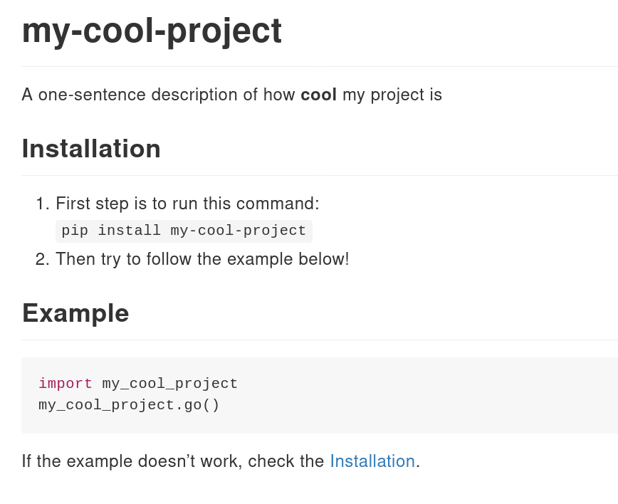
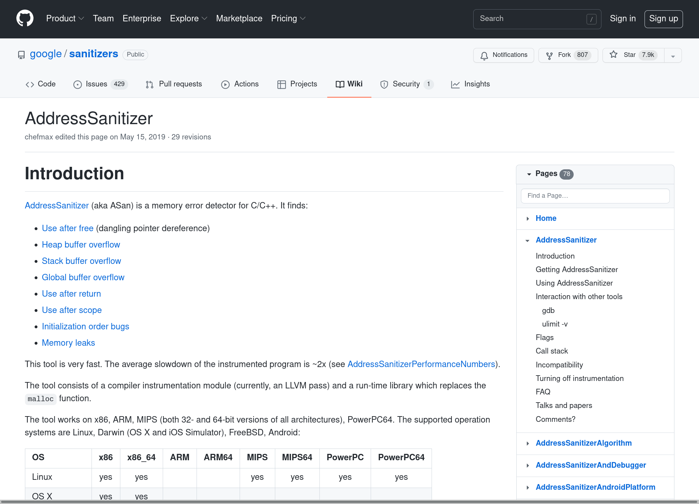
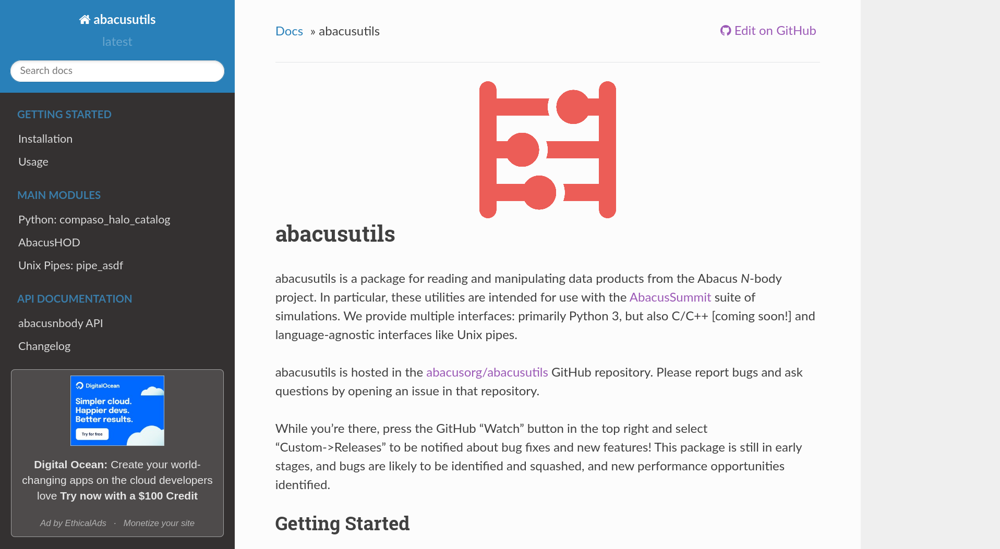
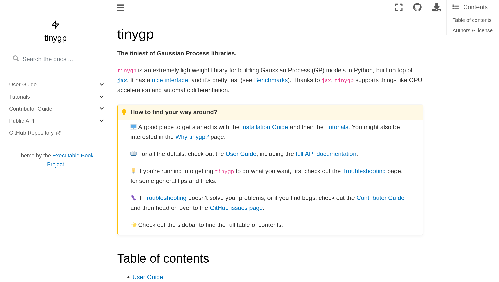
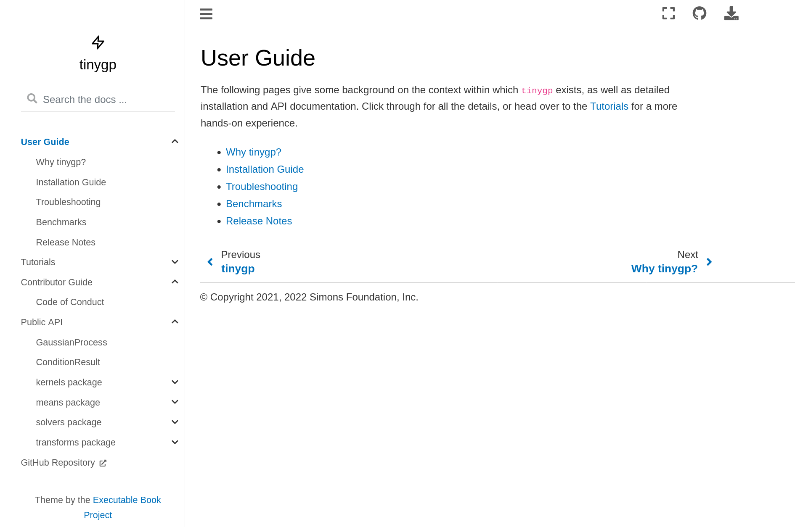
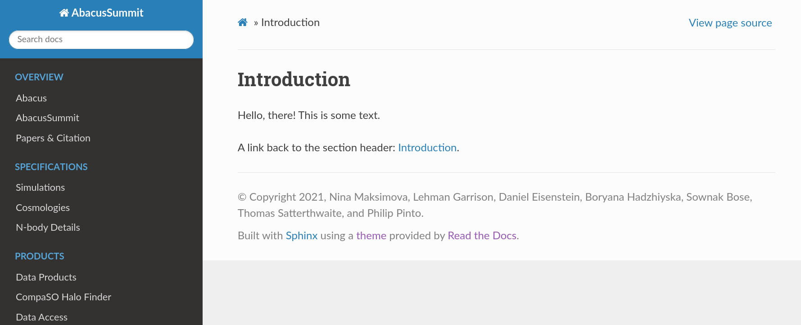
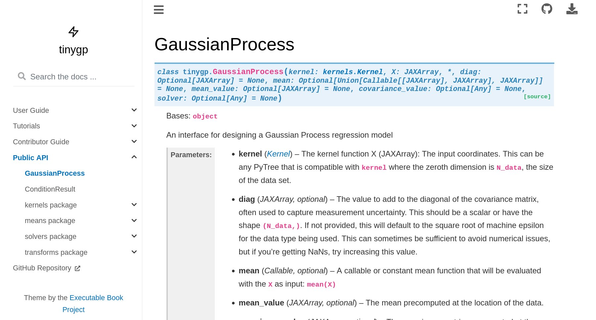
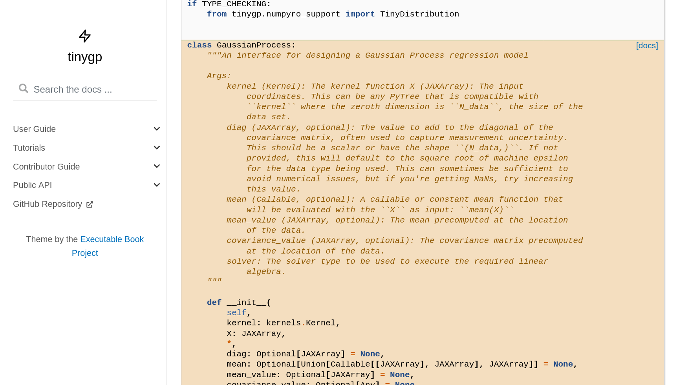

# Sciware

# Documentation
### How to win users and influence science

https://sciware.flatironinstitute.org/20_Documentation/

https://github.com/flatironinstitute/sciware/tree/main/20_Documentation


## Rules of Engagement

### Goal:

Activities where participants all actively work to foster an environment which encourages participation across experience levels, coding language fluency, *technology choices*\*, and scientific disciplines.

<small>\*though sometimes we try to expand your options</small>


## Rules of Engagement

- Avoid discussions between a few people on a narrow topic
- Provide time for people who haven't spoken to speak/ask questions
- Provide time for experts to share wisdom and discuss
- Work together to make discussions accessible to novices

<small>
(These will always be a work in progress and will be updated, clarified, or expanded as needed.)
</small>


## Zoom Specific

- If comfortable, please keep video on so we can all see each other's faces.
- OK to break in for quick, clarifying questions.
- Use Raise Hand feature for new topics or for more in-depth questions.
- Please stay muted if not speaking. (Host may mute you.)
- We are recording. Link will be posted on #sciware Slack.
- Please keep questions for the speaker in the Zoom chat.


## Future Sessions

- Suggest topics and vote on options in #sciware Slack


## Today's agenda

Documentation

- what & why: overview and scope for today
- how: writing docs for functions, with exercises
- how: tools for nice docs (web-facing, manuals, etc)


<!-- AAAAAAAAAAAAAAAAAAAAAAAAAAAAAAAAAAAAAAAAAAAAAAAAA -->
<!-- I want default left-justify everywhere:  -->
<style type="text/css">
  .reveal p {
    text-align: left;
  }
 </style>
<!-- see: https://stackoverflow.com/questions/41024596/r-markdown-slides-with-reveal-js-how-to-left-align-list-items-bullets-and-numb/41047550#41047550    -->


# Documentation: Principles and Definitions

### Alex Barnett (CCM)


## What is documentation?

Text that helps one use and understand a code or software tool

- describe inputs & outputs for one or more routines
  - fancy name: "API" = application programming interface

<div class="fragment">
- Equally useful: "narrative" docs (free-form)
  - motivation: what does this tool do?
  - why better than tools X, Y? (eg: it's 10x faster...)
  - install instructions, examples, tutorials, pretty figures, bugs
  - how to run a "hello world" example, test your install
   (often in `README.md`: the first thing web user sees on GitHub)
  - or more extensive: PDF manual, wiki, website...
</div>

## Who is your audience?

Thinking from your audience's point of view is crucial
- eg API: these two functions _do exactly the same thing_
(the code inside could be identical):
```
beta = linear_regression(X,y) estimates regression weights beta
given a feature matrix X and response vector y.
```
```
x = linsolve(A,b) solves in the least-squares sense the possibly
rectangular linear system Ax=b, where A is a MxN matrix, etc...
```
Stats audience vs math audience - which do you want?

<div class="fragment">
- Choosing a _good name_ for the function (= what it does), is part of good doc!

- Choose good names for arguments in the docs (`beta` is a typical
name for unknown vector in stats, but in physics/math would confuse...)

<!-- - see: https://github.com/ahbarnett/sciware/tree/main/12_Functions -->
</div>

## What focus on today?

- User-facing: read by users (not developers) of your code
  - this includes _your future self_: <6 months you forget how to call own code!

<di class="fragment">
- Overview, general advice, pointers
  - later: API docs, with exercises!
  - finally: nice tools for narrative docs, including web-facing
</div>


## Won't talk about today, but related & important

- writing tests for your code/function (can integrate into docs)
- choosing a good interface (API) for your code/func
- um, your algorithms :)  (the body of your code)
- good commenting of code, but...
   - comments are not docs! user should *not* have to look down there!
- discussion/documentation of bugs (eg GitHub Issues)
- academic papers showcasing your package


## API Documentation: how do I call function X?

- self-contained text "docstring" or comment block at top of each function
- printed when do `help` or `?`. Can be gathered to website (eg via Doxygen)
- be as precise and specific as you can about inputs and outputs
- what are the edge cases? what behavior should happen in those cases?
- assumes an audience that is already invested in using your work
     (does little to explain big picture or sell your work to new users)


##

In high-level languages, API doc accessed from command line, eg
```python
In [1]: ?range
Init signature: range(self, /, *args, **kwargs)
Docstring:     
range(stop) -> range object
range(start, stop[, step]) -> range object

Return an object that produces a sequence of integers from start (inclusive)
to stop (exclusive) by step.  range(i, j) produces i, i+1, i+2, ..., j-1.
start defaults to 0, and stop is omitted!  range(4) produces 0, 1, 2, 3.
These are exactly the valid indices for a list of 4 elements.
When step is given, it specifies the increment (or decrement).
```

This is called *inline documentation*.

The `range(4)` example is good: can read to understand quickly

Many people simply modify examples for their purposes

The bang (!) sentence we find unclear ("stop" is bad argument name?)
</div>


## API docs for a function

You should aim to break up any repeated task (no matter how small) into
a self-contained function with a docstring.

Eg, well-known and useful MATLAB/Octave quadrature function `gauss.m` (not part of core language):
```matlab
% GAUSS  nodes x (Legendre points) and weights w
function [x,w] = gauss(N)
  beta = .5./sqrt(1-(2*(1:N-1)).^(-2));
  T = diag(beta,1) + diag(beta,-1);
  [V,D] = eig(T);
  x = diag(D); [x,i] = sort(x);
  w = 2*V(1,i).^2;
end
```

It's clear from *source code* that outputs are `x` and `w`, but...


When you ask for (interactive) help, it prints only the docstring, which in MATLAB/Octave is the first contiguous `%` comment block:
```
>> help gauss
  GAUSS  nodes x (Legendre points) and weights w
```
Hmm, why not useful? [Please shout out the many reasons why]

<div class="fragment">
- missing input args, their meaning and types!
- missing output args, their order, types, meaning...
- no use example!
- no mention of quadrature (or teaching that it approximates an integral)
</div>


## Better docs for `gauss.m`

<pre><code class="matlab">
>> help gauss
  GAUSS   Nodes (Legendre points) and weights for Gaussian quadrature on [-1,1]

  [x,w] = gauss(N) computes N nodes x and N weights w for Gaussian quadrature
  on the 1D interval [-1,1]. The run-time scales as O(N^3). For example, for f a smooth
  function, [x,w]=gauss(16); dot(f(x),w) approximates the integral of f from -1 to 1.

  Inputs:
        N - number of nodes, a positive integer (recommend 1000 or less)
  Outputs:
        x - N*1 double-precision vector of nodes, which each lie in [-1,1]
        w - 1*N double-precision vector of corresponding weights

  Note: increasing N usually gives more accuracy in the approximating the integral.
</code></pre>
Note: precise math description, types/sizes of inputs & outputs, helpful advice to newbies teaching example of quadrature use

- API docs crucial in low-level languages too:
Fortran/C/C++ users just read source code comment block at top of each function.


## Final API advice

- Learn and follow docstring style for your language
  - eg: how to annotate variable types, [optional] inputs
- Can you avoid biology/physics/etc terms in your docs?
  - avoid jargon, instead try describe using accessible math
- API docs are easy to maintain: docstring right next to source code!
- Limitation: function-by-function not often the best way to understand a package

  - case in point re complex package: https://portal.hdfgroup.org/display/HDF5/HDF5


## The Triangle: API, Test, Documentation

Q: What order should you write these in?\
A: Write them all at once!\
Good practices are mutually interdependent (Jeff makes this point every Sciware)

Alex recommends: write doc first, then test, only then function body!
 - this gets the brain thinking about what task you want to do first
 - then how you'll know your code did it right
 - ok, finally you have to figure out how actually to code it :)


## READMEs overview

"What is this package and how do I get and run it?"

- eg: https://github.com/danfortunato/ultraSEM

- Audience:
  - New users of the software
  - People who may be calling your code as a step in a pipeline (rather than interacting with your functions as an API)
- Tells users how to install the package & make sure it works
- Describes some of the functionality but probably only scratches the surface of what your code can do
- Sometimes a good README simply redirects to a more elaborate website doc:
     https://github.com/dfm/emcee


## Narrative docs overview

- "What can this package do" to "Tell me technical details about this package", user manual.
  - Eg FINUFFT (ReadTheDocs+sphinx+mathjax for LaTeX):
    https://finufft.readthedocs.io/en/latest/index.html
- Audience:
  - People you're trying to convince to use your tool
  - Those seeking details about features and workings
- Can include rationale, design decisions, or more sophisticated configurations
- Needs additional work to make sure it stays up to date as code changes
- Essential for any reasonably mature package


## Tutorials overview

- "Step-by-step example of solving ABC using XYZ"

https://emcee.readthedocs.io/en/stable/tutorials/quickstart/
https://github.com/fruzsinaagocs/oscode/blob/master/examples/cosmology.ipynb

- Fully worked (and working!) examples: many learn by example
  - Ideally cover the full gamut of what people would want to do with your tool
- *how to solve a particular problem* rather than *how to use a particular function*
- Audience: everyone, start with novice user, then advanced
- make sure it stays up-to-date as your code/APIs/design decisions change!


## Documentation is a form of publication

Your work only makes a difference if people use it.

It will only get widely used if it's easy to understand and use.

Once you have written a stable code, writing docs takes time, but is well worth it!

It is just as important as publishing papers, conference talks, etc


# Writing API Documentation

### Bob Carpenter (CCM)


## The doc/test/code triangle

- When desiging a function, consider together
    1. **Documentation**: says what the code does
	2. **Testing**: tests it does what it says it does
	3. **Code**: the code itself


## Hints of trouble

- if code is hard to doc, it's probably badly designed
- if code is hard to test, it's probably badly designed or
  poorly documented or both


## Exercise 1

1. In your favorite language, design a function to sum a sequence of
values.
2. Write documentation for it.
3. Ask yourself if you can write complete tests for it only looking at
   the doc.

```python
def mySum(v) ...
```

```cpp
template <typename T>
T mySum(const std::vector<T>& v) ...
```


## Answer 1: C++ Documentation with Doxygen

```cpp
/**
 * Return the sum of the specified inputs.  Starting from
 * a nullary value for the return type, elements of the
 * argument are added in order using `operator+=<T>()`.
 *
 * Example usage and output:
 * ```cpp
 * double x = mySum<double>({});
 * int n = mySum(vector<int>{1, 2, 3});
 * string s = mySum(vector<string>{"hello", " ", "world"});
 * cout << "x = " x << "; n = " << n << "; s = " << s << endl;
 * ```
 * ```
 * x = 0; n = 6; s = hello world
 * ```
 *
 * @tparam T type of arguments
 * @param v vector of arguments
 * @return sum of the elements of v
 */
template <typename T>
T mySum(const std::vector<T>& v) {
  T sum = T();
  for (const T& x : v) sum += x;
  return sum;
}
```


## Answer 1: More questions

* C++ is very strict
    - all arguments have to be of same type because argument type is
    `vector<T>` and there's no `Object` like in Java
	- the **concept** (usage of `T`) requires `T` to support `T()` and
    `operator+=<T>`.
* What about R, Python, or Julia?
    - how did you document argument and return types? and shapes?
    - did you consider non-numeric inputs?
    - how about clients mixing numbers and strings?


## Exericse 2

- Consider writing a function `myAvg` to calculate the average of an array.
    - How does the documentation differ?
    - How will testing differ?

- Do the same for `mySD` that calculates the sample standard deviation of an array.


## Exericse 2, More questions

- What about `myAvg` and zero-length inputs? (div by 0?)
- Inputs are numeric, what is output type for integer input?
- What about the two definitions of `mySD`?
    - divide by `size` is the maximum likelihood estimate
    - dividing by `size - 1` gives an unbiased estimate


# New Flatiron Wiki

[wiki.flatironinstitute.org](https://wiki.flatironinstitute.org/)

_We'd greatly appreciate your feedback._
- Slack: @Geraud Krawezik / @Liz 
- Email: gkrawezik@flatironinstitute.org / elovero@flatironinstitute.org


# Survey

https://bit.ly/sciware-docs


# Tools to Generate Documentation

How do people write user documentation for scientific software projects?

### Lehman Garrison (CCA)


## Categories of Documentation

- As before, let's consider tools in two categories of documentation
  - **Narrative** documentation: high-level, "instruction manual" prose
  - **API** documentation: granular technical specifications


## Tools for Narrative Documentation

- In order of increasing feature-richness and complexity
  - `README` (Markdown and reStructuredText)
  - Wiki
  - Jekyll + static web hosting (e.g. GitHub Pages)
  - Sphinx + ReadTheDocs


## Narrative Documentation: the `README`

- Simplest form of top-level documentation
- Highly portable, easily read as a webpage or in a terminal
- Often where you will start documentation—don't underestimate the usefulness!
  - Great idea to jot down the steps to run your code in a `README` as soon as you start
  - We all promise ourselves we'll set up beautiful documentation later, but in case that doesn't happen, a `README` is a lifesaver
- GitHub and other hosting sites will render your `README`


## Formatting the `README`

- Two popular languages to make your plain-text `README` look nice online:
  - Markdown (`README.md`)
  - reStructuredText (`README.rst`)
- Markdown is a little easier to write, RST is more feature-complete
- ["GitHub-Flavored Markdown"]((https://docs.github.com/en/get-started/writing-on-github/getting-started-with-writing-and-formatting-on-github/about-writing-and-formatting-on-github)) is used throughout GitHub; RST is commonly used on ReadTheDocs with Sphinx


## Formatting the `README`


## Formatting the `README`: Markdown

- Plain text format for writing structured documents
  - Highly readable in its raw form
  - but also renders into pretty HTML (or PDF, etc)
- These slides are written in Markdown!


## Formatting the `README`: Markdown Example
File: `README.md`
````markdown
# my-cool-project
A one-sentence description of how **cool** my project is

## Installation
1. First step is to run this command:
`pip install my-cool-project`
2. Then try to follow the example below!

## Example
```python
import my_cool_project
my_cool_project.go()
```
If the example doesn't work, check the [Installation](#installation).
````


## Formatting the `README`: Markdown Example



## Formatting the `README`: reStructuredText

- Still a plain text format, slightly more complicated than Markdown
- Supports more directives than Markdown
   - Textual substitution
   - Good integration with LaTeX
   - References & footnotes
   - Links between sections and pages
   - Admonitions (call-out boxes)
- Sphinx has a good [RST primer](https://www.sphinx-doc.org/en/master/usage/restructuredtext/basics.html)


## Formatting the `README`: reStructuredText Example
File: `README.rst` (renders the same as the Markdown example)
````rst
my-cool-project
===============
A one-sentence description of how **cool** my project is

Installation
------------
``pip install my-cool-project``

Example
-------
.. code-block:: python

  import my_cool_project
  my_cool_project.go()

If the example doesn't work, try `Installation <#installation>`_.
````


## Tools for Narrative Documentation: Wiki
- GitHub and other sites have built-in support for Wikis
    - Good for long-form documentation (e.g. design philosophy, implementation details, etc)
    - An easy next step when your documentation is too big for a single `README` file
    - Can clone from GitHub as its own repo: <code>git clone https://github.com/google/sanitizers.<b>wiki</b>.git</code>
- GitHub Wiki usage seems to be declining in research software, in favor of ReadTheDocs


## Tools for Narrative Documentation: Wiki Example



## Documentation Tools: Jekyll + Static Hosting
- [Jekyll](https://jekyllrb.com/) is a tool for generating websites from plain text files, like Markdown
- Generates static webpages
  - Can be hosted on any HTTP server (including [Flatiron user www](https://docs.simonsfoundation.org/index.php/PublicWWW))
  - No need to run a "Jekyll server", or maintain a database, etc.
  - These slides are rendered with Jekyll!


## Documentation Tools: Jekyll + Static Hosting
- [GitHub Pages](https://docs.github.com/en/pages/setting-up-a-github-pages-site-with-jekyll/creating-a-github-pages-site-with-jekyll) natively supports Jekyll and will host the generated sites (`username.github.io/mycoolproject`)
  - Will be built and deployed as a GitHub Action, like CI
- Go to the [Sciware GitHub](https://github.com/flatironinstitute/sciware/) for a real example of Jekyll + GitHub pages!
- Source files are in GitHub-flavored Markdown, output is HTML website (the slides)


## Documentation Tools: Sphinx + ReadTheDocs
- Sphinx is a tool that builds a website from plain text files
  - Reads in reStructuredText (or Markdown)
  - Outputs a website
- ReadTheDocs is a web host and cloud service
   - ReadTheDocs pulls your GitHub repo
   - Runs Sphinx on their servers to build the website
   - Hosts the docs at `mycoolproject.readthedocs.io`
   - Even hosts past versions (based on git branches/tags)
- Sphinx + ReadTheDocs is a powerful, popular combo!


## Documentation Tools: Sphinx + ReadTheDocs



## Documentation Tools: Sphinx + ReadTheDocs



## Documentation Tools: Sphinx + ReadTheDocs
- Sphinx
  - Controlled by `conf.py`: supports themes, extensions, and extensive customization
  - Inserts rich navigation features: search, outline in the sidebar, table of contents, etc
- `docs/index.rst` will become `index.html` (main page); `docs/installation.rst` will become `installation.html`, etc.


## What to put in narrative docs



## What to put in narrative docs
- Overview
  - What problem does your package solve?
- Installation
- Usage / Examples
- Tutorials
- Release Notes / Changelog
- How to contribute (and link to repo!)
- How to report issues
- How to cite
- API (Sphinx autodoc can help generate this)


## Documentation Tools: Sphinx + ReadTheDocs
Sphinx `conf.py` example ([Full Documentation](https://www.sphinx-doc.org/en/master/usage/configuration.html))

```python
  # conf.py

  extensions = [
      'sphinx.ext.autodoc', 'sphinx.ext.autosectionlabel'
  ]

  # General information about the project.
  project = "mycoolproject"
  html_theme = "sphinx_rtd_theme"  # the theme we all know and love
  # but there are many others, like "sphinx_book_theme"

  autosectionlabel_prefix_document = True
```


## Documentation Tools: Sphinx + ReadTheDocs
An example of `sphinx.ext.autosectionlabel`:

File: `index.rst`
```rst
Introduction
------------

Hello, there! This is some text.

A link back to the section header: :ref:`index:Introduction`.
```


## Documentation Tools: Sphinx + ReadTheDocs



## Documentation Tools: Sphinx + ReadTheDocs
Example of API doc generation with `sphinx.ext.autodoc`:




## Documentation Tools: Sphinx + ReadTheDocs



## Other Useful Sphinx Extensions
- [MyST-NB](https://myst-nb.readthedocs.io/en/latest/)
  - Executable documentation with [sphinx-book-theme](https://sphinx-book-theme.readthedocs.io/en/stable/)
  - Write docs/examples in a Jupyter notebook
  - MyST extension renders them as a Sphinx webpage
  - Allow user to launch notebook in Binder/Colab
- [Breathe](https://www.breathe-doc.org/)
  - Bridge between Doxygen (C/C++ docs) XML and Sphinx RST
- [Built-in extensions](https://www.sphinx-doc.org/en/master/usage/extensions/index.html)
  - doctest, githubpages, intersphinx, napoleon


## Getting Started
- ReadTheDocs tutorial here, using a Sphinx template: https://docs.readthedocs.io/en/stable/tutorial/
- Create a Sphinx project from scratch: https://www.sphinx-doc.org/en/master/usage/quickstart.html


