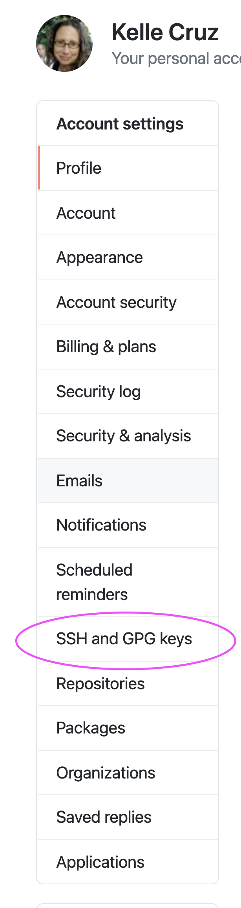
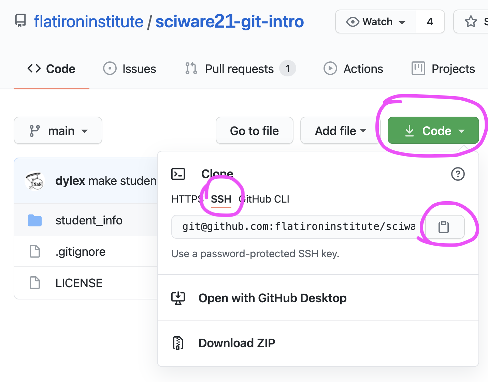

# Sciware

## Intro to GitHub

https://sciware.flatironinstitute.org/21_IntroGithub

https://github.com/flatironinstitute/learn-sciware-dev/tree/master/21_IntroGithub

## Rules of Engagement

### Goal:

Activities where participants all actively work to foster an environment which encourages participation across experience levels, coding language fluency, *technology choices*\*, and scientific disciplines.

<small>\*though sometimes we try to expand your options</small>

## Rules of Engagement

- Avoid discussions between a few people on a narrow topic
- Provide time for people who haven't spoken to speak/ask questions
- Provide time for experts to share wisdom and discuss
- Work together to make discussions accessible to novices

<small>
(These will always be a work in progress and will be updated, clarified, or expanded as needed.)
</small>

## Zoom Specific

- Dedicated Zoom moderator to field questions.
- Please stay muted if not speaking. (Host may mute you.)
- We are recording. Link will be posted on #sciware Slack.

## Future Sessions

- Tomorrow: GitHub Part 2: collaboration
- June 29: Showcase of code editors, development environments (show & tell)
- July 21 (preliminary): Shells, environments, command-lines

## Today's Agenda

- What is Git and GitHub? 
- Setting up git and GitHub on your computer
- Getting code off of GitHub
- Putting code onto GitHub

# Intro to Git and GitHub

## Version control

<ul>
<li>keeps track of history of one or more files</li>
<li>helps with backup and collaboration</li>
<li>makes it easier to combine changes to the same file</li>
</ul>

*an open-source, distributed, command-line, version-control tool*

<ul>
<li>released in 2005 by Linus Torvalds for Linux kernel (alternative to CVS, svn, ...)</li>
<li>dominant tool for academic and industry software development</li>
<li><b>distributed</b>: no central server, every repo is fully functional, independent, and can "sync" with any other</li>
</ul>

<h2>GitHub </h2>

* A central website for storing and sharing git repositories
* Started in 2008 as a freemium service, now owned by Microsoft
* Provides repository management, permissions, collaboration tools, CI, etc.

# Setting up GitHub on your Computer

## Make sure `git` is installed
<pre  style="font-size:1em;"> <code data-trim data-noescape>&gt; git version
git version 2.30.1
</code></pre>

If this returns an error, please raise your hand and put a red flag on your laptop.

  

## Setting your name in Git 

See what name is currently set
<pre style="font-size:1em;"> <code data-trim data-noescape>&gt; git config --global user.name
</code></pre>

Set your name
<pre  style="font-size:1em;"> <code data-trim data-noescape>&gt; git config --global user.name "Mona Lisa"
</code></pre>

## Setting your email address

See what email address is currently set
<pre  style="font-size:1em;"> <code data-trim data-noescape>&gt; git config --global user.email
</code></pre>

Set an email address
<pre  style="font-size:0.9em;"> <code data-trim data-noescape>&gt; git config --global user.email "youremail@flatironinstitute.org"
</code></pre>
(Ideally set to the same email address you used for GitHub)

## Generate an SSH key

<pre style="font-size:1em;"> <code data-trim data-noescape>&gt; ssh-keygen -t ed25519
</code></pre>

- We're going to generate a new key (one you hopefully don't have already)
- It is easiest to leave the passphrase blank

<pre style="font-size:1em;"> <code data-trim data-noescape>&gt; cat ~/.ssh/id_ed25519.pub
ssh-ed25519 AAA..... user@host
</code></pre>

Copy this whole line to the clipboard

## Add the SSH key to GitHub

- On GitHub:
  - Profile Photo > Settings > SSH and GPG keys > New SSH Key
  

## Add the SSH key to GitHub

- **Title** should refer to the computer on which the key was generated.

- Paste key into text box.

## Setup Git's default text editor

So that you don't get stuck in vi:

<pre  style="font-size:1em;"> <code data-trim data-noescape>&gt; git config --global core.editor "nano -w"
</code></pre>

How to set up your favorite editor with Git:

> https://git-scm.com/book/en/v2/Appendix-C%3A-Git-Commands-Setup-and-Config#ch_core_editor

# Questions?

## Getting code from GitHub onto your computer

# GitHub Jargon

<ul>
<li>Folder containing the code<ul>
  <li><i>repository</i> or <i>repo</i>, for short</li>
</ul></li>
<li> "Download the code"<ul>
  <li><i>clone</i> the repo</li>
</ul></li>
<li>Your computer drive<ul>
  <li><i>local</i></li>
</ul></li>
</ul>

*Download the code to your computer* in GitHub-ese is   
**Clone the Repo to your local**

## Clone the repo

<ul>
<li>Go to the repo on the GitHub website<ul>
  <li>https://github.com/flatironinstitute/sciware21-git-intro</li></ul>
</li>
<li>Click Green Code button</li>
<li>Choose SSH tab</li>
<li>Click the clipboard icon to copy the repo path</li>
</ul>

## Clone the repo (continued...)

- In a Terminal window, clone the repo:

<pre  style="font-size:0.9em; margin-top:-25px; margin-left:40px; margin-right: 40px"> <code data-trim data-noescape style="margin-right: 0px">> git clone git@github.com:flatironinstitute/sciware21-git-intro
> cd sciware21-git-intro
</code></pre>

A folder will be created containing all of the files in the repo. 

The folder name will be the repo name.

## What does `git clone` do?
Using the `git clone` command connects the folder to the repo on GitHub in case you ever wanted to interact with it later.

- It generates hidden folder `.git`

<pre  style="font-size:1em; margin-top:-25px"> <code data-trim data-noescape>&gt; ls -a
</code></pre>

- It also saves the URL to the repo and names it *origin*

<pre  style="font-size:0.9em; margin-top:-20px; margin-left:40px; margin-right: 40px"> <code data-trim data-noescape>&gt; git remote -v
origin  git@github.com:flatironinstitute/sciware21-git-intro (fetch)
origin  git@github.com:flatironinstitute/sciware21-git-intro (push)
</code></pre>

# Questions? 

# Activity

## Find a repo and clone it to your computer

https://github.com/explore

# Survey

## http://bit.ly/sciware-github1-2022

## Putting code on GitHub

# Make a project folder

<pre  style="font-size:1em; margin-top:-20px; margin-left:40px; margin-right: 40px"> <code data-trim data-noescape>> mkdir silly_project
> cd silly_repo
> touch silly_code.py
> touch silly_file.txt
</code></pre>

## Create a repo on GitHub

<ul>
<li>Go to your homepage on GitHub</li>
<li>Click the Repositories tab</li>
<li>Click the green New button</li>
<li>Name the repository <tt>silly_repo</tt></li>
</ul>

## Initialize the directory to use with GitHub

<pre  style="font-size:1.1em"> <code data-trim data-noescape>> git init
</code></pre>

<pre  style="font-size:1.1em"> <code data-trim data-noescape>> git status
</code></pre>

## Name the primary *branch* `main`

It's possible to have multiple *branches* of the code where different things are being worked on. 

The primary branch is usually called *main*. 

<pre  style="font-size:1.1em"><code data-trim data-noescape>> git branch -M main
</code></pre>

<pre  style="font-size:1.1em"><code data-trim data-noescape>> git status
</code></pre>

Notice:
- branch name
- `silly_file.txt` is in red and is *untracked*

## Specify which files that you want to transfer

Use the `git add` command to specify exactly which files you want to transfer to GitHub.

<pre  style="font-size:1.1em"><code data-trim data-noescape>> git status
</code></pre>

<pre  style="font-size:1.1em"><code data-trim data-noescape>> git add silly_file.txt
</code></pre>

<pre  style="font-size:1.1em"><code data-trim data-noescape>> git status
</code></pre>

Notice:
- `silly_file.txt` is now green
- `silly_file.txt` needs to be committed 

## Save the changes

Use the `git commit` to save the local changes.

Add a *commit message* to document the changes.

Launch a text editor where you can type the commit message:
<pre  style="font-size:1.1em; margin-top:-20px"> <code data-trim data-noescape>> git commit
</code></pre>

Alternatively, you can commit directly from the command line:
<pre  style="font-size:1.1em; margin-top:-30px"> <code data-trim data-noescape> > git commit -m "add silly file"
</code></pre>

<pre  style="font-size:1.1em; margin-top:-30px"> <code data-trim data-noescape> > git status
</code></pre>

## Connect the folder to GitHub

Use `git remote add` to provide the URL to the GitHub repo.

The repo that is in your personal profile is usually called `origin`

<pre  style="font-size:1.1em"><code data-trim data-noescape>> git remote -v 
</code></pre>
<pre  style="font-size:1.1em"><code data-trim data-noescape>> git remote add origin git@github.com:kelle/silly_project.git
</code></pre>
<pre  style="font-size:1.1em"><code data-trim data-noescape>> git remote -v
</code></pre>

## Upload the folder contents to GitHub

Use the `git push` command to upload the committed changes to the GitHub repo.

<pre  style="font-size:1.1em; margin-top:-20px"> <code data-trim data-noescape style="margin-top:-20px">> git push origin main
</code></pre>

# Check GitHub

`silly_file.txt` should now be in the repo on the GitHub website.

# Questions?

# Activity

## Push `silly_code.py` to the repo
## Put one of your projects into a new GitHub repo

# Troubleshooting

- Find GitHub buddies 
  - The best way to figure things out is by asking folks for help

## Troubleshooting

- Avoid problems by keeping track of the state of your local.
- Inspect `git status` before and after every command until you gain confidence

https://medium.com/@kenwarner/command-line-ux-matters-too-improve-your-git-status-colors-170de858953d

# Troubleshooting

- There are many resources for common git and GitHub problems on the internet.
  - Consider discussing with a buddy before copy/pasting.

## Tomorrow

### Using GitHub to collaborate

# Survey

## http://bit.ly/sciware-github1-2022
