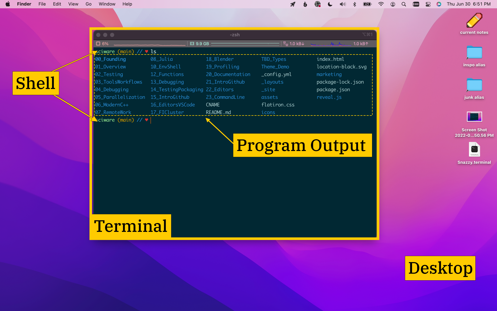

# Sciware

## Command line and Shell interaction

https://sciware.flatironinstitute.org/23_CommandLine

https://github.com/flatironinstitute/learn-sciware-dev/tree/main/23_CommandLine


## Rules of Engagement

### Goal:

Activities where participants all actively work to foster an environment which encourages participation across experience levels, coding language fluency, *technology choices*\*, and scientific disciplines.

<small>\*though sometimes we try to expand your options</small>


## Rules of Engagement

- Avoid discussions between a few people on a narrow topic
- Provide time for people who haven't spoken to speak/ask questions
- Provide time for experts to share wisdom and discuss
- Work together to make discussions accessible to novices

<small>
(These will always be a work in progress and will be updated, clarified, or expanded as needed.)
</small>


## Zoom Specific

- Dedicated Zoom moderator to field questions.
- Please stay muted if not speaking. (Host may mute you.)
- We are recording. Link will be posted to [https://sciware.flatironinstitute.org/](https://sciware.flatironinstitute.org/).


## Future Sessions

- Planning for this fall
   - How types can help you think about programs
   - File formats, data management, hdf5
   - Modern C++
- Suggest topics and vote on options in #sciware Slack


## Today's Agenda

- Overview, terminology, shells
- Shell interaction, navigation
- Environment variables
- Prompt customization
- Shell commands and scripting


## Overview

### Jeff Soules


## Definitions

Here are some terms that people often get confused:

* Operating System
* Terminal
* Console
* Shell
* Command Line

A *terminal [emulator]* provides a *command line interface* to the computer. The computer is
running a *shell* that lets the user direct the *operating system* to run other programs.





### Operating System

- The base programs and libraries that define and control what a computer does
- Made up of many parts:
   - a kernel: privileged code that controls hardware and manages processes
   - "user space" processes: daemons (servers), applications, desktop

<small>_Linux_ 🐧 can refer to both a kernel and the various OSs built on that kernel.</small>


### Terminal

- _Terminal_ is a program that provides I/O (input/output) between a shell (or other program) and a display
- Originally a physical device to interact with remote computers, now we run software terminal _emulators_
- Many different terminal emulators (Gnome Terminal, iTerm, Terminator, xterm)
- "Console" is an old synonym for "terminal"--a physical control panel for a computer
- While a terminal usually runs locally (on the computer in front of you), the programs in it may be running remotely (like over `ssh`)


### Shell

- A _Shell_ is a program that lets you enter commands & passes them to the operating system to run
  - e.g. execute program `xyz.exe` on input files `a`, `b`, `c` and write the output to file `q.out`
- Usually the first program that runs in a terminal
- An old idea (late 1960s/early 1970s): software to replace the "expert computer operator" & punch-card interfaces
  - Lots of variety & lots of layers of backward compatibility = many different ways to do things

<small>The shell interface surrounds the kernel just as a nutshell surrounds a nut 🥜.</small>


### Command Line

- Any programs that only interact with text and typing
  - _Command line interface_ (CLI), as opposed to a _graphical user interface_ (GUI)
- Non-shell programs can provide their own command line interface (e.g. `ipython`)
- _Console_ is sometimes used to refer to all command-line interfaces
  - "Print to the console" = display output on the command-line


## Why have shells?


### Shells are:

- *Interactive*: explore the file system & available commands, run things & see results in real-time
- *Customizable*: control the environment where commands execute
- *Programmable*: automate tasks by:
  - building lists of commands to run together
  - defining how separate commands communicate
  - using constructs like variables, loops, & conditionals
  - repeating commands you've run in the past
- *Standardized*: most systems provide a familiar shell


### Why not a desktop GUI?

- Both are interactive & discoverable
- GUI has some advantages for exploration
  - But shells may make it easier to locate commands
- Shell makes it easier to issue complex instructions (e.g. command-line arguments)
- Shell has better support for automation & programming
- GUI can be more resource-intensive and require more configuration to work on shared systems


### Common Shells

- `bash`: **B**ourne **A**gain **SH**ell (1989), an enhanced version of the shell written by Steve Bourne (1979)
   - default interactive on most Linux systems
   - most common shell for shell scripts
- `zsh`: a modern interactive shell (1990)
   - compatible with bash (mostly superset of features)
   - default on MacOS (replacing bash in 2019, for licensing reasons)
- Other shells: `fish`, `ksh`, `tcsh`, ...


#### Changing your shell

- To just try it out: typing the shell executable name (`zsh`, `bash`) runs a new shell inside your old one
- To change which shell gets started by default:
  - Most systems: `chsh`
  - FI: https://fido.flatironinstitute.org/
  - caveat: some commands on the cluster (`modules`, `source`) only work out of the box in bash


### Types of shell sessions

A shell instance can be `login`, `interactive`, both, or neither.
- A `login` shell is one you had to log in to.
- A shell is `interactive` if it reads & writes from the command line.
- Most login shells are interactive, but interactive shells may not be login shells
  - e.g. a new terminal window in a desktop GUI
  - typing `bash` from an existing login shell
- When is a shell neither login nor interactive? Usually when running scripts (e.g. `$ bash my_script.sh`)


### Shell startup process

- Shells run certain scripts when they start, commonly called "dotfiles", containing configuration and setup
- Modify with care--these can easily break your shell, prevent logins (ex: `exit`) or hurt performance


### Shell config files list

<table class="vert">
<thead><tr><th>shell</th><th style="text-align: center;">login (ssh)</th><th style="text-align: center;">interactive</th><th>neither</th></tr></thead>
<tbody>
<tr><td rowspan='2'>bash</td><td style="text-align: center;"><code>.bash_profile</code> | <code>.bash_login</code> | <code>.profile</code></td><td style="text-align: center;"><code>.bashrc</code></td><td style="text-align: center;">-</td></tr>
<tr>   <td style="text-align: center;"><code>.bash_logout</code></td><td style="text-align: center;">-</td><td style="text-align: center;">-</td></tr>
<tr><td rowspan='4'>zsh</td><td colspan='3' style="text-align: center;"><code>.zshenv</code></td></tr>
<tr>   <td style="text-align: center;"><code>.zprofile</code></td><td style="text-align: center;">-</td><td style="text-align: center;">-</td></tr>
<tr>   <td colspan='2' style="text-align: center;"><code>.zshrc</code></td><td style="text-align: center;">-</td></tr>
<tr>   <td style="text-align: center;"><code>.zlogin</code>, <code>.zlogout</code></td><td style="text-align: center;">-</td><td style="text-align: center;">-</td></tr>
</tbody>
</table>


## Interacting

### Robert Blackwell (SCC)


### Nomenclature/shorthand/tips
- Default shell interaction is based on `Emacs` keybindings, though there are vim bindings as well
- We use `^A` as shorthand for the 'chord' `Control + a` together
- `Alt-X` keybindings might not work without proper terminal configuration (e.g. `Alt` sends `Meta` in `Iterm.app`)
- `Alt-X` keybindings can be simulated by hitting `Esc` and then the character after releasing


### Tab completion

- once, twice
- zsh more


### Navigating

- `Left` (`^B`), `Right` (`^F`) [Move back and forward a character]
- `^Left` (`Alt-B`), `^Right` (`Alt-F`) [Move back and forward a word]
- `Home` (`^A`) [Jump to beginning of line]
- `End` (`^E`) [Jump to end of line]


### Editing
Shells have a builtin clipboard 'kill ring' where 'cuts' add new entries to the ring.

- `^K` [Cut "kill" to end of line from cursor]
- `^U` [Cut line from beginning to end]
- `^W` (`Alt-BS`) [Cut previous word - repeating adds to the last cut]
- `^Y` [Paste whatever was last cut, `Alt-Y` after to cycle through the kill ring]


### History

- `Up` (`^N`), `Down` (`^P`) [Go to previous/next command in history of commands]
- `history 10` [Print last 10 commands you entered]
- `^R` [Search history. After matching, pressing `^R` repeatedly will go to previous matches]


### Processes

- ^C [Send 'interrupt' signal to current process, usually stopping it]
- ^D EOF [Kills most interactive sessions, if line is empty (your current shell, python repl, etc)]
- ^Z ... [Pause current running process and background it]

- jobs [List currently backgrounded jobs]
- bg [Unpause last backgrounded job, keeping in background]
- fg [Unpause last backgrounded job, bringing back to foreground]
- %1
- (interactive)
- `&`
- `wait`

- tmux/screen?


### Evaluation

what happens when you type something

- which
- `$PATH`

- `alias`
   - `alias rm="rm -i"`


### Directories

- `pwd`
- `cd DIR`, `cd`, `cd -`


## Environment control

### Nils Wentzell (CCQ)


### Shell and Enviroment variables - Live Demo

```sh
MYVAR="Hello there" # Define a shell variable
echo $MYVAR         # Use $ to obtain the value

# Shell variables are not seen by child process
python -c "import os; print(os.getenv('MYVAR'))"

# Convert into an environment variable using export
export MYVAR

# Environment variables are seen by child processes
python -c "import os; print(os.getenv('MYVAR'))"

# Definition and export in one line
export ANOTHERVAR="Hello again"
python -c "import os; print(os.getenv('ANOTHERVAR'))"

# Variable expansion 
echo "$MYVAR fellow coders"

# Delete existing variables
unset MYVAR

# Inspect your environment
env
env | grep VAR
```


### Environment Variables

* Local to each shell session
* Influence the way your shell and processes behave
* Conventionally upper case: `PATH`, `HOME`, ...
* Make changes permanent in your `~/.bash_profile`
<br />
<br />

| Env. Variable        | Description                                 |
| -------------------- | ------------------------------------------- |
| `PATH`               | List of directories searched or executables |
| `USER`               | The current username                        |
| `HOME`               | Home directory of the current user          |
| `PWD`                | Path to the current working directory       |


### Executing shell scripts: `source`
<br />

```sh
# -- myenv.sh
export PATH=$HOME/mysoftware/bin:$PATH
...
```
<br />

✅ Execute script in current shell ➜ Script variables will persist
```sh
source myenv.sh
```
<br />

⛔ Run script as child process ➜ Script variables will **not** persist
```sh
bash myenv.sh
```


### Environment Modules - Lmod
<br />

FI Cluster: Use the `module` command to find and load software
```
$ git --version
bash: git: command not found

$ module spider git
     ...
     Versions:
        git/2.31.1
        git/2.35.1

$ module load git
$ git --version
git version 2.35.1

$ module show git
...
prepend_path("PATH","/mnt/sw/nix/store/wix1v2lrfbwrh4mar9ry07zzvsix82i5-git-2.35.1/bin")
```
We also have a modules intro in our [FI Wiki](https://docs.simonsfoundation.org/index.php/Public:SoftwareFlatiron)!


### Managing Python Environments
<br />

<div style="text-align: left">

* `virtualenv` ([user guide](https://virtualenv.pypa.io/en/latest/user_guide.html))

```sh
virtualenv /path/to/myenv
source /path/to/myenv/bin/activate
```
<br />

* `conda` ([user guide](https://docs.conda.io/projects/conda/en/latest/user-guide/tasks/manage-environments.html))

```sh
conda create --name myenv
conda activate myenv
```

</div>


### Environment variables for software developement
<br />

| Env. Variable           | Description                               |
| ----------------------- | ----------------------------------------- |
| `PYTHONPATH`            | Searched for Python modules               |
| `CC`, `CXX`             | C/C++ compiler                            |
| `CFLAGS`,`CXXFLAGS`     | Compiler flags for C/C++                  |
| `LDFLAGS`               | Flags for the linker                      |
| `LIBRARY_PATH`          | Searched for libraries at linktime        |
| `LD_LIBRARY_PATH`       | Searched for dyn. libraries at runtime    |
| `CPATH`                 | Searched for C/C++ header files           |


### Environment variables affecting OpenMP

**Note:** Important when using MPI + OpenMP.
Each MPI rank usually spawns an equal number of OpenMP threads.
If you use one MPI rank per core you should `export OMP_NUM_THREADS=1`
<br />
<br />

| Env. Variable          | Description                               |
| ---------------------- | ----------------------------------------- |
| `OMP_NUM_THREADS`      | Number of OpenMP threads to use           |
| `MKL_NUM_THREADS`      | Number of OpenMP threads to for Intel MKL |
| `OPENBLAS_NUM_THREADS` | Number of OpenMP threads to for OpenBlas  |


## Prompt customization

### Dylan Simon (SCC)


## Configuring your prompt 🎨

- prompt can show information about your environment

### ⚠️ Warning ⚠️

- Customizing your prompt can have hidden costs.  Avoid anything that hides expensive operations behind a "simple" interface (e.g., 🌈 ls aliases).


### Prompt design

 - Only include what you will actually use.
 - That said, don't be afraid to add a little ✨.
 - ♥ ☆ Try a new starting character(s) ʕ•ᴥ•ʔ.
 - Need inspo? ASCII Art Archive https://www.asciiart.eu/
 - ANSI escape sequences for colors: https://gist.github.com/vratiu/9780109
 - Powerline: https://github.com/powerline/powerline


### Off the shelf options

- Oh-my-zsh:
  - _ 🙃 A delightful community-driven framework for managing your zsh configuration. Includes 200+ optional plugins, over 140 themes to spice up your morning, and an auto-update tool._
  - Can cause ⚠️ performance issues, so I recommend using the themes on github for inspiration.


### Off the shelf options

- Powerline:
  - _ A statusline plugin for vim, and provides statuslines and prompts for several other applications, including zsh, bash, tmux, IPython, Awesome and Qtile._


### Prompt variables (bash)

- `PS1`: default interactive prompt.
- `PROMPT_COMMAND`: executed just before PS1, often used for timestamps.
- Other prompt variables (PS2, 3, 4...) exist to manage specific conditions like select loops, continuation, and tracing.
- Check out ss64 for reference info on `bash` prompt special characters, colors, and prompt variables:  https://ss64.com/bash/syntax-prompt.html


### Accessing git branch (bash)

- Homebrew bash autocompletion / git comes with `__git_ps1` predefined to display the branch.
- Otherwise you can use the following function to find the active git branch.

```sh
  function parse_git_branch {
    git symbolic-ref --short HEAD 2> /dev/null
  }
```


### Example prompt (bash)

- Show some 💛 for FI with this prompt:

```sh
  # Define the prompt character
  char="♥"

  # Define some local colors
  red="\[\e[0;31m\]"
  blue="\[\e[0;34m\]"
  green="\[\e[0;32m\]"
  gray_text_blue_background="\[\e[37;44;1m\]"

  # Define a variable to reset the text color
  reset="\[\e[0m\]"

  # Export PS1:  default interactive prompt
  PS1="\[\e]2;\u@\h\a[$gray_text_blue_background\t$reset]$red\$(parse_git_branch) $green\W\n$blue//$red $char $reset"
```


### Prompt variables (zsh)

- `PROMPT`: default is `%m%#`
  - %m: short form of the current hostname
  - %#:  stands for a % or a #, depending on whether the shell is running as root or not.
- `RPROMPT`: right side prompt variable. `RPROMPT='%t'`


###  Accessing git branch (zsh)

```zsh
  autoload -Uz vcs_info
  precmd() {vcs_info}
  zstyle ':vcs_info:git:*' formats '%F{yellow}%B% (%b)'
```

- Enable `vcs_info` function and call it in a pre-command.
- `zstyle`: builtin command is used to define and lookup styles stored as pairs of names and values.


### Example prompt (bash)

- `PROMPT_SUBST`: expands the parameters usable in the prompt.
- `%F{green}%B%`: Named colors must be surrounded by the escape characters.
- The final `%F{black}%B%` sets the color for the
- Showing the same FI love.

```zsh
  setopt PROMPT_SUBST
  PROMPT='%F{green}%B% %c ${vcs_info_msg_0_} %F{blue}%B% // %F{red}%B% ♥ %F{black}%B%'
```


## github dotfiles

- https://github.com/dylex/skel
- https://github.com/wentzell/dotfiles


## Shell commands and scripting

### G&eacute;raud Krawezik (SCC)

Most commands presented here take from 0 to _N_ arguments. The command is usually just repeated on the _N_ arguments


### Getting help
- man pages (manuals) are accessible using `man command`
- Search using `/`, and navigate with the keyboard
- man pages also exist for programming! eg: `man fprintf`
- The **SEE ALSO** section contains useful related commands

```sh
$ man ls
LS(1)                              User Commands                         LS(1)

NAME
       ls - list directory contents

SYNOPSIS
       ls [OPTION]... [FILE]...

DESCRIPTION
       List information about the FILEs (the current directory by default).  Sort entries alphabetically if none of -cftuvSUX nor --sort is specified.

       Mandatory arguments to long options are mandatory for short options too.

       -a, --all
```


### Working with files
_The local directory is assumed when no argument is provided_
- `ls` will show you all the files in a given directory
- Create a new directory with `mkdir`
- `mv filename new_filename_or_location` rename or move a file
- `rm`, `rm -r`: remove files, and (**r**ecursively) directories


### Text handling
- `cat` prints the file(s) content, concatenated
- `less` shows the file content, scrolling by line or page
- `echo` prints text, including environment variables
- Redirect the output of commands to a file using `>`, `>>`
   - `> file` will create a new file
   - `>> file` will append to the file


### Outputs and errors
- Programs usually print output and errors separately
   - stdout is used for output
   - stderr is used for error
- If you are not using redirection, they appear together
   - `>` redirects only stdout
   - `2>` redirects only stderr
   - `&>` redirects both together
   - eg: `my_program > program.out 2> program.err`


### Reusing commands outputs
- One command output can be piped as an input to another with `|` in a left to right execution
   - `command1 | command2 | command3 | ...`
   - To read an input from a file, you can use `<`
- Backticks `` ` `` are used when you want to store a result

```sh
$ KERNEL_VERSION=`uname -r`
$ echo $KERNEL_VERSION
4.18.0-372.13.1.el8_6.x86_64
```


### Control flow: loops
- `for do done` is used to create a loop

```sh
for nprocs in 1 2 4 8 16 32; do
    mpirun -np $nprocs ./program
done
```

- globs (_shell globbing_) (`*`, `**` zsh only? bash config) are used to iterate over files/directories/subdirectories
```sh
$ shopt -s globstar # Enable it
$ ls  **/*.md       # Shows all the .md files in the directory and its subdirectories
```


### Control flow: tests
- `if elif else then fi` are used for conditional operations.

```sh
if [ $i -eq 0 ]; then
    echo "Null value"
elif [ $i -lt 5 ]; then
    echo "Small value"
else
    echo "Large value"
fi
```


### Scripts
You can create a new script (eg: `my_script.sh`) with the following (remember to make it executable with `chmod`)

```sh
#!/bin/bash
# The line above is the shebang, to tell Linux what interpreter to use
# Comments start with hash

list_files=`ls /tmp`
for file in $list_files; do
    mv $file ${file}.old
done
```


## Please give us feedback

### TBD: survey link


## Other resources


* shell scripting
* slurm
* fzf


## Environment variables

[EnvironmentVariables.md](https://sciware.flatironinstitute.org/10_EnvShell/EnvironmentVariables.html)


### Shell Comparison

#### History


- run commands, interactive
- slowly developed more scripting features
- control structure syntax: ALGOL (`fi`, `esac`), C (`{}`)


#### Evolution

- ksh introduced functions
- tcsh invented history, alias, other interactive features
- POSIX.2 standardized minimal /bin/sh features (see `dash`)
- bash developed (and spun off) readline, key bindings
     - emacs mode, vi mode, custom bindings in `.inputrc`
- zsh added sophisticated tab-completion, prompts
     - <small>`git diff <tab>`, `rsync host:<tab>`, `gcc -<tab>`</small>
     - more permissive license, adopted by Apple as default (as of Catalina, Nov 2019)

most modern shells copied, adopted similar, popular features


#### Preferences

- bash
  - most common shell, especially for scripting
  - often assumed default
  - lags behind, catches up
- tcsh: fallen out of favor, non-POSIX, still maintained
- zsh
  - large, superset of **compatible with bash** and tcsh
  - many interactive and scripting features
  - [oh my zsh](https://ohmyz.sh/) ([plugins](https://github.com/ohmyzsh/ohmyzsh/wiki/Plugins), [themes](https://github.com/ohmyzsh/ohmyzsh/wiki/Themes))
- opinions?


- change shell alternative: exec different shell from `.bash_profile` (careful!)

```sh
if [[ $- == *i* && -x /bin/zsh ]] ; then
	SHELL=/bin/zsh exec /bin/zsh -l
fi
```


- Remove prefix: `${file##*.}` -> `csv`
- Remove suffix: `${file%%.*}` -> `mydata`
- Substitute prefix: `${file/#*./data.}` -> `data.csv`
- Substitute suffix: `${file/%.*/.bin}` -> `mydata.bin`
- Brace expansion: `{1..10..2}` -> `1 3 5 7 9`


#### Shell variables

- Similar to local variables - set for current shell, don't propagate to child processes
- Conventionally lower case (`$file`, `$dir`, `$x`, etc.)
- List with `set` command (depending on shell/mode, will print environment variables as well)
- Delete with `unset` command
```sh
$ fi="the best"
$ echo "flatiron is... $fi"
flatiron is... the best
$ sh
sh-4.2$ echo "flatiron is... $fi"
flatiron is...
```


   - make it executable (by adding `#!/bin/bash` and doing `chmod +x myscript.sh`) and run `./myscript.sh`


#### Modules

- Manages environment by setting and modifying environment variables for you
- `module avail` to see all available modules
  - search: `module avail -t | grep <pattern>`
- `module load <modulename>` to load module
- `module unload <modulename>` to unload module
- `module purge` to unload all modules
- `module show <modulename>` to show what loading the module does


#### Python (conda and venv/virtualenv)

- Two main ways to manage multiple python environments
- conda is a powerful, but heavier, one-stop-shop solution
  - Must be user installed, though install is straight forward (__please__ use our docs for installing conda)
- venv is lighter weight and is handled natively by python modules, but is more difficult for some packages


#### Conda

```sh
    conda create -n myenvname # places inside conda
    conda activate myenvname
    conda install numpy
    conda deactivate
```

- Pros:
  - Cross-platform installs of non-python packages
  - Handles complex packages well (e.g. tensorflow)
  - Multiple environments in a central repository
- Cons:
  - Libraries can sometimes conflict: `shadowing`
  - Uses a __lot__ of files. Can hit filecount quota
  - [Un]installing packages (transactions) slow


#### venv (virtualenv)

```sh
    python3 -m venv myenvname # places in cwd
    source myenvname/bin/activate
    pip install numpy
    deactivate
```

- Pros:
  - Lightweight - fast [un]installs
  - Can build on SCC-supported and maintained python installations, better support
  - More on-the-fly selecting of library/python
- Cons:
  - Restricted to use existing python binaries
  - Some issues with compiled packages
  - (Almost) no non-python packages (vim, emacs, etc.)


#### Manual sourcing

- Often useful to lump environment control commands into a single file
- I often create an environment file in a project root

```sh
$ cat setenv.sh
module purge
module load gcc python3 intel/compiler/2020 --force
module load pvfmm/1e4bef5 home/stkfmm/59951f4 openmpi2/2.1.6-intel-hfi intel/mkl/2020
source $HOME/projects/codes/fiber-private/env/bin/activate
$ source setenv.sh
```


### Shell features

- Builtins
- Quoting and Word Splitting
- I/O Redirection
- Command and Process Substitution
- Globs
- Common programs that aren't builtins


#### Builtins

- Q: What is a builtin?
- A: A builtin is a command you run that is part of the shell itself and not a separate executable
- Q: Why does this matter?
- A: These commands are accessible no matter what and are not dependent on other processes or variables (e.g., `PATH`)


##### More About Builtins

- There are over 70 builtin commands in bash (even more in zsh)
- Find them all by using the `help` command at your prompt (for zsh `man zshbuiltins`)
- Now, we will focus on a handful that are important to your interactive session


##### Today's Builtins

- `export`, `source` and `.` (see above)
- `alias` and `command`
- `bg`, `fg`, `jobs`, `kill`, and *^C*
- `suspend` and *^Z*
- `cd`, `pwd`, `pushd`, `popd`, and `dirs`
- `help`
- `history` and `fc`
- `echo`


- `alias`: create or display a shortcut
   - with no arguments `alias` displays a list of all aliases
   - with a single word argument alias displays the definition of the alias to which the argument refers
   - with the argument `NAME=VALUE`, creates or updates the alias named *NAME* with the value of *VALUE*
- `command`: use the actual command or builtin, even if there is an alias making it something else
   - useful when you have an alias configued to run a command with a common set of flags
   - prefixing with `\` has a similar effect


- `bg`
   - puts the most recently suspended process in the background
- `fg`
   - brings the first process in the jobs list into the foreground
- `jobs`
   - displays the status of jobs and their ID
   - `-p` flag also gives the PID for the relevant process
   - common statuses are running, suspended, killed


- `kill`: terminates the process specified by either a PID or a job number
   - `-HUP`: "Good afternoon process, please consider stopping or maybe re-reading your configuration file"
   - `-TERM` (default): "hey process, just die."
   - `-KILL`: "DIE DIE DIE STUPID PROCESS!!!"
   - *^C* is equivalent to `-INT`: "please stop"


- *^Z*
   - suspend the process currently running in the foreground of your shell (`kill -TSTP`)
- `suspend`
   - suspend the execution of your shell (because *^Z* doesn't work for shells)


- `cd`
   - change into another directory
   - `cd -` puts you into the last directory you were in
   - `cd` with no arguments puts you back to your home directory
   - `cd A B` substitutes *A* for *B* in your path (zsh only)
- `pwd`
   - prints the name of the current working directory (also `$PWD`)


- `pushd`
   - change into a directory and place it onto the top of a stack
- `popd`
   - removes a directory from the top of the stack and changes into the new top of the stack
- `dirs`
   - shows the contents of the stack generated by `pushd`


- `echo`
   - just print its arguments
   - also a non-builtin, in some shells

- `help`
   - with no arguments lists all shell builtins with very basic descriptions
   - with a single argument of a shell builtin, displays usage instructions on using the builtin


- `history`
   - display or manipulate the history of commands you have run
   - usually you just run it without arguments to remember something you did before
- `fc`
   - opens the last command in the editor, re-runs edited result
   - can also search history and do many other things (zsh)


#### Quoting and Word Splitting

- spaces matter: for most things they define the boundaries of strings
- `"` vs `'`
  - `"` does variable expansion
  - `'` does not
- automatic string concatenation (nested quotes and such)
  - if you have consecutive quoted things
- `\`
  - escapes things like spaces or special characters


#### I/O Redirection

- `>` and `>>`
   - `>` writes output from a process to the file named after the greater than symbol. if the file already exists, it is overwritten.
   - `>>` appends output from a process to the file name after the double greater than. if the file does not exist, it is created.
   - `set -o noclobber` keeps you from overwriting files with `>`


##### stdin, stdout, stderr

- stdin (`0`) is a stream of information you send to a process
- stdout (`1`) is usually the expected output of a process
- stderr (`2`) is either related to something going wrong or sort of control/status information depending on the process
- what does this mean?  `2>&1`
   - this redirects standard error to standard output


- `|`
   - take the stdout from one process and send it to the stdin of another. very useful
- `<( CMD )` (and `>( CMD )`)
   - output from *CMD* is passed as if in a real file
   - multiple processes can write to the hidden file
   - the program that wants to read the data only needs to be able to open a file


#### Command and Process Substitution

- <code>\`CMD\`</code> or `$( CMD )`
   - this is replaced with the output of the command


#### Globs

Globs match things (but are less awesome than regular expressions)
- `*`: 0 or more any characters
- `?`: precisely any one character
- `[somelistofcharspickone]` precisely one character from the list in the brackets (case matters)
- if a glob doesn't match anything, then the glob stays as is (this can be confusing)
- (zsh) if you press tab to complete, it will expand the glob in-place


#### Not Builtins But Still Great

- `ls`
   - lists the files in a directory. if no directory is specified, lists the current directory
   - usually aliased with some options to make for easier color/formatting (and slower!)


- `man`
   - instructions on how to use a command
   - `man -k` / `apropos` is a keyword search of man pages (this is life changing)
   - if you try to use `man` on a builtin, you might get a generic or bash man page.


- `sed`, `awk`, `cut`
   - `sed` is used to selectively edit streams of text (usually replacement or transformation of one or more characters)
   - `awk` is used to carve up text based around some field separators
   - `cut` selects single columns
   - effective for formatting output from a command to be piped to another command


- `nano`
   - basic editor. open. (^R) save. (^O) quit. (^X)


- `rename`
   - rename multiple files based on a supplied expression
   - usually 3 arguments: starting format, ending format, and the things you want to change
      - `rename foo foo00 foo?`
      - the takes the files foo1 -> foo5 and makes them foo001 -> foo005


- `sleep`
   - wait for some number of seconds (or other unit) based on a single argument


- `less` (is `more`)
   - paginates output, so we can read it before it scrolls past
- `cat`
   - does not
