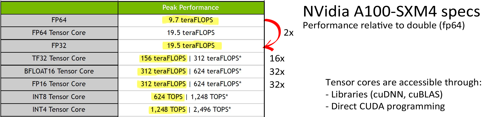
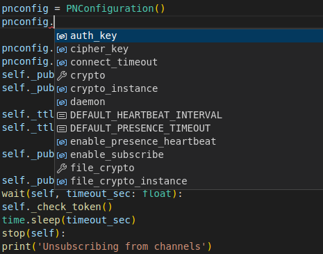
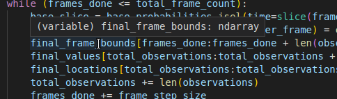
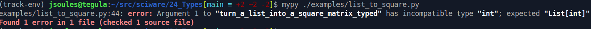

# Sciware

## Command line and Shell interaction

https://sciware.flatironinstitute.org/24_Types

https://github.com/flatironinstitute/learn-sciware-dev/tree/main/24_Types


## Rules of Engagement

### Goal:

Activities where participants all actively work to foster an environment which encourages participation across experience levels, coding language fluency, *technology choices*\*, and scientific disciplines.

<small>\*though sometimes we try to expand your options</small>


## Rules of Engagement

- Avoid discussions between a few people on a narrow topic
- Provide time for people who haven't spoken to speak/ask questions
- Provide time for experts to share wisdom and discuss
- Work together to make discussions accessible to novices

<small>
(These will always be a work in progress and will be updated, clarified, or expanded as needed.)
</small>


## Zoom Specific

- Dedicated Zoom moderator to field questions.
- Please stay muted if not speaking. (Host may mute you.)
- We are recording. Link will be posted to [https://sciware.flatironinstitute.org/](https://sciware.flatironinstitute.org/).


## Future Sessions

- Planning for the next few months:
   - Modern C++
   - File formats, data management, hdf5
- Suggest topics or contribute to content in #sciware Slack


## Today's Agenda

- Thinking about types: concepts, syntax
- Concrete types, storage, performance
- Types in python: mypy


# Type concepts

### Dylan Simon (SCC)


# Applying Types

* *Not* type theory (a branch of mathematics involving propositional logic and category theory)
* algebraic data types


### Motivation: dimensional analysis

* In calculations, dimensional analysis can often be used to find mistakes: \\(\frac{\texttt{mass}}{\texttt{time}^2} \ne \texttt{force} \\)
* Distinguishing different types of data (e.g., input, output) can help automatically detect coding mistakes

```python
def process(x0):
    x1 = step(x0)
    return x0
```


## Types

* If you think about types at all, you probably think storage, bits:
   * `float`, `double`, `int32`, `string`
   *  `complex`, `struct`, `class`, `list` (of what?)
* Types are not about how many bits, but about the values these bits represent
* Types are for thinking abstractly about your data (not the algorithm or implementation)


So what is a type?


## A type is a *set of values*

Think of a type as representing a set of possible values:

$$
\begin{align}
	\texttt{Bool} &= \\{\textsf{FALSE}, \textsf{TRUE}\\} & \left|\texttt{Bool}\right| &= 2 \\\\
	\texttt{UInt8} &= \\{0,1,\dots,255\\} & \left|\texttt{UInt8}\right| &= 2^8 \\\\
        \texttt{Int32} &= \\{-2^{31},\dots,2^{31}-1\\} & \left|\texttt{Int32}\right| &= 2^{32} \\\\
\end{align}
$$

By saying \\( x \\) has type \\( T \\) we mean
$$ x \in T $$

* \\( \left|T\right| \\) is the number of possible values in \\( T \\) (the *cardinality*)


## Common numeric types

$$
\begin{align}
        \texttt{Int} &\approx \mathbb{Z} \\\\
        \texttt{Float} &\approx \mathbb{Q} \approx \mathbb{R} \\\\
	\texttt{Float32} &\approx \pm 10^{\pm 38} \text{ with 7 digits} \\\\
	\left|\texttt{Float32}\right| &\le 2^{32} \\\\
	\left|\texttt{Float64}\right| &\le 2^{64}
\end{align}
$$

* Practically, cardinality is always finite (computers have finite memory)
* We may define types with infinite cardinality, but always countably infinite!


## A set of values you choose

No need to limit yourself to established types!

$$
	\\{1,2,3\\} \qquad
	\\{\textsf{YES}, \textsf{NO}, \textsf{MAYBE}\\} \qquad
	\\{\textsf{RED}, \textsf{GREEN}, \textsf{BLUE}\\} \\\\
	\mathbb{Q} \cap [0,1] ~ (\\{x \in \mathbb{Q} : 0 \le x \le 1 \\}) \\\\
	\mathbb{P} \qquad
	\mathbb{Q}^+ \\\\
	\texttt{Float} - \\{ \textsf{NaN}, \pm\textsf{Inf} \\} \quad
	(T - S = T \setminus S = \\{ x \in T : x \notin S \\})
$$

* Many languages represent "finite" data types with labeled values as *enumerations*
* All types with the same cardinality are isomorphic (can trivially substitute one for another by replacing values)


## Special types

A couple simple types may seem silly but are quite useful:

$$
\begin{align}
	\texttt{Unit} &= \\{()\\} & \left|\texttt{Unit}\right| &= 1 \\\\
	\texttt{Void} &= \emptyset = \\{\\} & \left|\texttt{Void}\right| &= 0
\end{align}
$$

* `Unit` is the singleton type with only one possible value (`None` in python, `Nothing` in Julia)
* `Void` is the empty type with no possible values (impossible, a value that can never exist, the return value of a function that never returns)
   * `void` in C?


## Why is this useful?

Documentation, optimization, error checking, logic!

```python
def compute(order ∈ {1,2,3}):
  if order == 1: ...
  elif order == 2: ...
  else: ... # order == 3
  #if order == 0 (ERROR?)
```

* Can be helpful for describing and thinking about code even if the types are not perfectly represented in the programming language
* Once a variable has a type, its value must be in that type


## Type syntax

Different languages use a variety of syntax to represent types

| \\( x \in T \\)             | languages          |
|--------------------|--------------------|
| `x: T`, `x: int`   | Python, TypeScript |
| `x :: T`, `x::Int` | Haskell, Julia     |
| `T x`, `int x`     | C, C++, Fortran 77 |
| `T :: x`, `integer :: x` | Fortran 90   |


## Adding types: Unions

Sometimes we want to allow different types of values, so we make a new type by combining other types with a union:

$$
\begin{align}
	\texttt{Bool} \cup \texttt{Unit} &= \\{\textsf{FALSE}, \textsf{TRUE}, ()\\} \\\\
	\texttt{Int8} \cup \texttt{Int32} &= \texttt{Int32} \\\\
	(\texttt{Int8} \subset \texttt{Int32})
\end{align}
$$

* Simple unions are not particularly useful, as they can usually be represented by a different type
   * Some exceptions: C `union`
* Instead...


## Sum types (disjoint unions)

Just like a union, but keeps all values (not just distinct)

$$
\begin{align}
	T + S &= T \sqcup S \\\\
	\texttt{Bool} + \texttt{UInt32} &= \\{\textsf{FALSE},\textsf{TRUE},0,1,2,\dots\\} \\\\
	\texttt{UInt8} + \texttt{UInt32} &= \\{0_8, 1_8, \dots, 255_8, 0_{32}, 1_{32}, \dots\\} \\\\
	\left|T + S\right| &= \left|T\right| + \left|S\right|
\end{align}
$$

* Sometimes called a "tagged" union because values are tagged by which type they're from
* "discriminated": each value is either from `T` or `S` (and you can tell)


## Type parameters, more syntax

* Types can have parameters (arguments) of other types
* \\(+\\) is an operator (function) that builds existing types into a new one: \\( T+S = \texttt{Union}(T,S) \\)
* Syntax for type parameters (and unions):

| \\( T + S \\)      | language          |
|--------------------|--------------------|
| `Union[T,S]`   | Python |
| `Union<T,S>` (`T\|S`)    | TypeScript |
| `Union{T,S}`  | Julia |
| `variant<T, S>`    | C++ |
| `Either T S`  | Haskell |


## Other simple types

* Adding \\( \texttt{Unit} \\) to a type is often useful

$$
	\texttt{Unit} + \texttt{T} = \\{(), \dots\\} \\\\
	\texttt{Unit} + \texttt{Bool} = \\{(), \textsf{FALSE}, \textsf{TRUE}\\}
$$

* Provides a "missing" option (`NULL`, `None`, `nothing`, `NA`)
* Often has a special name:
   * `Optional[T] = Union[T,None]` (Python)
   * `optional<T>` (C++)
   * `Maybe T` (Haskell)


## Product types

* Unions can only have one value, one type OR the other
* Products allow one value from each type (AND)
* Represents every possible combination of two types (cross product, outer product)

$$
\begin{align}
	T \times S &= \\{ (x, y) : x \in T, y \in S \\} \\\\
	\texttt{Bool} \times \texttt{UInt8} &= \\{(\textsf{FALSE},0),(\textsf{TRUE},0),(\textsf{FALSE},1),(\textsf{TRUE},1),\dots\\} \\\\
	\texttt{Float} \times \texttt{Float} &\approx \mathbb{R}^2 = \mathbb{R} \times \mathbb{R} \qquad (\mathbb{C}) \\\\
	\left|T \times S\right| &= \left|T\right|\left|S\right|
\end{align}
$$

* Often represented by pairs or tuples: `(T,S)`, `T*S`, `Tuple[T,S]`, `pair<T,S>`


## Larger (and smaller) tuples

$$
	\prod_{i=1}^n T_i = T_1 \times T_2 \times \cdots \times T_n = \texttt{Tuple}(T_1, T_2, \dots, T_n) \\\\
		= \\{ (x_1,\dots,x_n) : x_1 \in T_1, \dots, x_n \in T_n \\} \\\\
	\left| \textt{Tuple}(T_1, T_2, \dots, T_n) \right| = \prod_{i=1}^n \left| T_i \right|
$$

* `(1.2, 3.1, 5) : Tuple[Float,Float,Int]`
* Larger tuples with labeled fields can be "structs" or "records"


## Empty tuple?

$$
\begin{align}
	\texttt{Tuple}() &= ??? \\\\
	\left| \texttt{Tuple}() \right| &= \prod_{i=1}^0 \left|T_i\right| = 1 \\\\
	\texttt{Tuple}() &\cong \texttt{Unit} = \\{()\\}
\end{align}
$$


## Empty sum?

$$
\begin{align}
	\sum_{i=1}^n T_i &= T_1 + \cdots + T_n \\\\
	\sum_{i=1}^0 T_i &\cong \texttt{Void}
\end{align}
$$

* `Union{}` (Julia)


### Quiz
$$
\begin{align}
	T + \texttt{Void} &\cong ??? \\\\
	T \times \texttt{Unit} &\cong ??? \\\\
	T \times \texttt{Void} &\cong ??? \\\\
	T + T &\cong ???
\end{align}
$$


### Answers
$$
\begin{align}
	T + \texttt{Void} &\cong T & \left|T\right| + 0 \\\\
	T \times \texttt{Unit} &\cong T & \left|T\right| \times 1 \\\\
	T \times \texttt{Void} &\cong \texttt{Void} & \left|T\right| \times 0 \\\\
	T + T &\cong \texttt{Bool} \times T & 2 \left|T\right|
\end{align}
$$


## Arrays, Lists

* Fixed-length arrays are equivalent to tuples:
   $$
	\texttt{Array}\_n(T) = \prod_{i=1}^n T = T^n \qquad \left|T^n\right| = \left|T\right|^n \\\\
	(x_1, x_2, \ldots, x_n) \in T^n \qquad x_i \in T \\\\
	T^0 \cong \texttt{Unit}
   $$
* (Reminder: focus on possible values, not representation)


## Arrays, Lists

* Variable-length arrays can be thought of in a couple (equivalent) ways:
   $$
   \begin{align}
	\texttt{Array}(T) &= \sum_{n=0}^\infty T^n = \texttt{Unit} + T + T^2 + \cdots \\\\
	\texttt{List}(T) &= \texttt{Unit} + (T \times \texttt{List}(T)) \\\\
	\texttt{Array}(\texttt{Bool}) &= \\{(), (\mathsf{F}), (\mathsf{T}), (\mathsf{F},\mathsf{F}), (\mathsf{T},\mathsf{F}), \dots \\}
   \end{align}
   $$
* Infinite type
* By restricting \\( \sum_{n=a}^b T^n \\) we can represent arrays of certain lengths (non-empty, at most 10, etc.)


## Array syntax

| \\( \texttt{Array}\_{[n]}(T) \\)      | language          |
|--------------------|--------------------|
| `List[T]`   | Python |
| `Array{T}`  | Julia |
| `Array<T>`, `T[]`  | TypeScript |
| `[T]`  | Haskell |
| `list<T>`, `vector<T>` | C++ |
| `T x[n]` | C |
| `x(n)`, `DIMENSION` | Fortran |


## "Real" (Rational) Numbers

$$
\begin{align}
	\texttt{Digit} &= \\{0,1,2,3,4,5,6,7,8,9\\} \\\\
	\mathbb{N} \cong \texttt{Natural} &= \texttt{Array}(\texttt{Digit}) \qquad 852 \cong (8,5,2) \\\\
	\mathbb{Z} \cong \texttt{Integer} &= \texttt{Bool} \times \texttt{Natural} \quad -852 \cong (\mathsf{T},(8,5,2)) \\\\
	\mathbb{Q} \cong \texttt{Rational} &= \texttt{Integer} \times \texttt{Natural} \\\\
	-8.5 &= \frac{-17}{2} \cong ((\mathsf{T},(1,7)),(2))
\end{align}
$$

Exercise: Strings?


## Subtypes

If one type is a subset of another, we call it a subtype:

$$
	S \subseteq T \qquad \forall x, x \in S \Rightarrow x \in T \\\\
	S \times U \subseteq T \times U \\\\
	S + U \subseteq T + U \\\\
	\texttt{Array}(S) \subseteq \texttt{Array}(T) \\\\
	T \subseteq T + U \\\\
	\texttt{Int8} \subset \texttt{Int16} \subset \texttt{Int32} \\\\
$$

* Similar to inheritance: if \\( C \\) inherits from \\( B \\), then \\( C \subset B \\)


## "Any" types

* Some languages have an "any" type representing union of all possible types, containing all possible values
* `Any`, `void *`

$$
	\texttt{Void} \subseteq T \subseteq \texttt{Any} \quad \forall T
$$


## Functions

$$
	f(x) = x^2 \\\\
	f : \mathbb{R} \to \mathbb{R} \\\\
	f \in T \to S \\\\
	x \in T \implies f(x) \in S \\\\
	g(x) = \text{if } x \text{ then } 0 \text{ else } 1 \\\\
	g \in \texttt{Bool} \to \texttt{Int}
$$


## Function syntax

| \\( T \to S \\)      | language          |
|--------------------|--------------------|
| `Callable[[T], S]`   | Python |
| `(x: T) => S`, `Function`  | TypeScript |
| `T -> S`  | Haskell |
| `S (*)(T)` | C (function pointer) |
| `function<S(T)>`, `Callable` | C++ |
| `Function` | Julia |


## Exercise

* How would you represent the position and mass of a particle in the 3D unit box?
* What about an arbitrary number of particles?
* What's the type of a function that calculates the center of mass for these particles?


## Multiple arguments

* Approaches to functions with multiple arguments:

$$
	f \in (T \times S) \to R \qquad \text{single tuple argument} \\\\
	f \in T \to S \to R \qquad \text{currying}
$$

| \\( T, S \to R \\)      | language          |
|--------------------|--------------------|
| `Callable[[T, S], R]`   | Python |
| `(x: T, y: S) => R`, `Function`  | TypeScript |
| `T -> S -> R`  | Haskell |
| `R (*)(T, S)` | C (function pointer) |
| `function<R(T, S)>`, `Callable` | C++ |


## Defining functions

```python
def f(x: T, y: S) -> R:
	z: R = python
	return z
```

```typescript
function f(x: T, y: S) => R {
	let z: R = typescript;
	return z;
}
```

```julia
function f(x::T, y::S)::R
	z::R = julia
	z
end
```

```c
R f(T x, S y) {
	R z = c/c++;
	return z;
}
```

```haskell
f :: T -> S -> R
f x y = haskell
```


## Checking types

* Much of the advantage of types comes from checking them to make sure they hold
* This can be done in one of two ways:
   * "Statically": before the program runs, by the compiler or static analysis tool
      * Lets you catch errors (typos, bugs) before they happen
   * "Dynamically": while the program runs, as values are created or used
      * Extra checks can slow down your code
* Most languages end up using a mix of both


## Classes as types

* In OO languages you can use classes to help constrain types
   * Additional constraints on the values beyond can be verified in the constructor
   * Dynamic checking: optional, only in "debug" mode

```python
class Order(int):
    def __init__(self, val: int):
        assert val in (1,2,3)

def compute(order: Order) -> float:
```


## Conclusions, tips

* Try to think about your problem starting with data: how do you represent your input, state, etc.
* Build functions that transform between representations to process data
* Avoid error checking at the beginning of functions, shift to type


# Bits, representations

Lehman

representations

type coersion:
  check types through expression


# Performance

* Processors come with (short) vector units: AVX2, AVX512, ...
* A single CPU operation is multiple math operations! 
* Performance: single (fp32) vs double (fp64) precision
   * GROMACS: hybrid (fp32+fp64) vs fp64: +40%
   * LAMMPS: on single node, fp32 vs fp64:  +28%
* GPUs specs show how type selection is important


NOTE: Encourage those who want to follow along in part 2 to install mypy over the break?


# Practical Types in Python with mypy

### What, How, and Why of Type-Annotated Python


## Motivation

### Annotations are *FOR YOU*

- The interpreter doesn't need your annotations.
  - In fact it ignores them.

You want to annotate types because:
- They make your intentions clearer
- They make your expectations more consistent
- They reduce the load on your human memory
- They enable tooling that can help you even more


### Catching subtle errors

```Python
def turn_a_list_into_a_square_matrix(values):
    root = math.sqrt(len(values))
    int_root = int(root)
    if root < 1 or root != int_root:
        return None
    array = np.asarray(values)
    array = array.reshape((root, root))
    return array

if __name__ == '__main__':
    input_int = 54
    untyped = turn_a_list_into_a_square_matrix(input_int)
    ## oops! 54 isn't a list
```


### Useful contextual information

- Auto-completing members of known classes




- Reminding you what a variable should contain




### Today is Python Typing 101

- For further research, see the docs:
  - [Full Python doc on type hinting](https://docs.python.org/3/library/typing.html)
  - [Python's somewhat more basic type documentation](https://peps.python.org/pep-0483/)
  - [mypy documentation](https://mypy.readthedocs.io/en/stable/)
- Note these docs privilege exhaustiveness over readability...


## Vocab

- **Static analysis** (SA)--tools that tell you things about your code just from
its structure, without running it.
- **Type Checker**/**Type Analyzer**--SA tool that reasons about variable and function types (e.g. `mypy`)
- **Linter**--SA tool that checks style, code reachability, & more
  - I'll say "type checker", "type analyzer", and "linter" pretty freely
- **Duck typing**--"if it quacks like a duck, it's a duck"
  - If it has the right properties, it counts as a ___


## Basics

### Installing mypy

```bash
$ pip install mypy
$ mypy simple_example.py
```




## Annotating Types


### Syntax

- Postfix type hints:
  - `int_valued_variable: int = 5`
  - Form is `<VARIABLE_NAME>: <TYPE_NAME>`
  - Applies anywhere a variable is first used, including function parameters
- Function return values use an arrow:
  - `def f(x: int) -> float:`
  - This says `f` takes an `int` and returns a `float`
  - Typing for a function is called a *type signature*


### What type names can you use?

- Primitive types: Basic data
  - `int`
  - `float`
  - `bool`
  - `str`
- These types actually exist to the interpreter


- Non-primitives
  - `None` -- technically not a primitive
  - `Any` -- Matches anything; *turns off type checking*
  - `object` -- Matches anything; does *not* turn off type checking
  - Any classes in your namespace
    - (e.g. `np.ndarray` if you did `import numpy as np`)


- Parameterized types
  - Built-in container types:
    - `List`
    - `Set`
    - `Tuple`
    - `Dict`
  - `Callable`
  - `Literal`
  - ...
- We'll spend most of this session on these


- Container types need *parameters*
  - e.g. `List[int]`, not just `List`
  - (What's in the list?)
- Generally need to be imported from `typing` package
- Recent changes: 3.10 lets you lowercase, and allows importing from `collections.abc`
- Our examples work in 3.10 or earlier versions


## Parameterizing container types

### List & Set

- Parameters go in square brackets: `List[str]` or `Set[int]`

```Python
def sum(items: List[int]) -> int:
    pass
```

- Now the linter can warn us of adding invalid values
  - Or confirm that we're allowed to do something with one of the items


### Tuple

- A `Tuple` has a fixed number of elements in a certain order.
  - Used whenever you pack values together, e.g. returning `(x, y)` as one unit

```Python
price_and_count: Tuple[float, int] = (1.5, 3)
```

- (An empty tuple is typed as `Tuple[()]`)
- (A variadic tuple of one type is `Tuple[t1, ...]`)


### Dict

- Stores *values* that can be looked up by their unique *key*
  - Must provide types for both

```Python
heights_per_person: Dict[str, float] = {}
```

- Along with variable naming, this helps you understand what is stored


### Union

- Sometimes a variable can be one of a few different types:

```Python
cash_on_hand: Union[int, float, None] = ...
```

- This allows flexibility while still providing guidance.


### You can nest them...!

```python
cash_per_person: Dict[str, Union[int, float, None]] = {...}
```


### This can get long...

```python
points: Dict[str, Dict[int, List[float]]] = {...}
# for each student, for each test number, store how many points they got on each question
```

- ```points["Kushim"][1]``` is a list of how many points Kushim got on each question
on the first Accounting exam at Uruk University


### Type Aliases

- Instead we can define *type aliases*

```python
from typing import TypeAlias

Gradebook: TypeAlias = Dict[str, Dict[int, List[float]]]
my_gradebook: Gradebook = get_gradebook_for_semester()
grades_for_student = gradebook['Kushim']
```

- Lets you use a shorter but more meaningful name for something complex
  - [typealias.py](./examples/typealias.py)


- We could also do:

```python
from typing import TypeAlias

PointsPerQuestion: TypeAlias = List[float]
TestId: TypeAlias = int
StudentName: TypeAlias = str

Gradebook: TypeAlias = Dict[StudentName, Dict[TestId, PointsPerQuestion]]

my_gradebook: Gradebook = get_gradebook_for_semester()
kushim_points_test_one = gradebook['Kushim'][1]
```


### Type Aliases - Why?

- Pros:
  - Meaningful names document *intention*
  - Shorter: easier to read and type
- Cons:
  - Sometimes mouseover hints don't drill down enough
    - (might just get `Gradebook`, not actual structure)
  - Consider whether you'd be better off with an actual class or a [dataclass](https://docs.python.org/3/library/dataclasses.html)


### Callable

- Describes the type of a function stored in a variable.
- Takes a list of parameter types (in order), then the return type

```python
from typing import Callable

sum_then_square: Callable[[float, float], float]
sum_then_square = lambda x, y: (x + y) ** 2
```

- Useful higher-order programming, anonymous fns
- You'll probably want to use aliases


### Classes

- If a class is defined in your namespace, you can use it as a type
  - This includes built-in classes and classes from imports
  - This includes classes from your code
- Child classes count as instances of the parent class


- Built-in classes work (but you may need to import the types explicitly):

```python
from io import TextIOWrapper

def write_to_file(msg: str, handle: TextIOWrapper) -> None:
    handle.write(msg)
```

  - [filehandle.py](./examples/filehandle.py)


- Child classes count as members of the parent class:

```python
class MyClass(): pass
class MyOtherClass(MyClass): pass

b: MyClass = MyClass()
c: MyOtherClass = MyOtherClass()
d: MyOtherClass = b # error; MyClass is not a MyOtherClass
b = 5 # error (naturally; 5 is not a MyClass)
b = d # no error -- inheritance means MyOtherClass is a MyClass
```

  - [classes.py](./examples/classes.py)


- Linters differ on using a class during its definition

```python
class MyClass():
    def __init__(self) -> None:
        pass

    def compare(self, other: MyClass) -> int:
        return 5
```

- `mypy` thinks this is fine
- VSCode complains about using `MyClass` in `compare`
  - You *can* use `MyClass` outside its class definition
  - To fix: put it in quotes (`other: 'MyClass'`)


- `self` never needs type annotation: it's inferred
- `__init__` is inferred to return `None`
  - BUT `mypy` won't type-check an `__init__(self)` function unless it has *some*
  explicit type annotations
  - (either from non-`self` parameters or by explicitly returning `None`)


### Literals

- `Literal` means a *specific* value
  - `Literal[15]` means the literal value `15` and not any other integer

```python
way: Union[Literal['North'], Literal['South'], Literal['East'], Literal['West']] \
    = 'west'
```

- [literal.py](./examples/literal.py)
- Did you catch the error there?
- It's probably better to use an [Enum](https://docs.python.org/3/library/enum.html) for this case


### Final

- Means you shouldn't change the variable's value
  - Like `const` in JavaScript/TypeScript, C/C++/C#, etc.

```python
  x: Final[int] = 15
  x = 22     # will generate a warning
```

- This is *great* for supporting [functional programming](https://en.wikipedia.org/wiki/Functional_programming)
and reducing mistakes
  - But it **is not** enforced at runtime!
  - [final.py](./examples/final.py)


## How you interact with types


### At runtime

- You pretty much don't!
- Errors from your linter are not enforced at runtime
- Python typing (per se) is entirely for static code analysis
  - You *could* use `TypeGuard`s (see bonus content)


### In your editor

- mouseover information for variables, functions
- auto-completion of member reference
  - (`my_ClassA_var.` pops up methods from `ClassA`)
- auto-populates docstring skeleton


### With separate analyzer (mypy)

- Generates a report of detected type errors
- **ONLY** looks at functions that have some explicit type hinting
- *Stops tracking* variables which are annotated `Any`


### Lists-to-Square-Matrix example

[See list_to_square.py](./examples/list_to_square.py)


## Type Inference

- The analyzer can often figure out a type through static analysis, without hints:

```Python
def returns_int():
    return 15

a = returns_int() + 3 # Note: this will be a Literal[18], not int!
```

  - But it might not infer what you want!
  - Mark it explicitly as `-> int` and `a` will be seen as `int`.
  - [returns_int.py](./examples/returns_int.py)


### Narrowing

- `Union` types can be interpreted more precisely if the context eliminates some possibilities
- Type checker understands a few built-in functions
  - Type is narrowed *only* within a conditional branch
  - [narrowing.py](./examples/narrowing.py)

```python
def narrowing_example(my_var: Union[str, int]) -> str:
    if isinstance(my_var, str):
        # If this branch got taken, we know my_var is a str, so mouseover shows it
        return my_var
    # type checker knows all strs hit the "return" statement
    # So it knows by process of elimination that my_var is an int
    # And mouseover will show 'int' here
    return str(my_var)
```


- `isinstance()` actually works at runtime, so `mypy` knows this is safe
- Also supported:
  - `issubclass(cls, MyClass)`
  - `if (type(a) is int)`
  - `if (callable(fn))` (though this doesn't distinguish `Callable`s with different signatures)
- `mypy` also understands how `assert`, `return`, and exceptions work with conditionals


- `Optional[xyz]` is short for `Union[xyz, None]` and benefits from narrowing:

```python
def narrowing_example_2(a: Optional[int]) -> None:
    print(a) # here 'a' could be int or None
    if (a is None):
        raise Exception('Exception ends this branch!')
    a # here a must be int, and mouseover shows it
```

- This is useful for handling user inputs or values that might be missing.


### Casting

- For when inference fails!
- If you know better than the analyzer, you can overrule it

```python
import xarray as xr
from typing import cast

def load_xarray(filename: str) -> xr.Dataset:
    # xarray's open_dataset returns Any, but we know it's returning a Dataset object.
    # So use cast(TYPE, VALUE) to tell the checker that VALUE is of type TYPE
    results = cast(xr.Dataset, xr.open_dataset(filename))
    return results
```

- [casting_example.py](./examples/casting_example.py)
- Note: in `mypy`, if a variable is *explicitly* marked `Any`, even casting it won't turn type checks back on.


### Generics

- Sometimes you can say *something* about a type without knowing *everything* about it.
```python
def prepend_to_list(value: int, values: List[int]) -> List[int]:
    return [value] + values
```
  - Great, now do one for every other possible type of `list`...???


- Instead, you can use a *variable type parameter* using `TypeVar`:

```python
from typing import TypeVar

T = TypeVar('T')
def prepend_to_list(value: T, values: List[T]) -> List[T]:
    return [value] + values
```

- This now works for any type (as long as you can write logic that makes sense)


### Numpy

- Uses more precise types (`dtypes`) based on actual bit representation
  - Closer to types in C
  - `mypy` and the Python typing spec don't handle these cases
- Some extensions (`nptyping`) let you type the actual `dtype` and
even shape of `ndarray` objects
  - Useful if you plan to do linear algebra


## Big Example

[riemann.py](./examples/riemann/riemann_base.py)
[completed version](./examples/riemann/riemann-full.py)


## Bonus Content

- Here are some topics which are beyond today's main scope.


### TypeGuards

- `TypeGuard`: a function that returns whether a variable is of a given type
  - Connected to narrowing
  - Code that both actually works at runtime...
  - ...and is also understood by the type analyzer


```python
def is_str_list(val: List[object]) -> TypeGuard[List[str]]:
    return all(isinstance(x, str) for x in val)
```

- This returns true if & only if every element of `val` is a `str`
  - Other code can now call `is_str_list(some_list)` and branch on the result
  - in a branch where `is_str_list(x)` returned `True`, the type checker also knows `x` is a `List[str]`
- You can do a *lot* with these
  - [Official documentation](https://mypy.readthedocs.io/en/stable/type_narrowing.html#user-defined-type-guards)
  - [typeguard.py](./examples/typeguard.py)


### Generics and Constraints

- `TypeVar()` lets you add *subtype constraints* to limit what generic types you support
  - e.g. `TypeVar('T', int, float)` means `T` must be an `int` or `float`.
  - How is that different from `Union[int, float]`?
    - `List[T]`: all elements are `T` (either `int` or `float`)
    - `List[Union[int, float]]` could contain some `int`s and some `float`s


- You can also restrict to type families:
  - `TypeVar('S', bound=str)` means `S` has to extend `str` to qualify.
  - This supports the possibility of more specific types while guaranteeing that certain functionality will be available
- One `TypeVar` can only use either binding or subtype constraints
  - it doesn't make sense to use both


### Abstract Base Classes (ABCs)

- Object-oriented programmers may be familiar with *interfaces*
  - A defined set of properties/behaviors that lets one object "count as" another
  - E.g. `Iterable` = any class that has elements that can be operated on in order
- Python has lots of objects but no built-in explicit interfaces
- Duck typing: if an object has the expected properties it "implements the interface"
  - This is effectively a runtime check


- If we want to define an interface explicitly we use **[Abstract Base Classes](https://docs.python.org/3/library/abc.html)**
  - `from abc import ABC`
- You then define an *abstract* class and *concrete* classes
  - Base class = abstract, defines an interface
  - Concrete class = implements the interface

```python
from abc import ABC
class Animal(ABC):
    @abstractmethod
    def respire(self, compound): pass

class Cat(Animal):
    def respire(self, compound):
        print(f"{compound} should be oxygen!")
```


- Concrete classes inherit from the ABC
  - and must implement any methods marked `@abstractmethod`
- Instantiating a base class directly is invalid
  - (i.e. no `x = Animal()`)
- `mypy` will check for this


### Covariance and Contravariance

- [python doc](https://peps.python.org/pep-0483/#covariance-and-contravariance)
- [wikipedia](https://en.wikipedia.org/wiki/Covariance_and_contravariance_(computer_science))


- Suppose I have an `Animal` class
  - both `Cat` and `Dog` inherit from `Animal`
- Is `List[Cat]` a subtype of `List[Animal]`?
  - What about `Callable[]`s?
  - Generally: how does class inheritance play with container types?


- *Covariant*: Means that if `A` is a subtype of `B`, then `Generic[A]` is always a subtype of `Generic[B]`
- *Contravariant*: Means that if `A` is a subtype of `B`, then `Generic[B]` is always a subtype of `Generic[A]`
  - (Note it's reversed!)
- *Invariant*: the relationship is inconsistent.


- Functions are "contravariant in parameters but covariant in returns":
  - `f() -> Cat` is a subtype of `f() -> Animal`
    - Any caller expecting an `Animal` can take a `Cat`.
    - This is covariance
  - *BUT* `f(x: Animal) -> None` is a *subtype* of `f(x: Cat) -> None`!
    - Of all the functions that operate on `Cat`s, only some work on all `Animal`s.
    - This is contravariance


- Lists are *invariant*:
  - All items from a `List[Dog]` can be added to a `List[Animal]`
    - So `List[Dog]` is a subtype *when acting as a source*
  - `List[Animal]` can receive all items that could be added to `List[Dog]`, but not vice versa
    - So `List[Animal]` is a subtype *when acting as a sink*
  - Relationship is not fixed -- thus invariant
