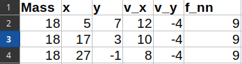
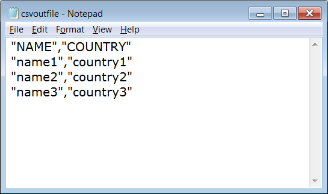

# Sciware

## File Formats and Storing Data

https://sciware.flatironinstitute.org/26_DataFormats

https://github.com/flatironinstitute/sciware/tree/main/26_DataFormats


## Rules of Engagement

### Goal:

Activities where participants all actively work to foster an environment which encourages participation across experience levels, coding language fluency, *technology choices*\*, and scientific disciplines.

<small>\*though sometimes we try to expand your options</small>


## Rules of Engagement

- Avoid discussions between a few people on a narrow topic
- Provide time for people who haven't spoken to speak/ask questions
- Provide time for experts to share wisdom and discuss
- Work together to make discussions accessible to novices

<small>
(These will always be a work in progress and will be updated, clarified, or expanded as needed.)
</small>


## Zoom Specific

- Dedicated Zoom moderator to field questions.
- Please stay muted if not speaking. (Host may mute you.)
- We are recording. Link will be posted to [https://sciware.flatironinstitute.org/](https://sciware.flatironinstitute.org/)


## Future Sessions

- Suggest topics or contribute to content in #sciware Slack
- We're recruiting: looking for CCB representative, contributors


## Today's Agenda

- Intro to _data_ and _files_
- Common file formats and their strengths/weaknesses
- Overview and python interfaces for HDF5 and ASDF


# General Concepts

### Jeff Soules (CCM)


## Outline

- Basic definitions
- Data-in-context
- Data's internal structure
  - Particularly beyond lists/tables
- Desirable properties of file formats
- Overview of the trade-offs

This section is fairly abstract--don't worry, we'll be looking
at examples soon!


Today is about the **trade-offs** imposed by different formats,
and making **choices** that fit our situation and goals.


## Basic definitions


### What is data?

- Input to or output from a computational process
- Information we care about, such as:
  - X, Y, Z component of a particle's position
  - Edge weights on a graph
  - Chunks of natural-language text
  - ...
- Attempt to *quantify* some phenomenon


### What is a file?

- A discrete entity on a filesystem
- A *representation* of some data
  - using a *finite* series of *bits*
  - on some *persistent* electronic storage
  - *separate* from other data
- Organizing separate files is hard in its own right
- There are many ways to represent the same data


### Where is data when it's not in files?

In memory!

- Representation trade-offs apply here too
- File-specific tasks include:
  - Getting *the right* data to/from memory
  - Persisting and duplicating data
  - Data sharing/moving between systems


### What is a file format?

- *Not* the file extension (e.g. `.txt`)
- Particular choice of rules for:
  - *What* data to store,
  - How to *represent* it in *bits*
  - How to *organize* it on *disk*
- Allowing disk-to-memory conversion
  - in either direction
  - consistently and repeatably


## Metadata and context

There are considerations outside our data that may influence our
choice of file formats. Let's look at that.


### What's the purpose of data?

- Some files are for publication
  - These require the most care and robustness
- Some files are for internal use or short duration
  - But listen to optimistic pessimism!
  - It'll be more important & long-lived than you think
- Many fields have standard practice
  - If you do something else, have a good reason


### What's metadata?

- "Data that describes data"
- Says how to interpret a representation/file
  - For both the humans and the machines
  - Might be explicit or implicit
- Expresses assumptions made about the data


### More examples of metadata

- Data provenance? (Source, time, recording setup...)
- Hyperparameter choices that generated the data?
- Possible values for categorical observations
  - e.g. 6 quark types, 4 DNA bases, ...
  - "data dictionary"


### Where to store metadata

- In the file itself
  - Most reliable & secure
  - Takes more space
  - Format must support it (somehow)
- In the filename or directory structure
  - Easy and straightforward
  - until you need to share or re-sort your data
  - leads to long filenames, incomplete capture


- In a separate file
  - Pro: Explicit, no special tooling needed
  - Con: not automatic, can get lost
  - Can be tricky if you have multiple writers


### Where not to store metadata

- In your head
  - You know what's in `untitled_16_final_final.dat`
  - I think those numbers mean...
- In the paper
  - No
- General tension: what is implicit vs explicit


## Simple vs Composite Data

Data often has some sort of natural internal structure.
Here's how to describe that.


- *Simple*: only one observation or type of observation
  - e.g. Height of an object at time `t=0`, `t=1`, ...
  - One set of values, representing the same observable
- *Composite*: more than one type of observation that go together as a unit
  - e.g. Position & velocity of an object over time
- We mostly think about the composite case


### Parts of composite data



- **Fields** are distinct observables
  - the columns above, e.g. `mass`, `v_x`, etc
- **Records** are groups of fields that belong as a unit
  - the rows above, i.e. one row per time
  - A record is "one value in each of the fields"
- Does the row order mean anything?


### Fields have types

- This can be a property of the data
  - Mass and velocity mean different things
- Or it can be purely about representation
  - `float32`? `float64`? Ints? Strings?
  - Imperial? Metric? What's the zero value?
- For categorical data, what defines the category values?
  - Are those values all known in advance?
  - How do I encode those values?


## The map is not the terrain

- And your data are not lists/tables
- Those are *representations* of your data
  - May or may not be a useful way to think about your data
  - May or may not be a desirable file format
- First choice: what data to store?
- Limits of single-file table-oriented approach?


### Implicit Fields


- We assumed that:
  - each row/record represents a new time
  - each time is equally far apart
- These are *choices* in representation
  - i.e. choosing what *not* to represent
- Consider representing implicit fields explicitly
  - All data is composite if you do


### Higher-dimensional data

- Suppose your data is a 6d tensor
  - What dimension (field) distinguishes the records?
  - Is each record just one field with a 5d tensor?
- How would you slice along the different dimensions?


### Missing fields & Evolving data

- Fields' interpretation might change
  - `f_nn`: but the nearest neighbor can vary
- Some fields don't apply to all records
  - "Spouse" or "dependents" fields?
- What if we want to add a new field partway through?
- Partly a metadata issue, partly a data design issue
  - Formats handle empty fields differently


### Sparsity

- What if your table is mostly blank?


### Incompatible Scales


- Fields can evolve over different time scales or be treated at different spatial resolutions
  - Mass gets repeated--can it even change?
  - Adaptive grids, different-scale phenomena
- Natural solution: record them as different files
  - How do I keep the files together?
  - How do I link related records?
- Relational models address this (not in today's scope)


### Rehabilitating tables

- Still useful for lots of scientific data
- Just be aware of the limitations
- It's expected that you'll find cases where data isn't neatly tabular
- Whatever problem you encounter, you probably aren't the first
  - Ask around for advice!


## Representations and Trade-Offs

Now that we've thought about data, let's look at how we would like to record it.


- This is Flatiron: we'll focus on efficiency and clarity
- There are plenty of other desirable properties for files
  - Access control
  - Resilience to data corruption
  - Verified authenticity
  - ...
- These are out of scope for today


### An ideal format would let us....

- Read files fast
  - Sequentially (from start to finish)
  - Or skipping around (random access)
- Write files fast
- Use minimal disk space
- Open files on any machine
- Read files without special software
- Interpret the contents without outside knowledge
- Know when data is missing from a record


**You can't have all of those things at once!**


### General Trade-Offs:

**It's easy to come up with exceptions!**

- Smaller files are faster to read than larger ones
  - There's less data to transfer
- Flexibility and transparency require larger sizes
  - Two-digit vs four-digit years
- Reading speeds compete with writing speeds
  - "Time" may not be the best way to structure a file
- Random access competes with everything
  - requires external indexes or regular-sized records
  - but enables using a subset of the full file


### Solutions

- The extremes:
  - Flexible, transparent, but big
  - Concise, efficient, but brittle
- We sort of map these onto "human-readable" and "binary"
- But in practice all formats try to balance these extremes
  - Best -- or worst -- of both worlds


# Common<br>
# "human readable"<br>
# formats

Robert Blackwell (SCC)


## What do I mean by<br>
## "human readable"



- Text only
- A human can read, but not necessarily understand, it
- ...That's about it


## Some generalities: the "pros"

- Self-documenting
- No special tooling required to inspect
- Typically easy to read, but maybe not understand
- Portable
- Generally flexible/extendable


## Simplest: one number

```bash
$ cat Energy_K=1.0_Beta=2.5_Gamma=193.2
3.953190
```

* EXTREMELY slow/space inefficient
* Difficult to extend
* Blows up very very quickly at scale


## Second simplest: CSV

```csv
#  t,         x,         v_x
   0.00000,   0.00000,   0.15915
   0.33333,   0.86603,  -0.07958
   0.66667,  -0.86603,  -0.07958
   1.00000,  -0.00000,   0.15915
```

* "Comma separated values"
* Fixed table
* Flexible types
* Comments
* Very portable
* Allows for empty fields


## "TXT" et al.

```csv
#t x v_x
0.00000 0.00000 0.15915
0.33333 0.86603 -0.07958
0.66667 -0.86603 -0.07958
1.00000 -0.00000 0.15915
```

* Often a homegrown extension of csv
* Space/tab/whatever delimited
* Non-standard, so *might* have to write custom parser


## JSON "natural" form

```json
[{"t": 0.0, "x": 0.0, "v": 0.15915},
 {"t": 0.33333, "x": 0.86603, "v": -0.07958},
 {"t": 0.66667, "x": -0.86603, "v": -0.07958},
 {"t": 1.0, "x": 0.0, "v": 0.15915}]
```

* List of objects
* Handles missing fields


## JSON "transposed" form

```json
{"t": [0.0, 0.33333, 0.66666, 1.0],
 "x": [0.0, 0.86603, -0.86603, 0.0],
 "v": [0.15915, -0.07958, -0.07958, 0.15915]}
```

* Object of lists
* Can't handle missing fields
   * ...without special values


## JSON (3)

```json
{'points': [{'x': [0.0, 0.0, 0.0], 'radius': 1.0},
            {'x': [2.0, 0.0, 0.0], 'radius': 0.5}],
 'params': {'dt': 0.0001,
            't_final': 1.0,
            'optimization': {'dt_opt': 0.1, 'shell': 1.5} },
 'velocity_field': {'resolution': 0.5, 'dt_write': 0.5}}
```

* Flexible/extendable -- very portable
* Verbose (con? pro? context matters.)
* No comments! (I assure you this is terrible)
* `jq` utility useful for formatting


## Some generalities: the "cons"

* Size: Typically 2-??X larger than machine native formats
  * CSV/TXT: ~2x for floats
  * JSON: minified ~2x, formatted ~10x (+?!)
* Performance: Lot of overhead to read - easy for humans, hard for computers
* Only sequential access -- No random access
  * Sequential is a 'pro' for writing often


# Binary File Formats

Lehman Garrison (SCC)


## What do we mean by "binary file"?

* Any file meant to be read by a machine instead of a human
* Low-level, often mostly a "raw memory dump"
  * The values are stored identically on disk as they are in memory
  * No expensive translation step, like with CSV to binary
  * Or if there is a translation step (such as compression), it's very efficient
  * Binary formats are almost always the right way to store large amounts of data!


## What do binary files look like?

Let's write the raw contents of an array with Numpy's `tofile()`:

```python
>>> a = np.arange(10**7, dtype='f4')
>>> a.tofile('mybinfile')
```

```
$ head -c 128 mybinfile
�?@@@�@�@�@�@AA A0A@APA`ApA�A�A�A�A�A�A�A�A�A�A�A�A�A�A�A�A
```

* It's gobbledygook, as expected
* What would we do if we wanted it to be human readable?


## What do binary files look like?

Could make a human readable file with:

```python
>>> np.savetxt('mytxtfile', a)
```

```
$ head -n8 mytxtfile
0.000000000000000000e+00
1.000000000000000000e+00
2.000000000000000000e+00
3.000000000000000000e+00
4.000000000000000000e+00
5.000000000000000000e+00
6.000000000000000000e+00
7.000000000000000000e+00
```


## Why not always do human readable?

* It's so much slower to save, so much slower to load, and so much bigger to store!

```python
>>> %timeit np.savetxt("mytxtfile", a)
14.5 s ± 141 ms per loop (mean ± std. dev. of 7 runs, 1 loop each)

>>> %timeit a.tofile("mybinfile")
19.1 ms ± 196 µs per loop (mean ± std. dev. of 7 runs, 10 loops each)
```

```
$ ls -lh
-rw-rw-r-- 1 lgarrison lgarrison  39M Dec  8 12:09 mybinfile
-rw-rw-r-- 1 lgarrison lgarrison 239M Dec  8 12:09 mytxtfile
```


## So we should always use Numpy `tofile()`?

* Don't always use Numpy's `tofile()`!
  * or similar raw binary dumps in other languages/packages
  * Doesn't store metadata
  * Not self-describing—how will a user know how to read? Does this file contain floats or ints? 4-byte or 8-byte? Etc.


## What does self-describing mean?

```python
>>> np.fromfile("mybinfile")
array([7.81250000e-03, 3.20000076e+01, 2.04800049e+03, ...,
       5.88761292e+53, 5.88762023e+53, 5.88762753e+53])
```

That's garbage! Have to remember to do:

```python
>>> np.fromfile("mybinfile", dtype='f4')
array([0.000000e+00, 1.000000e+00, 2.000000e+00, ..., 9.999997e+06,
       9.999998e+06, 9.999999e+06], dtype=float32)
```


## Better Binary Formats

* Better formats exist that solve these problems
  * Self-describing (e.g. knows its own `dtype`)
  * Stores metadata (what simulation did this data come from?)
  * Retain the performance and size benefits of raw binary
- Another key advantage of binary over human-readable is jump-ahead (next slide...)


## Jump-Ahead in Binary Formats
- _Example:_ I have a file with 1 billion elements, but I know I only need elements 500 million to 501 million
- In most human-readable formats, have to read all 501 million elements, then discard all the but last million
- In binary formats with *fixed record size*, you can compute:
  1) Each record (array element) is (e.g.) three 4-byte floats: 12 bytes per record
  2) 500 millionth record is at offset: 12*500M = 6 billion bytes
  3) Start reading from the 6 billionth byte in the file, save tons of time
- A good binary format (HDF5, ASDF) will handle this for you under the hood


## Examples of Binary Formats

There are thousands of binary formats! Here are a few common, high-quality ones:
- HDF5
- ASDF
- Numpy .npy
- Msgpack
- Python Pickle
- Other domain-specific formats


## Binary Formats: HDF5
- HDF5
  - Wide adoption, feature-rich, often the Right Choice
  - Will talk about with examples in Part 2
  - _Good for:_ arrays of data with metadata, complex data models, inter-language operability
  - _Downsides:_ complicated API, opaque internals (unpredictable performance)
  - https://docs.h5py.org/en/stable/quick.html#core-concepts


## Binary Formats: ASDF
- ASDF
  - Combines human-readable header with binary data blocks
  - _Good for:_ exchanging data (small or big) between Python users, medium-complicated use-cases like compression, extendable arrays, etc.
  - _Downsides:_ limited support outside Python
  - https://asdf.readthedocs.io/en/stable/asdf/overview.html


## Binary Formats: Numpy .npy
- .npy/.npz files (Numpy specific)
  - Simple format for Numpy arrays; use with `np.save()` and `np.load()`
  - .npz is literally zip file for .npy files
  - _Good for:_ data consists only of Numpy arrays, easy to read in other languages
  - _Downsides:_ only works with Numpy arrays, no metadata support besides types
  - https://numpy.org/doc/stable/reference/generated/numpy.save.html


## Binary Formats: Msgpack
- Msgpack
  - "Binary JSON": lists, key-value dicts, etc
  - _Good for:_ arbitrarily structured binary data
  - _Downsides:_ bad for arrays: no random access/jump-ahead (each item can have different size)
  - https://msgpack.org/index.html


## Binary Formats: Python Pickle
- Python Pickle
  - Stores arbitrary Python objects
  - _Good for:_ saving and loading intermediate state of custom Python objects
  - _Downsides:_ slow, fragile (won't work across Python versions or if packages are missing)
  - https://docs.python.org/3/library/pickle.html


## Binary formats: Domain Specific-Formats
- Domain-specific formats
  - Countless domain-specific formats!
  - e.g. NIfTI (neuroscience), netCDF (geospatial)
  - _Good for:_ compatibility with software tools in a domain
  - _Downsides:_ users outside that domain won't know what to do with the file


## Summary of Binary Formats
- Binary formats store data in a low-level way, often as a direct copy of the values in memory
- Nearly always the right choice when size or performance is a consideration
- Downsides: the format you choose locks you (and your users) into that format's tooling ecosystem
  - HDF5 files have to be read with an HDF5 library, npy files have to be read with numpy, etc.
  - Usually can't open a file and know what's inside without that format's tools (but see ASDF)


## And many others...

- Other formats you've used?  Things you like?  Challenges?
- Questions?


# Break


## Survey
Please give us some feedback!

https://bit.ly/sciware-file-formats-2022


# HDF5

Dylan Simon (SCC)


## HDF5 concepts

Largely taken from HDFGroup's [Introduction to HDF5](https://docs.hdfgroup.org/hdf5/develop/_intro_h_d_f5.html)

"An HDF5 file can be thought of as a container (or group) that holds a variety of heterogeneous data objects (or datasets). The datasets can be images, tables, graphs, and even documents, such as PDF or Excel"


### HDF5 Groups

Groups are like directories in a filesystem


- UNIX path names are used to reference objects: `/SimOut/Mass`


### HDF5 Datasets

- Datasets store multi-dimensional blocks of data of a single type
- Usually represent a single "field" of data


### HDF5 Datatypes

- Datatypes are designed to map to in-memory representations
- Predefined datatypes: atomic values
  - `H5T_IEEE_F32LE`, `H5T_NATIVE_FLOAT` (float)
  - `H5T_INTEL_I32`, `H5T_STD_I32LE`, `H5T_NATIVE_INT` (int)
  - `H5T_C_S1` (char, basis for fixed-length strings)
- Derived datatypes: compound values composed of other types
  - fixed-length strings for random access


### HDF5 Compound Datatypes


- Compound types can be nested and include fixed-sized arrays


### HDF5 Dataspaces

- Dataspaces represent the dimensions of an array (scalar, vector, etc.)
- Can be used to describe overall Dataset size, and subsets ("views", "slices") of data


### HDF5 Attributes

- Attributes are metadata attached to an object (usually a Group or Dataset)
- Have names and values
- Values are the same as Dataset values, but are usually small
  - Scalar value of simulation parameter
  - String describing field, units, etc.


### HDF5 Properties

- Properties control how data is stored on disk


### And more...

- Links (symlinks), Filters (compression, checksums)
- Images, tables, units
- Default values (missing data can be hard in binary)


## HDF5 Inspection Tools

- h5ls
- h5dump
- hdfview


### `h5ls`

- Like ls for hdf5 structure
- Useful for summarizing contents
- `h5ls -r`

```
/                        Group
/results                 Group
/results/count           Dataset {SCALAR}
/results/final           Group
/results/final/x         Dataset {1000}
/results/final/y         Dataset {1000}
/results/final/Velocity  Dataset {1000, 2}
/results/final/Mass      Dataset {1000}
```


### `h5dump`

- Full text dump of all data
- Can limit to certain groups (`-g /path`) or dataset (`-d /path/x`)

```
HDF5 "vasp.h5" {
GROUP "/" {
   GROUP "/results" {
      DATASET "count" {
         DATATYPE  H5T_STD_I64LE
         DATASPACE  SCALAR
         DATA {
         (0): 20
         }
      }
      GROUP "final" {
         DATASET "x" {
            DATATYPE  H5T_IEEE_F64LE
            DATASPACE  SIMPLE { ( 1000 / 1000 ) }
            DATA {
            (0): 0.052104
            (1): 0.139832
            (2): 1.398349
            ...
            }
            ATTRIBUTE "units" {
               DATATYPE  H5T_STRING {
                  STRSIZE 8;
                  STRPAD H5T_STR_NULLPAD;
                  CSET H5T_CSET_ASCII;
                  CTYPE H5T_C_S1;
               }
               DATASPACE  SCALAR
               DATA {
               (0): "furlongs"
               }
            }
         }
      }
   }
}
```


### HDFView

- Graphical viewer (and editor) for hdf5 files


# HDF5 Libraries

- There is only one full HDF5 implementation (in C): hdf5
- Many interfaces built on top of this


## C library

```c
/* Open an existing file. */
hid_t file_id = H5Fopen(FILE, H5F_ACC_RDWR, H5P_DEFAULT);

/* Open an existing dataset. */
hid_t dataset_id = H5Dopen2(file_id, "/dset", H5P_DEFAULT);

/* Read the dataset. */
int dset_data[4][6];
herr_t status = H5Dread(dataset_id, H5T_NATIVE_INT, H5S_ALL, H5S_ALL, H5P_DEFAULT, dset_data);

/* Close the dataset. */
status = H5Dclose(dataset_id);

/* Close the file. */
status = H5Fclose(file_id);
```


## h5py

- h5py is the standard interface to hdf5 in python
- Provides a low-level interface (that looks a lot like the C API)
- More common high-level interface provides pythonic access


### h5py Files and Groups

- Open files with `h5py.File("file.h5", mode)`
   - `mode` can be `"r"` (read) `"w"` (create/truncate), or `"r+"` (read/write)
- Files can be closed using `with` (explicit scope) or automatically when unreferenced
- Groups provide dict-like interface, index with `[]` and paths

```python
file = h5py.File("file.h5", "r")
# <HDF5 file "file.h5" (mode r)>

group = file["results"]["final"]
group = file["results/final"]
# <HDF5 group "/results/final" (4 members)>
```


### h5py Datasets

- Datasets mostly look like numpy arrays, can be indexed with `[]`
- Scalar values are accessed by `()`

```python
count = file["results/count"]
# <HDF5 dataset "count": shape (), type "<i8">
count[()]
# 20

x = group["x"]
# <HDF5 dataset "x": shape (1000), type "<f8">
x.dtype
x.shape
x[0]
# 0.052104: numpy.float64
x[10:20]
# numpy.ndarray
```


### h5py Attributes

- Groups and Datasets have `attrs`
- Works like a simple dictionary

```python
group.attrs.keys()
x.attrs["units"]
```


### h5py writing

```python
with h5py.File("file.h5", "w") as file:
    group = file.create_group("results/data")

    x = group.create_dataset("x", (1000,), dtype="f")
    x[0] = 0.052104

    y = group.create_dataset("y", data=np.arange(1000))

    x.attrs["units"] = "furlongs"
```


### h5py multi-dimensional arrays

```python
pos = group.create_dataset("Velocity", (1000,2), dtype="f")

pos[10,1] = 3.5
pos[10][1] # works for access, not assignment!

pos[0,:]
pos[20:29,0] = numpy.arange(10)
```


### h5py extendable datasets

- HDF5 allows incremental resizing of Datasets (like appending to a CSV)

```python
mass = f.create_dataset("Mass", (10,), maxshape=(None,))
mass[0:9] = ...

mass.resize((20,))
mass[10:19] = ...
```


## Tips

- Avoid opening files (or objects) repeatedly
- Combine related data in the same file (and...)
- Add any relevant metadata in attributes
   - software version, timestamp, parameters, configuration
   - parameter descriptions, units
- HDF5 provides a parallel-enabled (MPI) interface: you don't generally need it
   - better to do all writes from a single rank


## Other hdf5 interfaces

- https://github.com/TRIQS/h5: C++, python


# ASDF File Format
Lehman Garrison


## ASDF File Format

* Most binary formats are _all_ binary—no way to know what's inside with installing special tools (e.g. `h5ls`)
* Doesn't have to be that way, we can have a human-readable header while still storing the data in binary blocks for efficiency
* That's what ASDF is!
  * ASDF = Advanced Scientific Data Format
  * "A next-generation interchange format for scientific data"
* https://github.com/asdf-format/asdf


## ASDF Example

```python
import asdf
import numpy as np

seed = 123
rng = np.random.default_rng(seed)
sequence = np.arange(10**6, dtype='f4')
rand = rng.random((512,512))
tree = {'seq': sequence,
        'rand': rand,
        'params':
            {'comment': 'This is an example for Sciware',
             'seed': seed,
            },
       }

af = asdf.AsdfFile(tree)
af.write_to('/tmp/myfile.asdf')
```


## ASDF Example

```yaml
#ASDF 1.0.0
#ASDF_STANDARD 1.5.0
%YAML 1.1
%TAG ! tag:stsci.edu:asdf/
--- !core/asdf-1.1.0
asdf_library: !core/software-1.0.0 {author: The ASDF Developers, homepage: 'http://github.com/asdf-format/asdf',
  name: asdf, version: 2.13.0}
history:
  extensions:
  - !core/extension_metadata-1.0.0
    extension_class: asdf.extension.BuiltinExtension
    software: !core/software-1.0.0 {name: asdf, version: 2.13.0}
params: {comment: This is an example for Sciware, seed: 123}
rand: !core/ndarray-1.0.0
  source: 1
  datatype: float64
  byteorder: little
  shape: [512, 512]
seq: !core/ndarray-1.0.0
  source: 0
  datatype: float32
  byteorder: little
  shape: [1000000]
...
<D3>BLK^@0^@^@^@^@^@^@^@^@^@^@^@^@^@=   ^@^@^@^@^@^@=   ^@^@^@^@^@^@=   ^@<B7>_<98><E3>^B<87><A5><FE>^M
^M<BF><A7>^H*<B0><91>*^@^@^@^@^@^@<80>?^@^@^@@^@^@@@^@^@<80>@^@^@<A0>@^@^@<C0>@^@^@<E0>@^@^@^@A^@^@^PA^@
```


## ASDF Inline Array Example

```python
import asdf

sequence = list(range(12))
squares = {k:k**2 for k in range(10,20)}
tree = { 'seq': sequence, 'squares': squares}

af = asdf.AsdfFile(tree)
af.write_to('/tmp/myfile.asdf')
```


## ASDF Inline Array Example

```yaml
#ASDF 1.0.0
#ASDF_STANDARD 1.5.0
%YAML 1.1
%TAG ! tag:stsci.edu:asdf/
--- !core/asdf-1.1.0
asdf_library: !core/software-1.0.0 {author: The ASDF Developers, homepage: 'http://github.com/asdf-format/asdf',
  name: asdf, version: 2.13.0}
history:
  extensions:
  - !core/extension_metadata-1.0.0
    extension_class: asdf.extension.BuiltinExtension
    software: !core/software-1.0.0 {name: asdf, version: 2.13.0}
seq: [0, 1, 2, 3, 4, 5, 6, 7, 8, 9, 10, 11]
squares: {10: 100, 11: 121, 12: 144, 13: 169, 14: 196, 15: 225, 16: 256, 17: 289,
  18: 324, 19: 361}
```


## ASDF Details
- Development led by astronomy community (STScI) as a FITS replacement (all JWST data in ASDF)
- [Greenfield, et al. (2015)](https://www.sciencedirect.com/science/article/pii/S2213133715000645) lays out motivation: want human-readable headers; avoid complexity of HDF5 (is it really archival?); HDF5 doesn't represent certain data structures (e.g. Python dict) well
- The reference implementation is in Python. Excellent integration with Numpy. C++ interface less mature.
- Lehman prefers to use ASDF over HDF5 when it makes sense
  - End-users are using Python and are okay with non-HDF5


## ASDF Details
- Reasonably feature-complete
  - Multiple compression options
  - Streaming blocks (for incoming data of unknown size)
  - Lazy-loading of arrays
  - Memory-mapped IO for efficient jump-ahead
  - Can define extensions and schema for serializing custom types
- File format is formally standardized


## Survey
Please give us some feedback!

https://bit.ly/sciware-file-formats-2022


