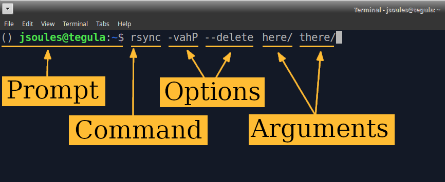

# Sciware

## Command line and Shell interaction

https://sciware.flatironinstitute.org/27_SummerIntro

https://github.com/flatironinstitute/learn-sciware-dev/tree/main/27_SummerIntro


## Rules of Engagement

### Goal:

Activities where participants all actively work to foster an environment which encourages participation across experience levels, coding language fluency, *technology choices*\*, and scientific disciplines.

<small>\*though sometimes we try to expand your options</small>


## Rules of Engagement

- Avoid discussions between a few people on a narrow topic
- Provide time for people who haven't spoken to speak/ask questions
- Provide time for experts to share wisdom and discuss
- Work together to make discussions accessible to novices

<small>
(These will always be a work in progress and will be updated, clarified, or expanded as needed.)
</small>


## Today's Agenda

- Pre-session: setup a terminal (15 min)
- Command-line intro (45 min, with terminal)
- Cluster intro (30 min)
- VS code intro, terminal (10 min)

- Homework for next time: create a github account


## Preparation Instructions
*Instructions to get your laptop set up before the session*

- Windows
   - See next slide
- Mac
  - Install xcode: open a terminal and run `xcode-select --install` (10 min)
  - Install VS Code: https://code.visualstudio.com/docs/setup/mac
- Linux
   - Install VS Code: https://code.visualstudio.com/docs/setup/linux


## Windows Instructions
- Follow the three steps at this link to install WSL, VS Code, and the WSL extension for VS Code: https://code.visualstudio.com/docs/remote/wsl#_installation
- Check if your installation worked: follow these instructions to open VS Code and connect to WSL: https://code.visualstudio.com/docs/remote/wsl#_open-a-remote-folder-or-workspace
- If you see "WSL" in the bottom left of your VS Code window, your installation is working


# Background

## Definitions

* Terminal
* Shell
* Command Line
* Programs


### Command Line

- "CLI" = _command line interface_
   - Compare to GUI = _graphical user interface_
- In a terminal, you run a shell
- With the shell, you run programs
- Shell may be on another (remote) computer (e.g., ssh)


### Shell Command Example



Here's a typical shell command, with three parts:

- A **prompt** provided by the shell
- A **command**, the other program I want to run
- The **options** or **flags** that control behavior, usually starting with `-`
- The **arguments**, additional words that will be passed in to the command


## Working directory

A shell or program always has a "current working directory": the directory (or folder) that's used by default
- `pwd` shows you the current directory ("print working directory")
- `cd` changes the current directory, by default to your "home" directory (`~`)

```
> pwd
/home/you/dir
> cd
> pwd
/home/you
```


## git

- `ls` lists the files and directories (...in a specific directory, or your current by default)

```
> ls
Desktop
> git clone https://github.com/flatironinstitute/sciware-command-intro
Cloning into 'sciware-command-intro'...
> ls
Desktop  sciware-command-intro
> cd sciware-command-intro
> pwd
/home/you/sciware-command-intro
```


### Interactive navigation

```
ls
cat README
less README
mv
cp
rm
mkdir
rmdir
ls -la
git --help
```

history, scroll, up, down
tab completion

```
exit
touch
python
1+1
^D
```


### Shells and configuration

- bash: .bashrc
- zsh: .zshrc


## VS code

Interactive demo
* look at a couple files
* correspond to command line
* terminal


## Homework

* create github account
