# Sciware

## Intro to GitHub

https://sciware.flatironinstitute.org/27_SummerIntro

## Sciware goal

Activities where participants all actively work to foster an environment which encourages participation across experience levels, coding language fluency, *technology choices*\*, and scientific disciplines.

<small>\*though sometimes we try to expand your options</small>

## Sciware website

Previous sciwares available here
https://sciware.flatironinstitute.org

Password for videos is...

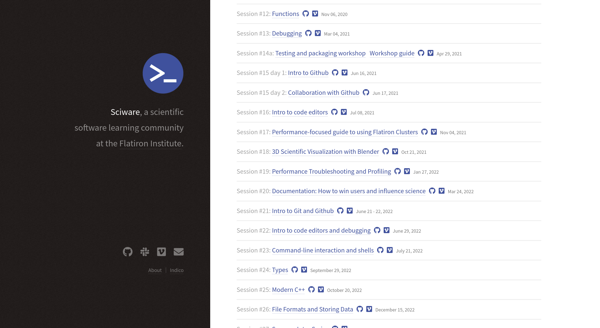

## Sciware slack, contact

#sciware on simonsfoundation.slack.com (use flatiron email)

Computational help: scicomp@flatironinstitute.org

## Summer Intros

- May 31 2-4: command line & cluster
- Jun 7 2-4 in 162-2 IDA: git & GitHub, Part I
- today 2-4 in 162-2 IDA: git & GitHub, Part II
- Jun 21 **1-3** in 162-2 IDA: VS Code

## Today's Agenda

### Collaborating on GitHub

- Forking
- Pull Requests
- Reviewing

## Collaborating with others

- We need something more than a single repo, if we want to...
   - make changes _separately_ from a main project
   - take an existing project in a _new_ direction
   - make and track changes to repositories we don't have permissions to push to

## Forking Workflow

1. Fork the repository on github
2. Clone your new fork from github to local
2. Make changes to the code
2. Push to your fork
3. Open a Pull Request (PR) from your fork to the upstream repo
3. Wait for upstream to approve and merge your changes
4. Keep your fork up to date

## Step 0: A clean start

<ul>
<li>If you already have a copy of this repo from the last workshop, navigate to the directory above it and rename it.</li>
<li>Normally you'd re-use this repository, but just to make sure everyone's on the same page...</li>
</ul>

<pre  style="font-size:1em;"><code data-trim data-noescape>
&gt; mv sciware27-git-intro/ sciware27-git-intro-day1/
</pre>

## Step 1: Fork

## Step 1: Fork

First we need to fork the repo
https://github.com/flatironinstitute/sciware27-git-intro
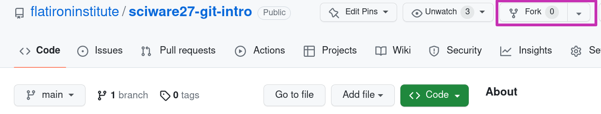

## Step 2: Clone

## Step 2: Clone

Next, we clone <em>our</em> fork of the repo:

<pre style="font-size:1em;"><code data-trim data-noescape>
&gt; git clone git@github.com:your_user_name/sciware27-git-intro.git
</code></pre>

## Step 3: Add Your Code

- Add a file in the `student_info/` directory called `firstName_lastName.csv` with the following info:
   - Your full name
   - Your center
   - Your research focus
   - A fun fact

<pre  style="font-size:01em;"><code data-trim data-noescape>
&gt; cd student_info/
&gt; nano
</code></pre>

## Step 3: Add Your Code

Example contents of `robert_blackwell.csv`:

<pre  style="font-size:0.75em;">
    <code data-trim data-noescape class="language-plaintext">
Name,Center,Research Focus,Fun Fact
Robert Blackwell,SCC,high performance computing,violin!
    </code>
</pre>

Save the file.

## Step 4: Push to Your Fork

## Step 4: Push to Your Fork

- Add the file
- Commit the file
- Push the commit to your fork

<pre  style="font-size:1em;">
    <code data-trim data-noescape>
&gt; git status
    </code>
    <code data-trim data-noescape>
&gt; git add student_info/robert_blackwell.csv
&gt; git commit -m "Adding info for Robert Blacwell"
    </code>
    <code data-trim data-noescape>
&gt; git push origin main
    </code>
</pre>

# Survey

## http://bit.ly/sciware-github2-2023

## Step 5: Open a Pull Request

## Step 5: Open a Pull Request

- Using your browser, navigate to your forked repository
- It should look something like this:

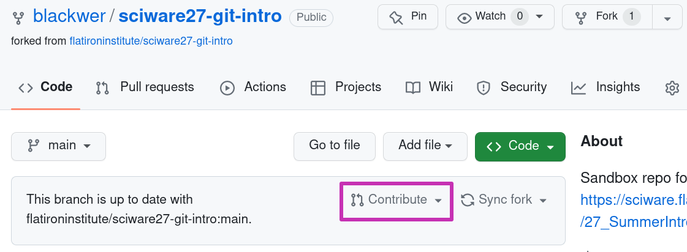

- Click on the `Contribute` button

## Step 5: Open a Pull Request

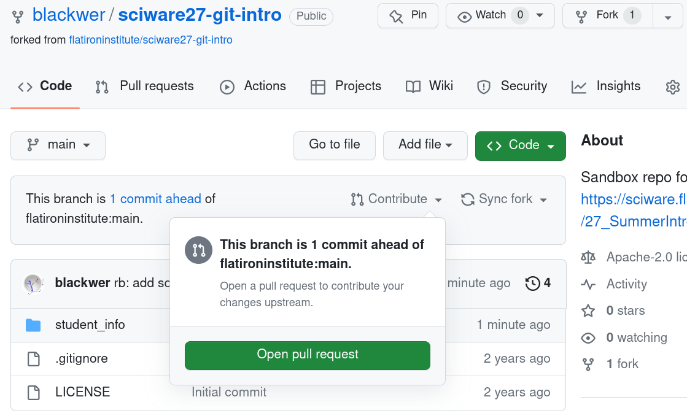

- Click on the `Open pull request` button

## Step 5: Open a Pull Request

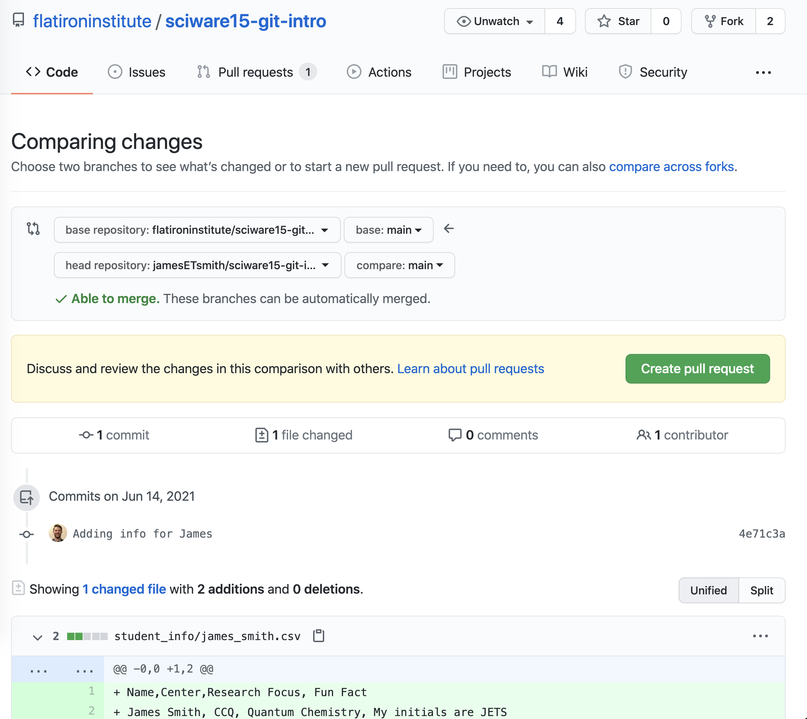

## PR Case Study

Here's an example of a PR _without_ a helpful description:

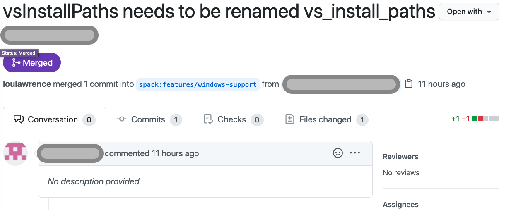

## PR Case Study

Here's an example of a [PR](https://github.com/scikit-learn/scikit-learn/pull/20251) _with_ a helpful description:

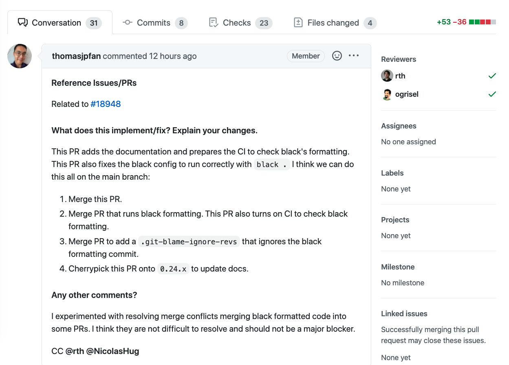

## Step 5: Open a Pull Request

Things to think about when making pull requests (PR):

<ul>
   <li>PRs are a way for someone else to review your changes before they are merged into the "upstream" version.</li>
   <li>PRs usually contain many commits.</li>
   <li>The first comment in the PR should be more narrative than the commit messages and should describe <b><em>why</em></b> you're making the PR and summarize the changes you made.</li>
   <li>PRs are a valuable record, similar to a lab notebook.</li>
</ul>

## Reviewing a Pull Request

As other students make PRs, go to the pull requests tab on GitHub.

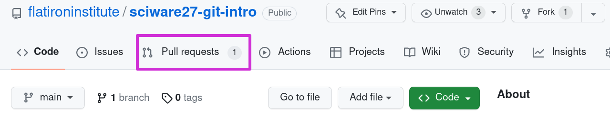

## Reviewing a Pull Request

Choose another student's PR and click on it.

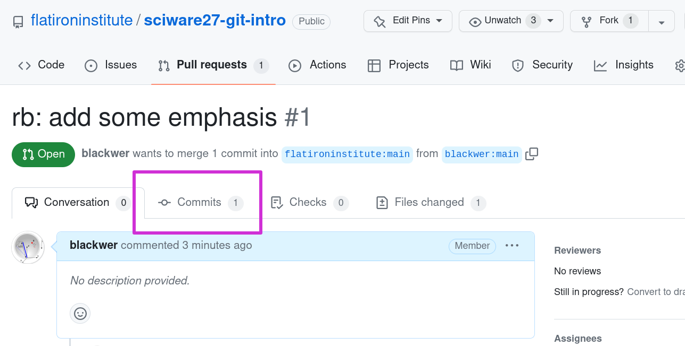

Click on the commit to see the diff of their changes and hover over a line until you see the `+` symbol.

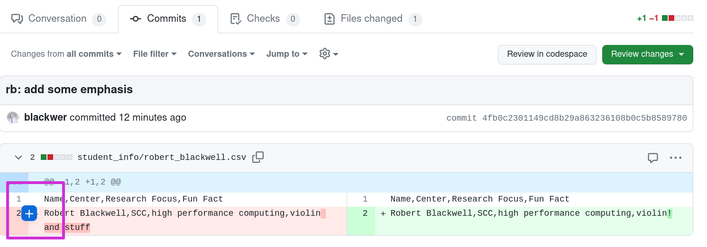

## Step 7: Pull Other's Changes

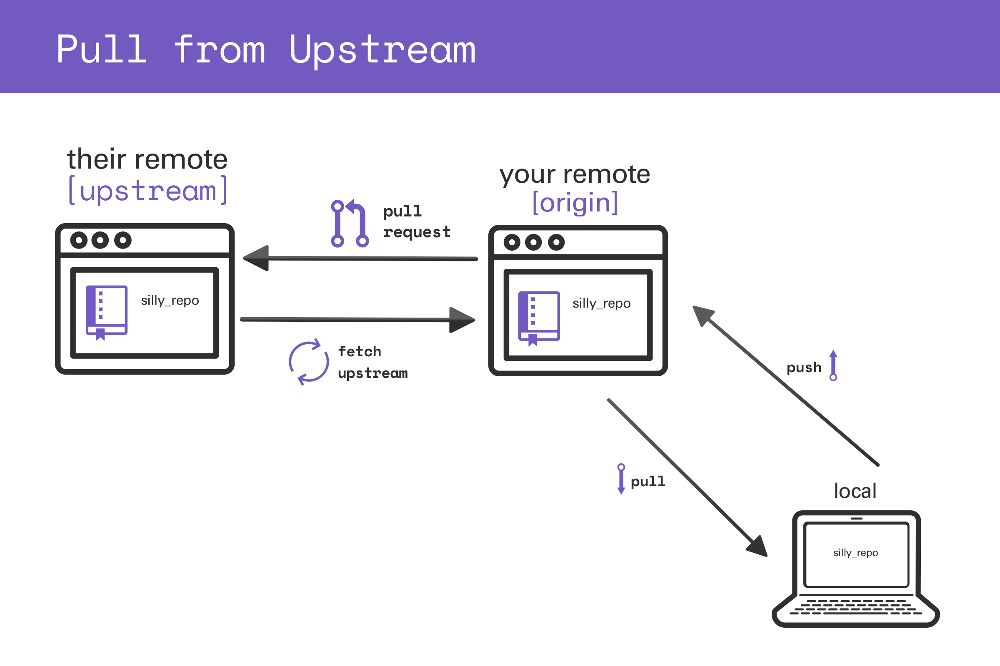

## Step 7: Pull Other's Changes

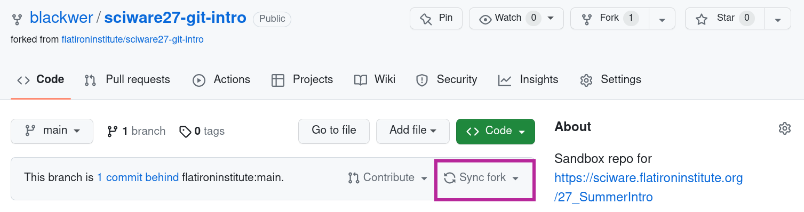

## Step 7: Pull Other's Changes

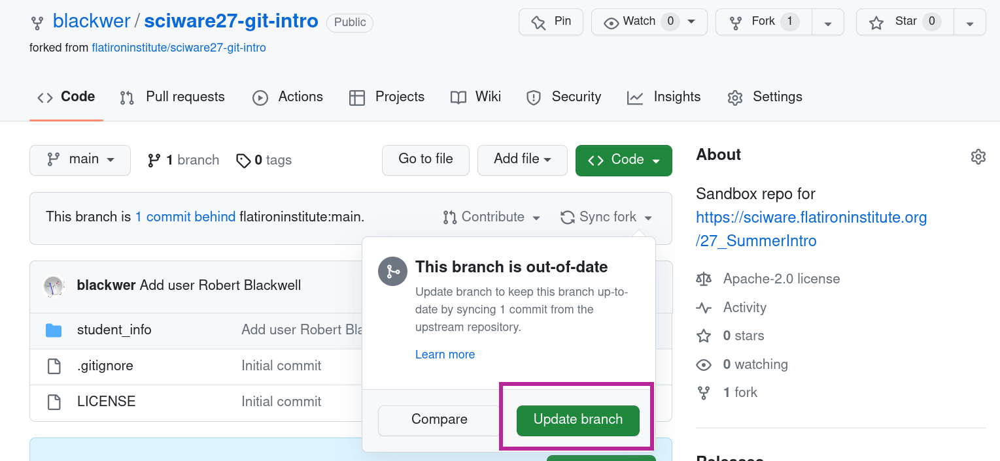

<pre class="fragment" style="font-size:1em;">
    <code data-trim data-noescape data-line-numbers="1,4,5,10">
    &gt; git pull origin main
    </code>
</pre>

## Extra Resources

Check out and bookmark these tutorials for more information about git and the forking workflow:

- [Bitbucket: Making a Pull Request](https://www.atlassian.com/git/tutorials/making-a-pull-request)
- [CodeRefinery: Distributed version control and forking workflow](https://coderefinery.github.io/git-collaborative/03-distributed/)

# Survey

## http://bit.ly/sciware-github2-2023
