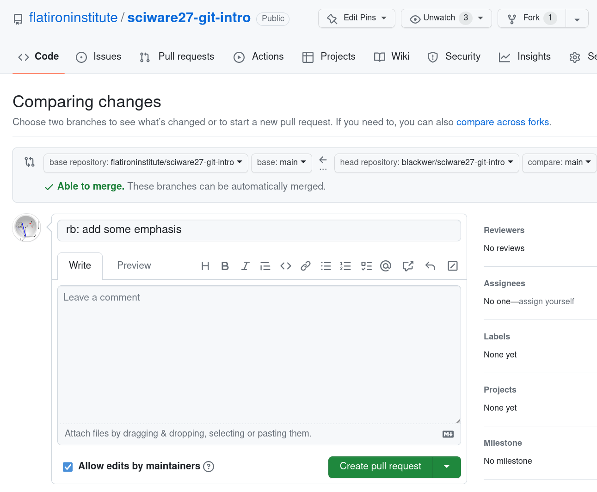

# Sciware

## Intro to GitHub

https://sciware.flatironinstitute.org/27_SummerIntro

## Sciware goal

Activities where participants all actively work to foster an environment which encourages participation across experience levels, coding language fluency, *technology choices*\*, and scientific disciplines.

<small>\*though sometimes we try to expand your options</small>

## Summer Intros

- May 31 2-4: command line & cluster
- Jun 7 2-4 in 162-2 IDA: git & GitHub, Part I
- today 2-4 in 162-2 IDA: git & GitHub, Part II
- Jun 21 **1-3** in 162-2 IDA: VS Code

## Today's Agenda

### Collaborating on GitHub

- Forking
- Pull Requests
- Reviewing

## Step 0: A clean start

<ul>
<li>If you already have a copy of this repo from the last workshop, navigate to the directory above it and rename it.</li>
<li>Normally you'd re-use this repository, but just to make sure everyone's on the same page...</li>
</ul>

<pre  style="font-size:0.75em;">> mv sciware27-git-intro/ sciware27-git-intro-day1/
</pre>

## Collaborating with others

- We need something more than a single repo, if we want to...
   - make changes _separately_ from a main project
   - take an existing project in a _new_ direction
   - make and track changes to repositories we don't have permissions to push to

## Forking to the Rescue

## Forking Workflow

1. Fork and clone the project
2. Add the code and push to your fork
3. Merge code into the main project
4. Keep your fork up to date

## Step 1: Fork and Clone

## Step 1: Fork and Clone

    First we need to fork the repo
    https://github.com/flatironinstitute/sciware27-git-intro
    

    Next, we clone <em>our</em> fork of the repo:
    <pre  style="font-size:0.75em;">
        <code data-trim data-noescape class="language-zsh">
        ➜ git clone git@github.com:your_user_name/sciware27-git-intro.git
        </code>
    </pre>

## Step 2a: Add Your Code

- Add a file in `student_info` called `firstName_lastName.csv` with the following info:
   - Your full name
   - Your center
   - Your research focus
   - A fun fact

## Step 2a: Add Your Code

For example:

<pre  style="font-size:0.75em;">
    <code data-trim data-noescape class="language-plaintext">
Name,Center,Research Focus,Fun Fact
James Smith,CCQ,Quantum Chemistry,My initials are JETS
    </code>
</pre>

## Step 2b: Push to Your Fork

## Step 2b: Push to Your Fork

- Run `git add` on your file
- Commit it
- Push to your fork

For example:

<pre  style="font-size:0.75em;">
    <code data-trim data-noescape class="language-zsh">
➜ git status
...
➜ git add student_info/james_smith.csv
➜ git commit -m "Adding info for James Smith"
...
➜ git push origin main
    </code>
</pre>

## Step 3: Open a Pull Request

## Step 3: Open a Pull Request

- Using your browser, navigate to your forked repository
- It should look something like this:

- Click on the `Contribute` button

## Step 3: Open a Pull Request

- Click on the `Open pull request` button

## Step 3: Open a Pull Request

## Step 3: Open a Pull Request

Things to think about when making pull requests (PR):

<ul>
<li>Many projects have PR templates with information you need to fill out, <b><em>use them</em></b>!</li>
<li>Include <b><em>why</em></b> you're making the PR, what steps you took, and how it addresses a current problem.</li>
<li>Bug reports should <b><em>always</em></b> include a minimum working example.</li>
<li>PRs (and Issues) are a valuable <b><em>public</em></b> record, just like StackOverflow.</li>
</ul>

## Reviewing a Pull Request

As other students make PRs, go to the pull requests tab on GitHub.

## Reviewing a Pull Request

Choose another student's PR and click on it.

Click on the commit to see the diff of their changes and hover over a line until you see the `+` sybmol.

## PR Case Study

Here's an example of a PR _without_ a helpful description:

## PR Case Study

Here's an example of a [PR](https://github.com/scikit-learn/scikit-learn/pull/20251) _with_ a helpful description:

# Survey

## http://bit.ly/sciware-github2-2022

## Step 4: Pull Other's Changes

## Step 4: Pull Other's Changes

<pre class="fragment" style="font-size:0.75em;">
    <code data-trim data-noescape class="language-zsh" data-line-numbers="1,4,5,10">
    ➜ git pull origin main
    </code>
</pre>

## Extra Resources

Check out and bookmark these tutorials for more information about git and the forking workflow:

- [Bitbucket: Making a Pull Request](https://www.atlassian.com/git/tutorials/making-a-pull-request)
- [CodeRefinery: Distributed version control and forking workflow](https://coderefinery.github.io/git-collaborative/03-distributed/)

# Survey

## http://bit.ly/sciware-github2-2022
