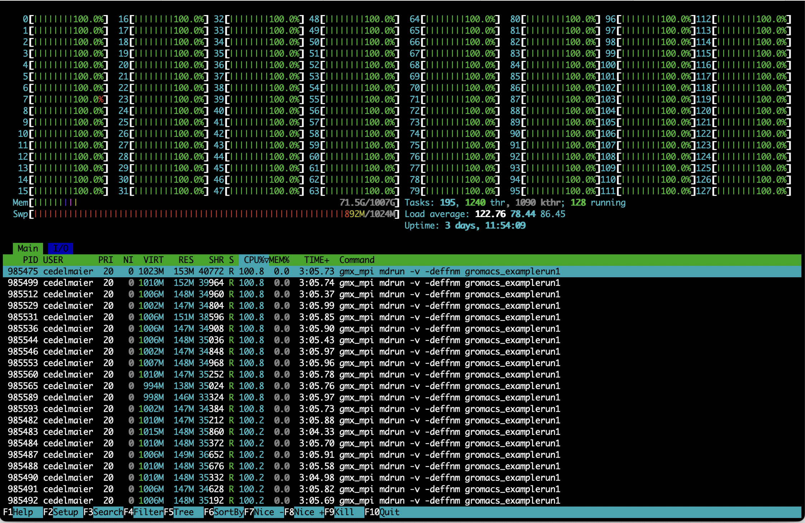
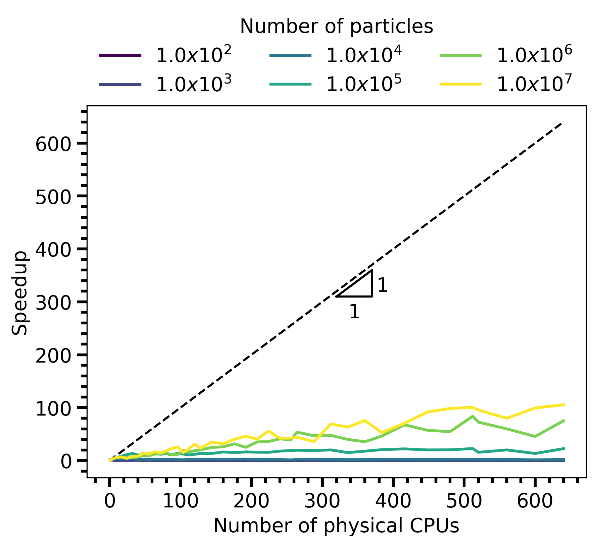
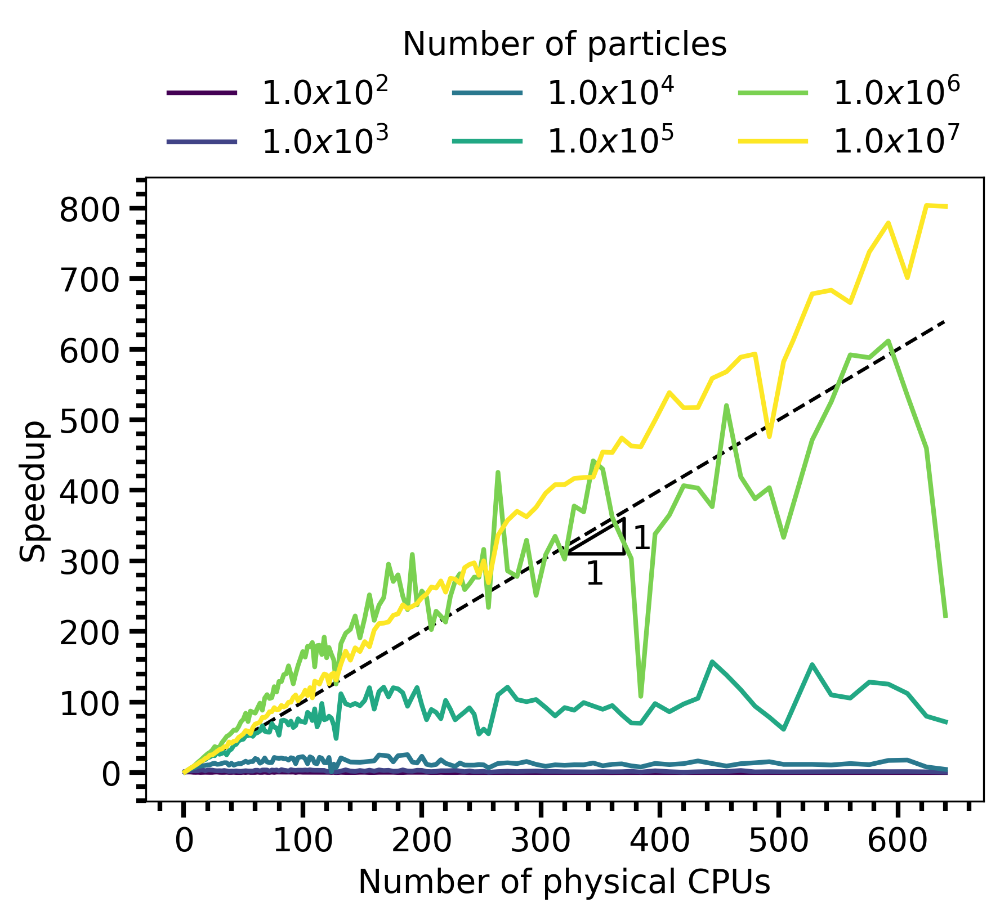
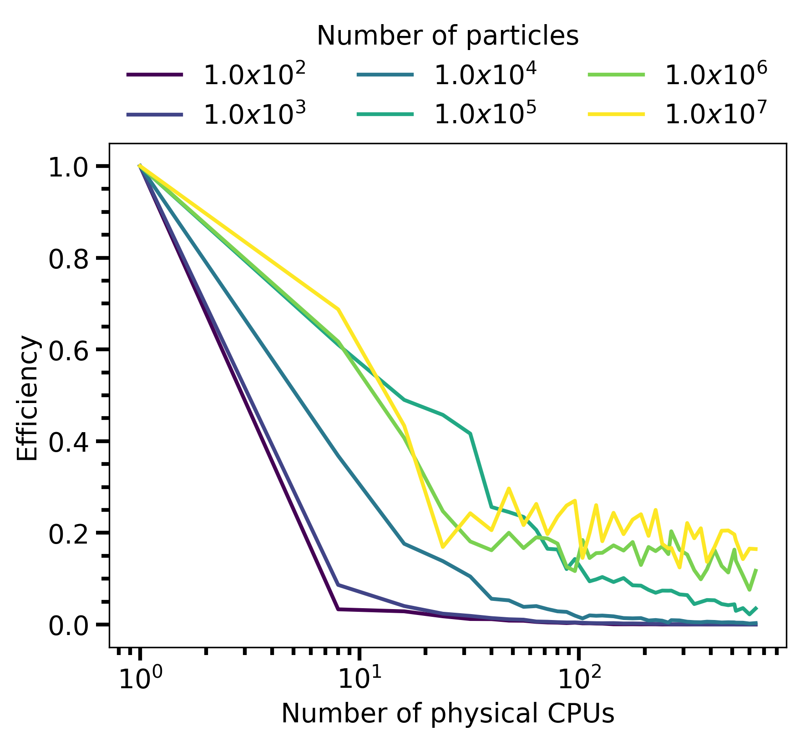
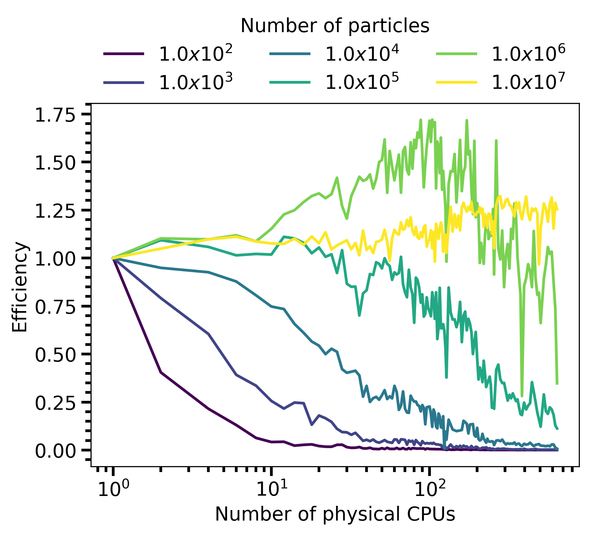

# Sciware

## The many faces of parallelism
### Running parallel codes on the cluster

https://sciware.flatironinstitute.org/28_CCB

https://github.com/flatironinstitute/sciware/tree/main/28_CCB


## Rules of Engagement

### Goal:

Activities where participants all actively work to foster an environment which encourages participation across experience levels, coding language fluency, *technology choices*\*, and scientific disciplines.

<small>\*though sometimes we try to expand your options</small>


## Rules of Engagement

- Avoid discussions between a few people on a narrow topic
- Provide time for people who haven't spoken to speak/ask questions
- Provide time for experts to share wisdom and discuss
- Work together to make discussions accessible to novices

<small>
(These will always be a work in progress and will be updated, clarified, or expanded as needed.)
</small>


## Zoom Specific

- Dedicated Zoom moderator to field questions.
- Please stay muted if not speaking. (Host may mute you.)
- We are recording. Link will be posted to [https://sciware.flatironinstitute.org/](https://sciware.flatironinstitute.org/)


## Future Sessions

- Suggest topics or contribute to content in #sciware Slack


## Today's Agenda


# Performance on HPC clusters
- We want our code to be as performant as possible!
- How do we do this in an HPC/cluster environment?
- "Premature optimization is the root of all evil" -- Donald Knuth


## Problem statement

We have highly parallelized code \<foo\> and want to get the "best" performance out of it that we can.

- Need to define
  - "Time"
  - "Performant"
  - <h4 style="color:rgb(255,0,0)">"Efficiency"</h4>


## Some software in CCB

- GROMACS
- aLENS
- Dedalus

Add logos to this slide!


## A brief introduction to cluster computing (at FI)
<small>
(Although much of this information will work at other clusters)
</small>

- How do you share a set of computational resources among cycle-hungry scientists?
  - With a job scheduler! Also known as a queue system.
- Flatiron uses [Slurm](https://slurm.schedmd.com) to schedule jobs


## SLURM preamble

```bash
#!/bin/bash
#SBATCH --nodes=2
#SBATCH --ntasks-per-node=8
#SBATCH --cpus-per-task=16
#SBATCH --constraint=rome,ib
#SBATCH --partition=ccb
#SBATCH --time=00:10:00
#SBATCH --job-name=mpi_omp_example1
#SBATCH --output=mpi_omp_example1.log
```

<small>
Replace ccb with your center partition!
</small>


## SLURM modules

```bash
# Set up our environment for this SLURM submission
module -q purge
module -q load openmpi
module list

# Helper functions to see what kind of system we are running on, if we have GPUs that are accessible, and other information
lscpu
nvidia-smi
numactl -H
```


## SLURM program execution

```bash
# Print some helpful information
echo "Slurm nodes:              ${SLURM_NNODES}"
echo "Slurm ntasks:             ${SLURM_NTASKS}"
echo "Slurm ntasks-per-node:    ${SLURM_NTASKS_PER_NODE}"
echo "Slurm cpus-per-task:      ${SLURM_CPUS_PER_TASK}"

# Run the program
OMP_NUM_THREADS=${SLURM_CPUS_PER_TASK} mpirun -np ${SLURM_NTASKS} --report-bindings \
  mpi_omp_mockup
```


## Running a simple MPI/OpenMP executable on the cluster

\<foo\> = mpi\_omp\_mockup

```bash
> cd mpi_omp_mockup/
> sbatch run_slurm_example1.sh
```

What do you see for the output of the log file?

<small>
If you want to compile mpi_omp_mockup.cpp, feel free to do so with MPI and OpenMP and the provided Makefile
</small>


## Tips and tricks SLURM

```bash
> squeue --me
             JOBID PARTITION     NAME     USER ST       TIME  NODES NODELIST(REASON)
           2669303       ccb gromacs_ cedelmai  R       0:13      2 worker[5020,5088]
```


## Understanding performance metrics

### Time exists so everything doesn't happen all at once!

- "Wall time" = time
- "CPU time" = cpu cores * time
  - Multiple threads
  - 1 core for 1 second + 8 cores for 5 seconds + 1 core for 2 seconds = 43 cpu seconds, 8 wall seconds


## Measuring performance: *date*

```bash
# Capture the time
start_time=$(date +%s)

OMP_NUM_THREADS=${SLURM_CPUS_PER_TASK} mpirun -np ${SLURM_NTASKS} --report-bindings \
  mpi_omp_mockup

# Report the time
end_time=$(date +%s)
elapsed_time=$((end_time - start_time))
echo "Elapsed time: $elapsed_time seconds"
```

Execute in the same directory as before (mpi_omp_mockup)
```bash
> sbatch run_slurm_example2.sh
```


## Measuring performance: *seff*

Getting previous job information from the cluster (need JobID, get via sacct)

```bash
> sacct
JobID           JobName  Partition    Account  AllocCPUS      State ExitCode 
------------ ---------- ---------- ---------- ---------- ---------- -------- 
2640715      mpi_omp_e+        ccb        ccb        256  COMPLETED      0:0 
2640715.bat+      batch                   ccb        128  COMPLETED      0:0 
2640715.ext+     extern                   ccb        256  COMPLETED      0:0 
2640715.0         orted                   ccb        128  COMPLETED      0:0
```


## Measuring performance: *seff*

Getting previous job information from the cluster (once we have JobID)

```bash
> seff 2640715
Job ID: 2640715
Cluster: slurm
User/Group: cedelmaier/cedelmaier
State: COMPLETED (exit code 0)
Nodes: 2
Cores per node: 128
CPU Utilized: 00:00:19
CPU Efficiency: 0.93% of 00:34:08 core-walltime
Job Wall-clock time: 00:00:08
Memory Utilized: 5.80 MB
Memory Efficiency: 0.00% of 0.00 MB
```


## GROMACS

Chris: Can I embed a video here, or just a still image?


## Running GROMACS

```bash
> cd gromacs/
> sbatch run_gromacs_example1.sh
> squeue --me
             JOBID PARTITION     NAME     USER ST       TIME  NODES NODELIST(REASON)
           2669305       ccb slurm_gr cedelmai  R       2:05      2 worker[5086-5087]
> ssh worker5086
> htop
```


## Measuring GROMACS performance: *htop*




## Measuring GROMACS performance: *seff*

```bash
> seff 2669305
Job ID: 2669305
Cluster: slurm
User/Group: cedelmaier/cedelmaier
State: COMPLETED (exit code 0)
Nodes: 2
Cores per node: 128
CPU Utilized: 19:04:53
CPU Efficiency: 91.27% of 20:54:24 core-walltime
Job Wall-clock time: 00:04:54
Memory Utilized: 18.64 GB
Memory Efficiency: 0.00% of 0.00 MB
```


## Tasks vs. Threading

### MPI vs. OpenMP

- MPI tasks across nodes (distributed memory)
- OpenMP threads within a node (shared memory)

```bash
...
#SBATCH --nodes=2
#SBATCH --cpus-per-task=2
...
export OMP_NUM_THREADS=$SLURM_CPUS_PER_TASK
...
mpirun --map-by socket:pe=$OMP_NUM_THREADS -np 120 --report-bindings \
  gmx_mpi mdrun -v -deffnm gromacs_examplerun2
```

On a single node can trade MPI tasks for OpenMP threads with different performance results!


## Good practices: code performance

- Diagnose problems with *seff* and *htop*
- To optimally/efficiently run code, need to turn to **benchmarking**


## Benchmarking

- Thanks to G&eacute;raud Krawezik
  - A 15 minute benchmark can help your week-long computation get you more results
- [Previous Sciware](https://sciware.flatironinstitute.org/17_FICluster/slides.html)


## When to benchmark?

- Once your code runs small samples (aka: it works!)
- Before you type `sbatch --time=LOTS`
- For new projects
- For known projects: batch scripts are not "one size fits all"
  - Especially if your scripts come from another HPC center
  - Even locally we have very diverse machines!
  - Drastically new inputs can require new benchmarks
  - New software versions can mean new configuration


## What to benchmark?

- Find something that can:
  - Represent your whole run in a short period of time
  - eg: a couple of iterations instead of 1000s of them
  - Use a production run configuration
- Start small, but be wary of "toy benchmarks":


## How to benchmark?

- Domain-specific benchmarking tools
  - [MDBenchmark](https://mdbenchmark.readthedocs.io/) for Molecular Dynamic simulations
- Generic frameworks
  - [JUBE](https://www.fz-juelich.de/ias/jsc/EN/Expertise/Support/Software/JUBE/jube.html)
- These environments will let you:
  - Explore a space of different parameters
  - Easily read/format/export results
  - Produce scaling results for articles


## Speedup (1)

- Simulation has some (amount of data) / (amount of time it took to collect)
  - 1 CPU/core took T1 amount of time to run
  - p CPU/core took Tp amount of time to run
- Speedup can be defined as Sp = Tp/T1
- Thanks to Bryce Palmer for the following data


## Speedup (2)

<div style="display: flex; justify-content: space-between;">
  <div style="flex: 1; text-align: center; margin-right: 10px;">
    <h3>Old code</h3>
    
  </div>
  <div style="flex: 1; text-align: center; margin-left: 10px;">
    <h3>New code</h3>
    
  </div>
</div>


## Efficiency (1)

- Speedup isn't the whole story, we also need to know how *efficient* our code is.
  - Good efficiency: Use 2x the computing power to get a Speedup of 2x
  - Bad efficiency: Use 2x the computing power to get a Speedup of 1.1x
- Efficiency can be defined as Ep = Sp/p


## Efficiency (2)

<div style="display: flex; justify-content: space-between;">
  <div style="flex: 1; text-align: center; margin-right: 10px;">
    <h3>Old code</h3>
    
  </div>
  <div style="flex: 1; text-align: center; margin-left: 10px;">
    <h3>New code</h3>
    
  </div>
</div>


## Using JUBE: Example


[Jube Webpage](https://apps.fz-juelich.de/jsc/jube/jube2/docu/index.html)

```bash
> module load python/3.10.10
> python3 -m venv --system-site-packages ~/envs/jube
> source ~/envs/jubs/bin/activate
> pip3 install http://apps.fz-juelich.de/jsc/jube/jube2/download.php?version=latest --user
> jube --version
```


## Using JUBE: Running

```bash
> cd jube_gromacs
> jube run gromacs_jube_example.yaml
######################################################################
# benchmark: gromacs_jube_example
# id: 0
#
# GROMACS on CPU
######################################################################

Running workpackages (#=done, 0=wait, E=error):
####################0000000000000000000000000000000000000000 (  2/  6)

  | stepname | all | open | wait | error | done |
  |----------|-----|------|------|-------|------|
  |   submit |   6 |    0 |    4 |     0 |    2 |

...
> jube analyse gromacs_jube_example_rome_cpu --id 0
```


## Using JUBE: Results

```bash
jube result gromacs_jube_example_rome_cpu --id 0
tpr_filename,nodes,ranks_per_node,threads_per_rank,ns_per_day,ns_per_day_per_core
gromacs_examplerun,1,120,1,37.601,0.3133416666666667
gromacs_examplerun,1,60,2,38.102,0.3175166666666666
gromacs_examplerun,1,30,4,36.049,0.30040833333333333
gromacs_examplerun,2,120,1,67.188,0.27995000000000003
gromacs_examplerun,2,60,2,71.59,0.2982916666666667
gromacs_examplerun,2,30,4,69.753,0.2906375
```


# Ways to access and transfer data
- Globus
- Globus public download portal
- SSHFS
- JupyterHub
- [Other options on wiki...](https://wiki.flatironinstitute.org/SCC/DataSharing)


# Globus


# SSHFS and FUSE
- SSH FileSystem (SSHFS): Is a convenient way to access files on the cluster as if they're on your local machine. 

- Filesystem in USErspace (FUSE): Needed by SSHFS to 'mount' a filesystem. 

https://wiki.flatironinstitute.org/SCC.Playbooks/SshFsMount


## What can SSHFS do?

- Access files on the cluster as if they're on your local machine
- Transfer files between your local machine and the cluster


## Things to know 
- It is very sensitive to latency, so depending on your connection, may sometimes be slow.
- Folders mounted on the cluster, e.g, a zip archive mounted using `fusermount`, may not show up in directory.
- Used primarly to interact with files using GUI and visual tools.


## Setting up FUSE for cluster
- Install FUSE and SSHFS (may already be installed on linux, or should be in your package manager; on OSX download them [here](https://www.fuse-t.org)).
- Make sure you can `ssh rusty` (from inside the FI network) or `ssh gateway` (from outside), following the [RemoteConnect](https://wiki.flatironinstitute.org/SCC/RemoteConnect) instructions if necessary.
- Choose which cluster directory you want to mount, such as `/mnt/home/USERNAME` or `/mnt/ceph/users/USERNAME`, and create directories on your local computers to mount to. 


It often makes things more convenient to use paths matching the cluster. If you wish to do this, then type the following command
```bash
mkdir -p ~/mnt/home/USERNAME ~/mnt/ceph/users/USERNAME
```


- Mount directory you want from the server, e.g.:
```bash
sshfs rusty:/mnt/home/USERNAME ~/mnt/home/USERNAME 
```

## Example
```bash
> cd ~/mnt/home/alamson/
> ls
> sshfs rusty:/mnt/home/alamson/ ~/mnt/home/alamson/
> ls
10-powerline-symbols.conf ceph                      requirements.txt
Chi                       intel                     test_local
Desktop                   libyaml-cpp.a             test_projects
Downloads                 local                     
bash_profile              projects
bashrc                    public_www
```

## Tips and Tricks
- Create aliases for common mount points in your `.bashrc` or `.bash_profile` files, e.g.:
```bash
alias mount_home='sshfs flatiron:/mnt/home/USERNAME /mnt/home/USERNAME'
```
