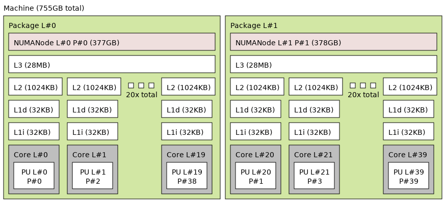
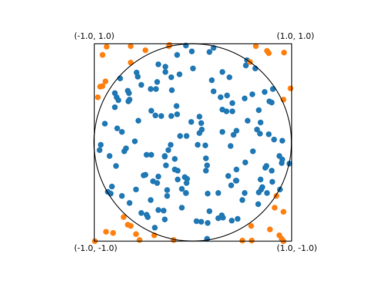

# Sciware

https://sciware.flatironinstitute.org/32_IntroToHPC

https://github.com/flatironinstitute/sciware/tree/main/32_IntroToHPC


## Rules of Engagement

### Goal:

Activities where participants all actively work to foster an environment which encourages participation across experience levels, coding language fluency, *technology choices*\*, and scientific disciplines.

<small>\*though sometimes we try to expand your options</small>


## Rules of Engagement

- Avoid discussions between a few people on a narrow topic
- Provide time for people who haven't spoken to speak/ask questions
- Provide time for experts to share wisdom and discuss
- Work together to make discussions accessible to novices

<small>
(These will always be a work in progress and will be updated, clarified, or expanded as needed.)
</small>


## Center-hosted Sciware

- Sciware will rotate between centers each month
   - focus on topics of interest to centers
   - include voices from all centers
   - each center will host twice a year
   - open to all
- Suggest topics or contribute to content in #sciware Slack
- We are recording. Link will be posted to [https://sciware.flatironinstitute.org/](https://sciware.flatironinstitute.org/)


## Today's Agenda
- Supercomputing components and terminology
- Flatiron resources overview
- Environment management [interactive]
- Running your jobs [interactive]


## Supercomputing terminology


### Compute nodes
- What most people would call a computer, but...
  - Typically headless -- no display
  - Accessed/controlled via network -- often programatically
  - Often multiple network "interfaces" -- more later
  - Designed for high _throughput_ computation


### Compute node architecture
- Typically large amounts of RAM (random access memory)
  - temporary storage used during computation for data and program instructions
- One or more "multi-core" CPUs (central processing units)
  - CPU Core -- a single physical CPU on a multi-core CPU
  - Cores have their own _cache_ but also share _cache_ directly with other cores
  - Cores typically slower than laptop/workstation cores, but more of them and more cache/RAM
- One or more network cards (more later!)


### Compute node architecture -- `lstopo`
- Cores also sometimes have extra groupings in "NUMA" (non-uniform memory architecture) domains
  - beyond scope today, but good to know
  - Specifies what hardware has direct access to what memory
- `lstopo --no-io` on FI 'skylake' node
<center>
    
</center>


### GPU node architecture
- GPU nodes have all the stuff a CPU node has, plus...
- Some GPUs - graphics processing units
  - Misnomer/legacy name, used to "offload" general computation
    - AKA accelerator/TPU/etc
  - Great for large dense linear algebra problems
  - Or... tons of small problems in parallel


### Network/fabric
- Network/fabric - the means of communication between computers
  - Communication lines usually fiber/copper/wireless
  - fiber most common for _high performance_ networks
- Some rough "typical" numbers
  - WiFi -- 1ms -- \~0.1-1 Gbit/s
  - Ethernet -- 0.1ms -- \~1-40 Gbit/s
  - Infiniband -- 0.001ms -- \~100-800 Gbit/s


### Filesystems
- System that manages file organization and access
- Can be local (stored on "hard drive" like on laptop)
  - _typically_ high bandwidth/low latency
- or distributed/networked (data shared between drives/computers and accessed remotely)
  - _typically_ high bandwidth/high latency, networked
  - Tradeoffs exist and are _extremely_ important
- Ceph and GPFS are the distributed filesystems used at FI
  - Lustre also common at supercomputing centers


## Flatiron resources overview


### Two clusters: 'Rusty' and 'Popeye'

- Rusty on east coast, Popeye on west coast
- Completely distinct
  - Independent storage
  - Independent job management
- Both heterogenous -- multiple node types
- Details at https://wiki.flatironinstitute.org/SCC/Overview


### Rusty -- compute power

- FI's "primary" cluster
- \~100k CPU cores (\~1200 nodes)
- _Almost_ every node connected by high performance infiniband fabric
  - Dedicated (only for job traffic)
  - fiber-optic
  - Node types on different infiniband networks!
- 240 H100, 288 A100 and 98 V100 GPUs


### Popeye -- compute power

- \~41k dedicated CPU cores (\~800 nodes)
- Generally more available, but data separate from rusty
- Everything on infiniband fabric
- 128 V100 GPUs


### Rusty/popeye storage -- home

- Put your source code and software installs here!
- High performance GPFS filesystem
- Mind your quota! You can get locked out of the cluster!
  - \~1 million files
  - \~1 TiB limit
- `module load fi-utils && fi-quota`


### Rusty/popeye storage -- ceph

- rusty: located at `/mnt/ceph/$USER` or via symlink at `~/ceph`
- popeye: located at `/mnt/sdceph/$USER` or via symlink at `~/ceph`
- Always put your data/large files here!
- \~45 PiB (rusty) and \~15 PiB (popeye)
- High bandwidth, high latency (\~1.5GiB/s parallel reads)
- Highly redundant, but not backed up


## Environment management


## What you'll need

- Remote access to the cluster via terminal
  - on 'FI' wifi network: `ssh username@rusty`
  - or... `ssh -p 61022 username@gateway.flatironinstitute.org`, `ssh rusty`
  - or... `https://jupyter.flatironinstitute.org`
- Way to edit files on cluster
  - terminal `emacs/vi/nano/ed`
  - or... remote edit via `vscode/emacs/vi/sshfs`
  - or... `https://jupyter.flatironinstitute.org`


## Building/running software
- Demonstrates: `module avail`, `module load`, `PATH`, `fi-create-module`, `icp[cx]`+`libstdc++` issues
- `git clone https://github.com/flatironinstitute/sciware_awful_cp`
- `cd sciware_awful_cp`


## Let's make a python project

- create new project directory
- `ml python ; python -m venv venv --system-site-packages ; source venv/bin/activate`
- create `setup_env` script that loads clean environment


## Please never do this

- Calculate π by throwing darts "_Monte Carlo Sampling_"
- π ≅ 4 N<sub>in</sub> / N<sub>tot</sub>
- https://github.com/flatironinstitute/sciware/tree/main/32_IntroToHPC/mc_pi
<center>
    
    
</center>


## Running it on the cluster
- Demonstrates: `sbatch`, `squeue`, `sacct`

```
#!/bin/bash
#SBATCH -o pi.log  # All stdout from this script
#SBATCH -e pi.err  # All stderr from this script
#SBATCH -p genx    # genx partition (non-exclusive -- doesn't request full nodes)
#SBATCH -t 1:00    # request 1 min runtime (default 7 days, helps schedule faster)

source load_env.sh
python pi.py 100000 0
```

```
% sbatch pi.sbatch
```


## Scaling up
- We could make our code more efficient...
- But let's throw some power at it, some options are:
  - `MPI` (message passing interface) using `openmpi`
  - multiple serial jobs via `disBatch`
  - could loop through calls to python in sbatch script, but hard to balance and error prone
  - could use small jobs or job array with slurm, but this angers the compute gods


## MPI with slurm
- Demonstrates: `module spider`, `openmpi`, `mpi4py`, `mpirun`, `squeue`, `htop`, `sacct`, `seff`
- Run one π calculation per MPI "rank"
- Send all π calculations to one rank, average, and write to disk
  - Could also use `MPI_reduce`


## disBatch
- Demonstrates: `disBatch` task files, and `disBatch` repeat
- Create list of tasks, pass to disBatch
- `module load disBatch`
- sbatch <sbatch options> disBatch task_file


## SciWare Survey [TODO]
<!-- <center> -->
<!--  -->
<!-- </center> -->
