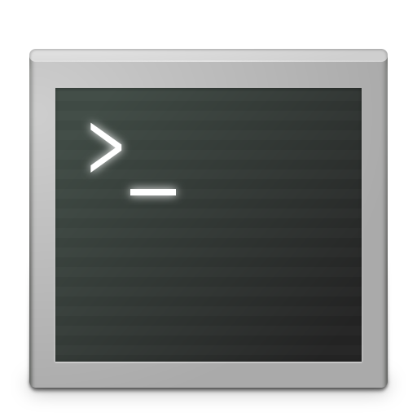
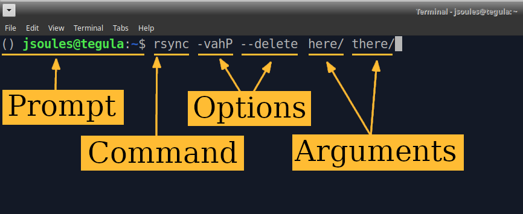

# Sciware

## Command line and Shell interaction

https://sciware.flatironinstitute.org/33_SummerIntro


## Sciware goal

Activities where participants all actively work to foster an environment which encourages participation across experience levels, coding language fluency, *technology choices*\*, and scientific disciplines.

<small>\*though sometimes we try to expand your options</small>


## Summer Intros

- today 10-12:30: command line & cluster
- Jun 12 10-12:30: VS Code
- Jun 17-18 all day: NVIDIA intro to Machine Learning
- Jun 20 10-12:30: git & Github, Part I
- Jun 27 10-12:30: git & Github, Part II


## Today's Agenda

- Pre-session: setup a terminal (15 min)
- Command-line intro (45 min, with terminal)
- Cluster intro (30 min)
- VS code setup, intro (15 min)
- Homework for next time: create a github account


## Getting help

\#code-help on SF Intern Slack


## Preparation Instructions
*Instructions to get your laptop set up before the session*

- Mac: Install xcode: open a terminal and run
   - `xcode-select --install`
- Windows
  - Install WSL: https://learn.microsoft.com/en-us/windows/wsl/install


## Getting started

Let's start a terminal!
<br>

<br>
"Terminal" (or "wsl" on Windows)


### Shell Command Example



Here's a typical shell command, separated by spaces:

- A **prompt** displayed by the shell
- A **command**, the program to run
- **options** or **flags** control behavior, starting with `-`
- **arguments**, additional words that will be passed to the command


### Command Line

- "CLI" = _command line interface_
   - Compare to GUI = _graphical user interface_
- In a terminal, you run a shell
- With the shell, you run programs
- Shell may be on another (remote) computer (e.g., ssh)


## Working directory

A shell always has a "current working directory": the directory (or folder) that's used by default
- `pwd` shows you the current directory ("print working directory")
- `cd` changes the current directory, by default to your "home" directory (`~`)

```bash
> pwd
/home/you/somewhere
> cd
> pwd
/home/you
> cd ~
> cd /home/you # same thing, for your home directory path
```


## Clone a git repo

`ls` lists the files and directories (...in a specific directory, or your current by default)

```bash
> ls
Desktop
> git clone https://github.com/flatironinstitute/sciware-command-intro
Cloning into 'sciware-command-intro'...
> ls
Desktop  sciware-command-intro
> cd sciware-command-intro
> pwd
/home/you/sciware-command-intro
```


## Advanced exercises

See `advanced/README.md`

https://wiki.flatironinstitute.org/Public/UnixIntroduction

- `cd`, `cat`, `rmdir`, history, globbing
- `awk`, `wget`, `sed`, `grep`


### Paths

- combine directories with `/` to make longer paths
- paths starting with `/` start at the "top" or *root* of the system, full *absolute* path
- others are *relative* paths, starting with current directory
- `.` means current directory
- `..` means parent directory (up one)
- if `pwd` is `/home/you`, then these are all the same:
   - `/home/you/dir/file`
   - `dir/file`
   - `./dir/file`
   - `../you/dir/../dir/file`
   - `../..///../.././home//you/dir/./file`


### Tab completion

No one wants to type all these file names: use tab!
```bash
> cd ~
> cd sciware-<tab>
> cd ~/sciware-<tab>
```

If there are multiple things, press tab twice:
```bash
> cd di<tab><tab>
```


### Looking at files

To see *inside* a file, the contents, you need something else
- `cat` just prints an entire file to the terminal
- `less` lets you scroll around (`q` to quit)
- You can also use an editor

```bash
> cat README
> less README
```


### Listing files

`ls` lists files in a directory, and has many options to show more/different information

```bash
> ls -l # long
> ls -l -t -r # long, sort by modification time, reversed
> ls -ltr # same
> ls --help # may not work on Mac
> man ls # MANual page
```


### Creating directories

Create a new directory with `mkdir`, remove with `rmdir`

```bash
> mkdir mydir
> cd mydir
> ls
> cd ..
> cd -
> pwd
> cd -
> rmdir mydir
```

`cd -` can be used to "go back" or "undo" the last `cd`


### Quoting, spaces, arguments

What if we want to make a directory `work stuff`?

```bash
> mkdir work stuff
> ls
> rmdir work stuff
> mkdir "work stuff"
> cd work<tab>
```

- The shell always splits arguments into words before the command gets it.
- To avoid this, use quotes, or `\ `, which "escapes" any character
- We usually avoid putting spaces in filenames because it's annoying (often use `_` underscores)


### More file manipulation

- `mv` renames or moves files or directories
- `rm` removes files, or `rm -r` removes directories and contents (careful!)

```bash
> cd ~/sciware-command-intro
> mv filea fileb
> mv fileb dir1
> ls dir1
> rmdir dir1
rmdir: failed to remove 'dir1': Directory not empty
> rm dir1/fileb dir1/deleteme
> rmdir dir1
> ls dir2
> rm -r dir2
```


### Hidden "dot" files

Files and directories that start with `.` don't show up by default, but you can access them as usual.

```bash
> cd notempty
> ls
> ls -a # all
> ls -la
> mv .hiddenfile nothidden
> ls
> cd ..
```


### Copying files

`cp` makes an identical copy of a file.

```bash
> cp README readnot
> cat readnot
```

To copy entire directories, use `cp -a`.


### Interactive programs

- Some programs are interactive, don't immediately return you to the shell.
- You can often use Control keys to stop them, written `<Ctrl-X>` (or sometimes `^X` or **C-X**)
   - `<Ctrl-D>` tells a program you're done
   - `<Ctrl-C>` tells a program to exit ("cancel")

```bash
> python3
Python 3
>>> 1+1
2
>>> ^D
```


### Globbing

You can use `*` to mean "anything", any file that matches:

```
> ls *.txt
> echo *.txt
```

`echo` just prints its arguments

```
> echo "*.txt"
> echo \*.txt
```


### History, navigation

Run something again

```bash
> <Up><Down>
> history
> <Ctrl-R>
```

Navigation

```bash
> <Left><Right><Home><End>
```


### Shell interaction

- `<Ctrl-A>` = Home (beginning of line), `<Ctrl-E>` = End (end of line)
- `<Ctrl-Left>`, `<Ctrl-Right>` = move by word
- `<Ctrl-L>` = clear

https://vhernando.github.io/keyboard-shorcuts-bash-readline-default

```bash
> exit
```


### Shells and configuration

There are multiple different shells with different features.

- bash (usually default on Linux): `.bashrc`
- zsh (usually default on Mac): `.zshrc`

Shells are extremely customizable, including prompts, keybindings, aliases, plugins


### Questions and exercise

Organize the files in `animals` directory:
- create directories to categorize the animals
- move files into these directories
- hint: use `ls`, `cat`, `mkdir`, `mv`


## VS Code

A flexible IDE (Integrated Development Environment) and editor


### Preparation Instructions
*Instructions for installing VS Code*

- Mac: https://code.visualstudio.com/docs/setup/mac
- Linux: https://code.visualstudio.com/docs/setup/linux
- Windows:
  - Follow the three steps at this link to install WSL, VS Code, and the WSL extension for VS Code: https://code.visualstudio.com/docs/remote/wsl#_installation
  - Check if your installation worked: follow these instructions to open VS Code and connect to WSL: https://code.visualstudio.com/docs/remote/wsl#_open-a-remote-folder-or-workspace
  - If you see "WSL" in the bottom left of your VS Code window, your installation is working


### Interactive demo
* look at a couple files
* correspond to command line
* terminal


## Homework

Sign up for account at [github.com](https://github.com/signup)
