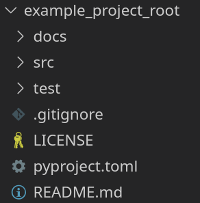
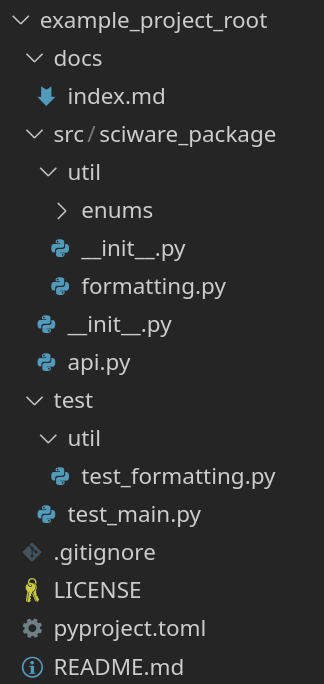

# Sciware

## Python Packaging

https://sciware.flatironinstitute.org/34_PyPackaging

https://github.com/flatironinstitute/sciware/tree/main/34_PyPackaging


## Rules of Engagement

### Goal:

Activities where participants all actively work to foster an environment which encourages participation across experience levels, coding language fluency, *technology choices*\*, and scientific disciplines.

<small>\*though sometimes we try to expand your options</small>


## Rules of Engagement

- Avoid discussions between a few people on a narrow topic
- Provide time for people who haven't spoken to speak/ask questions
- Provide time for experts to share wisdom and discuss
- Work together to make discussions accessible to novices

<small>
(These will always be a work in progress and will be updated, clarified, or expanded as needed.)
</small>


## Future Sessions

- Oct 2 10-noon: Intro to HPC: Extended introduction to the FI cluster
- Suggest topics or contribute to content in #sciware Slack
- We are recording. Link will be posted to [https://sciware.flatironinstitute.org/](https://sciware.flatironinstitute.org/)


## Today's Agenda

- What do we mean by packaging, and why do you want to do it?
- Review of the Python import system 
- Configuring your project with `pyproject.toml`
- Hands-on example of turning a Jupyter notebook into importable code


# Whats and Whys of Python Packaging

### Jeff Soules (CCM)


## Outline

- Motivation
- Vocabulary
- The Import System
- `pyproject.toml` and You


## Does this sound like you?

- My script only runs from a certain directory
- My tests can't find my code
- I've defined the same function in three notebooks
- Using `setup.cfg` or `setup.py`
- To run that function in `ipython` I paste in...
- So first we edit `sys.path`...


Do you have these issues with packages you install by `pip`?

No. You `import ThePackage` and it Just Works.

Running your own code should be that simple too.


- What we'll show today helps get you ready for *distributing* your
work on a package archive like PyPI (so it is `pip` installable).

- We can cover the details of PyPI distribution in a later session if there's interest

- For today, we just want you to be able to `import` your own code as easily
as you do someone else's.


## Defining Terms


### "Package" vs "Module" vs "Project"

The [documentation](https://docs.python.org/3/glossary.html#term-package) can
be quite confusing.

For today, we mean:

- `Project`: some collection of files that you're working on
- `Module`: a file (ending in `.py`) of Python code
- `Package`: Python code you can *install* for reuse
  - One or more files (the user doesn't need to care)
  - Downloaded from a repository or installed locally


In short:

- We'll use "**project**" to mean something you're editing, and "**package**"
to mean something you want to install and import.

- Our goal for today is to show how easy and beneficial it is to make your
  *projects* into (locally) importable *packages*.


### Why Have Packages?

- We've said packages are "code you can install"

- So the point of packages is *code reuse*
  - They are libraries of pre-written code
  - Importantly, with *versions* and *dependencies*

- A big part of Python's success is its robust package ecosystem!


That comic is from *2007*. (A few things have changed!)

But the ecosystem still addresses 3 problems:

- How do I get useful code from other people
- How do I share my useful code with others
- How do I run the *right* code


## Five Pillars of Python Packages

- Python version management
- Environment management
- Package management
- Package building
- Package publishing


### The easy one

- Python version management
  - aka interpreter version. Python 2 is not 3.6 is not 3.12
  - Thanks to backward compatibility, this is rarely a huge issue any more


### Wrangling installed packages

- Package management
  - Fetching and installing published code
  - *and its dependencies*
  - e.g. `pip install xarray` also installs `pandas`
  - `pip`, `conda`
- Environment management
  - Different tasks need different (conflicting?) packages/versions
  - [(virtual) environments](https://docs.python.org/3/tutorial/venv.html) let them coexist
  - `venv`, `conda`


### Multiple environments example

- I have `Project_One` from grad school in 2019
  - That used PyTorch v 1.1.0
- Today I'm working on `Project_Two`
  - I'm... not using PyTorch from 2019
  - But upgrading `Project_One` to PyTorch 2024 is a huge ask
- Separate environments solve this issue


### Package distribution

- Package building
  - How do I put my code in a distributable form?
  - `setuptools`, `meson`, others
- Package publishing
  - How do I share my bundled code publicly?
  - `twine` (bundling), `PyPI` (a repository)


### Five Pillars Revisited

- Python version management <!-- .element style="color: #999999" -->
- Environment management <!-- .element style="color: #999999" -->
- **Package management**
- **Package building**
- Package publishing <!-- .element style="color: #999999" -->

Many tools are available for these; today
we're really only talking about `pip`
(and maybe a little bit of [setuptools](https://setuptools.pypa.io/en/latest/)).


### namespaces

- A [namespace](https://docs.python.org/3/glossary.html#term-namespace) creates a nested 
  hierarchy of names.

- Namespaces let packages define variables, functions, and classes without worrying about uniqueness.

Example:
- `numpy.linalg.norm(...)` and `torch.norm(...)` work on different objects
- You can use both in the same script because the
namespace (`numpy` vs `torch`) clarifies what you mean.


### global vs local namespaces

The *global namespace* is the top level for everything in the module.
```python
# in my_file.py

x = 10
print(x) # prints 10
```

*Local namespaces* nest one name inside another:
```python
# in my_file.py

class MyClass:
    y = 10  # note this is a class variable

print(y) # fails: y not defined
print(MyClass.y) # prints 10
```


## Python imports


### What importing does

An [import](https://docs.python.org/3/reference/import.html) does
two things:

- Finds the code you want to use, and
- Attaches that code to a name in the namespace

Let's talk about the second point first.


Example:
```python
from math import sqrt
print(sqrt(16)) # prints 4
print(math.pi) # fails--we didn't import math!

import numpy as np
my_array_1 = np.array([1, 2, 3]) # works
my_array_2 = numpy.array([1, 2, 3]) # fails!
```
- `sqrt` is attached to the *global namespace* of this file
- its parent, `math`, is not! We didn't import that.
- The `numpy` package has been imported with an alias
  - That *alias* is visible, but the original name isn't


### Relative imports

What about this?
```python
from .mycode import function_a
from . import othercode
from .. import thirdfile as t

print(function_a(1, 2))
print(othercode.function_b(3, 4))
print(t.fun_c())
```

It *might* work...
- if we are in the right directory
- if we invoked Python the right way
- if the files don't move

Why is this so brittle?


### Finding the code to import

- `import FOO` makes Python look for a *module* named `FOO`
  - That means a file `FOO.py`
  - Or a directory `FOO/` with an `__init__.py` file in it


### Finding the code to import

- Python looks in the list of locations defined in `sys.path`
  - This list includes various standard locations
  - It also includes your current working directory, but...
    - ...that changes with every `cd`!

Reliable imports require the code to be in one of the standard locations.
Managing that is what `pip` does.


### Aside: Re-exports

- Importing code makes it part of the namespace, just as
  if the module defined it directly.
- A common pattern is to use imports in `__init__.py` to
  simplify the import structure, e.g.:

```python
# src/sciware_package/util/__init__.py
from .enums import Mode as Mode
from .enums import Precision as Precision
from .formatting import canonicalize_string
```
Now `Mode` is importable from
`sciware_package.util` rather than from
`sciware_package.util.enums.Mode`, etc.

We're okay with relative imports here because this directory
structure is pretty fixed.


### Package installation

- When you `pip install` a package, `pip`:
  - downloads a bundle from PyPI with the package code
  - Places it in a standard location (defined in `sys.path`)


`pip` can also install *your project* as a package, using *editable mode:*

`$ pip install -e /path/to/my/project`

- the base directory of your project gets added to `sys.path`
- Now regular import patterns work!
- You just have to describe your project to `pip`
- which you do through `pyproject.toml`


Note: If you're used to manually editing `sys.path` to make your code
visible--there's no need! An editable install will do this for you, in
a robust, well-tested way.

Now before we get to `pyproject.toml`...


### A bit more about environments

`sys.path` is actually how
environments work.

Let's take a look at a `venv` virtual environment and
what happens when I install packages in it.


```bash
$ which python  # none found--it's called python3
$ which python3 # /usr/bin/python3
$ python3 --version # Python 3.10.12
$ python3 -m venv ~/tmp/my-venv
$ source ~/tmp/my-venv/bin/activate
$ which python  # now returns ~/tmp/my-venv/bin/python
```


Note the paths:
- `''` gives the directory where you launched `python`
- The `/usr/lib/` directories are for preinstalled packages
- `~/tmp/my-venv/lib/python3.10/site-packages` is
  where downloaded packages will be installed


Before we install anything:


that directory has a few package-distribution tools installed,
and that's it.


Now let's install numpy!

```bash
$ pip install numpy
```

And see that `numpy` gets copied into the package directory.


What about a local package installed in editable mode?


Note we get a project descriptor, but no actual code directory.

Instead:


The project src directory gets added to `sys.path`.

This means my changes are visible live--no reinstall needed.


### Editable install gotchas

- Building your package for distribution usually removes all the
  non-`.py` files. So if you rely on (say) data files, those may work
  fine in editable mode, but break for a real install
  - Unless you do some extra config to include them
- Depending on your build tool configuration, sub-packages may
  work in editable mode but need more configuration for a real install.


## Properly Handling Python Projects


### Pythons Organized Neatly

To make following discussion concrete, we'll work with an example project using a standard layout.
We're calling our package `sciware_package`.

The code for this example is under `example_project_root` in
[this presentation repository](https://github.com/flatironinstitute/sciware/tree/main/34_PyPackaging).






The highlights:
- The root of the project is `example_project_root` (this name doesn't matter)
- `pyproject.toml` goes at the top level--the project root
- Package code is in the `src` directory.
  - Specifically, in a `sciware_package` sub-directory
    - That name matches the package name
- Test code is in a `test` directory
  - Also *not* part of the package


### pyproject.toml

- The modern way to configure a project
  - Not just for packaging--it's a single-source config file
- Written in [toml](https://toml.io/en/) format, so human-readable
- Goes in the root of your project directory


Quick note: there's a lot of old material online recommending deprecated package
configuration methods. Guides referring to `setup.cfg` are almost certainly
outdated.

- `setup.py` is sometimes still required, but only very rarely
  - if you aren't positive why you need it, you probably don't
  - In particular, you can use single-source version numbers without it
- These configuration methods will stop working soon, so now's the time to migrate!


### Minimal pyproject.toml for an installable package

```toml
[project]
name = "sciware_package"
version = "0.0.1"
requires-python = ">=3.8"
dependencies = [
    "numpy>=1.24.0",
]
```

- `name` will be the name you use to import the package
  - Note: it can't have spaces, dashes, or periods
  - By convention it should be lower-case

- `dependencies` will be automatically installed when you `pip install` the package


### Build system

You also need a `[build-system]` section:

```toml
[build-system]
requires = ["setuptools"]
build-backend="setuptools.build_meta"
```

This specifies the tool that bundles your code (i.e. `setuptools`)


```toml
[tool.setuptools.packages.find]
where = ["src"]
```
We have another config block: for the `setuptools` tool.
(`pyproject.toml` collects many tools' config into the same file)

- This block is specific to `setuptools`. Specifically:
  - It configures the "find" option of the "packages" option
  - This just tells `setuptools` the root directory to start from
    when looking for packages to bundle.
- These can also be set explicitly, but that can lead to pitfalls with sub-packages.


That's it! With this minimal `pyproject.toml` config in place, you can install your project as a package.

If:

- the project is at `~/example_project_root`
- `~/example_project_root/pyproject.toml` is as above
- package code lives in `~/example_project_root/src/`

Then:
```bash
$ pip install -e ~/example_project_root/
```


Now, in *any* Python file, `repl`, or notebook, you can import the `sciware_package` package
and use the code it defines.

```python
from sciware_package import describe_operation
from sciware_package.util import canonicalize_string
```

Importing your own code will work just as smoothly as importing a fancy published package
you got off PyPI!


### What if I want to share?
Sample `pyproject.toml` has extra `[project]` fields:

```toml
description = "Example package for Sciware 34"
authors = [
    { name = "Jeff Soules", email = "jsoules@flatironinstitute.org" }
]
readme = "README.md"
classifiers = [
    "Programming Language :: Python :: 3",
    "Operating System :: OS Independent",
]

[project.license]
file = "LICENSE"
```
- Required for publishing to PyPI
- `readme` can be text, a file, or even `dynamic` (see later)
- `license` describes how others can legally use your code


### But that's not all!

Now that you have a `pyproject.toml`, consider using it to configure other tools too!
For example:

- [pytest](https://docs.pytest.org/en/6.2.x/customize.html#pyproject-toml) for automated testing
- [pytest-cov](https://coverage.readthedocs.io/en/latest/config.html) for test coverage reports
- [pylint](https://pylint.pycqa.org/en/latest/user_guide/configuration/all-options.html) the classic linter
- [mypy](https://mypy.readthedocs.io/en/stable/config_file.html) for type-checking
- [ruff](https://docs.astral.sh/ruff/configuration/), monolithic linter and formatter

It's worth looking into for any tool you use.
(And if you don't use any code quality tools, now's a great time to start!)


## Survey
Please give us some feedback!


[https://bit.ly/sciware-sep2024](https://bit.ly/sciware-sep2024)


# Live Demo

### Brian Ward, CCM


## Survey
Please give us some feedback!


[https://bit.ly/sciware-sep2024](https://bit.ly/sciware-sep2024)
