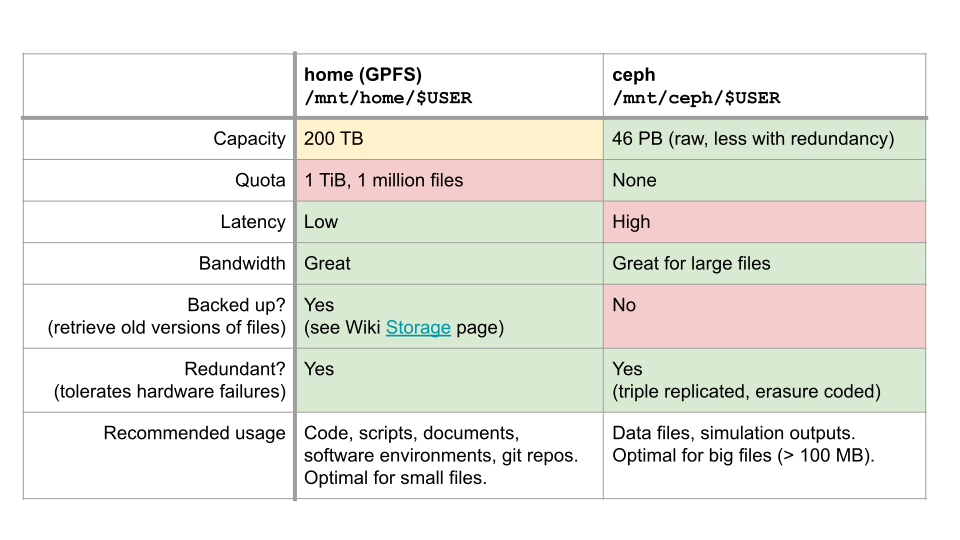

# Sciware

https://sciware.flatironinstitute.org/35_IntroToHPC

https://github.com/flatironinstitute/sciware/tree/main/35_IntroToHPC


## Rules of Engagement

### Goal:

Activities where participants all actively work to foster an environment which encourages participation across experience levels, coding language fluency, *technology choices*\*, and scientific disciplines.

<small>\*though sometimes we try to expand your options</small>


## Rules of Engagement

- Avoid discussions between a few people on a narrow topic
- Provide time for people who haven't spoken to speak/ask questions
- Provide time for experts to share wisdom and discuss
- Work together to make discussions accessible to novices

<small>
(These will always be a work in progress and will be updated, clarified, or expanded as needed.)
</small>


## Center-hosted Sciware

- Sciware will rotate between centers each month
   - focus on topics of interest to centers
   - include voices from all centers
   - each center will host twice a year
   - open to all
- Suggest topics or contribute to content in #sciware Slack
- We are recording. Link will be posted to [https://sciware.flatironinstitute.org/](https://sciware.flatironinstitute.org/)


## Today's Agenda
- Helpdesk recap
- Supercomputing components and terminology
- Flatiron resources overview
- Environment management [interactive]
- Running your jobs [interactive]


## What you'll need

- Remote access to the cluster via terminal
  - on 'FI' wifi network: `ssh username@rusty`
  - or... `ssh -p 61022 username@gateway.flatironinstitute.org`, `ssh rusty`
  - or... `https://jupyter.flatironinstitute.org`
- Way to edit files on cluster
  - terminal `emacs`, `vi`, `nano`
  - or... remote edit via `vscode/emacs/vi/sshfs`
  - or... `https://jupyter.flatironinstitute.org`


## Getting help with the FI clusters!


### Getting help with the clusters (1)

- SCC provides a wiki for cluster help and information
  - https://wiki.flatironinstitute.org
  - Information on effectively using slurm, python, conda, mpi, compiles, MATLAB, Mathematica, etc.
  - can log in with cluster credentials, or SSO if flatiron email is on your cluster account


### Getting help with the cluster (2)

- #scicomp on slack for quick or broad questions
  - SCC/FI community will help with your issue
- https://wiki.flatironinstitute.org/SCC/ReportingProblems
  - Email with details from above to scicomp@flatironinstitute.org


## Supercomputing terminology


## Cluster
<div style="display: flex;">

<ul>
<li> A group of computers that work together as a single system
<li> Goal: distribute computational load over multiple devices
<li> Common components to be defined:
  <ul>
  <li> Node (CPU/GPU)
  <li> Filesystem (shared/local)
  <li> Network/fabric
  </ul>
</ul>
</div>


## Quiz!
### Which statement is generally true about what we mean by a "cluster"?
- <font color="#804">A. One very powerful computer</font>
- <font color="#080">B. Many geographically dispersed computers connected via the internet</font>
- <font color="#880">C. Collection of computers that are linked together with a local network</font>


### Network/fabric
- Network/fabric - the means of communication between nodes
  - Communication lines usually fiber/copper/wireless
- Latency -- time between sending and receiving messages
- Bandwidth -- Rate data can be transferred
- Some rough "typical" numbers
  - WiFi -- 1ms -- \~0.1-1 Gbit/s -- network
  - Ethernet -- 0.1ms -- \~1-40 Gbit/s -- network
  - Infiniband -- 0.001ms -- \~100-800 Gbit/s -- fabric


## Quiz!
### Which statement is false?
- <font color="#804">A. Latency is the time between sending and receiving messages</font>
- <font color="#080">B. Bandwidth is the rate at which messages can be sent</font>
- <font color="#880">C. Infiniband fabric has relatively high latency and low bandwidth</font>


### Compute nodes
<div style="display: flex;">
<ul>
<li> What most people would call a computer, but...
  <ul>
  <li> Typically headless -- no display
  <li> Accessed/controlled via network
  <li> Often multiple network "interfaces"
  <li> Designed for high <i>throughput</i> computation
  </ul>
</ul>

</div>


### Compute node architecture
- Typically large amounts of RAM (random access memory)
  - temporary storage used during computation for data and program instructions
- One or more "multi-core" CPUs (central processing units)
  - CPU Core -- a single physical CPU on a multi-core CPU
  - Cores have their own _cache_ but also share _cache_ directly with other cores
  - Cores typically slower than laptop/workstation cores, but more of them and more cache/RAM


## Quiz!
### Which statement is true about nodes and cores?
- <font color="#804">A. There is one node per supercomputer</font>
- <font color="#080">B. Each node has multiple CPU cores</font>
- <font color="$880">C. Cores in supercomputers are typically faster than laptop cores and have less RAM</font>


### Compute node architecture -- `lstopo`
- Cores also sometimes have extra groupings in `NUMA` (non-uniform memory architecture) domains
  - Tells what hardware has direct access to what memory
  - Automatic internal "fabric" with different latencies/bandwidth
  - `lstopo --no-io` on FI `skylake` node
<center>
    
</center>


### GPU node architecture
<div style="display: flex;">

<ul>
<li> GPU Node -- CPU node + GPU
<li> GPU -- graphics processing unit
  <ul>
  <li> Misnomer/legacy name, used to "offload" general computation -- AKA accelerator/TPU
  <li> SIMD power -- single instruction multiple data
  <li> large numbers of small identical problems
  <li> e.g. large dense linear algebra problems
  </ul>
</ul>


### Filesystems
- System that manages file organization and access
- Can be local (stored on "hard drive" like on laptop)
  - _typically_ high bandwidth/low latency
- or distributed/networked (data shared between drives/computers and accessed remotely)
  - _typically_ high bandwidth/high latency, networked
  - Tradeoffs exist and are _extremely_ important
- Ceph and GPFS are the distributed filesystems used at FI
  - Lustre also common at supercomputing centers


## Flatiron resources overview


### Two clusters: 'Rusty' and 'Popeye'

- Rusty on east coast, Popeye on west coast
- Completely distinct
  - Independent storage
  - Independent job management
- Both heterogenous -- multiple node types
- Details at https://wiki.flatironinstitute.org/SCC/Overview


### Rusty -- compute power

- FI's "primary" cluster
- \~150k CPU cores (\~1400 nodes)
- _Almost_ every node connected by high performance infiniband fabric
  - Dedicated (only for job traffic)
  - Node types on different infiniband networks!
- 240 H100, 288 A100 and 24 V100 GPUs


### Popeye -- compute power

- \~41k dedicated CPU cores (\~800 nodes)
- Generally more available, but data separate from rusty
- Everything on infiniband fabric
- A handful of GPUs for special purposes


### Rusty/popeye storage -- local
- All worker nodes have fast `NVMe` storage local to the machine
- Usually about 2 terabytes in the `/tmp` path
- Automatically deleted at job completion!


### Rusty/popeye storage -- home
- `/mnt/home/$USER` AKA `$HOME` -- default path
- Put your source code and software installs here!
- High performance GPFS filesystem (General Parallel FS)
- Mind your quota! You can get locked out of the cluster!
  - \~1 million files
  - \~500 GiB limit
- Backed up regularly -- can recover deleted files
- `module load fi-utils && fi-quota`


### Rusty/popeye storage -- ceph (1)

- rusty: located at `/mnt/ceph/$USER`, symlink at `~/ceph`
- popeye: located at `/mnt/sdceph/$USER`, symlink at `~/ceph`
- `ceph` (after cephalopod) -- software providing this FS
- Always put your data/large files here! (large \~ 100MB+)
<center>

</center>


### Rusty/popeye storage -- ceph (2)
- \~50 PiB (rusty) and \~20 PiB (popeye)
- High bandwidth, high latency (\~1.5GiB/s parallel reads)
- Highly redundant, not backed up (deletes unrecoverable!)
- "Small" files "triple replicated"
  - Two disks can fail and can still recover
- Large files start triple replicated, then erasure coded later
  - EC - file distributed across many disks with extra data
  - Full recovery with some number of disk failures


### Rusty/popeye storage -- overview

<br>
https://wiki.flatironinstitute.org/SCC/Hardware/Storage


## Quiz!
### Which statement is true about file systems at FI?
- <font color="#804">A. I should put many small files in a single directory on ceph</font>
- <font color="#080">B. I should put large files in my home directory</font>
- <font color="#880">C. Home and ceph are the only options for storing data during a job</font>
- <font color="#048">D. Files stored in my home directory are backed up while ones on ceph are not</font>


## Environment management


## Building/running software
- `git clone ~scc/sciware_awful_cp`
- `cd sciware_awful_cp`


## Building/running software (2)
- Learning points:
  - `module avail`
  - `module load`
  - `PATH`
  - `icp[cx]` +`libstdc++` issues


## Let's make a Python project

- create new project directory
- `ml python ; python -m venv myenv --system-site-packages ; source myenv/bin/activate`
- create `setup_env` script that loads clean environment
  - `module` quirk: load `python` BEFORE `venv` activate!


## Please never do this

- Calculate π by throwing darts "_Monte Carlo Sampling_"
- π ≅ 4 N<sub>in</sub> / N<sub>tot</sub>
- https://github.com/flatironinstitute/sciware/tree/main/35_IntroToHPC/mc_pi
<center>
    
    
</center>


## Running it on the cluster
```
#!/bin/bash
#SBATCH -o pi.log  # All stdout from this script
#SBATCH -e pi.err  # All stderr from this script
#SBATCH -p genx    # genx partition (non-exclusive -- doesn't request full nodes)
#SBATCH -t 1:00    # request 1 min runtime (default 7 days, helps schedule faster)
#SBATCH -n 1       # 1 task (default)

source load_env.sh
python pi.py 100000 0
```

```
% sbatch pi.sbatch
```


## Scaling up
- We could make our code more efficient...
- But let's throw some power at it, some options are:
  - `MPI` (message passing interface) using `openmpi`
  - `srun` to run multiple copies
  - multiple serial jobs via `disBatch`
  - could loop through calls to python in sbatch script, but hard to balance and error prone
  - could use small jobs or job array with slurm, but this angers the compute gods


## MPI with slurm
- Run one π calculation per MPI "rank" AKA task
- Send all π calculations to one rank, average, and write to disk
  - Could also use `MPI_reduce`


## MPI with slurm (2)
- Learning points:
  - `module spider`, `openmpi`, `mpi4py`
  - `srun`, `sacct`, `seff`, `squeue`
  - `htop`


## What now?
- `disBatch` - e.g. modify `pi.py` for a `disBatch` submission
- NUMA: `lstopo` - pinning/binding - latency/bandwidth
- discussion about other HPC topics -- what interests you?


## disBatch
- Create list of tasks, pass to disBatch
- `module load disBatch`
- `sbatch <sbatch options> disBatch task_file`


## disBatch (2)
- Learning points:
  - `disBatch` task files
  - `disBatch` `PREFIX/REPEAT`
  - `&>` redirect
  - `()` subshells


## SciWare Survey
<center>

</center>
