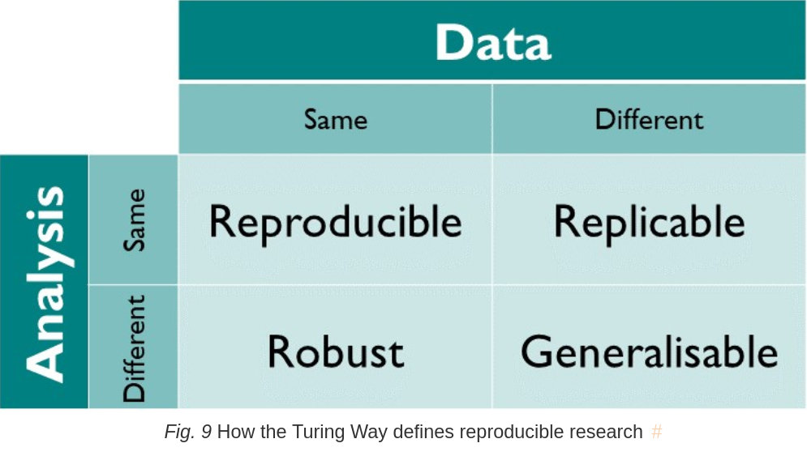
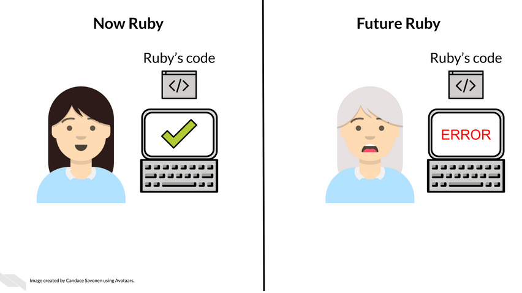
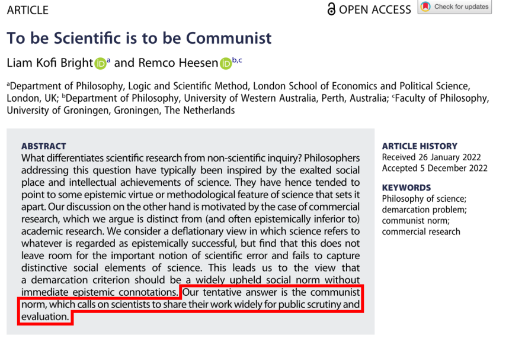
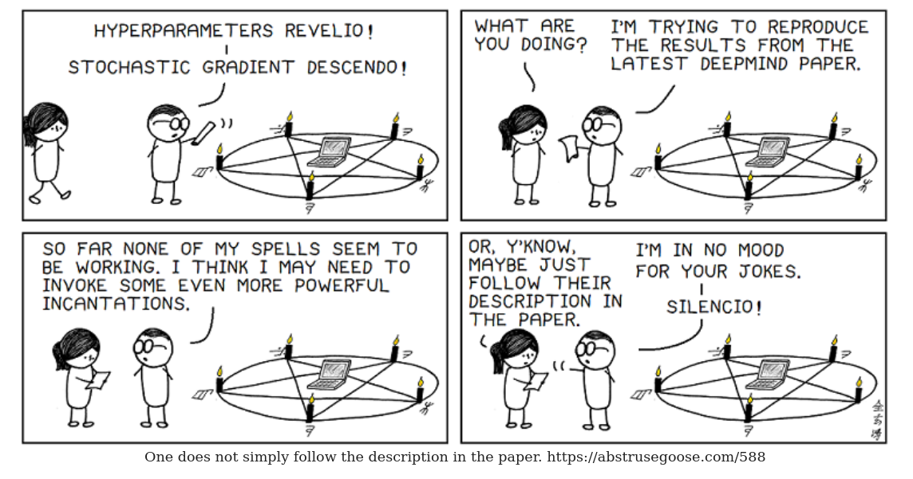
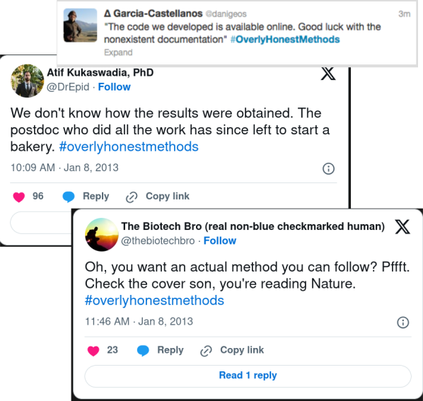

# Sciware

## How to (try to) publish a reproducible paper

https://sciware.flatironinstitute.org/36_ReproduciblePaper

https://github.com/flatironinstitute/sciware/tree/main/36_ReproduciblePaper

## Rules of Engagement

### Goal:

Activities where participants all actively work to foster an environment which encourages participation across experience levels, coding language fluency, *technology choices*\*, and scientific disciplines.

<small>\*though sometimes we try to expand your options</small>

## Rules of Engagement

- Avoid discussions between a few people on a narrow topic
- Provide time for people who haven't spoken to speak/ask questions
- Provide time for experts to share wisdom and discuss
- Work together to make discussions accessible to novices

<small>
(These will always be a work in progress and will be updated, clarified, or expanded as needed.)
</small>

## Future Sessions

- Suggest topics or contribute to content in #sciware Slack
- We are recording. Link will be posted to [https://sciware.flatironinstitute.org/](https://sciware.flatironinstitute.org/)

## Today's Agenda

- What is reproducibility and why should you care?
- Big picture questions to consider
- Steps towards reproducibility

## What is reproduciblity?

#note: before we get started, let's define our terms. I'm using the definitions from the Turing Way, which locates reproducible research here: can I run the same analysis on the same data and get the same output? these other quadrants are also really important for good science and we should generally aim for all of them, but beyond the scope of this talk.

of these quadrants, reproducible should be the easiest. but that doesn't mean it's *easy*

## Why be reproducible at all?

#note: why should you do this at all? I think just about every scientist, if you ask them, will say this is important, but they won't agree that it's worth spending time on. any of these steps requires extra time, which is time that you're not spending working on your next brilliant idea. If you look around online, people make a lot of different arguments for this, but for me I think there are two main reasons, one practical and one normative.

## The number one person you're helping is future you

#note: at some point, you will return to your code. maybe you submitted the paper and now have to revise it. maybe someone reaches out to you with a question about your paper, or because they want to follow up. maybe someone in your lab wants to use your data or analysis for a new project. maybe this work will be the beginning of a new research line. assuming you think your work has some value, it is unlikely that you're done with it when you submit a paper about it; or, more accurately, that you can accurately predict when you're done with it.

the way I've heard this described is "your most important collaborator is yourself, six months from now, or five years from now". try not to make your life harder.

## Science requires transparency

#note: secondly, more normatively, doing science means being transparent. this is a paper from some philosophers of science, addressing what's known as the "demarcation problem": how do you determine whether something counts as science? their answer is that what really distinguishes science from other forms of inquiry is that scientists must share their work widely for public scrutiny and evaluation. you cannot just say "trust me", you have to explain why.

### But I've already written the paper!

 <!-- .element: style="width:90%" -->

#note: but you might say, I've already published the paper, surely if anyone has any questions about my analysis, they can just read my beautifully-written  and completely clear paper

## Papers are insufficient

#note: papers are insufficient for reproducibility. that can be for a lot of reasons. some of those reasons are silly, but some of them are simply that it can be hard to convey all the info required to run an analysis in prose in a way that's not totally mind-numbing. not to mention, there's a lot of implicit knowledge you have, which you might not realize is relevant. and *that* problem is exacerbated by the fact that you're writing for a broad audience: the info a senior professor in your field would need to reproduce your analysis is different than that needed by a junior grad student, and different again than that required by someone outside your field (if you're writing in a journal with a broader audience).

## Points to consider

- What are your goals?  <!-- .element: class="fragment"  -->
- Who is the target community?  <!-- .element: class="fragment"  -->
- How much maintenance do you want to do on this?  <!-- .element: class="fragment"  -->
- The earlier you start, the easier this will be.  <!-- .element: class="fragment" -->
- But it's never too late to start. <!-- .element: class="fragment" -->
- Don't let the perfect be the enemy of the good.  <!-- .element: class="fragment"  -->

#note: so now you're all thoroughly convinced that you should be reproducible and that to do that, you need to share your code+data. Before we start talking practically, let's set out some questions:
- What your goal is when sharing the code: do you want people to just be able to re-generate your figures? Running same method on newly-collected data / different datasets? Are there any parts of your code (model, algorithm) that folks will want to apply to a completely new context? 
   - Do you see this as a living code base that you’ll continue to update and use for other projects? Or does it serve only to generate results for a single paper?
   - what we'll cover helps all of these, but the "more difficult" topics will be more and more useful the broader your goals
- Who is the community you are sharing with. Will depend on your publication venue, but how comfortable can you assume they are with programming. If you say “set up a python virtual environment with python 3.10”, will they know how to do that?
- Think about your maintenance burden going forward. You probably don't want to do much maintenance on this.
- In general, all of these will be easier the earlier you start. 
- Don’t let the perfect be the enemy of the good. You don’t have to do all of these on a given project, doing one is better than doing none. Ideally, this is a learning experience, and once you know how to do this on one project, you can easily do it on other projects going forward, so you’re always getting better.

## Caveats

- Largely talking about python.
- I'm mostly familiar with neuroscience and psychology.
- This is heavily opinionated.

#note: finally, some caveats

## Topics

- Get your code running on another machine.
- Tell people how to run your code and what it's doing.
- Data and archiving.
- Workflow.
- Advanced topics.

#note: we're going to give a brief overview of a lot today, which fall into these categories. the goal here is to make you aware of all of these topics, and to get you started. the goal is not to be exhaustive, and you'll probably need to do more reading or ask questions about the topics we'll cover today. I'll have some resources at the end of this presentation, which you can find on the sciware site and, if you end up trying to follow these guidelines and have questions or just want to show off, post on the sciware channel!

so our topics are grouped into a couple of higher-level categories: read slide. Edaordo's going to present about the first two of these, which are the meatiest, and then I'm going to come back and finish us up. Periodically, we're going to switch tabs to show you how we've implemented these steps in our own projects.

these topics pretty much all generally fall into "good software engineering practices".

we're covering a lot of ground here. we're going to try and signal what we think is required, and what is "supplemental", which we'll try to indicate with gray

## Get your code running on another machine

#note: the absolute minimal requirement for reproducible results is that your analysis code can run on a machine that is not your own. In the next slides I will
provide a few advices that should make this requirement easier.

### Choose Your Toolkit Well
- **Focus on Your Scientific Problem**
  - Use "standard" tools to avoid re-implementing common solutions.   <!-- .element: class="fragment"  -->
  - Example: don't reimplement your own PCA; use libraries like scikit-learn instead.  <!-- .element: class="fragment"  -->
  - Look for: well-documented, widely used, and actively maintained tools.   <!-- .element: class="fragment"  -->

#note: Let's start with choosing your toolkit. The tools you select form the foundation of your workflow, so it’s crucial to pick wisely. Your primary focus should be on addressing your research question. Standard tools, like scikit-learn for machine learning or numpy for numerical computations, help you avoid reinventing the wheel and are reliable because they’re widely used and maintained. Prioritize tools that are well-documented and actively supported by the community to ensure stability and longevity.

### Open Source First
- Increases transparency and reproducibility.  <!-- .element: class="fragment"  -->
- Open-source tools often have better community support.  <!-- .element: class="fragment"  -->

### Avoid GUIs, Prefer Scripting  <!-- .element: class="fragment"  -->
- GUIs limit automation—use scriptable alternatives or obtain a scripted version when possible. <!-- .element: class="fragment"  -->
- When not possible, store both GUI outputs and configurations. <!-- .element: class="fragment"  -->
   - Example: Finding and merging double-counted units in spike sorting (manual GUI step). <!-- .element: class="fragment"  -->

#note: Generally, you should prioritize open-source whenever possible. Open-source software fosters transparency, making it easier for others to understand and reproduce your work. Plus, with a large community of contributors and users, open-source tools typically offer better support and faster resolution of issues. Avoid using GUI-based tools, which are usually hard to automate, don't scale well, and may manual steps that are difficult to reproduce. When a GUI is unavoidable, a classic example in neurosciecne is finding double counted units in spike sorting, document and save the configurations and outputs so the process remains traceable.

### Version Control with Git
- **Keep a Clean Repository**
   - <!-- .element: class="fragment" --> Use <code>.gitignore</code> to avoid committing unnecessary files. 
   - <!-- .element: class="fragment" --> Have a <code>README</code> file explaining repo content, as well as references to associated paper. 
   - Minimize the amount of files (especially large binaries).  <!-- .element: class="fragment"  -->
   - Delete stale branches.  <!-- .element: class="fragment"  -->
   - Avoid credential and private data.  <!-- .element: class="fragment"  -->

#note: Now that your tools and scripts are in place, it’s time to focus on version control. Use Git to track changes and host your code on a platform like GitHub, GitLab, or Bitbucket. Keep your repository clean: exclude unnecessary files using a `.gitignore`, document the repo with a clear `README`, and avoid including large binaries. Regularly delete stale branches, and never commit credentials or private data.

### Avoid Hard-Coded Paths 
- <!-- .element: class="fragment" data-fragment-index=1 -->Use <strong>config files</strong> (or <strong>environment variables</strong>, harder for users). 

#note: Another thing to be mindful of is how you manage file paths in your code. Avoid hard-coded paths. Instead, use configuration files to store paths and parameters. This approach makes your code easier to share and adapt.

### License Your Code
- **Clarify Usage Rights**
   - Add a license (e.g., MIT, Apache 2.0) to define how others can use your code.

#note: As your repository takes shape, don’t forget to add a license. This step is often overlooked, but it’s critical for defining how others can use your code. Popular licenses like MIT or Apache 2.0 are great for encouraging reuse while protecting your work.

### Facilitate Installation
- Specify Core Dependencies in a [pyproject.toml](https://github.com/flatironinstitute/sciware/blob/main/34_PyPackaging/example_project_root/pyproject.toml) file.
   - List only direct dependencies. <!-- .element: class="fragment"  -->
   - Avoid pinning package versions if possible. <!-- .element: class="fragment"  -->
   - <!-- .element: class="fragment"  --> Specify version ranges when needed (e.g., <code> >=1.0,<2.0 </code>) 
   - <!-- .element: class="fragment"  --> Store your package version as a reference, using <code>pip freeze > myenv.txt</code> for Python.
   -  <!-- .element: class="fragment"  --> See <a href="https://sciware.flatironinstitute.org/34_PyPackaging/slides.html">September Sciware on Packaging</a>.

#note: To ensure your package is easy to install, list your direct dependencies (the ones your code directly imports) in a pyproject.toml file. Avoid pinning exact versions for flexibility, but consider specifying version ranges (e.g., >=1.0,<2.0) for critical packages to prevent compatibility issues. Do not pin a specific. For reproducibility, create a snapshot of your environment with pip freeze, which lists all installed packages and their versions. This snapshot should be saved separately (e.g., requirements.txt). For more details, check the September Sciware session on packaging. for more details on this check Sept sciware on pacakging.

### Containers?
- **When To Use Containers**
   - If your code has **complex dependencies** or non-Python packages.
   - If you have code that must run on High-Performance Computing clusters (facilitates portability).
- <!-- .element: class="fragment" data-fragment-index=1 --> **When To Probably Not** 
   -  <!-- .element: class="fragment" data-fragment-index=1 --> If you use <strong>stable Python packages</strong> with good backward compatibility.
   -  <!-- .element: class="fragment" data-fragment-index=2 --> <strong>Conda environments</strong> might be enough if dependencies are Python-only.

#note: Containers like Docker or Singularity can simplify the setup process, especially when your code has complex or non-Python dependencies. They are particularly useful for high-performance computing environments, where portability is key. However, if your project relies only on stable Python packages, a Conda environment might be sufficient. Choose the approach that aligns with your needs, and my suggestion is don't over engineer it, keep it simple when you can.

## Provide Necessary Information

Write a `README` file which answers the following questions:

- What does my code do? 
- How to install my code?
- How to run my code?
- How to cite?

#note: A README file is crucial for your repository as it serves as the entry point for anyone trying to use your code. Make sure to clearly explain what your code is, how to install it, how to use it with examples, and how to properly cite your work if someone includes it in their research. The goal is to make your code as accessible as possible.

## What does my code do?

- Brief overview of what problem my code solves.
- Key information: programming language, core dependencies (JAX, scipy...).<!-- .element: class="fragment" -->
- Link to related papers, presentations, or documentation.<!-- .element: class="fragment" -->

#note: Start by summarizing the main goal of your code. What problem does it solve, or what research question does it address? Include any important technical details, like the programming language and major dependencies, so users can understand what they’re working with. Add links to relevant background materials or to an associated paper, when available.

## How to install my code?

- Step-by-step install procedure.
- Specify python vesions and non-python dependencies. <!-- .element: class="fragment" -->
- Mention OS compatibility. <!-- .element: class="fragment" -->

#note: The installation section should provide clear, step-by-step instructions. Mention specific Python versions and any non-Python dependencies that users need. Don’t forget to specify which operating systems are supported to avoid confusion, if you did test your code on a specific operating system only, it is fair to state it, and say that it is not guaranteed to work on other platforms.

## How to run my code?

- Code snippets with examples of usage.
- Add decriptive text and comments. <!-- .element: class="fragment" -->
- Point to extended notebook/script tutorials, summarizing the content. <!-- .element: class="fragment" -->
- Notebooks should show example usages, rather than full analysis. <!-- .element: class="fragment" -->

#note: The README should also breifly demonstrate how to use your code with simple examples. These should include enough context and comments so users can understand the workflow. It is also useful to liink to more detailed tutorials for advanced use cases. These notebooks focus on illustrating usage rather than performing a full analysis.

## How to cite?

Different ways of adding citations:

- Bibtex entry in `README`
- Link to a paper. 
- Consider generating a DOI via Zenodo.
- [Example](https://github.com/billbrod/spatial-frequency-preferences/blob/main/README.md)

#note: Finally, since you have done your job well and you produced some good quality research code, you definitely desearve credit! For this, it is important to let people know how they should cite your work. This can take the form of a BibTeX entry, a DOI, or a link to a related publication. Zenodo is a great option for generating DOIs for your code and increasing its visibility, more on that later.

## What data to share and where?

#note: when thinking about sharing data, start with these questions.

## What to share?

- Raw data <!-- .element: class="fragment" -->
- Processed data <!-- .element: class="fragment"  -->
- Model parameters <!-- .element: class="fragment" -->
-  <!-- .element: class="fragment"  --> <a href="https://users.flatironinstitute.org/~wbroderick/metamers/">Stand-alone outputs</a>
- <!-- .element: class="fragment" --> Metadata (e.g., <a href="https://help.osf.io/article/217-how-to-make-a-data-dictionary">data dictionary</a>)

#note: So what do you share? the obvious one is your raw data. If someone is going to run your analysis from scratch, they obviously need your data.

However, there are other things worth sharing that you might not thought of:
- it's probably worth sharing data that has been processed in some way. this is especially useful if part of your pipeline uses non-open source software or takes a long time / lots of computational resources to run. if you have any pre-processing steps, which use standard analyses which you are not responsible for (e.g., you're using some existing package and just applying as is), it can be useful to share the output of all those steps as well. these are typically also a good deal smaller than the raw data, at least in neuroscience. For me, I like to share the output of these pre-processing steps, and then also the inputs to the figure generation. that gives people multiple entry points into the data
- Model parameters. if you fit a model, these are probably useful to people. it's probably a small text file (csv, json) and very important for anyone to use your model, but a pain in the ass to sufficiently include in the paper
- Stand-alone outputs. By this I mean things that might be useful for people beyond just the goal of re-creating your figures. in that case, it's a bit out of the context of this talk, but still worth taking a moment to think about. model parameters (or model code, if new) are one instance of this but, there are others. (model metamer images)
- Metadata. how do you interpret any of this stuff? If you have collaborators, I'm sure you have the experience of getting data from them and having no idea how to move through it. you need to describe it: what does stimulus=0 mean? how do subject codes align with those used in the paper? etc. the generic way of doing this is using something called a data dictionary, which is a csv file describing each field in your dataset, with description (including units), and possible values
  - click to picture, talk through 

## Use data standards

 <!-- .element: class="plain" -->

#note: it might strike you that writing up all the metadata is a lot of work. yep! that's why, if your field has a data standard, you should use it. in neuroscience, there's BIDS (brain imaging data structure) for neuroimaging, and NWB (neurodata without borders) for physiology.

The point of a data standard is to handle all of that metadata for you: you'll have to go through some effort to get your data into that standard (though this should be at least a lab-wide, if not department-wide effort and only needs to be done once), but this makes it very clear how the information is structured. standard typically also have validation tools, which will automatically ensure everything looks good.

Ideally, getting data into the standard happens as soon as the data is collected, and this should be moved as upstream as possible. as an example, I gathered fMRI data in my phd, and what really led to the fMRI labs at NYU adopting BIDS is that the team that ran the actual fMRI machine made it easy to export the data directly into BIDS: they already had a consistent internal format, and so they were able to put together a little pipeline that converted from that format into BIDS, and offered it to everyone.

advantage beyond reproducibility: tools! for BIDS, there are a lot of tools that will work automatically with BIDS-formatted data, so you get an immediate benefit as an individual researcher.

## Where to share?

- Generally, data does not belong in a git repo.  <!-- .element: class="fragment" -->
  - Exception: small (<1 MB) text files. <!-- .element: class="fragment" -->
- Archive checklist:  <!-- .element: class="fragment" -->
  - Is it run by a non-profit and open source? 
  - How discoverable is it? How is it indexed?
  - Related to above, what does community use?
  - Gives DOI 
  - Integrations with other services

#note: generally speaking, data does not belong in a git repo. the only exception is small text files containing model parameters or similar.

therefore, we need to come up with somewhere else to put it. this is a checklist from Vicky Rampin, the reproducibility librarian at NYU. she's excellent, and was a lot of help during my PhD. I recommend anyone at NYU who's looking to share their data/code talk with her.

talk through checklist

## Example data archives
- General: [Open Science Framework (OSF)](https://osf.io/67tbe/), [Zenodo](https://zenodo.org/records/3854034)
- Neuroscience-specific (raw data only): [OpenNeuro](https://openneuro.org/datasets/ds003812), [DANDI](https://dandiarchive.org/dandiset/000939)
- Institutional repositories (e.g., [NYU Faculty Data Archive](http://hdl.handle.net/2451/63344))

#note: these are all free, and will have different file size / number of file limits. the neuro-specific ones also enforce and check for data standards. I've included links here to example datasets, several from me, so you can see what they look like.

in particular, you'll note that dropbox and google drive are not on here. Beyond the points in this checklist (which they fail), they're just not fit-for-purpose: they are not intended to do long-term public archiving (of anything).

## How to set up data?

Script the download and arrangement of your data.

#note: it is possible that getting your data ready to use with your pipeline requires a bit more work than "download zip file, unzip, and store the path to it in a variable". if that's case, if it's literally *any* more complicated than that, I'd recommend you include a "download data" script, which downloads the data, extracts it, and arranges it as necessary. this is helpful if, for example, you'll be downloading multiple files and their relative locations matter. your goal is for preparing the data to be a single line of code to run or something you can describe in a single sentence. you want it to be as easy as possible. 

## Code archiving

The internet is not forever.
- <!-- .element: class="fragment"  --> Zenodo can automatically archive github repositories and give them DOIs (<a href="https://zenodo.org/records/13851768">e.g.</a>)
- <!-- .element: class="fragment"  --> See <a href="https://docs.github.com/en/repositories/archiving-a-github-repository/referencing-and-citing-content">instructions</a>.

#note: which brings me to my next point: beyond your data, you should also archive your code. nothing is guaranteed to last forever on the internet, and this is especially true of resources owned by private companies like Microsoft.

Fortunately, Zenodo has an easy interface with Github. Once you set up your account, you can set it up to automatically archive your code, giving you a DOI and promising to archive it for a long time. In fact, Zenodo will mint a new DOI whenever you do a release / add a git tag, which leads us to...

## Versioning

Not just for software packages!
- <!-- .element: class="fragment" --> Can do through GitHub's web UI ([e.g.](https://github.com/billbrod/spatial-frequency-preferences)). 
- Use versioning to mark milestones (e.g., "presentation at Cosyne", "preprint", "journal submission", "final accepted version") <!-- .element: class="fragment" -->
- Version your data too!  <!-- .element: class="fragment" -->

#note: while versioning is very useful for software packages, it can also be useful for research code. I've used versions to mark whenever I've reached a milestone. that includes when making a pretty large refactor, but also just to say "this was the code I used for this presentation" or "the preprint", "journal submission", "final accepted version".

This way, it's easy to come back and say "I generated this figure in that presentation I made three years ago, but at some point later I broke the code -- how did I do it?"

## Workflow

How do I convert the data into figures?
- Some notes in your readme  <!-- .element: class="fragment" -->
- A handful of bash scripts <!-- .element: class="fragment" -->
- Snakemake <!-- .element: class="fragment" -->
- Spyglass / DataJoint / BrainLife <!-- .element: class="fragment" -->

#note: when I say workflow, I'm referring to whatever you have that can answer the question of "how do I convert data into figures?" 

there are many ways to do this, with varying levels of complexity. it could be as simple as some notes showing the commands you ran, in order or bash scripts doing just that. however, there are also dedicated tools for this, which can be quite helpful, such as snakemake and spyglass / datajoint / brainlife. these second class are "heavier" in that they are primarily cloud services and build docker containers and run everything as well. for me, these have generally seemed like overkill for the kind of small bespoke research projects that I have done (balance shifts if you have a super standard pipeline that is used for every dataset)

you'll note that I don't say "big pile of / one big jupyter notebooks". several reasons:
- big picture reason is that my research projects have always required a lot of compute. I've never had a project where things could be done in a reasonable time in a jupyter notebook, no parallelization.
- makes things very non-modular: hard to run just the part of the code you want or rerun something
- in general, most people don't write clean notebooks. while it's possible, it's hard to do, and using something like snakemake will force you to write a usable workflow

for me, snakemake is ideal. it can be run locally, makes naive parallelization easy, can be configured to work with cluster or commercial cloud systems, and is fairly flexible.

Snakemake comes from the bioinformatics community and is inspired by GNU make, which, if you're like me, you've only interacted with by calling `make install`.

## Snakemake

<!-- {"setup": [
{"element": "#g8", "modifier": "attr", "parameters": [ {"class": "fragment fade-out", "data-fragment-index": "1"} ]},
{"element": "#g12", "modifier": "attr", "parameters": [ {"class": "fragment", "data-fragment-index": "1"} ]},
{"element": "#g20", "modifier": "attr", "parameters": [ {"class": "fragment fade-in-then-out", "data-fragment-index": "2"} ]},
{"element": "#g18", "modifier": "attr", "parameters": [ {"class": "fragment", "data-fragment-index": "3"} ]},
{"element": "#path9-6", "modifier": "attr", "parameters": [ {"class": "fragment fade-in-then-out", "data-fragment-index": "3"} ]},
{"element": "#rect13-3", "modifier": "attr", "parameters": [ {"class": "fragment", "data-fragment-index": "4"} ]},
{"element": "#g18-2", "modifier": "attr", "parameters": [ {"class": "fragment", "data-fragment-index": "4"} ]},
{"element": "#path9-2-88", "modifier": "attr", "parameters": [ {"class": "fragment fade-in-then-out", "data-fragment-index": "4"} ]},
{"element": "#rect13-1-2", "modifier": "attr", "parameters": [ {"class": "fragment", "data-fragment-index": "5"} ]},
{"element": "#g18-2-7", "modifier": "attr", "parameters": [ {"class": "fragment", "data-fragment-index": "5"} ]},
{"element": "#path9-2-8-4-0-3", "modifier": "attr", "parameters": [ {"class": "fragment fade-in", "data-fragment-index": "5"} ]}
]} -->

#note: I'm going to give a bit of an overview of what snakemake allows you to do, which I hope will convince you to look into the tool yourself; I'm not going to cover the syntax at all, though if there's interest, we can think about doing another sciware session on it

- so, snakemake allows you to define how you get from your raw data to your figures using a series of rules (file -> ??? -> figures)
- to do this, you define how your analysis proceeds from file to file. so, for example, the raw data gets converted to spikes, which gets used to fit a model, and each of these files is used to generate a separate figure
- that is, we've defined our data analysis as a DAG, a directed acyclic graph
- each of these arrows is what snakemake calls a rule. 
- each rule defines a step in your analysis and can be a script, a shell command, or arbitrary python

## Snakemake

<!-- {"setup": [
{"element": "#g18-2", "modifier": "attr", "parameters": [ {"class": "fragment fade-out", "data-fragment-index": "1"} ]},
{"element": "#g4", "modifier": "attr", "parameters": [ {"class": "fragment", "data-fragment-index": "1"} ]},
{"element": "#g18-2-2", "modifier": "attr", "parameters": [ {"class": "fragment fade-in-then-out", "data-fragment-index": "1"} ]},
{"element": "#g11", "modifier": "attr", "parameters": [ {"class": "fragment fade-in", "data-fragment-index": "2"} ]},
{"element": "#g13", "modifier": "attr", "parameters": [ {"class": "fragment fade-in", "data-fragment-index": "3"} ]},
{"element": "#g11-2", "modifier": "attr", "parameters": [ {"class": "fragment fade-in", "data-fragment-index": "4"} ]},
{"element": "#g13-0", "modifier": "attr", "parameters": [ {"class": "fragment fade-in", "data-fragment-index": "5"} ]},
{"element": "#g14", "modifier": "attr", "parameters": [ {"class": "fragment fade-in", "data-fragment-index": "5"} ]},
{"element": "#g13-7", "modifier": "attr", "parameters": [ {"class": "fragment fade-in", "data-fragment-index": "6"} ]}
]} 
-->

#note:
- and you can define rules using wildcards so that you can apply the same rule to produce multiple outputs. here, we're using a wildcard to specify the "model type", and passing that to our fit_model.py script, which will interpret it as needed
- once you've defined your workflow, you can say `snakemake fig-03.svg` and snakemake will figure out which parts of your analysis need to be run (highlight path through DAG)
- and because it knows the relationship between the jobs, if you tell it to run this in parallel, it will run this first job, wait for it to finish, then run these three jobs in parallel, and wait for them all to finish before running the final job
- if you were then to run this again, with fig-03.svg already existing, it would say "nothing to do". but if you were to modify spikes.npy (in any way), snakemake would see that some of the inputs are newer than their outputs (determined just by file modification time), and rerun all necessary steps
- this is just an overview -- there are more features! and snakemake is one such tool, which I like, but there are others which will have similar features to what I described here

## Tests and Continuous Integration

- Research code is not expected to be as generalizable as a full software library. <!-- .element: class="fragment" -->
- But CI can still be useful to check some of what we've talked about. <!-- .element: class="fragment" -->
- E.g., can I install my software, import it, and initialize my model. <!-- .element: class="fragment" -->
- Does my install work on multiple OSs? <!-- .element: class="fragment" -->
- Allows you to determine if dependencies change in breaking way. <!-- .element: class="fragment" -->
- Does add some maintenance load, but may save you time in long run. <!-- .element: class="fragment" -->

#note: And now to talk about something that initially sounds like it's too complex: tests and CI. Since you're writing research code, you don't need to fully test your code in the way you would if you were writing a research package. however, Github actions is available for free on any public repo and is quite easy to set up.

this can allow you to check: did I actually define my installation correctly? can write a small test to install your dependencies and run a quick test: can I import my code and run a simple test (e.g., initialize my model, load a subset of my data). if you're using snakemake, you could write a small rule (or some number of rules) that serves as your "installation check", which will import your code and do similar. this way, you can have that check running in your CI and your readme can tell people "run this command, if it passes, then your installation is working".

this can also help you keep track of dependencies changing under you. if you followed our advice from before, your version limits are minimal, but running this CI regularly will let you know if a version of e.g., pytorch, gets released that you're not compatible with.

this will give you some maintenance load, which is why it's not obvious that it's necessary; you're committing to looking at this if it fails at some point. but the goal being that you do ~10 minutes / month, rather than coming back in a year and having to spend much longer.

## Code style and readability

- Ideally, people will not need to read your source code to run it.
- Code is read far more often than it's written. <!-- .element: class="fragment" -->
- <!-- .element: class="fragment" --> See <a href="https://docs.google.com/presentation/d/1H7F0KiPMhNC79QxoBZiY4-xiIEdF8GWQ_XsLyE_Bygk/edit#slide=id.p3">Jeff Soules's presentation from FWAM</a>
- Consider using linters and formatters (e.g., ruff, black, flake8). <!-- .element: class="fragment" -->

#note: finally, some closing thoughts. we've spent this entire time talking about how to share your code without actually describing anything about what your code looks like. that's intentional -- ideally, people will be able to do the above without looking at your source code.

but, at some point, if someone is interested enough, they'll want to look at your code. The guiding principle is that code is read far more often than it's written, so aim for practices that make it easy to read.

Sciware and CCM member Jeff Soules gave a great talk at FWAM about how to write code for humans, the slides of which canb e found

additionally, most programming languages have some sort of linters / formatters, such as ruff for python, which will help keep your code to some defined standards. this will help your code match your readers' expectation, reducing the cognitive load. not necessary, but can be nice.

## Some useful links

- [David Nicholson's Four tips for structuring your research group’s Python packages](https://blog.nicholdav.info/four-tips-structuring-research-python/)
- [Jeff's presentation](https://docs.google.com/presentation/d/1H7F0KiPMhNC79QxoBZiY4-xiIEdF8GWQ_XsLyE_Bygk/edit#slide=id.p3)
- [Previous sciware about making python code installable](https://sciware.flatironinstitute.org/34_PyPackaging/slides.html)
- [Patrick Mineault's Good Research Code Handbook](https://goodresearch.dev/)
- [The Turing Way](https://book.the-turing-way.org/index.html)
- [NYU Guide to software reproducibility](https://guides.nyu.edu/software-reproducibility/home)
- Neuroscience data standards: [NWB](https://nwb-overview.readthedocs.io/en/latest/) (systems neuro), [BIDS](https://bids.neuroimaging.io/) (neuroimaging)
- [Snakemake](https://snakemake.readthedocs.io/en/stable/)
- Data archives: [OSF](https://osf.io/), [Zenodo](https://zenodo.org/), [DANDI](https://www.dandiarchive.org/)

## Survey
Please give us some feedback!

 
