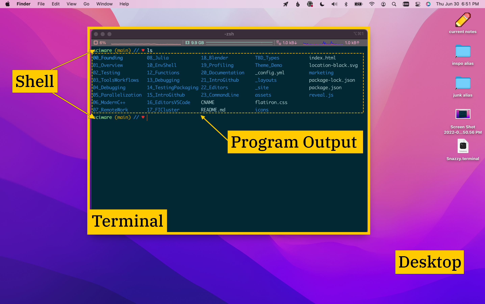

# Sciware

## Intro to the Command Line

https://sciware.flatironinstitute.org/40_SummerIntro/cli-exercises.md


## Agenda

- What is a Command Line Interface?
- Guided exercises in basic commands and principles


# What is a Command Line Interface?

- "CLI" = _command line interface_
    - usually interacting with a keyboard
    - "terminal", "shell", (rarely) "console"
- "GUI" = _graphical user interface_
    - interacting with a mouse or touch
    - "desktop", "window system"


## Parts of a CLI





## Example Shell Command


- The *prompt* is from the shell (user types the rest)
- The *command* is the program to run
- *options* or *flags* control how command behaves
- *arguments* tell command what to operate on


## What Are Shell Commands?

- Usually just programs on the file system
  - must have "execute" permissions (we'll discuss later)
  - extension (".py", ".txt" etc.) doesn't really matter
- can be compiled (binary) or text
  - text files are interpreted as commands, just like if you typed them
- `which` command shows you the full path
  - Helpful to distinguish e.g. different Python interpreters


### Vocabulary Reminders

- *Operating system*: the code that makes the computer hardware work
- *File system*: the part of the OS that:
  - stores data permanently on disk (*files*)
  - and organizes it (into *directories* or *folders*)


- On *Unix*-like systems:
  - File system begins at `/` ("root")
  - Directories separated with `/` character
  - A location string is called a *path* (`/home/users/NAME`)
- *absolute paths* start with `/`
- *relative paths* don't
  - They're relative to some "current location"
  - That's usually the "working directory"


# Exercises -- Filesystem


## First Steps

- Open a terminal
- Use `pwd` to **p**rint the **w**orking **d**irectory
  - = "figure out where you are"
- Run a git command to clone our exercise repository:

```bash
$ git clone https://github.com/flatironinstitute/sciware-command-intro.git
```


### What did you get?

- `ls` command **l**i**s**ts files and directories
  - Q: What new directory got created when you cloned the repo?
- Use the `cd` command to **c**hange **d**irectory into that one


### Special path characters

- `.` refers to the current directory
- `..` refers to the parent directory (the one above the current one)
- `~` is an alias for your *home directory*
  - Exercise: What are 3 `cd` commands to bring you back to where you cloned the repo?
  - Q: What do you do if you want to go up 2 levels?


- Assume you are in the repo directory and cloned it to your home directory:
```bash
$ cd .. # just go up one level
$ cd /home/USERNAME/  # absolute path
$ cd ~ # use the home directory alias
$ cd   # cd with no argument defaults to cd ~
$ cd ../.. # to go up two levels
```


## Learning more about files

- Use `-l` flag to `ls` to see more details about files
  - Exercise: who owns `Mainfile.idx`?
  - Exercise: Look at `myfile_02.txt`. How is `ls -l -h` different from `ls -l`?
  - Q: What does the tab key do when you type `ls -l M`? What about `ls -l m`?
  - Q: How is `ls -a` different from `ls`?


```bash
$ ls -l Mainfile.idx
-rw-rw-r-- 1 jsoules jsoules 43 Jun  3 14:51 MainFile.idx
```

Those columns are:
- Access permissions
- Link count
- Owner and group of the file
- size of the file (in bytes)
- modification date (and time, if <1 year ago)
- file name


- `ls -l -h` (or `ls -lh`, you can combine single-letter flags) shows the
  file size in **h**uman-readable units
- Tab completion automatically completes a filename, up to uniqueness
  - Since only one file starts with capital `M`, `ls -l M<tab>` autocompletes fully
  - Many files start with `m` (lowercase), so `ls -l m<tab>` completes only the shared prefix
    - Hitting tab twice shows you all the possible completions


### Special handling

- Q: How is `ls` different from `ls *`?
  - How is `ls` different from `ls -d *`? What does `-d` do?
- Q: How is `ls -a` different from `ls`?


- `ls` by itself lists all files and directories
  - But `ls <some-directory>` lists the directory *contents* by default
  - `ls -d` shows directories themselves, just as with default `ls`
- `ls -a` shows **a**ll files, including hidden ones
  - Files or directories starting with `.` are hidden by default


## Globbing (what's a *?)

- `*` is a *wildcard character*
  - The shell turns it into a list of all possible matches
  - Expanding a wildcard is called *globbing*
- Q: What does `ls -l myfile_01.txt myfile_02.txt` do?
  - Q: What does `ls -l myfile_0*` do?
  - How is that different from `ls -l myfile*`?
  - What does `ls -l myfile_?2*` do?

This is why a word is worth a thousand pictures!


- `ls` with multiple arguments provides information about each one
- The wildcard only expands to possible matches
  - So `myfile_0*` is expanded to all the files that start with `myfile_0`
  - `myfile*` matches more (not just `_0` files)
- A `?` replaces a *single* character, while `*` replaces *zero or more*
  - So `myfile_?2*` matches `myfile_02.txt` and `myfile_12.txt`


- You can use square brackets `[]` to list specific options
- Q: What does `ls -l myfile_1[1,3,5]*` do?
- Ex: Use `ls` and wildcards to show all the even-numbered `myfile`s.


- `ls -l myfile_1[1,3,5]*` gets files 11, 13, 15
- One solution:
```bash
$ ls myf*_?[0,2,4,6,8]*
```
- Be careful not to include `myfile_05.2.txt`!


### Aside: more navigation

- Use the up arrow to scroll through prior commands
  - You can edit them too by moving the cursor left or right
- Use `control-a` (`ctrl-a` or `C-a`) to move the cursor to the start of the line
- `C-e` moves the cursor to the end of the line
- Holding down `ctrl` when tapping left or right moves by word instead of by character


### Cutting and pasting on command line

- `ctrl-k` (**k**ill) cuts from cursor to end of line
- `ctrl-y` (**y**ank) pastes it back
- `C-c` cancels whatever you were typing & gives you a new prompt


## Copying and Moving Files

- `mv` **m**o**v**es files
- `cp` **c**o**p**ies files
- Exercise: rename the largest file in this directory to "big.txt"
  - (Be sure to name it back after!)


```bash
$ ls -lh *  # read the results--biggest file is myfile_02.txt
$ mv myfile_02.txt big.txt
$ ls    # to confirm it worked
$ mv big.txt myfile_02.txt # undo your change!
```
There are more automatic ways to do this, too, but we haven't
gotten there yet.


## Managing directories

- `mkdir` **m**a**k**es a **dir**ectory
- `rm` **r**e**m**oves a file
  - There is *NO TRASH CAN*--files are removed immediately!
- `rmdir` **r**e**m**oves a **dir**ectory
- Exercise: Make a directory called "newdir"
  - Now copy into it all the files whose names end in `txt`
- Exercise: Remove the "newdir" directory


```bash
$ mkdir newdir
$ cp *txt newdir
$ ls newdir  # confirm it worked
$ rm newdir/* # rmdir only works on empty dirs!
$ rmdir newdir
```

- Note: we could also do `rm -r newdir` to **r**ecursively remove
the directory and its contents
  - Again, no backsies! Be careful!


### Special characters

- Q: What happens when you do `ls dir1/file with spaces.doc`?
- Q: What shows when you do `ls dir1/file` and hit `tab`?


- Some characters (like spaces, `?`, `[]`, `*`) are special
- If they're actually in the name, they must be "escaped"
  - Putting a `\` in front a special character makes it not special
- Matching quotes (double `"` or single `'`) also solve this problem

```bash
$ ls dir1/"file with spaces.doc"  # this works fine
```


# Exercises -- Pipe Power


## Printing values

- `echo` prints out the arguments it gets from the shell
- `cat` (for con**cat**enate) prints the contents of all specified files
- `nano` is a simple text editor


- Q: What does `echo myfile_0*` do?
- Q: What does `cat MainFile.idx` do?
- Q: What does `nano myfile_02.txt` do?


- `echo myfile_0*`: shell expands the wildcard
  - the `echo` prints all the file names it received
  - (This is just `ls` with extra steps!)
- `cat MainFile.idx` prints the text of `MainFile.idx`
- `nano myfile_02.txt` opens an interactive editor


### Peeking in files

- `more`, like `cat`, prints out the file contents
  - but it does so one screenful at a time (you ask for **more**)
- `less` is like `more` but also lets you scroll back up
  - "`less` is `more`"

- Ex: Try `less` and `more` on `myfile_02.txt`


- `head` shows the first few lines of a file
  - 10 by default, but `-n` lets you set how many
- `tail` shows the *last* few lines of a file
  - 10 by default, `-n` to set it
- Ex: Print the first 15 lines of `myfile_02.txt`
- Ex: Print the last 3 lines of `myfile_02.txt`


```bash
$ head -n 15 myfile_02.txt
$ tail -n 3 myfile_02.txt
```

- There is also `tail -f FILE`
  - **f**ollows the file and prints new writes to the terminal
  - useful if `FILE` is still being written
  - often used for monitoring log files
  - exit with `control-c` (aka `ctrl-c` or `C-c`)


## Pipes

- Pipes `|` let you use the *output* of one command as the *input* of another
- `cat myfile_02.txt | head -n 3`
  - This will print the first 3 lines of `myfile_02.txt`
- Exercise: Print just lines 11-13 of `myfile_11.txt`.


```bash
$ cat myfile_11.txt | head -n 13 | tail -n 3
# or
$ head -n 13 myfile_11.txt | tail -n 3
```


- `wc` gives **w**ord **c**ounts (as well as character and line counts)
  - `wc -l` prints the number of lines in the input
- `ls -1` (that's a number 1) returns one filename per line
  - Ex: Run `wc MainFile.idx`. What do the fields mean? (Use `cat` to check)
  - Ex: Use `ls -1`, pipes, and `wc` to find how many files are in this directory


```bash
$ wc MainFile.idx
 2  9 43 MainFile.idx
```
- Returns # of lines, # of words, # of characters

```bash
$ ls -1 | wc -l
```
- Returns 25, but note--that *does* include the directories!


## Other redirections

- `<` takes input *from* a file
  - (for commands that want keyboard input while running)
- `>` sends output *to* a file
  - `> FILE` will overwrite ("clobber") `FILE` if it already exists
  - use `>>` to *append* to that file instead
- Useful for recording output of a command
- Q: What will `cat myfile_07.txt >out` do?
  - Q: What if you do `cat MainFile.idx >out` afterward?
  - Q: What if you do `cat MainFile.idx >>out` instead?


### Aside--revisiting history

- `history` shows you a numbered list of the commands you've run before
  - This can be very long--`history | tail` is useful!
  - or `history | grep PATTERN` to use `grep` to search for a pattern
- Exercise: use `grep` to look for every command you've run using the word "myfile" today


```bash
$ history | grep myfile
```
- should return several entries
- Note: it's matching the pattern against *what you typed*!
  - If you ran `cat myf*`, `myf*` might have *expanded* to `myfile`
  - but `grep` does not match "myfile" against it--that's not what you typed
- `grep` can also be used to search the contents of files
  - Worth looking at more, but not today


- You can use `!` to rerun a command from `history`
  - `!!` reruns the previous command
  - `!54` will rerun the command numbered 54
  - note that the numbers will change as you work
- `C-r` lets you do a search back through your command history
  - Type what you want to search for
  - Type `C-r` again to cycle through matches
  - Enter to rerun the command, or left/right arrow to edit it first
- Exercise: Use `ctrl-r` to see all the commands you ran today containing `07`


### Shell does the expansion

- Q: What does `echo *` do?
- Q: What does `m*` (with no command) do?


- `echo *`: shell passes all matching file names to `echo` which prints them
  - `echo` never sees or interacts with the `*`
- `m*` gets expanded to every filename
  - the shell then tries to **execute the files as commands**
  - This fails because they aren't *executable*


# Exercises: Intermediate Topics


## Permissions

- In Unix, all files (and directories) have *permissions*
  - Controls who can do what with files
  - See them with `ls -l`
- They come in 3 sets of 3, describing:
  - **r**ead, **w**rite, and e**x**ecute permissions for
  - the file's *owning user*, *group*, and *all others*
- Q: What permissions are set on `MainFile.idx`?
- Q: What's different between `myfile_01.txt` and `dir1`?


```bash
$ ls -l MainFile.idx
-rwxrw-r-- 1 jsoules jsoules 43 Jun 11 11:48 MainFile.idx
```
- `MainFile.idx` gives read, write, execute to its owner (`jsoules`)
  - members of the `jsoules` group can read or write it
  - all other users can only read it


```bash
$ ls -ld myfile_01.txt dir1
drwxrwxr-x 3 jsoules jsoules 4096 Jun 11 11:48 dir1
-rw-rw-r-- 1 jsoules jsoules    0 Jun 11 11:48 myfile_01.txt
```
- `dir1` is a directory so the first character is a `d`
  - `myfile_01.txt` is a file, so it's a `-`
- `dir1` has e`x`ecute permissions for everyone
  - You can't enter or see into a directory without execute permissions


### Executing Successfully

- Most shell commands are actually executable files
  - binary files: treated as compiled code
  - text files: human-readable list of shell commands to run
  - (This makes it easy to combine multi-step procedures)
- But this only works for files with *executable* permissions
  - If a file isn't executable, it can't be run
- Tab autocomplete is aware of context
  - Q: What happens when you type `M` and hit tab?
  - Q: What happens when you type `R` and hit tab?


- `M <tab>` offers to autocomplete `MainFile.idx`
  - that file is marked *executable*
  - (although it shouldn't be, it doesn't do anything)
- `R <tab>` does NOT autocomplete `README`
  - `README` is not marked executable


### Changing permissions

- `chmod` **ch**anges file permissions (**mod**e)
  - `chmod a+x some-file`
  - First letter: whose permissions?
    - `u` user/owner, `g` group, `o` others, `a` all
  - Second character: `+` add or `-` remove
  - 3rd letter: what permissions? `r`/`w`/`x`
- Permissions can also be represented numerically
  - don't worry about it


### `which` revisited

- `which NAME` tells you the location of the file that gets run when you type NAME
- It does this by searching the `PATH` variable
  - That's a list of paths, separated by colons `:`
  - Checks these, in order, for *executable* file with that name
- Shell replaces variable with its value when prefixed with `$`
  - So to mean "the value of `PATH`" you'd type `$PATH`
  - Usually people capitalize the names of variables


- Ex: Find where your `git` executable is installed, and print its detailed listing
- Q: Does your system have `python` available? What about `python3`?
- Ex: Print the full contents of the `PATH` variable


- `which git` shows the location
  - Can type that result into `ls -l` for listing
  - Can also do `ls -l ``which git`` `
  - (backticks mean "replace this with the result of running the command")
- `which python` and `which python3` will answer Q2 for you
- To print `PATH` use `echo $PATH` -- remember you need the dollar sign `$`


## Shell variables

- Any string of letters can be a variable
  - *Including* words that are already in use!
  - That's why you need a special character `$` to get a variable's contents
  - By convention we use ALL-CAPS
- To set a variable, just use `=`
  - `VAR=1234`
  - As always, you need to escape or quote any spaces
- When prefixed with `$`, the *shell* will expand the variable
  - `echo $VAR`


- Ex: Define `MYNUM` to store your favorite number, then print it.
- Ex: Define `STAR` to be `*`.
  - Q: What happens if you type `echo $STAR`?
  - Q: Does this change if you switch directory?
- Ex: Define `LS` to be `ls -l`
  - Q: What does `echo $LS` do?
  - Q: What happens if you just type `$LS` at the prompt?


- `MYNUM=13; echo $MYNUM` (`;` ends a command, so you can write them on one line)
- `STAR=*`, then `echo $STAR` shows all files in this directory
  - `cd dir1` then `echo $STAR` shows the files in `dir1`
  - Shell *first* replaces the variable
  - *then* expands the wildcard
  - *then finally* passes all results to `echo`
- `echo $LS` just prints `ls -l`
- `$LS` actually *runs* `ls -l`!


## `find`

- Complex but powerful way to find files matching criteria
- Basic use: `find . -name '*txt'`
- first argument(s) (without `-`) say what directories to search
- arguments with `-` (like `-name`) apply *tests*
  - Each test can take its own arguments
- files that pass, go on to the next test
  - if all tests pass, by default `find` prints the filename
  - (including path, from wherever you started the search)


- Other test types:
  - `-iname` is like `-name` but case-insensitive
  - `-type` can be `f` for files or `d` for directories
  - `-size` with + or - (`-size +100k` = files over 100 kb)
  - `-mtime` for the modification date...
- There are many more; [Wikipedia has extensive examples](https://en.wikipedia.org/wiki/Find_(Unix))
- Can also combine tests with `-and` and `-or`


- Ex: find all files in this directory or its children, ending in `txt`
- Ex: find all directories containing the letter `i` (do any surprise you?)
- Ex: find all directories containing the letter `i` and also the letter `d`


- `$ find . -name "*txt" -print`
- `$ find . -type d -name '*i*'`
  - `-print` is implied by default
  - oh hey, there's a hidden `.git` directory!
- `$ find . -type d -name '*i*' -name '*d*'`


## Beyond Pipes

- Recall: `|` passes output of a command to input of next command
- But what if we want to pass those values as *arguments*?


### `xargs`

- `xargs` takes its input & converts to command-line arguments
- Q: What does `ls myfile_?[1,2]* | xargs cat` do?
- `-I` flag lets you specify the character(s) to use to stand in for each input
  - `xargs -I {}` means "Replace `{}` in the command with the arguments"
  - Commands like `mv` or `cp` need a way to say *what* you are moving
  - e.g. `xargs -I {} cp {} DESTINATION/`
- Exercise: Use one `xargs` command to copy all the files named in `myfile_07.txt`
  into the `dir2` directory.
  - Hint: try `cat`ting `myfile_07.txt` to see what it contains!


```bash
$ cat myfile_07.txt | xargs -I {} cp {} dir2
```
You may wish to delete the extra copies before the next exercise.


### `find -exec`

- Don't use `find` and `xargs` together--clunky & slow
- Instead, use `-exec` to **exec**ute a command on the `find` results
  - executed command is everything between `-exec` & `';'`
    - (can use `';'` or `\;`, it just needs to be escaped)
  - `find` replaces `{}` in the command with the path to each found file
- Exercise: use `find -exec` and `cp` to copy all `.txt`
  files into the `dir2/done/` directory
   - hint: you will get a warning unless you use `-prune` and `-o`


```bash
$ find . -name "*txt" -exec cp {} dir2/done/ ';' # gives warning
$ find . -name "done" -prune -o -name "*txt" -exec cp {} dir2/done/ ';' # no warning
```

Q: Why did the warning occur?


```bash
$ find . -name "*txt" -print -exec cp {} dir2/done/ ';'
```
This explains the error: add `-print` when `-exec` is used to keep the printing behavior
