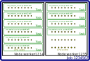
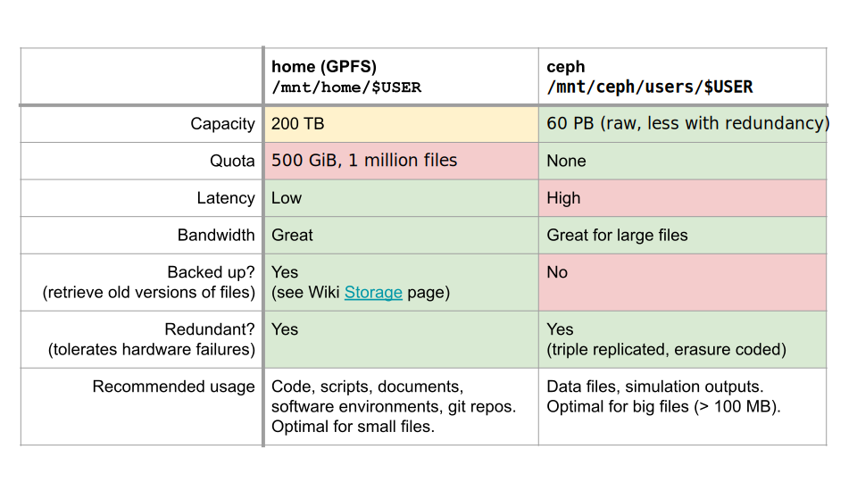

# Sciware

## Flatiron Summer Workshops

https://sciware.flatironinstitute.org/40_SummerIntro

- Schedule
  - **July 2**: Summer Sciware 4
  - All 10 AM - noon in the IDA Auditorium (162 Fifth Ave, 2nd Floor)


## Today's agenda

- Cluster overview, access
- Modules and software
- VS code remote
- Python environments and Jupyter kernels
- Slurm and parallelization
- Filesystems and storage


# Cluster overview


## Rusty


* 4 login nodes (`ssh rusty`)
* \~140k CPU cores, \~1400 nodes, 1.8PB RAM (\~1TB/node)
   * CPU nodes through "center" partition (`-p ccx`), exclusive
* 150 H200, 240 H100, 288 A100 GPUs

https://wiki.flatironinstitute.org/SCC/Hardware/Rusty


## Popeye


* Completely separate cluster (separate storage, job queue)
* \~42k CPU cores, \~800 nodes, 700TB RAM (\~1TB/node)
   * CPU nodes through "center" partition (`-p ccx`), exclusive

https://wiki.flatironinstitute.org/SCC/Hardware/Popeye


# Remote access

- Setup your cluster account
   - Mentor requests account on FIDO, provides PIN
   - Set your password on FIDO
   - Get a one-time verification code on FIDO
   - `ssh -p 61022 USERNAME@gateway.flatironinstitute.org`
   - Setup google-authenticator
- From gateway:
   - `ssh rusty` (or `ssh popeye`)

https://wiki.flatironinstitute.org/SCC/RemoteConnect


# Modules & software

## Overview

- Most software you'll use on the cluster will either be:
  - In a *module* we provide
  - Downloaded/built/installed by you (often using modules)
- By default you only see the *base system* software (Rocky8)


### `module avail`: Core

- See what's available: `module avail`

```text
------------- Core --------------
gcc/10.5.0                
gcc/11.4.0               (D)
gcc/12.2.0
openblas/single-0.3.26   (S,L)
openblas/threaded-0.3.26 (S,D)
python/3.10.13           (D)
python/3.11.7
...
```
- `D`: default version (also used to build other packages)
- `L`: currently loaded
- `S`: sticky


### `module load` or `ml`

- Load modules with `module load` or `ml NAME[/VERSION] ...`
   ```text
   > python -V
   Python 3.6.8

   > ml python
   > python -V
   Python 3.10.13
   ```
- Remove with `module unload NAME` or `ml -NAME`
- Can use partial versions, and also switch
   ```text
   > module load python/3.11
   The following have been reloaded: (don't be alarmed)
   > python -V
   ```


### `module show`

* Try loading some modules
* Find some command one of these modules provides
* (Hint: look at `module show MODULE`)


### Other module commands

- `module list` to see what you've loaded
- `module reset` to reset to default modules
- `module spider MODULE` to search for a module or package
   ```text
   > module spider numpy
   > module spider numpy/1.26.4
   ```
   - Some modules are "hidden" behind other modules: `module spider mpi4py/3.1.5`


### module releases

- We keep old sets of modules, and regularly release new ones
- Try to use the default when possible

```text
modules/2.3-20240529 (S,L,D)
modules/2.4-beta2    (S)
```


# Python environments

- `uv` (also in `modules/2.4`)
- Virtual environments


## Python packages: venv

- `module load python` has a lot of packages built-in (check `pip list`)
- If you need something more, create a [virtual environment](https://docs.python.org/3/tutorial/venv.html):

```bash
module load python
python3 -m venv --system-site-packages ~/myvenv
source ~/myvenv/bin/activate
pip install ...
```

- Repeat the `ml` and `source activate` to return in a new shell


### Too much typing

Put common sets of modules in a script
```bash
# File: ~/mymods
module reset
module load gcc python hdf5 git
source ~/myvenv/bin/activate
```
And "source" it when needed:
```bash
source ~/mymods
```

- Avoid putting module loads in `~/.bashrc`


## Other software

If you need something not in the base system, modules, or pip:
- Ask your mentor!
- Download and install it yourself
  - Many packages provide install instructions
  - Load modules to find dependencies
- Ask for help!  #code-help, #sciware, #scicomp, scicomp@


### Jupyter

- JupyterHub: https://jupyter.flatironinstitute.org/
  - Login and start a server
  - Default settings are fine: JupyterLab, 1 core
- To use an environment you need to create a kernel
  - Create a kernel with the environment
     ```bash
     # setup your environment
     ml python ...
     source ~/myvenv/bin/activate
     # capture it into a new kernel
     ml jupyter-kernels
     python -m make-custom-kernel mykernel
     ```
  - Reload jupyterhub and "mykernel" will show up providing the same environment


### VS code remote

- In JupyterLab: File, Hub control panel, Stop My Server


# Break

### Survey


# Running Jobs on the FI Cluster

## Slurm and Parallelism

How to run jobs efficiently on Flatiron's clusters


## Slurm

- How do you share a set of computational resources among cycle-hungry scientists?
  - With a job scheduler! Also known as a queue system
- Flatiron uses [Slurm](https://slurm.schedmd.com) to schedule jobs

</img>


## Slurm
- Wide adoption at universities and HPC centers: same commands work on most clusters (some details are different)
- Run any of these Slurm commands from a command line on rusty or popeye (or your workstation)

https://wiki.flatironinstitute.org/SCC/Software/Slurm


## Batch file

Write a _batch file_ called `myjob.sbatch` that specifies the resources needed.

<div class="two-column">  
  <div class="grid-item">

```bash
#!/bin/bash
#SBATCH --partition=genx  # Non-exclusive partition
#SBATCH --ntasks=1        # Run one instance
#SBATCH --cpus-per-task=1 # Cores?
#SBATCH --mem=1G          # Memory?
#SBATCH --time=00:10:00   # Time? (10 minutes)

echo "Starting..."
hostname
sleep 1m
echo "Done!"
```
  </div>
  <div class="grid-item">
    </img>
  </div>
</div>


## Submitting a job

- Submit the job to the queue with `sbatch myjob.sbatch`: \
  `Submitted batch job 1234567`
- Check the status with: `squeue --me` or `squeue -j 1234567`


## Where is my output?

- By default, anything printed to `stdout` or `stderr` ends up in `slurm-<jobid>.out` in your current directory
- Can add `#SBATCH -o myoutput.log` `-e myerror.log`


## Loading environments

Good practice is to load the modules you need in the script:

```bash
#!/bin/bash
#SBATCH ...

module reset
module load gcc python
source ~/myvenv/bin/activate

# (or: source ~/mymods)

python3 myscript.py
```


## What about multiple things?

Let's say we have 3 files, each using 1 GB and 1 CPU

<div class="two-column">  
  <div class="grid-item">

```bash
#!/bin/bash
#SBATCH --mem=10G           # Request 10x the memory
#SBATCH --time=02:00:00     # 2 hours
#SBATCH --ntasks=3          # Run 2 instances
#SBATCH --cpus-per-task=1   # Request 1 CPU
#SBATCH --partition=genx

# this would run 3 identical tasks:
#srun python3 myjob.py

# instead run different things:
srun -n1 python3 myjob.py data1.hdf5 &
srun -n1 python3 myjob.py data2.hdf5 &
srun -n1 python3 myjob.py data3.hdf5 &
wait # wait for all background tasks to complete
```
  </div>
  <div class="grid-item">
    </img>
  </div>
</div>


## Slurm Tip: Estimating Resource Requirements

- Jobs don't necessarily run in order
  - Specifying the smallest set of resources for your job will help it run **sooner**
  - But don't short yourself!
- Memory requirements can be hard to assess, especially if you're running someone else's code


## Slurm Tip: Estimating Resource Requirements

1. Guess based on your knowledge of the program. Think about the sizes of big arrays and any files being read
2. Run a test job
3. Check the actual usage of the test job with:\
`seff <jobid>`
  - `Job Wall-clock time`: how long it took in "real world" time; corresponds to `#SBATCH -t`
  - `Memory Utilized`: maximum amount of memory used; corresponds to `#SBATCH --mem`


## Slurm Tip: Choosing a Partition (CPUs)

- Use `-p gen` to submit small/test jobs, `-p ccX` for real jobs
  - `gen` has small limits and higher priority
- The center and general partitions (`ccX` and `gen`) always allocate whole nodes
  - **All cores, all memory**, reserved for you to make use of
- If your job doesn't use a whole node, you can use the `genx` partition (allows multiple jobs per node)
- Or run multiple things in parallel...


## Running Jobs in Parallel

- You've written a script to post-process a simulation output
- Have 10–10000 outputs to process
   ```bash
   $ ls ~/myproj
   my_analysis_script.py
   $ ls ~/ceph/myproj
   data1.hdf5  data2.hdf5  data3.hdf5 [...]
   ```
- Each file can be processed independently
- Running 1000 independent jobs won't work: limits on how many jobs can run


## Running Jobs in Parallel

- This pattern of independent parallel jobs is known as "embarrassingly parallel" or "pleasantly parallel"
- What if tasks take a variable amount of time?
  - The single-job approach allocates resources until the longest one finishes
- What if one task fails?
  - Resubmitting requires a manual post-mortem
- disBatch (`module load disBatch`)
  - Developed here at Flatiron: https://github.com/flatironinstitute/disBatch


## disBatch
- Write a "task file" with one command-line command per line:
   ```bash
   # File: jobs.disbatch
   python3 myjob.py data1.hdf5 >& data1.log
   python3 myjob.py data2.hdf5 >& data2.log
   python3 myjob.py data3.hdf5 >& data3.log
   ```
- Can also use loops:
   ```bash
   #DISBATCH REPEAT 13 python3 myjob.py data${DISBATCH_REPEAT_INDEX}.hdf5 >& data${DISBATCH_REPEAT_INDEX}.log
   ```
- Submit a Slurm job, invoking the `disBatch` executable with the task file as an argument:\
`sbatch -p genx -n 2 -t 0-2 disBatch jobs.disbatch`


## disBatch
<div class="r-stack">
  </img>
  </img>
  </img>
</div>


## disBatch

- When the job runs, it will write a `jobs.disbatch_*_status.txt` file, one line per task
- Only limited output is captured: if you need logs, add `>&` redirection for each task
- Resubmit any jobs that failed with:\
`disBatch -r jobs.disbatch_*_status.txt -R`

```text
0	1	-1	worker032	8016	0	10.0486528873	1458660919.78	1458660929.83	0	""	0	""	'./my_analysis_script.py data1.hdf5'
1	2	-1	worker032	8017	0	10.0486528873	1458660919.78	1458660929.83	0	""	0	""	'./my_analysis_script.py data2.hdf5'
```


### Slurm Tip: Tasks and threads

- For flexibility across nodes, prefer `-n`/`--ntasks` to specify total tasks (not `-N`/`--nodes` + `--ntasks-per-nodes`)
- Always make sure `-c` and thread count match:
   ```bash
   #SBATCH --cpus-per-task=4 # number of threads per task

   export OMP_NUM_THREADS=$SLURM_CPUS_PER_TASK

   run
   ```
- Total cores is `-c` * `-n`


## Summary of Parallel Jobs
- Independent parallel jobs are a common pattern in scientific computing (parameter grid, analysis of multiple outputs, etc.)
    - Slurm job arrays or disBatch work better than MPI

</img>


## GPUs

- GPU nodes are not exclusive (like genx), so you should specify:
  - `-p gpu`
  - Number of tasks: `-n1`
  - Number of cores: `--cpus-per-task=1` or `--cpus-per-gpu=1`
  - Amount of memory: `--mem=16G` or `--mem-per-gpu=16G`
  - Number of GPUs: `--gpus=` or `--gpus-per-task=`
  - Acceptable GPU types: `-C v100|a100|h100|h200`


# Break

### Survey


# File Systems


https://wiki.flatironinstitute.org/SCC/Hardware/Storage


## Home Directory

<ul>
  <li>Every user has a "home" directory at <code>/mnt/home/USERNAME</code> (or <code>~</code>)</li>
  <li>Home directory is shared on all nodes (rusty, workstations, gateway)</li>
  <li>Popeye (SDSC) has the same structure, but it's a <em>different</em> home directory</li>
</ul>


## Home Directory

<b>Your home directory is for code, notes, and documentation.</b>

<p style="text-align:left;">It is <b>NOT</b> for:</p>

1. Large data sets downloaded from other sites
2. Intermediate files generated and then deleted during the course of a computation
3. Large output files

<p style="text-align:left;"><b>You are limited to 900,000 files and 450 GB</b> (if you go beyond this you will not be able to log in)</p>


## Backups (aka snapshots)

<div class="r-stack">

  

  <div class="fragment fade-in" data-fragment-index=0>
    If you accidentally delete some files, you can access backups through the <code>.snapshots</code> directory like this:

  <pre style="font-size:0.65em">
  <code data-trim>
ls .snapshots
cp -a .snapshots/@GMT-2021.09.13-10.00.55/lost_file lost_file.restored</code>
  </pre>

  <ul>
    <li><code>.snapshots</code> is a special invisible directory and <em>won't</em> autocomplete</li>
    <li>Snapshots happen once a day and are kept for 3-4 weeks</li>
    <li>There are separate long-term backups of home if needed (years)</li>
  </ul>
  </div>

</div>


## Ceph

- Pronounced as "sef"
- Rusty: `/mnt/ceph/users/USERNAME`
- Popeye: `/mnt/sdceph/users/USERNAME`
- For large, high-bandwidth data storage
- Not a "scratch" filesystem: no automatic deletion
- No backups<sup>\*</sup>
- Do not put &ge; 1000 files in a directory

<small><sup>\*</sup> <code>.snap</code> is coming soon</small>


## Summary: Persistent storage




## Monitoring Usage: `/mnt/home`

View a usage summary:

<pre style="font-size:0.75em">
<code data-trim class="language-bash">
module load fi-utils
fi-quota
</code>
</pre>


## Monitoring Usage: `/mnt/home`

To track down large files or file counts use:
<pre style="font-size:1em">
<code data-trim class="language-bash">
ncdu -x --show-itemcount ~
</code>
</pre>


## Monitoring Usage: `/mnt/ceph`

- Don't use <code>du</code> or <code>ncdu</code>, it's slow
- Use can use `ls -lh`!

<pre style="font-size:0.7em">
    <code data-trim class="language-bash">
module load fi-utils
cephdu
    </code>
</pre>


## Moving Files
- Use `mv` within a filesystem, __NOT__ in between them
- Use `rsync` between `/mnt/ceph` and `/mnt/home`, see below
- `rsync` allows to stop in the middle, then resume
- `rsync` can verify the transfer before removal

```bash
# Transfer
rsync -a /mnt/home/johndoe/SourceDir /mnt/ceph/users/johndoe/TargetParentDir/
# Verify
rsync -anv /mnt/home/johndoe/SourceDir /mnt/ceph/users/johndoe/TargetParentDir/
# Clean-up
rm -r /mnt/home/johndoe/SourceDir
```


## Local Scratch

- Each node as a `/tmp` (or `/scratch`) disk of &ge; 1 TB
- For extremely fast access to smaller data, you can use the memory on each node under `/dev/shm` (uses memory)
- Both of these directories are cleaned up after _each_ job
  - Make sure you copy any important data/results over to `ceph` or your `home`


## Summary: Temporary storage


## Tape Storage

- We have a large "cold storage" tape archive
- Can be used to backup things you don't expect to need but don't want to lose
- Archive by moving files to /mnt/ceph/tape/*USERNAME* (contact SCC to setup the first time)
- Restores by request (please allow a few weeks)


# Planned usage

- Everyone has planned usage estimates (entered annually)
- Storage, CPU time (core-hours), GPU time (GPU-hours), for each cluster (rusty, popeye)
- Monitor usage on FIDO, or:

<pre style="font-size:0.75em">
<code data-trim class="language-bash">
module load fi-utils
fi-usage
</code>
</pre>


# Survey


# Questions & Help


