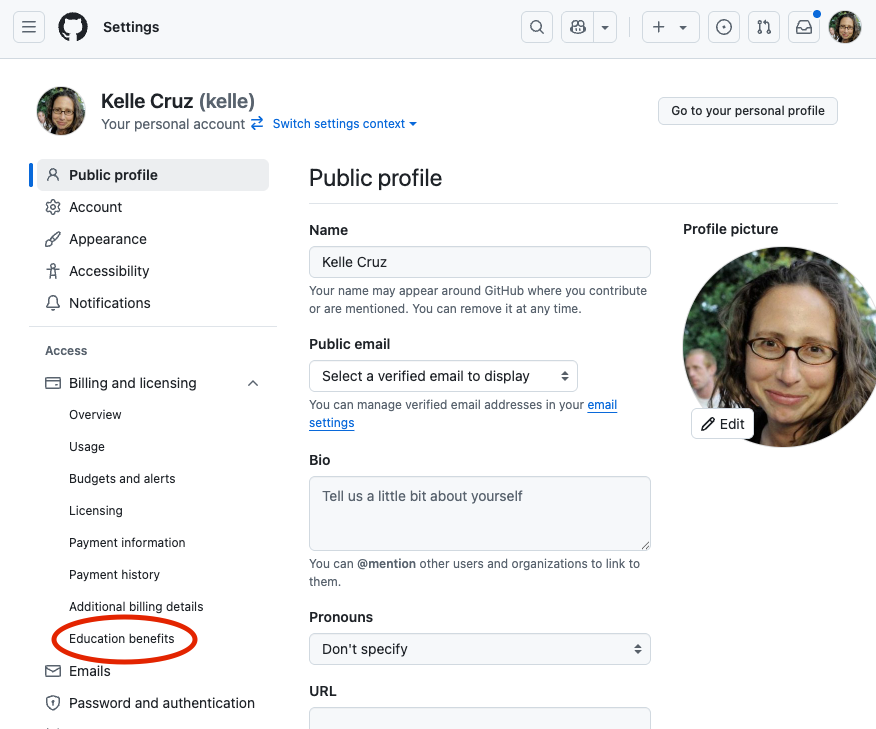
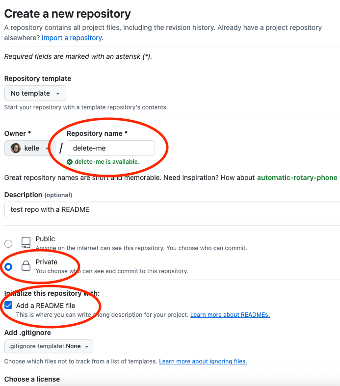

# Sciware

## Intro to GitHub

https://sciware.flatironinstitute.org/40_SummerIntro/github1.md

## Agenda

- What are Git and GitHub?
- Setting up a Free Pro account
- Setting up Git and GitHub on your computer

# Intro to Git and GitHub

## Version control

<ul>
<li>keeps track of the edit history to one or more files</li>
<li>serves as a backup</li>
<li>makes it easier to collaborate and combine multiple changes to the same file</li>
</ul>

*an open-source, distributed, command-line, version-control tool*

<ul>
<li>released in 2005 by Linus Torvalds for Linux kernel (alternative to CVS, svn, ...)</li>
<li>dominant tool for academic and industry software development</li>
<li><b>distributed</b>: no central server, every repo is fully functional, independent, and can "sync" with any other</li>
</ul>

<h2>GitHub </h2>

* A central website for storing and sharing git repositories
* Started in 2008 as a freemium service, now owned by Microsoft
* Provides repository management, permissions, collaboration tools, CI, etc.
* Alternatives: gitlab, bitbucket, ...

# Get a free GitHub Pro account 

## GitHub Pro accounts for Education

- unlimited private repositories
- more cloud computing resources (Codespaces)
- **Free GitHub Copilot, AI-powered coding companion**

## Do you already have GitHub Copilot? 

### https://github.com/settings/copilot/

-  🟩 if you have Copilot
-  🟨 if you do not have Copilot

## GitHub Pro accounts for Education - Qualification

- Students, Teachers, Researchers
- Easiest to use school ID with a date or recent transcript
- Other options exist

## To request a GitHub Pro account - Edu email

- Add your school .edu email address to your GitHub profile
  https://github.com/settings/emails

or 

 -  Github > Profile Photo > Settings > Emails

 -  🟩 when you have a .edu email added

## To get a Pro account - Settings

- Settings > Billing and Licensing > Education benefits

## To get a Pro account - Application

- Choose your school
- Upload your document

## HOMEWORK

Finish your GitHub for Education application.

# Make a new GitHub Repository
(stickies down)

## Make a new Private GitHub repo with a README

https://github.com/new

## Copy the SSH address to the repository

## Make sure `git` is installed

- At the Terminal prompt:

<pre  style="font-size:1em;"> <code data-trim data-noescape>&gt; git version
git version 2.30.1
</code></pre>

-  🟩 if you have git version
-  🟨 if you get an error

## Clone your new repository to your computer

- At the Terminal prompt:
<pre  style="font-size:1em;"> <code data-noescape>
&gt; git clone git@github.com:kelle/delete-me.git
&gt; ls
&gt; cd delete-me
&gt; ls 
</code></pre>

-  🟩 if you can see delete-me/README.md
-  🟨 if you're having trouble

# Setting up GitHub on your Computer

## Setting your name in Git

See what name is currently set
<pre style="font-size:1em;"> <code data-trim data-noescape>&gt; git config --global user.name
</code></pre>

Set your full name
<pre  style="font-size:1em;"> <code data-trim data-noescape>&gt; git config --global user.name "Mona Lisa"
</code></pre>

## Setting your email address

See what email address is currently set
<pre  style="font-size:1em;"> <code data-trim data-noescape>&gt; git config --global user.email
</code></pre>

Set an email address
<pre  style="font-size:0.9em;"> <code data-trim data-noescape>&gt; git config --global user.email "email@email.org"
</code></pre>
(Ideally set to the same email address you used for GitHub account)

## Viewing your email address on GitHub

## Generate an SSH key

<pre style="font-size:1em;"> <code data-trim data-noescape>&gt; ssh-keygen -t ed25519
</code></pre>

- We're going to generate a new key (one you hopefully don't have already)
- It is easiest to leave the passphrase blank

<pre style="font-size:1em;"> <code data-trim data-noescape>&gt; cat ~/.ssh/id_ed25519.pub
ssh-ed25519 AAA..... user@host
</code></pre>

Copy this whole line to the clipboard

## Add the SSH key to GitHub

- GitHub > Profile Photo > Settings > SSH and GPG keys > New SSH Key

## Add the SSH key to GitHub

- **Title** should refer to the computer on which the key was generated. ("pink mac laptop")

- Paste key into text box.

## Setup Git's default text editor

So that you don't get stuck in vi:

<pre  style="font-size:1em;"> <code data-trim data-noescape>&gt; git config --global core.editor "nano -w"
</code></pre>

How to set up your favorite editor with Git:

> https://git-scm.com/book/en/v2/Appendix-C%3A-Git-Commands-Setup-and-Config#ch_core_editor

## Questions?

### Survey

# Next week

## Tools for better coding

Thursday, June 12, 10am-12pm.

- More GitHub and VSCode
or
- Introduction to the Command Line

# Survey

