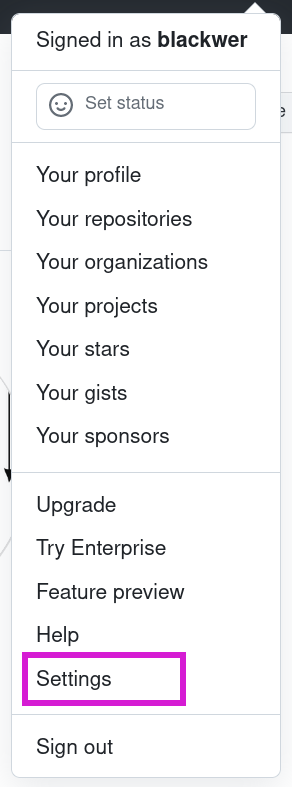
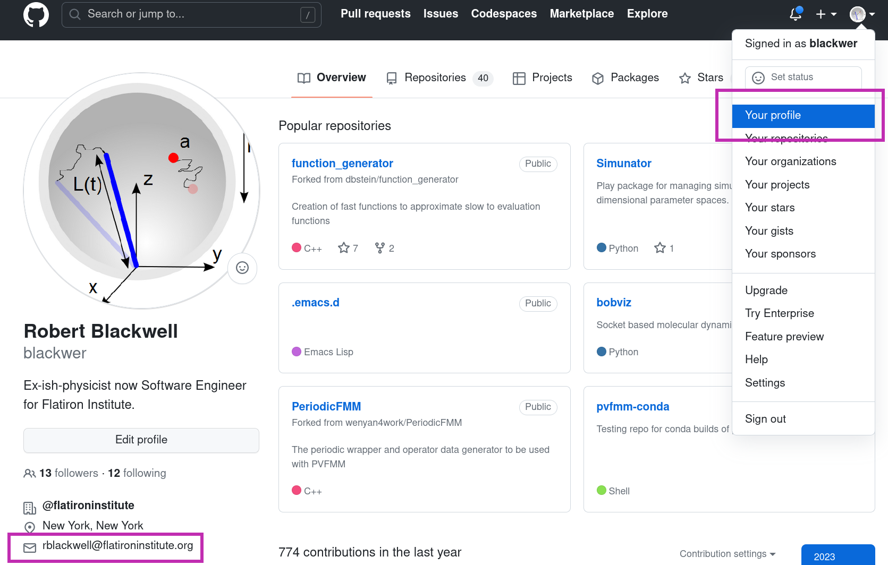
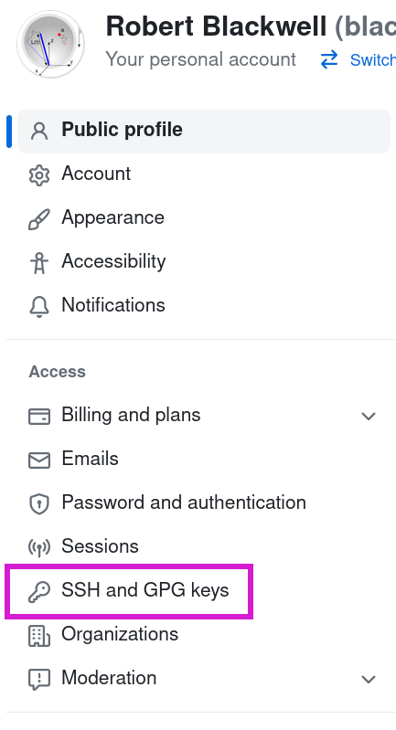
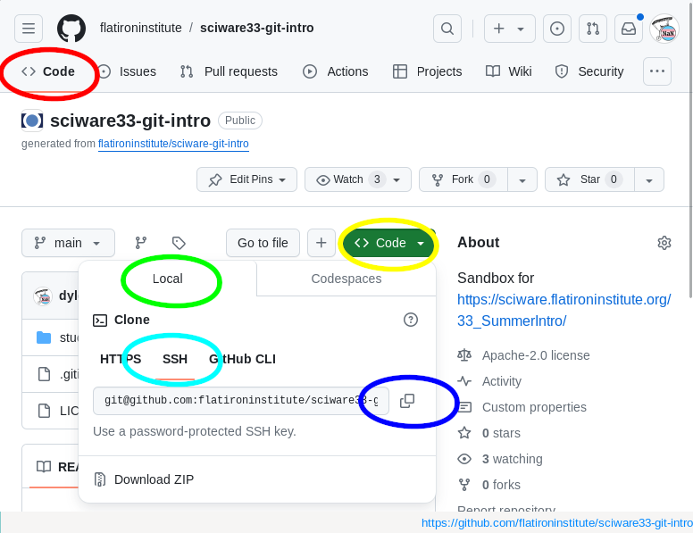
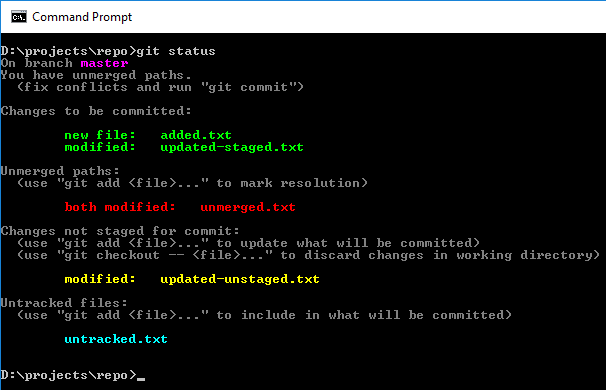

# Sciware

## Intro to GitHub

https://sciware.flatironinstitute.org/33_SummerIntro

## Agenda

- What are Git and GitHub?
- Setting up a Free Pro account
- Setting up Git and GitHub on your computer

# Intro to Git and GitHub

## Version control

<ul>
<li>keeps track of the edit history to one or more files</li>
<li>serves as a backup</li>
<li>makes it easier to collaborate and combine multiple changes to the same file</li>
</ul>

*an open-source, distributed, command-line, version-control tool*

<ul>
<li>released in 2005 by Linus Torvalds for Linux kernel (alternative to CVS, svn, ...)</li>
<li>dominant tool for academic and industry software development</li>
<li><b>distributed</b>: no central server, every repo is fully functional, independent, and can "sync" with any other</li>
</ul>

<h2>GitHub </h2>

* A central website for storing and sharing git repositories
* Started in 2008 as a freemium service, now owned by Microsoft
* Provides repository management, permissions, collaboration tools, CI, etc.
* Alternatives: gitlab, bitbucket, ...

# Get a free GitHub Pro account 

## GitHub Pro accounts for Education

- unlimited private repositories
- more cloud computing resources (Codespaces)
- Free GitHub Copilot, AI-powered coding companion

## Do you already have GitHub Copilot? 

https://github.com/settings/copilot/

## GitHub Pro accounts for Education - Qualification

- Students, Teachers, Researchers
- Easiest to use school ID with a date or recent transcript
- Other options exist

## To request a GitHub Pro account - Settings

- Add your .edu email address to your GitHub profile
  https://github.com/settings/emails

- Github > Profile Photo > Settings 

## To get a Pro account - Settings

- Settings > Billing and Licensing > Education benefits

## To get a Pro account - Application

- Choose your school
- Upload your document

# Setting up GitHub on your Computer

## Make sure `git` is installed
<pre  style="font-size:1em;"> <code data-trim data-noescape>&gt; git version
git version 2.30.1
</code></pre>

If this returns an error, please raise your hand or put a yellow sticky on your laptop.

## Setting your name in Git

See what name is currently set
<pre style="font-size:1em;"> <code data-trim data-noescape>&gt; git config --global user.name
</code></pre>

Set your full name
<pre  style="font-size:1em;"> <code data-trim data-noescape>&gt; git config --global user.name "Mona Lisa"
</code></pre>

## Setting your email address

See what email address is currently set
<pre  style="font-size:1em;"> <code data-trim data-noescape>&gt; git config --global user.email
</code></pre>

Set an email address
<pre  style="font-size:0.9em;"> <code data-trim data-noescape>&gt; git config --global user.email "email@email.org"
</code></pre>
(Ideally set to the same email address you used for GitHub account)

## Viewing your email address on github

## Generate an SSH key

<pre style="font-size:1em;"> <code data-trim data-noescape>&gt; ssh-keygen -t ed25519
</code></pre>

- We're going to generate a new key (one you hopefully don't have already)
- It is easiest to leave the passphrase blank

<pre style="font-size:1em;"> <code data-trim data-noescape>&gt; cat ~/.ssh/id_ed25519.pub
ssh-ed25519 AAA..... user@host
</code></pre>

Copy this whole line to the clipboard

## Add the SSH key to GitHub

- GitHub > Profile Photo > Settings > SSH and GPG keys > New SSH Key

## Add the SSH key to GitHub

- **Title** should refer to the computer on which the key was generated.

- Paste key into text box.

## Setup Git's default text editor

So that you don't get stuck in vi:

<pre  style="font-size:1em;"> <code data-trim data-noescape>&gt; git config --global core.editor "nano -w"
</code></pre>

How to set up your favorite editor with Git:

> https://git-scm.com/book/en/v2/Appendix-C%3A-Git-Commands-Setup-and-Config#ch_core_editor

# Questions?

## Getting code from GitHub onto your computer

# GitHub Jargon

<ul>
<li>Directory with the code<ul>
  <li><i>repository</i> or <i>repo</i></li>
</ul></li>
<li> "Download the code"<ul>
  <li><i>clone</i> the repo</li>
</ul></li>
<li>Your computer drive<ul>
  <li><i>local</i></li>
</ul></li>
</ul>

*Download the code to your computer* in GitHub-ese is
**Clone the Repo to your local**

## Clone the repo

<ul>
<li>Go to the repo on the GitHub website<ul>
  <li><a href="https://github.com/flatironinstitute/sciware33-git-intro">https://github.com/ flatironinstitute/sciware33-git-intro</a></li></ul>
</li>
<li>Click Green Code button</li>
<li>Choose Local tab</li>
<li>Choose SSH subtab</li>
<li>Click the clipboard icon to copy the repo path</li>
</ul>

## Clone the repo (continued...)

In a Terminal window, clone the repo:

<pre  style="font-size:0.9em; margin-top:-25px; margin-left:40px; margin-right: 40px"> <code data-trim data-noescape style="margin-right: 0px">> git clone git@github.com:flatironinstitute/sciware33-git-intro
> cd sciware33-git-intro
</code></pre>

- A directory will be created containing all of the files in the repo.
- The directory name will be the repo name.

## What does `git clone` do?

- Using the `git clone` command connects the directory to the repo on GitHub in case you ever wanted to interact with it later.
- It generates hidden directory `.git`

<pre  style="font-size:1em; margin-top:-25px"> <code data-trim data-noescape>&gt; ls -a
</code></pre>

- It also saves the URL to the repo and names it *origin*

<pre  style="font-size:0.9em; margin-top:-20px; margin-left:40px; margin-right: 40px"> <code data-trim data-noescape>&gt; git remote -v
origin  git@github.com:flatironinstitute/sciware33-git-intro (fetch)
origin  git@github.com:flatironinstitute/sciware33-git-intro (push)
</code></pre>

# Questions?

# Homework

## Find a repo and clone it to your computer

https://github.com/explore

# Survey

# Troubleshooting

- Find GitHub buddies
- The best way to figure things out is by asking folks for help
- There are many resources for common git and GitHub problems on the internet.
  - Consider discussing with a buddy before copy/pasting.

https://medium.com/@kenwarner/command-line-ux-matters-too-improve-your-git-status-colors-170de858953d

# Troubleshooting

## Next week

### Tools for better coding

Thursday, June 12, 10am-12pm.

# Survey

