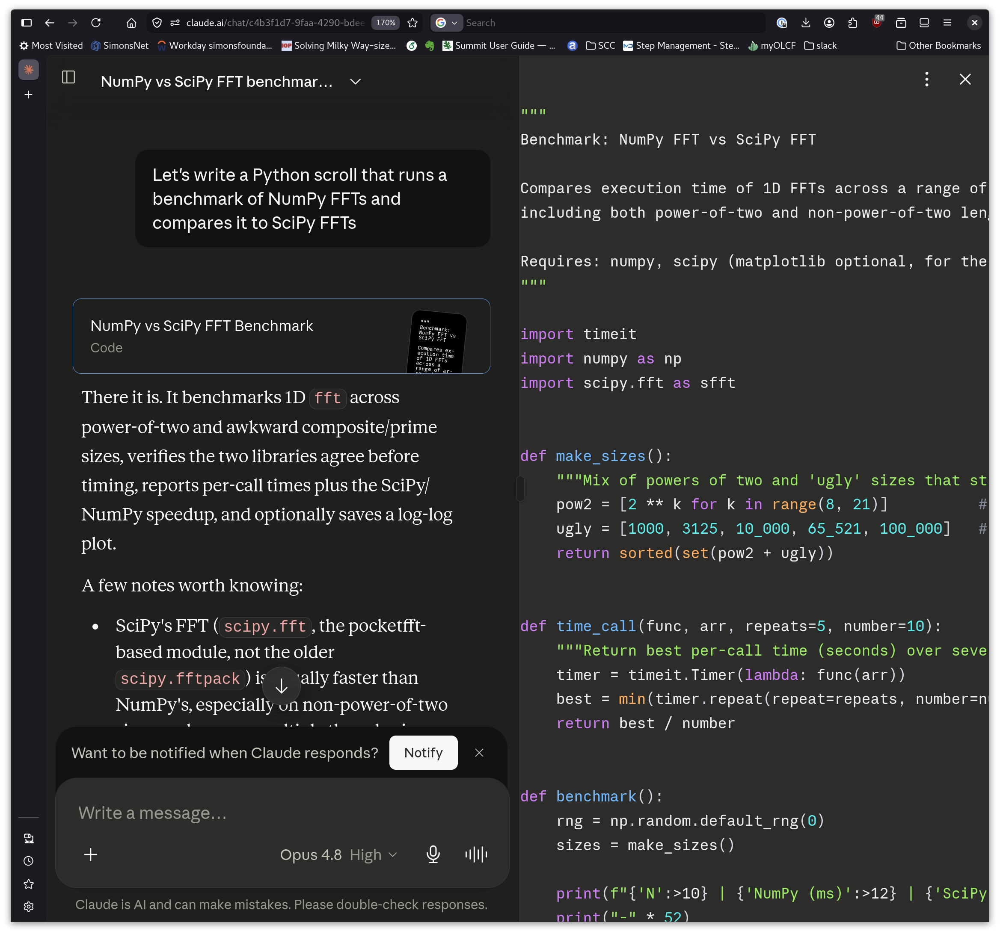
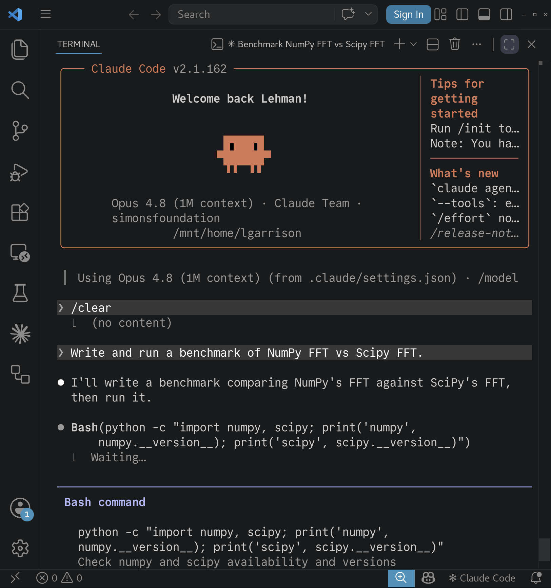
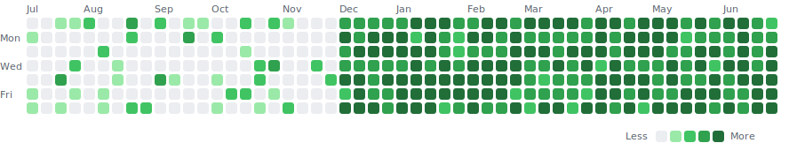
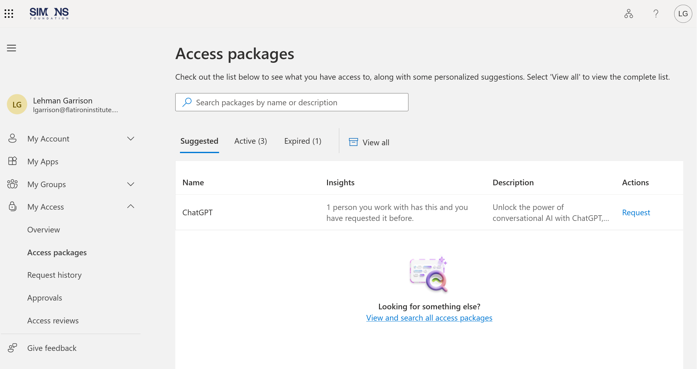

# Summer Sciware 1
## Introduction to Scientific Computing at Flatiron

https://sciware.flatironinstitute.org/44_SummerIntro

## Today's Agenda

- Introduction and computing learning goals
- Where to get computing help
- VS Code and Claude Code
- AI discussion
- Cluster intro

# Introduction and Computing Learning Goals

## Who We Are: Sciware

- Sciware is a grassroots, scientific software learning community at Flatiron Institute
-  We're here to help! Our goals are:
  - to help you setup and learn the computing tools you need to do your summer work, and
  - to help you build fundamental computing skills (terminal, VS Code, git/GitHub, Python project setup, etc).
-  These will be useful in any kind of computing career, academic or not!

## Summer Learning Goals

### We've identified six things that we think you should be able to do/have done by the end of this summer internship.

## Summer Computing Learning Goals

### 1. Name the tool(s) used to edit code (aka IDE). 
Examples: VS Code, vim, emacs

### 2. Name any AI tools and/or models used.
Examples: chatGPT web, GitHub Copilot, Claude, Gemini

This workshop

## Summer Computing Learning Goals

### 3. If the cluster was used, measure how many CPU and GPU hours were used.

June 17 Workshop

## Summer Computing Learning Goals

### 4. Name programming languages and notable packages and dependencies used.
Examples: Python, numpy, astropy, C++, R

### 5. Name the tools used for environment and/or package management.
Examples: conda, uv, pixi

July 1 Workshops

## Summer Computing Learning Goals

### 6. Create a GitHub repository containing new material developed.

July 8 Workshop

## Report on Poster

text:

# Resources 

## How to get more help

## Summer Sciware Sessions
- Schedule:
  - **June 10**: Summer Sciware 1 - Introduction to Scientific Computing at Flatiron
  - **June 17**: Summer Sciware 2 - Hands-on Computing with the Cluster
  - **July 1**: Summer Sciware 3 -  Making Your Software Project "Just Work"
    - Environment and package management with uv and pixi, the next gen pip and conda replacements
  - **July 8**: Summer Sciware 4 - Developing Software Collaboratively with git and GitHub
  - **July 22, 2-4pm**: Summer Sciware open office hour/poster help
- All 10 AM - noon, future sessions in **162 3rd floor classroom**

## Where to get help
- The cluster wiki: https://wiki.flatironinstitute.org/
- The [#sciware](https://simonsfoundation.enterprise.slack.com/archives/CDU1EE9V5) channel on Simons Foundation Slack
- Sciware website: https://sciware.flatironinstitute.org/
- Your mentor!
- SCC: scicomp@flatironinstitute.org or #scicomp Slack channel
- Question: Do you want a intern-only code-help channel??

## Intro to Claude Code

https://sciware.flatironinstitute.org/44_SummerIntro/day1.html

## Agenda

- Some context on Claude
- How to get Claude access through SF
- The Claude CLI and VS Code extension
- Hands-on demos: models, plan mode, existing repos, memory, more
- Exploring the many ways to use Claude
- How to learn more

## Thoughts and Feelings

### What do you think the PROs and CONs are of using LLMs as a research tool? 
https://ahaslides.com/DEDFJ

# Context on Claude

## What is Claude?

- LLM from Anthropic
- Model family: **Opus** (most capable), **Sonnet** (balanced), **Haiku** (fast / cheap)
- "Claude Code" = Anthropic's official CLI for software engineering
    - Can be used as a chat bot or an "agent" able to edit files and even run commands on its own
- The [claude.ai](https://claude.ai) website gives you access to a Claude chat bot, but no execution environment for arbitrary code

    <figure style="margin: 0;">
        
        <figcaption style="font-size: 0.7em; color: #888; margin-top: 0.3em;">claude.ai — chat in the browser</figcaption>
    </figure>
    <figure style="margin: 0;">
        
        <figcaption style="font-size: 0.7em; color: #888; margin-top: 0.3em;">Claude Code — CLI in the terminal</figcaption>
    </figure>

## The "December revolution"

- Through mid-2025, agentic coding LLMs were capable but inconsistent
- Opus 4.6 (late 2025) + Claude Code: LLM tool use and reasoning became sophisticated enough to be useful by modern software engineering standards
- A year ago, we wouldn't be talking about LLMs in the first summer Sciware
- Many people using Opus 4.8 with Claude Code today, although lots of alternatives/competitors exist
  - Tools like OpenAI's GPT + Codex or Google's Gemini + CLI.
  - AI-first IDEs like Cursor, Windsurf, or Antigravity (often can be powered by different models)

You'll see a lot of GitHub contribution graphs like this (fake) one

# How to use Claude Code

## Getting Access to Claude Code
- Login to https://myaccess.microsoft.com/ with your Flatiron Institute email address
- "My Access" -> "Access Packages"
- Click "Request" next to "Anthropic - Claude"

## Claude CLI vs. VS Code extension

- **Claude CLI** — runs in your terminal (download from https://claude.ai/downloads)
- **VS Code extension** — runs inside the editor sidebar
    - This is unrelated to the GitHub Copilot extension, even though Copilot can use Claude as a model
- Same Claude underneath; pick whichever matches your workflow
    - Claude CLI can still "talk" to VS Code (e.g. open a file, see what you have highlighted)
- We'll see both today

# Example: hands-on tour

## Demo 1 — A new Python project from scratch

- Key idea: **plan mode**
    - Ask Claude to design *before* it writes any code
    - Review the plan, edit, iterate — then approve
    - Plans can be pretty verbose. But in order for plan mode to work, you need to read the plan!
- Model selection: **Opus** vs **Sonnet** vs **Haiku** — capability vs. cost / speed
    - Effort selection to fine-tune usage (although effort isn't entirely up to the user)
    - `/usage` to see token usage per session (5 hr) & per week
    - Waiting for AI responses can take you out of the flow! Use judiciously.
- Output style
    - **Explanatory** adds "Insights" on its choices; **Learning** has you write pieces yourself (`TODO(human)`)

## Demo 2 — Working in an existing repo
- `CLAUDE.md` — project conventions Claude reads on startup
    - If the repo doesn't have a `CLAUDE.md` yet, use `/init` to have Claude explore the code and write a summary
    - Reference materials — point Claude at docs, papers, related code
    - Frequently loaded into your conversation — keep small
- Follow project guidelines regarding AI use
    - Always disclose AI use (ask Claude to add itself as a co-author on commits when appropriate)
    - These slides generated with Claude assistance!
    - If contributing to an external project with Claude, keep yourself in the loop. Project maintainers generally want to foster a community of human contributors.

## A repo friendly to Claude is friendly to humans

- Clear README, runnable examples
- Tests that exercise the real code paths
- Sensible directory structure, good error messages, clear API
- *Free win:* the LLM benefits from the same things a new collaborator does
- Likewise, patterns that make a repo unfriendly to humans make them unfriendly to LLMs
    - E.g. dead code, outdated documentation, "it's not written anywhere, but..."

## Demo 3 — Context
- **Context** — LLMs are stateless next-token predictors. When you chat with an LLM, every query sends the entire chat history to the model.
    - Whatever the LLM "sees" (chat history, relevant files, `CLAUDE.md`, available tools, etc) is called the "context"
    - Long conversations consume a lot of tokens! Start new sessions frequently.
- **Context management** — `/compact`, `/clear`, auto-summarization
    - Sub-agents help too; Claude will often use them automatically (look for the Agent tool use)

## Demo 4 — Memory and Extensions
- **Memory system** — context Claude Code carries across sessions
    - Re-sent to the model each time: the Anthropic servers aren't "remembering" anything, Claude Code is (in local files).
    - Auto-memory directory; `CLAUDE.md` at user / project scope; `MEMORY.md` index
- **Extensions** — Claude Code add-ons
    - Generally don't need extensions to track memory (same with subagents)
    - Dozens of extensions that "fix" Claude by adding persistent memory, or reduce token use with sub-agents
    - Might be a few weeks ahead of native capability, but Claude Code tends to catch up quickly
    - My experience? Don't buy the hype around extensions.

# Understanding vs Velocity
## Ways to use Claude in Research Software

    

    
    

    
    

    
    

    

        <h3>Fewer tradeoffs</h3>
        <ul>
            <li>LLM as Google or Stack Overflow</li>
            <li>Code review</li>
            <li>Controlled experiments (e.g. perf optimization, simplified mockups)</li>
        </ul>
    

    

        <h3>Some tradeoffs</h3>
        <ul>
            <li>Feature implementation (plan mode)</li>
            <li>Writing tests</li>
            <li>Bug fixing</li>
        </ul>
    

    

        <h3>More tradeoffs</h3>
        <ul>
            <li>Hands off, fully agentic, end-to-end execution</li>
            <li>Implementing core science logic/algorithms</li>
        </ul>
    

## How to learn more

- **Claude docs** — [docs.claude.com](https://docs.claude.com/en/docs/claude-code/overview)
    - Reference for the CLI, settings, skills, memory, and more
- **Official Claude Code course** — [anthropic.skilljar.com](https://anthropic.skilljar.com/claude-code-in-action)
    - Free, hands-on "Claude Code in Action"
- **Just ask Claude!** — it knows its own features
    - "How do I ...?", "What does `/foo` do?", `/help`
    - Tell Claude to search the web docs if it seems confused
- **Simons Foundation Slack: #sciware**
    - Chat with other humans about how they use LLMs
- **Output styles** (`/config` → Output style) — let Claude teach as it works
    - **Explanatory** adds "Insights" on its choices; **Learning** has you write pieces yourself (`TODO(human)`)

## Thoughts and Feelings

What do you think the PROs and CONs are of using LLMs as a research tool? 
https://ahaslides.com/DEDFJ

# Extra

## Grounding Claude's Technical Answers

    

        
1

        

            <h3>Training data</h3>
            
Claude answers from what it learned during pre-training. Fast and zero-setup, but may be outdated or wrong on niche topics.

        

    

    

        
2

        

            <h3>Web search</h3>
            
Tell Claude to search the web or fetch documentation. Verify it actually did — look for the <code>WebFetch</code> tool in its output.

        

    

    

        
3

        

            <h3>Reference the local docs and code</h3>
            
Get a copy of the software locally and force Claude to reference the source code and documentation in its answers. Makes it easier for Claude to leverage sub-agents.

        

    

    

        
4

        

            <h3>Write and run a test</h3>
            
Have Claude write and run a test that verifies its hypothesis, rather than trusting its reasoning. Especially powerful for performance questions — let it benchmark the alternatives and measure, instead of guessing which is faster.

        

    

Each successive level: more work and higher token cost, but potentially more accurate answers.

