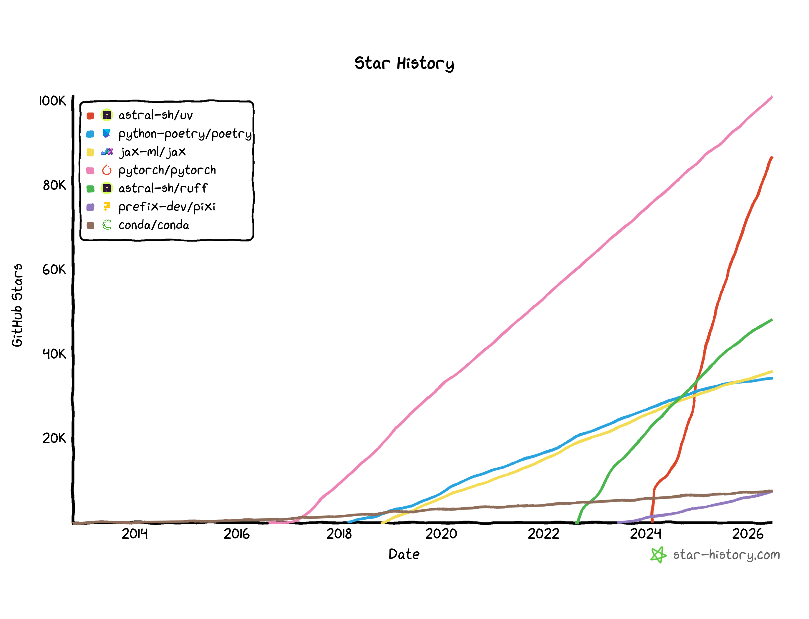

# Making Your Software Project "Just Work"
## Project environments and lockfiles with uv and Pixi

https://sciware.flatironinstitute.org/44_SummerIntro/day3.html

<style>
.reveal ul, .reveal ol { display: block; }.reveal pre.term { background:#1e1e1e; color:#d4d4d4; width:fit-content; max-width:94%; margin:14px auto; padding:12px 16px; text-align:left; font-size:0.58em; line-height:1.5; border-radius:8px; }
.reveal pre.term .pa { color:#3fc7e0; }
.reveal pre.term .dl { color:#808080; }
.reveal pre.term .nm { color:#ffffff; font-weight:bold; }
.reveal pre.term .pr { color:#6a9955; }
</style>


## Flatiron Summer Workshops

https://sciware.flatironinstitute.org/44_SummerIntro

- Schedule:
  - 10 AM - noon in the **162 3rd floor classroom**
  - **July 8**: Summer Sciware 4: Git and Github
  - **July 22, 2-4pm**: Summer Sciware open office hour/poster help


## Outline of Package Management

- Dependencies
- Environments
  - Why
  - How
- How `uv` makes it safer


## Start with a small Python script

```python
# analyze.py (the entire project)
import numpy as np

def summarize(values):
    arr = np.asarray(values, dtype=np.float_)
    arr[arr == -999.0] = np.NaN          # -999.0 marks a failed reading
    return np.nanmean(arr), np.nanstd(arr)

readings = [12.3, 11.8, -999.0, 12.1, 12.5, -999.0, 11.9]
mean, std = summarize(readings)
print(f"mean = {mean:.3f}, std = {std:.3f}")
```


## Dependencies

- Did you notice `import numpy as np`?
- Installing python does not install numpy
  - We install numpy separately with `pip`
- Dependency installation places a bunch of python code in a known directory structure
- `import` causes the the interpreter to load that code & make its functions accessible


## Versions

- Dependencies/libraries have **versions**
- A library's functions can change a lot between versions!
- `import` gives you whatever version comes first in `sys.path`


## Attempt 1: system python?

```bash
python analyze.py
```

- Calls whatever my system thinks `python` is
- Accesses whatever "numpy" shows up first in the path
- I don't know what the system python is
  - I certainly don't want to change its installed packages!
  - That might break my system (ask me how I know...)


## Controlled *environment*

- Instead let's use an installation we know & control
- We do this using **virtual environments** (`venv`)
- `venv` sets up an **environment-specific**:
  - alias for the python interpreter executable, and
  - directories for installed dependencies
- Standard part of Python standard (PEP 405)


## Aside: don't share environments

- You may see people using the same `venv` for many projects
- This is just recreating system python with extra steps!


## Attempt 2: Use an *environment*

```bash
python3.10 -m venv ~/venvs/analyze     # create a venv
source ~/venvs/analyze/bin/activate    # activate it
which python                           # confirm I'm in the venv
python analyze.py                      # run
```

Oops: no numpy

```text
  File "analyze.py", line 3, in <module>
    import numpy as np
ModuleNotFoundError: No module named 'numpy'
```


## Attempt 3: Install the dependency

```bash
which python          # confirm environment
pip install numpy     # install in the env
python analyze.py     # run
```

Oops: *wrong* numpy...

```text
  File "analyze.py", line 8, in summarize
    arr = np.asarray(values, dtype=np.float_)
AttributeError: `np.float_` was removed in the NumPy 2.0 release. Use `np.float64` instead.
```


## Attempt 4: Use the right numpy

```bash
which python            # confirm environment
pip install numpy<2     # downgrade numpy
python analyze.py       # *now* it works
```

```text
mean = 12.120, std = 0.256
```

Finally! Why was that so hard...?


## Don't make users guess

- Imagine having to guess and check for every dependency in a big package!
- `pyproject.toml`: grand unified configuration file for Python packages
  - lets you *declare* the needed dependencies & versions
  - older methods: `setup.py`, `setup.cfg`, `requirements.txt`
- Packages are installed by a **frontend** (`pip`, `conda`, `uv`, `pixi`...)
  - Frontend builds a *dependency graph* to determine all needed dependencies
  - (`numpy` might have dependencies of its own...)
- `conda` / `pixi` can also install non-Python packages (more later)


## pyproject.toml makes it easy

```toml
[project]
name = "research"
version = "0.1"
dependencies = ["numpy < 2"]
```

- Declared dependencies: just `pip install PACKAGE` and you're done
  - If it's a package you're developing, install in editable mode: `pip install -e .`
- Documented & discoverable dependencies!
- Consistency--makes sure every user, everywhere, can use your package


## So we're all good?


<div style="font-size:xx-small">"Sunny road in Tuscany" by Antonio Cinotti is licensed under CC BY-NC-ND 2.0.</div>


## Not so fast


<div style="font-size:xx-small">"stormy fields" by Daz Smith is licensed under CC BY-NC-ND 2.0.</div>


## What can go wrong

- Using the wrong `venv`
- Using one big `venv` for everything
  - Version conflicts
  - silent upgrades


## the "wrong-environment" problem

```bash
# before lunch — set up and ran project A
cd ~/projA
source .venv/bin/activate     # activate A's environment
python train.py               # ✓ runs with A's packages

# after lunch — same terminal still open; switch to project B
cd ~/projB
python analyze.py             # ✗ still in A's venv!
#   ModuleNotFoundError: No module named 'pandas'
#   ...or worse: it runs, but with the wrong versions → subtly wrong results
```


## Or you get false success

- Maybe `pyproject.toml` left out some dependencies
  - but you installed something manually
  - so your package still works... *for you*
  - but it's a hassle for others to figure it out


Conclusion: Good tools can help us use the right `venv` for every project.

#note: Demo live: create the venv, activate, `pip install numpy`, run, and let it crash — the traceback is the hook for the next slide. Use **Python 3.12**: it's the last version with NumPy 1 wheels, so when we pin `numpy < 2` in a moment, the install stays fast (from a wheel). On 3.13+, pip finds no wheel and compiles NumPy from source — minutes of dead air in front of the room. Make sure `python3.12` is on your PATH first (e.g. `uv python install 3.12`, pyenv, or a module).


# Project-centric environments
## A conceptual framework for projects that "just work"


## A venv per project, used automatically

In an ideal world:

- `venv` lives *beside* the code (in a `.venv/` directory in the project), to avoid cross-talk
- Changing the env's installed packages would update `pyproject.toml` automatically
- Tooling would check the environment against the description every time you run
  - So the documentation is always what you get
  - This makes `.venv` **reproducible** & **disposable** -- recreate it from scratch any time
- (*) Need to keep several projects in sync? → **workspaces** (bonus slides, if we have time)


## The ecosystem of Python package managers

<style>
.eco { display:grid; grid-template-columns:auto 1fr 1fr; gap:10px; max-width:740px; margin:18px auto 0; }
.eco > div { padding:14px; border-radius:8px; text-align:center; }
.eco .hd { font-weight:bold; background:#eef2f8; color:#2c3e50; }
.eco .hd span { font-weight:normal; font-size:0.78em; }
.eco .rh { font-weight:bold; background:#eef2f8; color:#2c3e50; display:flex; flex-direction:column; align-items:center; justify-content:center; }
.eco .rh .sub { font-weight:normal; font-size:0.78em; }
.eco .cell { border:2px solid #537eba; font-family:monospace; font-size:1.05em; display:flex; align-items:center; justify-content:center; }
.eco .focus { background:#537eba; color:#fff; }
.eco .corner { background:transparent; }
.eco-note { text-align:center; font-size:0.78em; margin-top:16px; }
</style>

<div class="eco">
  <div class="corner"></div>
  <div class="hd">PyPI<br><span>(pip wheels / sdists)</span></div>
  <div class="hd">conda-forge<br><span>(conda packages)</span></div>

  <div class="rh"><span>Manual Envs</span><span class="sub">hand-managed</span></div>
  <div class="cell">pip + venv</div>
  <div class="cell">conda</div>

  <div class="rh"><span>Automated Envs</span><span class="sub">tooling + lockfiles</span></div>
  <div class="cell focus">uv</div>
  <div class="cell">pixi</div>
</div>

<p class="eco-note"><b>uv</b> is to <b>pip</b> what <b>pixi</b> is to <b>conda</b>: a fast, modern, project-centric frontend.</p>


# uv: a project-centric package manager


## `uv run` command

<div style="display:flex; align-items:center; justify-content:center; gap:48px;">
<div>

- `uv run script.py`: one command that
  - creates a venv in the project directory (`uv venv`)
  - solves the dependency graph (`uv lock`)
  - ensures the dependencies are present (`uv sync`), and
  - runs your code in the venv
- No manual activation = no chance to use the wrong env
- Automatically installs the local package in editable mode

</div>

</div>


## Installing uv

- Follow the official docs at <https://docs.astral.sh/uv/>:

```bash
curl -LsSf https://astral.sh/uv/install.sh | sh
```

- **Minimally invasive:** a single self-contained binary
  - no admin rights, doesn't touch your system Python
  - no `conda`-style activation block in your `.bashrc` — only a `PATH` entry
  - on the FI clusters, there's also a module: `module load uv` (more later)
- Can install now if you want to follow along today


## Other uv selling points

- Much faster dependency resolution and installation than base `pip`
  - see [Charlie Marsh's talk](https://www.youtube.com/watch?v=gSKTfG1GXYQ) for more
- Great error messages and docs (`uv run --help`, `uv help run`)
- Developed openly, permissive licensing (dual MIT / Apache-2)
- Wide adoption
  - About 25% of all PyPI downloads originated from `uv` as of 1 year ago ([source](https://discuss.python.org/t/pypi-downloads-statistics-and-continuous-integration/91810/3))
  - Highly active GitHub (https://github.com/astral-sh/uv/)


## Adoption



<p style="font-size:0.7em; color:#888; margin-top:0.2em;">Stars ≈ developer mindshare, not usage, but still one of the steepest star trajectories ever on GitHub.</p>


## Two interfaces

`uv` gives you two ways to work — automated and manual

<style>
.iface { display:flex; gap:40px; justify-content:center; margin-top:16px; }
.iface-col { flex:0 1 410px; border:2px solid #537eba; border-radius:10px; padding:14px 20px; }
.iface-col.focus { background:#eef4fb; box-shadow:0 0 0 3px #537eba inset; }
.iface-col h3 { margin:0 0 2px; font-size:0.95em; }
.iface-col .badge { font-size:0.58em; background:#537eba; color:#fff; border-radius:4px; padding:2px 7px; vertical-align:middle; margin-left:8px; }
.iface-tag { font-size:0.72em; color:#777; margin:0 0 10px; line-height:1.9; }
.iface-tag code { padding:1px 5px; }
.iface-cmds { font-family:monospace; font-size:0.72em; line-height:1.9; }
.iface-cmds code { background:#f3f3f3; border-radius:4px; padding:1px 6px; white-space:nowrap; display:inline-block; }
.iface-use { font-size:0.72em; margin-top:10px; }
</style>

<div class="iface">
  <div class="iface-col focus">
    <h3>Project interface<span class="badge">default</span></h3>
    <p class="iface-tag">uv manages your <code>pyproject.toml</code>, <code>uv.lock</code> &amp; <code>.venv</code></p>
    <div class="iface-cmds"><code>uv init</code> <code>uv add</code> <code>uv lock</code> <code>uv sync</code> <code>uv run</code></div>
    <p class="iface-use"><b>Use for:</b> almost everything</p>
  </div>
  <div class="iface-col">
    <h3>pip interface</h3>
    <p class="iface-tag">you manage the venv yourself</p><p>(familiar <code>pip</code> muscle memory)</p>
    <div class="iface-cmds"><code>uv venv</code> &nbsp; <code>uv pip install</code></div>
    <p class="iface-use"><b>Use for:</b> fine control, temporary edits to venv</p>
  </div>
</div>


## Project interface

From an empty project, using `uv` is as simple as:

```bash
# Starting with no pyproject.toml
uv init --bare        # can skip if you have pyproject.toml already
uv add "numpy<2"      # record the dep → updates pyproject.toml + uv.lock
uv run analyze.py     # build the env to match, then run, no manual activation
```

```text
Creating virtual environment at: .venv
 + numpy==1.26.4
mean = 12.120, std = 0.256
```

<style>
.life { display:flex; align-items:center; justify-content:center; flex-wrap:wrap; gap:7px; margin:8px 0 2px; font-family:monospace; font-size:0.72em; }
.life .pill { border:2px solid #537eba; border-radius:7px; padding:5px 9px; }
.life .pill.focus { background:#537eba; color:#fff; }
.life .arr { color:#537eba; }
.life .grp { display:inline-flex; align-items:center; gap:7px; border:2px dashed #537eba; border-radius:9px; padding:6px 8px; background:#eef4fb; }
.life-cap { text-align:center; font-size:0.72em; color:#537eba; margin-top:6px; }
</style>

<div class="life">
  <span class="pill">uv init</span><span class="arr">→</span>
  <span class="pill">uv add</span><span class="arr">→</span>
  <span class="grp"><span class="pill">uv lock</span><span class="arr">→</span><span class="pill">uv sync</span></span>
  <span class="arr">→</span>
  <span class="pill focus">uv run</span>
</div>
<p class="life-cap"><code>uv run</code> does the boxed steps for you, so the env always matches the lockfile</p>

- No manual venv, no activation: the wrong-env pitfall is gone, and the env can't drift


## Dependency groups & extras

`uv add` can write to different tables in `pyproject.toml`:

```toml
[project]
dependencies = ["numpy"]          # uv add numpy

[dependency-groups]               # dev-side — not shipped to users
dev  = ["pytest"]                 # uv add --dev pytest
docs = ["sphinx"]                 # uv add --group docs sphinx

[project.optional-dependencies]   # extras — users opt in
plot = ["matplotlib"]             # uv add --optional plot matplotlib
```

- **Groups** = *developer*-side (tests, docs): not installed to end users
- **Extras** = extra feature sets the user can opt into: `pip install research[plot]`


## Lockfiles

- Pins every package's exact version + hash to be **disposable** == **reproducible**
- Skips the **"should I add an upper bound?"** debate
  - prefer **lower bounds** (`numpy>=1.26`) + the lockfile of a known-good version
  - speculative caps (`numpy<2`) propagate downstream and cause conflicts with other packages
- Should I add `uv.lock` to git?
  - Applications/pipelines: **yes!** Records known-good versions.
  - Libraries: sometimes. Lockfiles don't get published in wheels/sdist, so not much point.
- Technically human-readable (TOML) but you probably won't
  - Generated & maintained by **tooling** (`uv lock`, `uv sync`);

```toml
# uv.lock — generated; read & written by tooling, not by hand
version = 1
requires-python = ">=3.12"
[[package]]
name = "numpy"
version = "1.26.4"
source = { registry = "https://pypi.org/simple" }
wheels = [
    { url = "…/numpy-1.26.4-cp312-…x86_64.whl", hash = "sha256:675d61ff…" },
    # … one pinned wheel per OS / arch / Python …
]
```


## uv pip / manual interface

```bash
uv venv                       # create a .venv (no project files needed)
uv pip install numpy          # install into it, pip-style
source .venv/bin/activate     # activate the venv
python analyze.py             # run
```

- Doesn't use the lockfile: misses a big part of the advantage
- No need to activate venv to install
- *Do* need to activate to run `python` directly (but could just use `uv run --no-sync`)
- **Good way to get started with uv!** Low barrier to entry, familiar workflow but faster than `pip`
- Also useful for projects that mix Python with compiled code (easy way to force rebuild)
- uv `venv`s are ordinary, PEP-standardized `venv`s: `pip`-compatible, project-interface-compatible, auto git-ignored
  - Contrast with conda/Pixi, which lock you into specific tooling


## Python versions

- It's hard to set up a manual `venv` with a python version that's not on your system
- `uv` will download Python for you, or use a local version
  - plays nice with cluster modules
- Pin a version per-project in a `.python-version` file (`uv python pin 3.12`) — a lockfile for your Python
- `requires-python` in `pyproject.toml` declares the *range* your code supports — not an exact pin (don't upper-bound it!)
- **Back to our demo:** NumPy 1 only publishes wheels for Python ≤ 3.12 — pin `3.12` and `uv` fetches it for you. Avoids surprise source build.
- Most `uv` commands accept `-p`, e.g. `-p 3.12` or `-p 3.14t`

<pre class="term"><span class="pr">❯</span> uv python list
cpython-3.14.3-linux-x86_64-gnu     <span class="dl">&lt;download available&gt;</span>
cpython-3.13.12-linux-x86_64-gnu    <span class="pa">~/.local/share/uv/python/…/python3.13</span>
cpython-3.12.13-linux-x86_64-gnu    <span class="pa">~/.local/share/uv/python/…/python3.12</span>
cpython-3.11.13-linux-x86_64-gnu    <span class="pa">/usr/bin/python3.11</span>
cpython-3.10.20-linux-x86_64-gnu    <span class="dl">&lt;download available&gt;</span></pre>


## Running tools, not just projects

- A "tool" is a Python project with an executable module (e.g. `python -m ruff`)
  - You want these separate from any particular project/package
  - handy for `ruff`, `pre-commit`, `py-spy`, `meson`, even `disbatch`
- `uv` supports tools via `uv tool` and `uvx` (`uvx` == `uv tool run`)
- `uv tool install ruff` — install a CLI globally, isolated from your projects
- `uvx ruff check` — run a tool in a throwaway env (like `pipx run`)

<pre class="term"><span class="pr">❯</span> uv tool list
<span class="nm">ruff v0.15.12</span>
- ruff
<span class="nm">py-spy v0.4.1</span>
- py-spy
<span class="nm">disbatch v3.1.dev39</span>
- disBatch
- disbatch</pre>


## Ephemeral envs: "scrolls"

Need an environment for a *single* run of a standalone script? Make a throwaway env with `--with`:

```bash
uv run --with matplotlib plot.py   # temporary env, just this once
```


Run it often? **Bake the dependencies into the script** — a "scroll" (PEP 723):

```python
# /// script
# requires-python = ">=3.11"
# dependencies = ["matplotlib", "numpy"]
# ///
import numpy as np
import matplotlib.pyplot as plt
```

- `uv run plot.py` then builds the one-off env from the embedded metadata (no `--with` or `pyproject.toml` needed)
- The `# /// script` block is **PEP 723** — a Python standard (`pipx` and `hatch` read it too)
- Perfect for emailing/Slacking/gisting a one-file tool
  - `uv` can help you manage this metadata with with `uv add --script plot.py numpy matplotlib`
- Only for **standalone scripts** (use `pyproject.toml` if part of a bigger project)

<!-- niche/advanced — kept for reference, not shown
## Ecosystem & build backend

- **Ecosystem**: official GitHub Action, distroless Docker images
- **`uv_build`**: fast, minimal build backend for pure-Python packages
-->


## uv with notebooks

- Run Jupyter from your project's environment:

```bash
uv add --dev ipykernel              # makes the project env available as a kernel
uv run --with jupyter jupyter lab   # launch Jupyter (nice on a laptop)
```

- In VS Code, just select `.venv` as the kernel source — it'll offer to install `ipykernel` for you
- Dedicated uv guide for Jupyter: https://docs.astral.sh/uv/guides/integration/jupyter/
- Cluster users: a `venv` created with `uv` will work fine with [JupyterHub custom kernels (see FI Wiki)](https://wiki.flatironinstitute.org/SCC/JupyterHub)


## Future of uv

- Among the fastest-growing dev tools by GitHub stars
- Astral was acquired by OpenAI (!) but development seems to be carrying on as normal
  - Why should we care? Think about what happened with the Conda default channel!
  - uv is permissively licensed and could be forked
- Upcoming features
  - **Centralized venvs** (venv-in-cache): will make it easier for HPC users to keep venvs out of their quota-limited space
  - **Wheel Variants** (PEPs 817 & 825) — auto-pick the **optimal build for your machine**, e.g. the right GPU/CUDA wheel (think PyTorch, JAX)
- The uv team plays a leading role in the next generation of wheels (https://wheelnext.dev/):
  - **WheelNext**: first-class **compiled / non-Python deps** in wheels (conda's old advantage)
- uv + wheels may replace conda's niche (also Pixi is promising, too)
- And for HPC/cluster users: uv's first-class **source installs** give it an edge over Pixi (although Pixi adding experimental support)


## Bonus: Conflicting Dependencies

```bash
uv init --bare
uv add 'numpy<2'
uv add 'scipy>=1.18'
```

```
  × No solution found when resolving dependencies for split (markers: python_full_version >= '3.12'):
  ╰─▶ Because only scipy<=1.18.0 is available and scipy==1.18.0 depends on numpy>=2.0.0, we can conclude that scipy>=1.18.0 depends on numpy>=2.0.0.
      And because your project depends on numpy<2 and scipy>=1.18, we can conclude that your project's requirements are unsatisfiable.

      hint: While the active Python version is 3.11, the resolution failed for other Python versions supported by your project. Consider limiting
      your project's supported Python versions using `requires-python`.
  help: If you want to add the package regardless of the failed resolution, provide the `--frozen` flag to skip locking and syncing.
```


## Bonus: uv workspace (advanced)

- One repo, several packages: **shared resolution with a shared `.venv`**
- List members in `[tool.uv.workspace]` in the top-level `pyproject.toml`
- Can replace the idea of a **"base" environment**:
  - if you reflexively activate a conda env in your `.bashrc`, a workspace is often the better fit
- Members resolve together = no version skew between your own projects


# uv on the FI clusters
## Best Practices on Rusty & Popeye


## When is uv the right tool on the clusters?

**Short answer: most of the time**

- We've made our modules **uv-aware**:
   - `python` module: sets `UV_PYTHON` to tell uv to use its Python
   - `uv` module: provides a uv installation and tells uv to put its cache in `$HOME/.cache`
   - `uv` module **does not override** a user-installed uv binary. So install your own, and keep it up to date with `uv self update`!
- Typical usage:

```bash
module load python uv

uv run ...  # defaults to using Python from modules
```

- Also valid to use uv on its own, without a Python module. Especially useful if you want a Python version we don't have in modules:

```bash
module load uv

uv run -p 3.14 ...
```

- uv will fetch and install its own Python. Careful, will count against your **file count quota!**


## Using uv on the cluster

**When to not use uv:**

- When you need `--system-site-packages`
  - Creating a venv with `--system-site-packages` lets you use the pre-built Python packages in the `python` module
  - uv will create such an environment, but won't respect it when resolving packages!
  - First install/sync after creating an environment will overlay the system site packages. Not an error, but maybe not what you want.
- Some Python packages, like `mpi4py`, should be loaded from modules (`python-mpi`) and not installed with uv, pip, or conda/pixi
- See the [uv Python cluster wiki page](https://wiki.flatironinstitute.org/SCC.Software/UvPython) for more info


## Cluster gotchas

- uv uses **hard-links** to quickly create venvs from its cache → the cache and your `.venv` must share a filesystem
- Hard-linking across filesystems fails → uv falls back to slow copies:

```text
warning: Failed to hardlink files; falling back to full copy.
         …cache and target directories are on different filesystems…
```

- **If you see this:** run `module load uv`, which puts the cache on the home filesystem (which is where venvs should be)
- The cache is **many small files** → occasionally clear out your uv cache to stay under your **FIDO quota**:
  - `uv cache prune`: removes unreachable cache entries, always safe
  - `uv cache purge`: removes everything from cache, also safe, but can make subsequent installs slower


# Pixi: project-centric environments for the conda world


## Introducing Pixi

- Same idea as uv — per-project env, lockfile, `pixi run` — but it pulls from **conda channels** (conda-forge), not PyPI
- Reach for it when your dependencies aren't just Python packages:
  - compilers, MPI, CUDA toolkit, R, system libraries — things pip/uv generally can't install
- On a cluster, usually prefer modules for compiled dependencies, especially when interacting with MPI
- https://pixi.prefix.dev/


## Quick tour

```bash
pixi init research
pixi add numpy "scipy>=1.13"  # conda-forge deps → pixi.toml + pixi.lock
pixi add --pypi <pkg>         # mix in a PyPI-only package
pixi run python analyze.py    # run in the project env — no activation
```

- Config in `pixi.toml`, or `[tool.pixi]` in `pyproject.toml`; lockfile is `pixi.lock` (multi-platform)
- Several named environments per project — e.g. `default`, `gpu`, `test`
- `pixi shell` activates an env interactively, like `conda activate` but per-project


## Pixi vs. conda

- A fast, modern frontend to the **same conda-forge ecosystem** — Pixi is to conda what uv is to PyPI
- Fixes conda's *workflow* pain:
  - project-centric + lockfile, instead of central named envs you manually activate
  - no `conda init` block bloating your `.bashrc` — it just adds `pixi` to your `PATH`
- `pixi global` installs user-wide tools — cf. conda's base env or `uv tool`
- Inherits conda's *ecosystem* caveat: conda-forge packages aren't binary-compatible with the cluster **modules** — don't mix the two


## uv or Pixi?

- Pure-Python / PyPI stack → **uv**
- Working on cluster: usually **uv**
- Need non-Python deps from conda-forge (compilers, CUDA, R, …) → **Pixi**
- Same project-centric mental model either way, so switching is cheap
- **Caveat**: we (Sciware) don't have much experience with Pixi! But it's gaining community traction and seems like a promising option if you're working in the conda ecosystem.


# Survey


