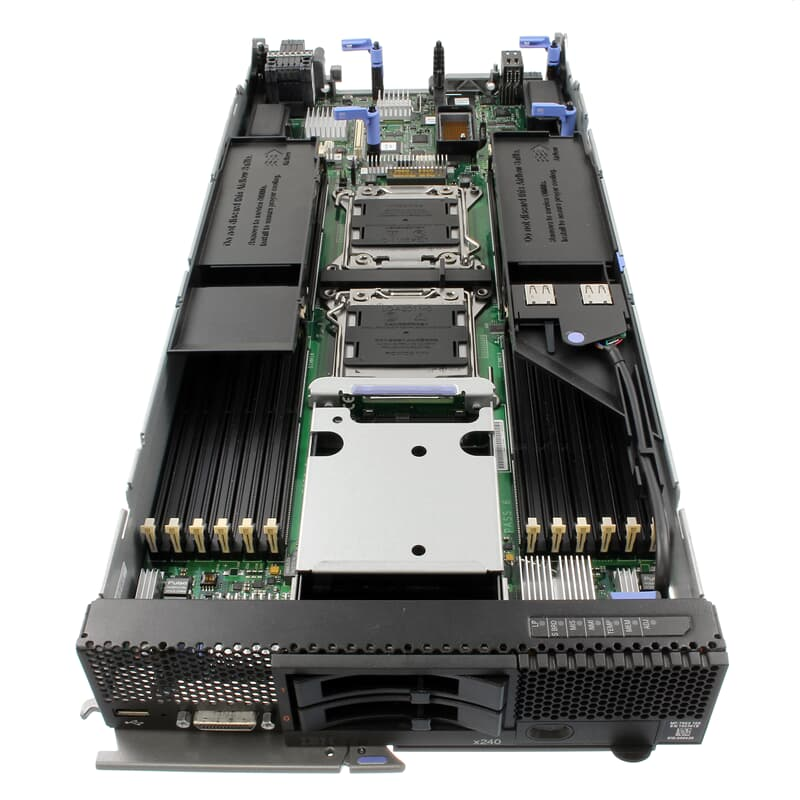
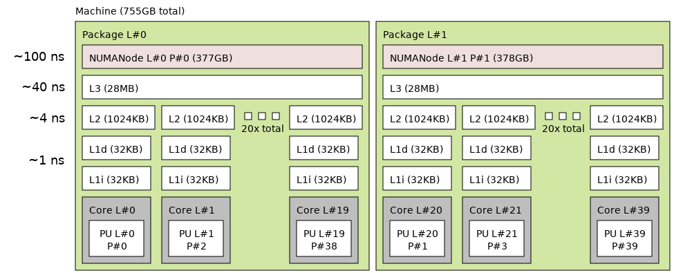
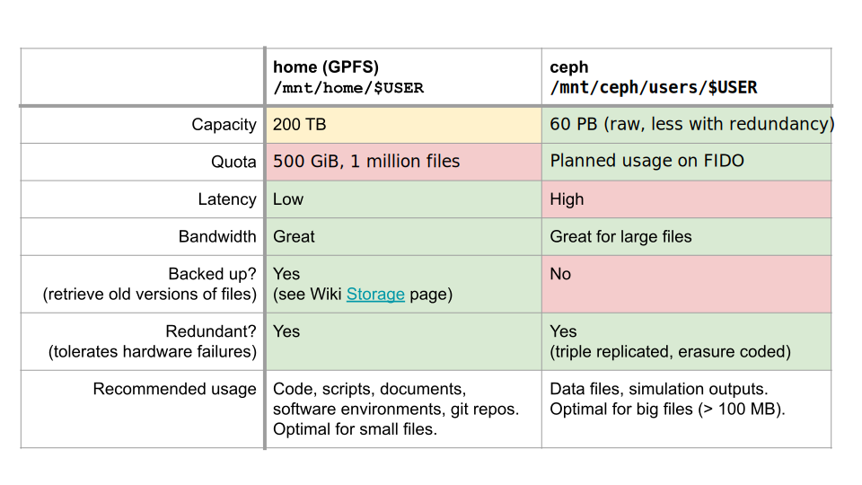
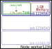
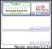

# Sciware

## Flatiron Summer Workshops

https://sciware.flatironinstitute.org/44_SummerIntro

- Schedule
  - **July 1**: Summer Sciware 3: Making your Software Project "Just Work"
  - **July 8**: Summer Sciware 4: Git and Github and You
  - All 10 AM - noon in the IDA Auditorium (162 Fifth Ave, 2nd Floor)


## Today's agenda

- Getting help
- Supercomputing terminology
- Cluster overview, access, account management
- Modules and software
- Break!
- Jupyterhub and remote VS Code
- Slurm and parallelization
- Using Flatiron hosted LLMs


# A quick quiz first...


# FI Cluster account status
- <font color="#808">A. Set up and a power user!</font>
- <font color="#080">B. Set up and used a cluster lightly (jupyterhub, vscode, ...)</font>
- <font color="#880">C. Will set up soon</font>
- <font color="#048">D. Don't have one</font>


# Getting help with the FI clusters


### Where to get help

- SCC provides a wiki for cluster help and information
  - https://wiki.flatironinstitute.org
  - Information on effectively using slurm, python, conda, mpi, compilers, MATLAB, Mathematica, etc.
  - Log in with cluster credentials, or SSO if your Flatiron email is on your cluster account


### Where to get help

- `#scicomp` on Slack for quick or broad questions (might need to join first)
  - SCC/FI community will help with your issue
- https://wiki.flatironinstitute.org/SCC/ReportingProblems
  - Email with details to scicomp@flatironinstitute.org
- `#sciware` channel for software development discussions
- `#code-help` channel
- Your mentor!


### Quiz!
#### What's the best way to get questions about the cluster answered?
- <font color="#808">A. https://wiki.flatironinstitute.org/</font>
- <font color="#080">B. Slack #scicomp</font>
- <font color="#880">C. scicomp@flatironinstitute.org</font>
- <font color="#048">D. Any of the above</font>


# Supercomputing terminology


## Cluster
<div style="display: flex;">

<ul>
<li> A group of computers that work together as a single system
<li> Goal: distribute computational load over multiple devices
<li> Common components to be defined:
  <ul>
  <li> Node (CPU/GPU)
  <li> Filesystem (shared/local)
  <li> Network/fabric
  </ul>
</ul>
</div>


### Quiz!
#### Which statement is generally true about what we mean by a "cluster"?
- <font color="#808">A. One very powerful computer</font>
- <font color="#080">B. Many geographically dispersed computers connected via the internet</font>
- <font color="#880">C. Collection of computers that are linked together with a local network</font>


### Network/fabric
- Network/fabric -- the means of communication between nodes
  - Communication lines usually fiber/copper/wireless
- Latency -- time between sending and receiving messages
- Bandwidth -- rate data can be transferred
- Some rough "typical" numbers
  - WiFi -- 1 ms -- \~0.1-1 Gbit/s -- network
  - Ethernet -- 0.1 ms -- \~1-40 Gbit/s -- network
  - Infiniband -- 0.001 ms -- \~100-800 Gbit/s -- fabric


### Quiz!
#### Which statement is false?
- <font color="#808">A. Latency is the time between sending and receiving messages</font>
- <font color="#080">B. Bandwidth is the rate at which messages can be sent</font>
- <font color="#880">C. Infiniband fabric has relatively high latency and low bandwidth</font>


### Compute nodes
<div style="display: flex;">
<ul>
<li> What most people would call a computer, but...
  <ul>
  <li> Typically headless -- no display
  <li> Accessed/controlled via network
  <li> Often multiple network "interfaces"
  <li> Designed for high <i>throughput</i> computation
  </ul>
</ul>

</div>


### Compute node architecture
- Typically large amounts of RAM (random access memory)
  - temporary storage used during computation for data and program instructions
- One or more "multi-core" CPUs (central processing units)
  - CPU Core -- a single physical CPU on a multi-core CPU
  - Cores have their own _cache_ but also share _cache_ directly with other cores
  - Cores typically slower than laptop/workstation cores, but more of them and more cache/RAM


### Quiz!
#### Which statement is true about nodes and cores?
- <font color="#808">A. There is one node per supercomputer</font>
- <font color="#080">B. Each node has multiple CPU cores</font>
- <font color="#880">C. Cores in supercomputers are typically faster than laptop cores and have less RAM</font>


### Compute node architecture -- `lstopo`
- Cores also sometimes have extra groupings in `NUMA` (non-uniform memory architecture) domains
  - Tells what hardware has direct access to what memory
  - Automatic internal "fabric" with different latencies/bandwidth
  - `lstopo --no-io` on FI `skylake` node
<center>
    
</center>


### GPU node architecture
<div style="display: flex;">

<ul>
<li> GPU Node -- CPU node + GPU
<li> GPU -- graphics processing unit
  <ul>
  <li> Misnomer/legacy name, used to "offload" general computation -- AKA accelerator/TPU
  <li> SIMD power -- single instruction multiple data
  <li> Large numbers of small identical problems
  <li> e.g., large dense linear algebra problems
  </ul>
</ul>
</div>


### Filesystems
- System that manages file organization and access
- Can be local (stored on "hard drive" like on laptop)
  - _typically_ high bandwidth/low latency
- Or distributed/networked (data shared between drives/computers and accessed remotely)
  - _typically_ high bandwidth/high latency, networked
  - Tradeoffs exist and are _extremely_ important
- Ceph and GPFS are the distributed filesystems used at FI
  - Lustre also common at supercomputing centers


## Flatiron resources overview


### Two clusters: 'Rusty' and 'Popeye'

- Rusty on east coast, Popeye on west coast
- Completely distinct
  - Independent storage
  - Independent job management
- Both heterogenous -- multiple node types
- Details at https://wiki.flatironinstitute.org/SCC/Overview


### Rusty/Popeye -- compute power

- Rusty -- \~200k CPU cores (\~2000 nodes)
- Popeye -- \~31k CPU cores (\~600 nodes, in flux currently)
- Node groups connected by high performance infiniband fabric
  - Dedicated (only for job traffic)
  - Node types on different infiniband networks!
- Rusty -- around 120 RTX6000Pro Blackwell, 192 H200, 240 H100, 290 A100 GPUs
- `fi-nodes`


## Our rusty cluster overview

* 2 gateway nodes (`gateway.flatironinstitute.org`): only for remote access to log into other cluster nodes (not for running applications)
* 4 login nodes (`rusty.flatironinstitute.org`): for submitting jobs
* Many CPU and GPU nodes


### Rusty/popeye storage -- local
- All worker nodes have fast `NVMe` storage local to the machine
- Usually about 2 terabytes in the `/tmp` path
- Automatically deleted at job completion!


### Rusty/popeye storage -- home
- `/mnt/home/$USER` AKA `$HOME` -- default path
- Put your source code and software installs here!
- High performance GPFS filesystem (General Parallel FS)
- Mind your quota! You can get locked out of the cluster!
- Backed up regularly -- can recover deleted files -- quota fixed
- `fi-quota`


### Rusty/popeye storage -- ceph (1)

- rusty: located at `/mnt/ceph/$USER`, symlink at `~/ceph`
- popeye: located at `/mnt/sdceph/$USER`, symlink at `~/ceph`
- `ceph` (after cephalopod) -- software providing this FS
- Always put your data/large files here! (large \~ 100MB+)
- Quota set in FIDO! `fi-usage` (only runs on rusty, but prints both)
- `cephdu` from `fi-utils` very useful for managing files
<center>

</center>


### Rusty/popeye storage -- ceph (2)
- \~65 PiB (rusty) and \~20 PiB (popeye)
- High bandwidth, high latency (\~1.5GiB/s parallel reads)
- Highly redundant, not backed up (deletes unrecoverable!)
- "Small" files "triple replicated"
  - Two disks can fail and can still recover
- Large files start triple replicated, then erasure coded later
  - EC - file distributed across many disks with extra data
  - Full recovery with some number of disk failures


### Rusty/popeye storage -- overview

<br>
https://wiki.flatironinstitute.org/SCC/Hardware/Storage


## Quiz!
### Which statement is true about file systems at FI?
- <font color="#808">A. I should put many small files in a single directory on ceph</font>
- <font color="#080">B. I should put large files in my home directory</font>
- <font color="#880">C. Home and ceph are the only options for storing data during a job</font>
- <font color="#048">D. Files stored in my home directory are backed up while ones on ceph are not</font>


# Remote cluster connections
<!-- 25 min mark? -->

- Setup your cluster account with mentor
   - Mentor requests account on FIDO, provides PIN
   - Set your password on FIDO
   - Get a one-time verification code on FIDO
   - `ssh -p 61022 USERNAME@gateway.flatironinstitute.org`
   - Setup google-authenticator
- From gateway:
   - `ssh rusty` (or `ssh popeye`)

https://wiki.flatironinstitute.org/SCC/RemoteConnect

(even on site, remote connection usually necessary)


# FIDO - quota management
<div style="display: flex;">

<ul>
<li> <a href="https://fido.flatironinstitute.org"> https://fido.flatironinstitute.org </a>
<ul> <li> mentor sets resource estimates -- helps us plan </ul>
<li> <code> module load fi-utils; fi-quota </code>
<ul> <li> see <i>home</i> storage quota usage info </ul>
<li> <code> module load fi-utils; fi-usage </code>
<ul> <li> see all <i>FIDO</i> related quota usage </ul>
<ul> <li> i.e. Rusty/Popeye Ceph/CPU/GPU (**for your poster!**) </ul>
</ul>
</div>


# Modules & software

## Overview

- Most software you'll use on the cluster will either be:
  - In a *module* we provide
  - Downloaded/built/installed by you (often using modules)
- By default you only see the *base system* software (Rocky8)


### `module avail`: Core

- See what's available: `module avail`

```text
------------- Core --------------
gcc/10.5.0                
gcc/11.4.0               (D)
gcc/12.2.0
openblas/single-0.3.26   (S,L)
openblas/threaded-0.3.26 (S,D)
python/3.10.13           (D)
python/3.11.7
...
```
- `D`: default version (also used to build other packages)
- `L`: currently loaded
- `S`: sticky


### `module load` or `ml`

- Load modules with `module load` or `ml NAME[/VERSION] ...`
   ```text
   > python -V
   Python 3.6.8

   > ml python
   > python -V
   Python 3.10.13
   ```
- Remove with `module unload NAME` or `ml -NAME`
- Can use partial versions, and also switch
   ```text
   > module load python/3.11
   The following have been reloaded: (don't be alarmed)
   > python -V
   ```


### `module show`

* Try loading some modules
* Find some command one of these modules provides
* (Hint: look at `module show MODULE`)


### Other module commands

- `module list` to see what you've loaded
- `module reset` to reset to default modules
- `module spider MODULE` to search for a module or package
   ```text
   > module spider numpy
   > module spider numpy/1.26.4
   ```
   - Some modules are "hidden" behind other modules: `module spider mpi4py/3.1.5`


### module releases

- We keep old sets of modules, and regularly release new ones
- Try to use the default when possible

```text
   modules/2.0-20220630   (S)    modules/2.2-20230808 (S)    modules/2.4-20250724 (S,L,D)
   modules/2.1.1-20230405 (S)    modules/2.3-20240529 (S)
```


### Too much typing

Put common sets of modules in a script
```bash
# File: ~/mymods
module reset
module load gcc python hdf5 git
source ~/myvenv/bin/activate
```
And "source" it when needed:
```bash
source ~/mymods
```

- Avoid putting module loads in `~/.bashrc`


## Other software

If you need something not in the base system, modules, or pip:
- Ask your mentor!
- Download and install it yourself
  - Many packages provide install instructions
  - Load modules to find dependencies
- Ask for help!  #sciware, #scicomp, scicomp@


# Break
<!-- 1 hour point -->


# Jupyter/VS Code Remote


### Jupyter

- JupyterHub: https://jupyter.flatironinstitute.org/
  - Login and start a server
  - Default settings are fine: JupyterLab, 1 core
- To use an environment you need to create a kernel
  - Detailed description at https://wiki.flatironinstitute.org/SCC/JupyterHub !
  - Create a kernel with the environment
     ```bash
     # setup your environment
     ml python ...
     source ~/myvenv/bin/activate
     # capture it into a new kernel
     ml jupyter-kernels
     python -m make-custom-kernel mykernel
     ```
  - Reload jupyterhub and "mykernel" will show up providing the same environment


### VS Code remote

- In JupyterLab: File, Hub control panel, Stop My Server


# Running Jobs on the FI Cluster

## Slurm and Parallelism

How to run jobs efficiently on Flatiron's clusters


## Slurm

- How do you share a set of computational resources among cycle-hungry scientists?
  - With a job scheduler! Also known as a queue system
- Flatiron uses [Slurm](https://slurm.schedmd.com) to schedule jobs

</img>


## Slurm
- Wide adoption at universities and HPC centers: same commands work on most clusters (some details are different)
- Run any of these Slurm commands from a command line on rusty or popeye (or your workstation)

https://wiki.flatironinstitute.org/SCC/Software/Slurm


### Slurm definitions
- **Node**: Same idea as a compute node, generally
- **CPU**: Same idea as a CPU core defined earlier
- **GPU**: Same as defined earlier, generally
- **Task**: Work that runs on a **node** using some amount of **cpus**, **memory**, and possibly **gpus**
  - E.g. running a python script or rank of an MPI program
- **Job**: List of **tasks** to run, on some number of **nodes**
- **Partition**: queue of jobs that can run on some set of **nodes**
- **Constraint**: subset of **nodes** with some special configuration
  - Useful for multi-node **jobs**, benchmarking, consistent resource needs, or **GPU jobs**


### Useful slurm commands
- **Most critical**:
  - `sbatch`: Submits a slurm 'sbatch' script to run in 'batch' (non-interactive) mode
    - For heavy/repeatable work, you should **always** be using `sbatch`
  - `squeue`: Show the job queues in any/all partitions
    - `squeue --me` to show only your jobs in queue. `squeue -p cca` to show cca **jobs**. etc.
  - `srun`: Run a set of slurm tasks limited by the resources defined in a **job**
- **Other useful**:
  - `seff`: Display resource usages of a **job** after it has finished
  - `sacct`: Display accounting information of past **jobs**
  - `salloc`: Allocates a slurm **job** without running anything. Our configuration automatically
    starts an interactive shell in that allocation. This is not universal behavior!
  - `man slurm` for more


## Batch file

Write a _batch file_ called `myjob.sbatch` that specifies the resources needed.

<div class="two-column">  
  <div class="grid-item">

```bash
#!/bin/bash
#SBATCH --partition=genx  # Non-exclusive partition
#SBATCH --ntasks=1        # Run one instance
#SBATCH --cpus-per-task=1 # Cores?
#SBATCH --mem=1G          # Memory?
#SBATCH --time=00:10:00   # Time? (10 minutes)

echo "Starting..."
hostname
sleep 1m
echo "Done!"
```
  </div>
  <div class="grid-item">
    </img>
  </div>
</div>


## Submitting a job

- Submit the job to the queue with `sbatch myjob.sbatch`: \
  `Submitted batch job 1234567`
- Check the status with: `squeue --me` or `squeue -j 1234567`


## Where is my output?

- By default, anything printed to `stdout` or `stderr` ends up in `slurm-<jobid>.out` in your current directory
- Can add `#SBATCH -o myoutput.log` `-e myerror.log`


## Loading environments

Good practice is to load the modules you need in the script:

```bash
#!/bin/bash
#SBATCH ...

module reset
module load gcc python
source ~/myvenv/bin/activate

# (or: source ~/mymods)

python3 myscript.py
```


### Monitoring slurm at FI
- `module load fi-utils`
  - `fi-slurm-limits`: shows the current **partitions** and current user/center resource usage in
    each partition
  - `fi-nodes`: shows the current resource usage by **constraint**
- `ssh workerXXXX` to **node** in a running **job**
  - `htop` -- quick live **CPU/mem** usage of running **job**
  - `nvtop` -- quick live **GPU** usage of running job (only works if the **node** has a **job** allocated to you!)
- `seff`: usage summary of completed **jobs**
- https://grafana.flatironinstitute.org
  - history of all **jobs/nodes** on cluster -- advanced but graphical


## Running Jobs in Parallel

- You've written a script to post-process a simulation output
- Have 10–10000 outputs to process
   ```bash
   > ls ~/ceph/myproj
   data1.hdf5  data2.hdf5  data3.hdf5 [...]
   ```
- Each file can be processed independently
- This pattern of independent parallel jobs is known as "embarrassingly parallel"
- Running 1000 independent jobs won't work: limits on how many jobs can run


## What about multiple things?

Let's say we have 10 files, each using 1 GB and 1 CPU

<div class="two-column">  
  <div class="grid-item">

```bash
#!/bin/bash
#SBATCH --mem=10G           # Request 10x the memory
#SBATCH --time=02:00:00     # 2 hours
#SBATCH --ntasks=10         # Run 10 tasks
#SBATCH --cpus-per-task=1   # Request 1 CPU
#SBATCH --partition=genx

# this would run 10 identical tasks:
#srun python3 myjob.py

# instead run different things:
srun -n1 python3 myjob.py data1.hdf5 &
srun -n1 python3 myjob.py data2.hdf5 &
srun -n1 python3 myjob.py data3.hdf5 &
...
wait # wait for all background tasks to complete
```
  </div>
  <div class="grid-item">
    </img>
  </div>
</div>


## Slurm Tip: Estimating Resource Requirements

- Jobs don't necessarily run in order
  - Specifying the smallest set of resources for your job will help it run **sooner**
  - But don't short yourself!
- Memory requirements can be hard to assess, especially if you're running someone else's code


## Slurm Tip: Estimating Resource Requirements

1. Guess based on your knowledge of the program. Think about the sizes of big arrays and any files being read
2. Run a test job
3. While the job is running, check `squeue`, `ssh` to the node, and run `htop`
4. Check the actual usage of the test job with:\
`seff <jobid>`
  - `Job Wall-clock time`: how long it took in "real world" time; corresponds to `#SBATCH -t`
  - `Memory Utilized`: maximum amount of memory used; corresponds to `#SBATCH --mem`


## Slurm Tip: Choosing a Partition (CPUs)

- Use `-p gen` to submit small/test jobs, `-p ccX` for real jobs
  - `gen` has small limits and higher priority
- The center and general partitions (`ccX` and `gen`) always allocate whole nodes
  - **All cores, all memory**, reserved for you to make use of
- If your job doesn't use a whole node, you can use the `genx` partition (allows multiple jobs per node)
- Or run multiple things in parallel...


## Running Jobs in Parallel

- What if we have 10000 things?
- What if tasks take a variable amount of time?
  - The single-job approach allocates resources until the longest one finishes
- What if one task fails?
  - Resubmitting requires a manual post-mortem
- disBatch (`module load disBatch`)
  - Developed here at Flatiron: https://github.com/flatironinstitute/disBatch


## disBatch
- Write a "task file" with one command-line command per line:
   ```bash
   # File: jobs.disbatch
   python3 myjob.py data1.hdf5 >& data1.log
   python3 myjob.py data2.hdf5 >& data2.log
   python3 myjob.py data3.hdf5 >& data3.log
   ```
- Can also use loops:
   ```bash
   #DISBATCH REPEAT 13 python3 myjob.py data${DISBATCH_REPEAT_INDEX}.hdf5 >& data${DISBATCH_REPEAT_INDEX}.log
   ```
- Submit a Slurm job, invoking the `disBatch` executable with the task file as an argument:\
`sbatch -p genx -n 2 -t 0-2 disBatch jobs.disbatch`


## GPUs

- GPU nodes are not exclusive (like genx), so you should specify:
  - `-p gpu`
  - Number of tasks: `-n1`
  - Number of cores: `--cpus-per-task=1` or `--cpus-per-gpu=1`
  - Amount of memory: `--mem=16G` or `--mem-per-gpu=16G`
  - Number of GPUs: `--gpus=` or `--gpus-per-task=`
  - Acceptable GPU types: `-C v100|a100|h100|h200`


## Summary of Parallel Jobs
- Independent parallel jobs are a common pattern in scientific computing (parameter grid, analysis of multiple outputs, etc.)
- If you need more communication, check out MPI (e.g., mpi4py)

</img>


# Survey


# Questions & Help


