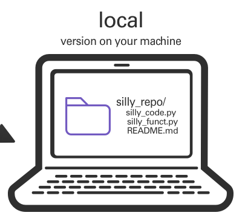
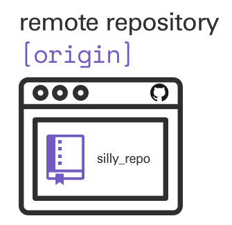

# Git and Github

## Flatiron Summer Workshops

https://sciware.flatironinstitute.org/44_SummerIntro

- **July 22, 2-4pm**: Summer Sciware open office hour/poster help

# Intro to Git and GitHub

## Version control

<ul>
<li>keeps track of the edit history to one or more files</li>
<li>serves as a backup</li>
<li>makes it easier to collaborate and combine multiple changes to the same file</li>
</ul>

*an open-source, distributed, command-line, version-control tool*

<ul>
<li>released in 2005 by Linus Torvalds for Linux kernel (alternative to CVS, svn, ...)</li>
<li>dominant tool for academic and industry software development</li>
<li><b>distributed</b>: no central server, every repo is fully functional, independent, and can "sync" with any other</li>
</ul>

<h2>GitHub </h2>

* A central website for storing and sharing git repositories
* Started in 2008 as a freemium service, now owned by Microsoft
* Provides repository management, permissions, collaboration tools, CI, etc.
* Alternatives: gitlab, bitbucket, ...

# Topics

## Putting code on GitHub

## Make a project directory (folder)

<pre  style="font-size:1em; margin-top:-20px; margin-left:40px; margin-right: 40px"> <code data-trim data-noescape>
> cd #out of sciware21-git-intro
> mkdir silly_repo
> cd silly_repo
> touch silly_code.py
> touch silly_file.txt
</code></pre>

## Create a repo on GitHub

<ul>
<li>Go to your homepage on GitHub</li>
<li>Click the Repositories tab</li>
<li>Click the green New button</li>
<li>Name the repository <tt>silly_repo</tt></li>
</ul>

### Initialize the directory to use with GitHub

<pre  style="font-size:1.1em"><code data-trim data-noescape>> git init
> git status
</code></pre>

## The primary *branch* `main`

- It's possible to have multiple *branches* of the code where different things are being worked on.
- The primary branch is usually called *main*.

<pre  style="font-size:1.1em"><code data-trim data-noescape>> git status
> git branch -v
> git branch -va
</code></pre>

Notice:
- branch name
- `silly_file.txt` is in red and is *untracked*
- no remote branches

## Specify which files that you want to transfer

Use the `git add` command to specify exactly which files you want to transfer to GitHub.

<pre  style="font-size:1.1em"><code data-trim data-noescape>> git status
> git add silly_file.txt
> git status
</code></pre>

Notice:
- `silly_file.txt` is now green
- `silly_file.txt` needs to be committed

## Save the changes

- Use the `git commit` to save the local changes.
- Add a *commit message* to document the changes.
- Launch a text editor where you can type the commit message:

<pre  style="font-size:1.1em; margin-top:-20px"> <code data-trim data-noescape>> git commit
</code></pre>
Alternatively, you can commit directly from the command line:
<pre  style="font-size:1.1em; margin-top:-30px"> <code data-trim data-noescape>> git commit -m "add silly file"
> git status
</code></pre>

## What's in a commit message?

- Like a comment in your code
- Says what you changed and why

## Connect the repo to GitHub

- Use `git remote add` to provide the URL to the GitHub repo.
- The repo that is in your personal profile is usually called `origin`

<pre  style="font-size:1.1em"><code data-trim data-noescape>
> git remote -v
> git remote add origin git@github.com:kelle/silly_repo.git
> git remote update
</code></pre>

## Upload the repo contents to GitHub

- Use the `git push` command to upload the committed changes to the GitHub repo.

<pre  style="font-size:1.1em; margin-top:-20px"> <code data-trim data-noescape style="margin-top:-20px">
> git branch -va
> git push origin main
> git branch -va
</code></pre>

# Check GitHub

`silly_file.txt` should now be in the repo on the GitHub website.

