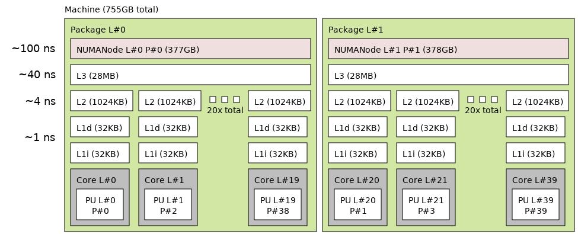

# Sciware

https://sciware.flatironinstitute.org/IntroToHPC

https://github.com/flatironinstitute/sciware/tree/main/IntroToHPC

## Rules of Engagement

### Goal:

Activities where participants all actively work to foster an environment which encourages participation across experience levels, coding language fluency, *technology choices*\*, and scientific disciplines.

<small>\*though sometimes we try to expand your options</small>

## Rules of Engagement

- Avoid discussions between a few people on a narrow topic
- Provide time for people who haven't spoken to speak/ask questions
- Provide time for experts to share wisdom and discuss
- Work together to make discussions accessible to novices

<small>
(These will always be a work in progress and will be updated, clarified, or expanded as needed.)
</small>

## Center-hosted Sciware

- Sciware will rotate between centers each month
   - focus on topics of interest to centers
   - include voices from all centers
   - each center will host twice a year
   - open to all
- Suggest topics or contribute to content in #sciware Slack
- We are recording. Link will be posted to [https://sciware.flatironinstitute.org/](https://sciware.flatironinstitute.org/)

## Today's Agenda
- Helpdesk recap
- Supercomputing components and terminology
- Flatiron resources overview
- Environment management [interactive]
- Running your jobs [interactive]

## What you'll need

- Remote access to the cluster via terminal
  - on 'FI' wifi network: `ssh username@rusty`
  - or... `ssh -p 61022 username@gateway.flatironinstitute.org`, `ssh rusty`
  - or... `https://jupyter.flatironinstitute.org`
- Way to edit files on cluster
  - terminal `emacs`, `vi`, `nano`
  - or... remote edit via `vscode/emacs/vi/sshfs`
  - or... `https://jupyter.flatironinstitute.org`

## Getting help with the FI clusters!

### Getting help with the clusters

- SCC provides a wiki for cluster help and information
  - https://wiki.flatironinstitute.org
  - Information on effectively using slurm, python, conda, mpi, compiles, MATLAB, Mathematica, etc.
  - can log in with cluster credentials, or SSO if flatiron email is on your cluster account

### Getting help with the cluster

- #scicomp on slack for quick or broad questions
  - SCC/FI community will help with your issue
- https://wiki.flatironinstitute.org/SCC/ReportingProblems
  - Email with details from above to scicomp@flatironinstitute.org
- #sciware channel for software development discussions

### What's the best way to get questions about the cluster answered?
- A. https://wiki.flatironinstitute.org/
- B. Slack #scicomp
- C. scicomp@flatironinstitute.org
- D. Any of the above

## Supercomputing terminology

## Cluster

<ul>
<li> A group of computers that work together as a single system
<li> Goal: distribute computational load over multiple devices
<li> Common components to be defined:
  <ul>
  <li> Node (CPU/GPU)
  <li> Filesystem (shared/local)
  <li> Network/fabric
  </ul>
</ul>

## Quiz!
### Which statement is generally true about what we mean by a "cluster"?
- A. One very powerful computer
- B. Many geographically dispersed computers connected via the internet
- C. Collection of computers that are linked together with a local network

### Network/fabric
- Network/fabric - the means of communication between nodes
  - Communication lines usually fiber/copper/wireless
- Latency -- time between sending and receiving messages
- Bandwidth -- Rate data can be transferred
- Some rough "typical" numbers
  - WiFi -- 1ms -- \~0.1-1 Gbit/s -- network
  - Ethernet -- 0.1ms -- \~1-40 Gbit/s -- network
  - Infiniband -- 0.001ms -- \~100-800 Gbit/s -- fabric

## Quiz!
### Which statement is false?
- A. Latency is the time between sending and receiving messages
- B. Bandwidth is the rate at which messages can be sent
- C. Infiniband fabric has relatively high latency and low bandwidth

### Compute nodes

<ul>
<li> What most people would call a computer, but...
  <ul>
  <li> Typically headless -- no display
  <li> Accessed/controlled via network
  <li> Often multiple network "interfaces"
  <li> Designed for high <i>throughput</i> computation
  </ul>
</ul>

### Compute node architecture
- Typically large amounts of RAM (random access memory)
  - temporary storage used during computation for data and program instructions
- One or more "multi-core" CPUs (central processing units)
  - CPU Core -- a single physical CPU on a multi-core CPU
  - Cores have their own _cache_ but also share _cache_ directly with other cores
  - Cores typically slower than laptop/workstation cores, but more of them and more cache/RAM

## Quiz!
### Which statement is true about nodes and cores?
- A. There is one node per supercomputer
- B. Each node has multiple CPU cores
- C. Cores in supercomputers are typically faster than laptop cores and have less RAM

### Compute node architecture -- `lstopo`
- Cores also sometimes have extra groupings in `NUMA` (non-uniform memory architecture) domains
  - Tells what hardware has direct access to what memory
  - Automatic internal "fabric" with different latencies/bandwidth
  - `lstopo --no-io` on FI `skylake` node

    

### GPU node architecture

<ul>
<li> GPU Node -- CPU node + GPU
<li> GPU -- graphics processing unit
  <ul>
  <li> Misnomer/legacy name, used to "offload" general computation -- AKA accelerator/TPU
  <li> SIMD power -- single instruction multiple data
  <li> large numbers of small identical problems
  <li> e.g. large dense linear algebra problems
  </ul>
</ul>

### Filesystems
- System that manages file organization and access
- Can be local (stored on "hard drive" like on laptop)
  - _typically_ high bandwidth/low latency
- or distributed/networked (data shared between drives/computers and accessed remotely)
  - _typically_ high bandwidth/high latency, networked
  - Tradeoffs exist and are _extremely_ important
- Ceph and GPFS are the distributed filesystems used at FI
  - Lustre also common at supercomputing centers

## Flatiron resources overview

### Two clusters: 'Rusty' and 'Popeye'

- Rusty on east coast, Popeye on west coast
- Completely distinct
  - Independent storage
  - Independent job management
- Both heterogenous -- multiple node types
- Details at https://wiki.flatironinstitute.org/SCC/Overview

### Clusters: Let's connect

- Remote access to the rusty cluster via terminal
  - on 'FI' wifi network: `ssh username@rusty`
  - or... `ssh -p 61022 username@gateway.flatironinstitute.org`, `ssh rusty`
  - or... `https://jupyter.flatironinstitute.org`
- Popeye
  - From rusty gateway `ssh popeye`
- `module load fi-utils` for useful FI-specific utilities

### Rusty/Popeye -- compute power

- Rusty -- \~150k CPU cores (\~1400 nodes)
- Popeye -- \~40k CPU cores (\~800 nodes)
- Node groups connected by high performance infiniband fabric
  - Dedicated (only for job traffic)
  - Node types on different infiniband networks!
- Rusty -- around 240 H100, 290 A100 GPUs
- `fi-nodes`

### Rusty/popeye storage -- local
- All worker nodes have fast `NVMe` storage local to the machine
- Usually about 2 terabytes in the `/tmp` path
- Automatically deleted at job completion!

### Rusty/popeye storage -- home
- `/mnt/home/$USER` AKA `$HOME` -- default path
- Put your source code and software installs here!
- High performance GPFS filesystem (General Parallel FS)
- Mind your quota! You can get locked out of the cluster!
- Backed up regularly -- can recover deleted files -- quota fixed
- `fi-quota`

### Rusty/popeye storage -- ceph (1)

- rusty: located at `/mnt/ceph/$USER`, symlink at `~/ceph`
- popeye: located at `/mnt/sdceph/$USER`, symlink at `~/ceph`
- `ceph` (after cephalopod) -- software providing this FS
- Always put your data/large files here! (large \~ 100MB+)
- Quota set in FIDO! `fi-usage` (only runs on rusty, but prints both)
- `cephdu` from `fi-utils` very useful for managing files

### Rusty/popeye storage -- ceph (2)
- \~65 PiB (rusty) and \~20 PiB (popeye)
- High bandwidth, high latency (\~1.5GiB/s parallel reads)
- Highly redundant, not backed up (deletes unrecoverable!)
- "Small" files "triple replicated"
  - Two disks can fail and can still recover
- Large files start triple replicated, then erasure coded later
  - EC - file distributed across many disks with extra data
  - Full recovery with some number of disk failures

### Rusty/popeye storage -- overview

 
https://wiki.flatironinstitute.org/SCC/Hardware/Storage

## Quiz!
### Which statement is true about file systems at FI?
- A. I should put many small files in a single directory on ceph
- B. I should put large files in my home directory
- C. Home and ceph are the only options for storing data during a job
- D. Files stored in my home directory are backed up while ones on ceph are not

## Job/resource/software management

### FIDO - quota management
- https://fido.flatironinstitute.org
  - set resource estimates -- helps us plan
- `module load fi-utils; fi-quota`
  - see home storage quota usage info
- `module load fi-utils; fi-slurm-limits`
  - see your and your center's slurm job limits

### Resource monitoring
- `module load fi-utils; fi-nodes`
  - Quick overview of total current cluster usage.
  - `fi-nodes --help` option for detailed help, `-h` for terse
- https://grafana.flatironinstitute.org
  - history of all jobs/nodes on cluster
- `ssh workerXXXX` to node in a running job
  - `htop` -- quick live CPU/mem usage of running job
  - `nvtop` -- quick live GPU usage of running job
    - Only works if the node has job allocated to you!
- `seff`
  - usage statistics of past jobs

### Software (live demo)
- `module` for dynamically loading common software
  - `module avail` to list details of modules
  - `module spider` to search
  - `module load` to load
  - `ml` "smart" shorthand
- Python
  - `python` module has common set of useful packages (aka module 'extensions')
  - `conda` and `uv` are other options for python
    - can push limits of file quota easily
    - conda doesn't play nice with modules -- especially with MPI
    - check wiki for details

### Slurm definitions
- **Node**: Same idea as a compute node, generally
- **CPU**: Same idea as a CPU core defined earlier
- **GPU**: Same as defined earlier, generally
- **Task**: Work that runs on a **node** using some amount of **cpus**, **memory**, and possibly **gpus**
  - E.g. running a python script or rank of an MPI program
- **Job**: List of **tasks** to run, on some number of **nodes**
- **Partition**: queue of jobs that can run on some set of **nodes**
- **Constraint**: subset of **nodes** with some special configuration
  - Useful for multi-node **jobs**, benchmarking, consistent resource needs, or **GPU jobs**

### Monitoring slurm at FI (live demo)
- `module load fi-utils`
  - `fi-slurm-limits`: shows the current **partitions** and current user/center resource usage in
    each partition
  - `fi-nodes`: shows the current resource usage by **constraint**
    - `fi-nodes -h` for help

### Useful slurm commands
- **Most critical**:
  - `sbatch`: Submits a slurm 'sbatch' script to run in 'batch' (non-interactive) mode
    - For heavy/repeatable work, you should **always** be using `sbatch`
  - `squeue`: Show the job queues in any/all partitions
    - `squeue --me` to show only your jobs in queue. `squeue -p cca` to show cca **jobs**. etc.
  - `srun`: Run a set of slurm tasks limited by the resources defined in a **job**
- **Other useful**:
  - `seff`: Display resource usages of a **job** after it has finished
  - `sacct`: Display accounting information of past **jobs**
  - `salloc`: Allocates a slurm **job** without running anything. Our configuration automatically
    starts an interactive shell in that allocation. This is not universal behavior!
  - `man slurm` for more

### Putting this all to use (live demo)
- Demonstrating an sbatch script with a simple python program

## SciWare Survey

